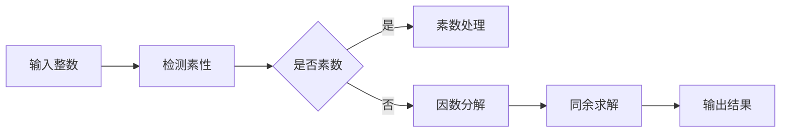

# 解析数论基础：非零区域（二）

## 1. 背景介绍

数论，被誉为数学的皇后，以其纯粹和美丽吸引着无数数学家。在信息时代，数论的某些分支，如同余理论、素数理论等，已经成为现代密码学和信息安全的基石。本文将深入探讨数论中的非零区域概念，以及它在现代计算机科学中的应用。

## 2. 核心概念与联系

在数论中，非零区域指的是除了零以外的整数集合。这个概念在许多数论问题中都至关重要，尤其是在研究整数环和域的性质时。非零区域与环论、域论有着密切的联系，是构建更复杂数学结构的基础。

## 3. 核心算法原理具体操作步骤

解析数论中的算法通常涉及素数发现、因数分解、同余求解等。这些算法的核心在于高效地处理整数运算，以及优化算法以减少计算复杂度。



## 4. 数学模型和公式详细讲解举例说明

数论中的数学模型通常涉及整数集合、同余类、素数等概念。例如，费马小定理是一个经典的数论公式，它表述为：如果 $ p $ 是素数，且 $ a $ 是任意不被 $ p $ 整除的整数，则 $ a^{p-1} \equiv 1 \pmod{p} $。

## 5. 项目实践：代码实例和详细解释说明

在实际编程中，我们可以使用Python等语言来实现数论算法。以下是一个简单的素数检测函数：

```python
def is_prime(n):
    if n <= 1:
        return False
    for i in range(2, int(n**0.5) + 1):
        if n % i == 0:
            return False
    return True
```

这个函数通过遍历从2到 $ \sqrt{n} $ 的整数来检测一个数是否为素数，这是基于素数的定义和因数的性质。

## 6. 实际应用场景

数论在现代科技中有广泛的应用，特别是在密码学领域。例如，RSA加密算法就是基于大素数的难以因数分解的性质构建的。

## 7. 工具和资源推荐

对于数论的学习和研究，以下工具和资源非常有帮助：

- Mathematica 或 Maple：用于复杂数学计算和符号运算。
- SageMath：开源数学软件，包含许多数论功能。
- "An Introduction to the Theory of Numbers" by G.H. Hardy and E.M. Wright：经典数论教材。

## 8. 总结：未来发展趋势与挑战

数论的研究仍然是数学中的一个活跃领域，随着计算能力的提升，许多以前无法解决的问题开始变得可行。同时，数论的计算机应用，特别是在密码学和算法领域，也在不断推动这一领域的发展。

## 9. 附录：常见问题与解答

Q: 为什么非零区域在数论中如此重要？
A: 非零区域是构建数论基础的关键，许多定理和算法都是在非零整数的基础上建立的。

Q: 数论和计算机科学有什么联系？
A: 数论为计算机科学提供了许多基础算法和理论，尤其是在密码学和理论计算机科学中。

作者：禅与计算机程序设计艺术 / Zen and the Art of Computer Programming