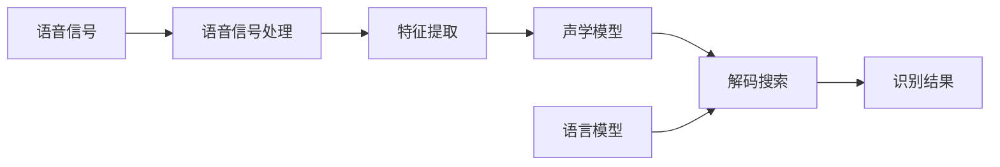

# 语音识别原理与代码实战案例讲解

## 1.背景介绍

语音识别技术是人工智能领域的一个重要分支,旨在让计算机能够理解和识别人类的语音。随着人工智能的快速发展,语音识别技术在过去几十年中取得了长足的进步。如今,语音识别已广泛应用于智能语音助手、语音搜索、语音输入、语音控制等诸多领域,极大地方便了人们的生活。

本文将深入探讨语音识别的原理,介绍语音识别系统的核心概念与关键技术,并通过详细的代码实例来演示如何实现一个基本的语音识别系统。通过本文的学习,读者将全面掌握语音识别的理论基础和实践技能。

### 1.1 语音识别的发展历程

语音识别技术的发展可以追溯到20世纪50年代。早期的语音识别系统主要基于声学-语音学知识和模式匹配方法,识别性能较为有限。20世纪70年代,隐马尔可夫模型(HMM)的引入极大地推动了语音识别技术的发展。

进入21世纪,深度学习方法如卷积神经网络(CNN)和循环神经网络(RNN)在语音识别领域取得了突破性进展。近年来,端到端的语音识别方法如CTC和Attention-based模型也受到广泛关注。语音识别技术正朝着更加智能化、个性化的方向发展。

### 1.2 语音识别的应用场景

语音识别技术在现实生活中有着广泛的应用,主要包括:

- 智能语音助手:如苹果的Siri、谷歌助手、亚马逊的Alexa等,可以通过语音控制完成搜索、设置提醒、播放音乐等任务。
- 语音输入:将语音转换为文字,用于文档录入、信息检索、邮件处理等。
- 语音控制:通过语音指令控制智能家居、车载系统等设备。
- 语音搜索:直接用语音进行网络搜索,无需键盘输入。
- 语音内容分析:对音视频内容进行语音识别,自动生成字幕或关键词。

随着人工智能技术的不断进步,语音识别将在更多领域发挥重要作用,为人们的生活和工作带来便利。

## 2.核心概念与联系

要深入理解语音识别的原理,首先需要了解语音识别系统的核心概念及其相互联系。本节将介绍语音识别的关键概念,并通过一张概念图来直观展示它们之间的逻辑关系。

### 2.1 语音信号处理

语音信号处理是语音识别的基础。它主要包括:

- 语音采集:通过麦克风将声音信号转换为电信号,并进行模数转换得到数字信号。
- 预加重:对语音信号进行高通滤波,增强高频部分。
- 分帧:将语音信号划分为一帧帧的短时分析单元。
- 加窗:对每帧语音信号加窗(如汉明窗),以减少频谱泄露。

### 2.2 特征提取

为了更好地刻画语音信号的特征,需要从时域和频域提取有效的特征参数。常用的特征提取方法有:

- MFCC(Mel频率倒谱系数):基于人耳听觉特性,在Mel频率尺度上提取语音的频谱特征。
- LPCC(线性预测倒谱系数):基于线性预测分析,提取语音的共振峰特征。
- Fbank(滤波器组能量):将语音频谱划分为若干个频带,提取每个频带的能量值。

### 2.3 声学模型

声学模型用于建立语音特征和语音单元(如音素)之间的对应关系。常见的声学建模方法包括:

- HMM(隐马尔可夫模型):将语音建模为一个隐马尔可夫过程,通过学习观测概率和状态转移概率来描述语音单元。
- DNN-HMM(深度神经网络-隐马尔可夫模型):用DNN替代HMM中的高斯混合模型(GMM),提高声学模型的判别能力。
- CTC(连接主义时间分类):端到端的声学建模方法,直接将语音特征映射为标签序列。

### 2.4 语言模型

语言模型用于刻画语言单元(如词)之间的约束关系,为语音识别提供语言学知识。常用的语言模型有:

- N-gram:基于词的N元语法,根据前N-1个词预测当前词的概率。
- RNN语言模型:利用RNN建模词序列,考虑长距离的上下文信息。
- Transformer语言模型:基于自注意力机制,并行学习词之间的依赖关系。

### 2.5 解码搜索

解码搜索是语音识别的最后一步,将声学模型和语言模型结合起来,找出与输入语音最匹配的文本假设。常见的解码搜索算法有:

- Viterbi解码:基于动态规划,寻找概率最大的状态序列。
- Beam Search:维护一个大小固定的候选集,剪枝掉概率较低的假设。
- A*解码:启发式搜索算法,利用语言模型估计未来代价。

### 2.6 概念图

下面通过一张Mermaid流程图来直观展示语音识别系统的核心概念及其相互联系:

从图中可以看出,语音识别是一个由语音信号处理、特征提取、声学建模、语言建模和解码搜索等多个模块组成的复杂系统。各个模块相互协作,最终将输入的语音信号转换为对应的文本输出。

## 3.核心算法原理具体操作步骤

本节将详细介绍语音识别系统中几个关键算法的原理和具体操作步骤,包括MFCC特征提取、HMM声学建模和Viterbi解码搜索。

### 3.1 MFCC特征提取

MFCC是语音识别中最常用的特征提取方法之一。它的基本思想是模拟人耳的听觉特性,在Mel频率尺度上提取语音的频谱特征。MFCC特征提取的具体步骤如下:

1. 预加重:对语音信号进行高通滤波,增强高频部分。
2. 分帧加窗:将语音信号划分为帧,并对每帧加汉明窗。
3. FFT:对每帧语音进行快速傅里叶变换,得到频谱。
4. Mel滤波器组:将频谱通过一组三角形滤波器,得到Mel频谱。
5. 取对数:对Mel频谱取对数,得到对数Mel频谱。
6. DCT:对对数Mel频谱进行离散余弦变换,得到MFCC特征。
7. 动态特征:计算MFCC特征的一阶差分和二阶差分,得到动态MFCC特征。

通过以上步骤,可以从语音信号中提取出能够有效刻画语音特性的MFCC特征,为后续的声学建模奠定基础。

### 3.2 HMM声学建模

HMM是语音识别中最经典的声学建模方法。它将语音建模为一个隐马尔可夫过程,通过学习观测概率和状态转移概率来描述语音单元。HMM声学建模的具体步骤如下:

1. 定义HMM拓扑结构:根据语音单元的特点,设计合适的HMM状态数和跳转方式。
2. 初始化HMM参数:随机初始化或用语料统计信息初始化HMM的观测概率和转移概率。
3. 前向-后向算法:计算给定观测序列和当前模型参数下,每个状态在每个时刻的前向概率和后向概率。
4. Baum-Welch算法:基于前向-后向概率,迭代更新HMM的观测概率和转移概率,使模型与训练数据的匹配程度最大化。
5. Viterbi算法:在测试阶段,用Viterbi算法寻找给定观测序列下最可能的状态序列,作为识别结果。

通过以上步骤,可以训练出与语音数据匹配度高的HMM声学模型,用于语音识别的声学评分计算。

### 3.3 Viterbi解码搜索

Viterbi解码搜索是语音识别中常用的解码算法。它利用动态规划的思想,在声学模型和语言模型的约束下,寻找与输入语音最匹配的文本假设。Viterbi解码搜索的具体步骤如下:

1. 初始化:将解码网络的起始节点概率设为1,其他节点概率设为0。
2. 递推:对于每一帧语音特征,计算每个节点的累积概率,选择最大概率的前驱节点。
3. 终止:在解码网络的终止节点,选择累积概率最大的路径作为最优假设。
4. 回溯:从终止节点出发,沿着最优路径回溯,得到识别结果。

在实际应用中,常常采用Beam Search等启发式搜索策略,以平衡识别速度和准确率。

通过以上介绍,读者应该对语音识别系统的几个核心算法有了深入的理解。在下一节中,我们将通过数学模型和公式来进一步阐释这些算法的理论基础。

## 4.数学模型和公式详细讲解举例说明

本节将通过数学模型和公式来深入阐释语音识别系统中几个关键算法的理论基础,并给出具体的举例说明。

### 4.1 MFCC特征提取

MFCC特征提取的数学模型可以表示为以下几个步骤:

1. 预加重:对语音信号$x(n)$进行高通滤波,得到预加重信号$\tilde{x}(n)$。
   
   $$\tilde{x}(n) = x(n) - \alpha x(n-1)$$
   
   其中$\alpha$为预加重系数,通常取0.97。

2. 分帧加窗:将预加重信号划分为帧,并对每帧加汉明窗$w(n)$,得到加窗信号$\hat{x}(n)$。
   
   $$\hat{x}(n) = \tilde{x}(n)w(n)$$
   
   其中汉明窗的表达式为:
   
   $$w(n) = 0.54 - 0.46\cos(\frac{2\pi n}{N-1})$$
   
   $N$为帧长。

3. FFT:对加窗信号进行快速傅里叶变换,得到频谱$X(k)$。
   
   $$X(k) = \sum_{n=0}^{N-1}\hat{x}(n)e^{-j\frac{2\pi}{N}nk}$$

4. Mel滤波器组:将频谱通过$M$个三角形滤波器$H_m(k)$,得到Mel频谱$S(m)$。
   
   $$S(m) = \sum_{k=0}^{N/2}|X(k)|^2H_m(k)$$
   
   其中$H_m(k)$的表达式为:
   
   $$H_m(k) = \begin{cases}
   0 & k < f(m-1)\\
   \frac{k-f(m-1)}{f(m)-f(m-1)} & f(m-1) \leq k < f(m)\\
   \frac{f(m+1)-k}{f(m+1)-f(m)} & f(m) \leq k < f(m+1)\\
   0 & k \geq f(m+1)
   \end{cases}$$
   
   $f(m)$为第$m$个滤波器的中心频率,可由Mel频率到线性频率的映射公式得到:
   
   $$f(m) = 700(e^{\frac{m}{1125}}-1)$$

5. 取对数:对Mel频谱取对数,得到对数Mel频谱$\log S(m)$。

6. DCT:对对数Mel频谱进行离散余弦变换,得到MFCC特征$c(n)$。
   
   $$c(n) = \sqrt{\frac{2}{M}}\sum_{m=1}^{M}\log S(m)\cos(\frac{\pi n}{M}(m-\frac{1}{2}))$$
   
   其中$n=0,1,\dots,L-1$,$L$