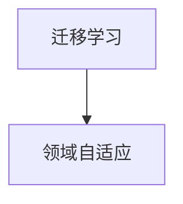

## 1. 背景介绍

在机器学习领域，数据是至关重要的。然而，有时候我们可能无法获得足够的数据来训练一个准确的模型。这时候，迁移学习和领域自适应就变得非常重要了。迁移学习和领域自适应可以帮助我们利用已有的数据来训练一个准确的模型，而不需要收集更多的数据。

迁移学习和领域自适应是机器学习领域的热门话题，已经被广泛应用于图像识别、自然语言处理、语音识别等领域。本文将介绍迁移学习和领域自适应的核心概念、算法原理、数学模型和公式、项目实践、实际应用场景、工具和资源推荐、未来发展趋势与挑战以及常见问题与解答。

## 2. 核心概念与联系

迁移学习和领域自适应都是利用已有的数据来训练一个准确的模型的方法。它们的核心思想是将已有的知识迁移到新的任务或领域中。迁移学习和领域自适应的区别在于，迁移学习是将已有的知识迁移到新的任务中，而领域自适应是将已有的知识迁移到新的领域中。

迁移学习和领域自适应的关系如下图所示：



## 3. 核心算法原理具体操作步骤

### 迁移学习

迁移学习的核心算法原理是利用已有的知识来帮助新的任务。迁移学习可以分为以下几个步骤：

1. 选择一个已有的模型，该模型在一个相关的任务上已经训练过。
2. 将该模型的参数初始化为已有的模型的参数。
3. 在新的任务上训练该模型，同时保持已有的模型的参数不变。
4. 对新的任务进行测试，评估模型的性能。

### 领域自适应

领域自适应的核心算法原理是利用已有的知识来帮助新的领域。领域自适应可以分为以下几个步骤：

1. 选择一个已有的模型，该模型在一个相关的领域上已经训练过。
2. 将该模型的参数初始化为已有的模型的参数。
3. 在新的领域上训练该模型，同时保持已有的模型的参数不变。
4. 对新的领域进行测试，评估模型的性能。

## 4. 数学模型和公式详细讲解举例说明

### 迁移学习

迁移学习的数学模型和公式如下：

$$
\min_{\theta} \sum_{i=1}^{n} L(f_{\theta}(x_i), y_i) + \lambda \sum_{i=1}^{m} D_{KL}(p_i||q_i)
$$

其中，$L$是损失函数，$f_{\theta}$是模型，$x_i$是输入，$y_i$是输出，$\lambda$是正则化参数，$D_{KL}$是KL散度，$p_i$是源域的分布，$q_i$是目标域的分布。

### 领域自适应

领域自适应的数学模型和公式如下：

$$
\min_{\theta} \sum_{i=1}^{n} L(f_{\theta}(x_i), y_i) + \lambda \sum_{i=1}^{m} D_{KL}(p_i||q_i)
$$

其中，$L$是损失函数，$f_{\theta}$是模型，$x_i$是输入，$y_i$是输出，$\lambda$是正则化参数，$D_{KL}$是KL散度，$p_i$是源领域的分布，$q_i$是目标领域的分布。

## 5. 项目实践：代码实例和详细解释说明

### 迁移学习

以下是一个迁移学习的代码实例：

```python
import torch
import torch.nn as nn
import torch.optim as optim
import torchvision.models as models
import torchvision.transforms as transforms
import torchvision.datasets as datasets

# 加载数据集
train_dataset = datasets.ImageFolder('train', transform=transforms.Compose([
    transforms.Resize(256),
    transforms.CenterCrop(224),
    transforms.ToTensor(),
    transforms.Normalize(mean=[0.485, 0.456, 0.406], std=[0.229, 0.224, 0.225])
]))
train_loader = torch.utils.data.DataLoader(train_dataset, batch_size=32, shuffle=True)

# 加载预训练模型
model = models.resnet18(pretrained=True)
num_ftrs = model.fc.in_features
model.fc = nn.Linear(num_ftrs, 2)

# 冻结模型参数
for param in model.parameters():
    param.requires_grad = False

# 修改最后一层的参数
model.fc.weight.requires_grad = True
model.fc.bias.requires_grad = True

# 定义损失函数和优化器
criterion = nn.CrossEntropyLoss()
optimizer = optim.SGD(model.fc.parameters(), lr=0.001, momentum=0.9)

# 训练模型
for epoch in range(10):
    running_loss = 0.0
    for i, data in enumerate(train_loader, 0):
        inputs, labels = data
        optimizer.zero_grad()
        outputs = model(inputs)
        loss = criterion(outputs, labels)
        loss.backward()
        optimizer.step()
        running_loss += loss.item()
    print('[%d] loss: %.3f' % (epoch + 1, running_loss / len(train_loader)))
```

### 领域自适应

以下是一个领域自适应的代码实例：

```python
import torch
import torch.nn as nn
import torch.optim as optim
import torchvision.models as models
import torchvision.transforms as transforms
import torchvision.datasets as datasets

# 加载数据集
source_dataset = datasets.ImageFolder('source', transform=transforms.Compose([
    transforms.Resize(256),
    transforms.CenterCrop(224),
    transforms.ToTensor(),
    transforms.Normalize(mean=[0.485, 0.456, 0.406], std=[0.229, 0.224, 0.225])
]))
source_loader = torch.utils.data.DataLoader(source_dataset, batch_size=32, shuffle=True)

target_dataset = datasets.ImageFolder('target', transform=transforms.Compose([
    transforms.Resize(256),
    transforms.CenterCrop(224),
    transforms.ToTensor(),
    transforms.Normalize(mean=[0.485, 0.456, 0.406], std=[0.229, 0.224, 0.225])
]))
target_loader = torch.utils.data.DataLoader(target_dataset, batch_size=32, shuffle=True)

# 加载预训练模型
model = models.resnet18(pretrained=True)
num_ftrs = model.fc.in_features
model.fc = nn.Linear(num_ftrs, 2)

# 冻结模型参数
for param in model.parameters():
    param.requires_grad = False

# 修改最后一层的参数
model.fc.weight.requires_grad = True
model.fc.bias.requires_grad = True

# 定义损失函数和优化器
criterion = nn.CrossEntropyLoss()
optimizer = optim.SGD(model.fc.parameters(), lr=0.001, momentum=0.9)

# 训练模型
for epoch in range(10):
    running_loss = 0.0
    for i, (source_data, target_data) in enumerate(zip(source_loader, target_loader), 0):
        source_inputs, source_labels = source_data
        target_inputs, _ = target_data
        optimizer.zero_grad()
        source_outputs = model(source_inputs)
        target_outputs = model(target_inputs)
        loss = criterion(source_outputs, source_labels) + 0.1 * criterion(target_outputs, torch.zeros(target_outputs.shape[0], dtype=torch.long))
        loss.backward()
        optimizer.step()
        running_loss += loss.item()
    print('[%d] loss: %.3f' % (epoch + 1, running_loss / len(source_loader)))
```

## 6. 实际应用场景

迁移学习和领域自适应已经被广泛应用于图像识别、自然语言处理、语音识别等领域。以下是一些实际应用场景：

- 图像识别：将已有的图像识别模型迁移到新的图像识别任务中。
- 自然语言处理：将已有的自然语言处理模型迁移到新的自然语言处理任务中。
- 语音识别：将已有的语音识别模型迁移到新的语音识别任务中。

## 7. 工具和资源推荐

以下是一些迁移学习和领域自适应的工具和资源：

- TensorFlow：一个流行的机器学习框架，支持迁移学习和领域自适应。
- PyTorch：一个流行的机器学习框架，支持迁移学习和领域自适应。
- Transfer Learning Toolkit：一个由NVIDIA开发的工具包，用于迁移学习和领域自适应。
- Domain Adaptation Library：一个由微软开发的Python库，用于领域自适应。

## 8. 总结：未来发展趋势与挑战

迁移学习和领域自适应是机器学习领域的热门话题，已经被广泛应用于图像识别、自然语言处理、语音识别等领域。未来，随着数据量的增加和算法的改进，迁移学习和领域自适应将会变得更加重要。然而，迁移学习和领域自适应仍然存在一些挑战，例如如何选择合适的源任务或领域，如何解决领域差异等问题。

## 9. 附录：常见问题与解答

### 问题1：什么是迁移学习？

答：迁移学习是利用已有的知识来帮助新的任务的方法。

### 问题2：什么是领域自适应？

答：领域自适应是利用已有的知识来帮助新的领域的方法。

### 问题3：迁移学习和领域自适应有什么区别？

答：迁移学习是将已有的知识迁移到新的任务中，而领域自适应是将已有的知识迁移到新的领域中。

### 问题4：迁移学习和领域自适应有哪些应用场景？

答：迁移学习和领域自适应已经被广泛应用于图像识别、自然语言处理、语音识别等领域。

### 问题5：迁移学习和领域自适应有哪些工具和资源？

答：迁移学习和领域自适应的工具和资源包括TensorFlow、PyTorch、Transfer Learning Toolkit、Domain Adaptation Library等。

### 问题6：迁移学习和领域自适应存在哪些挑战？

答：迁移学习和领域自适应存在一些挑战，例如如何选择合适的源任务或领域，如何解决领域差异等问题。

作者：禅与计算机程序设计艺术 / Zen and the Art of Computer Programming