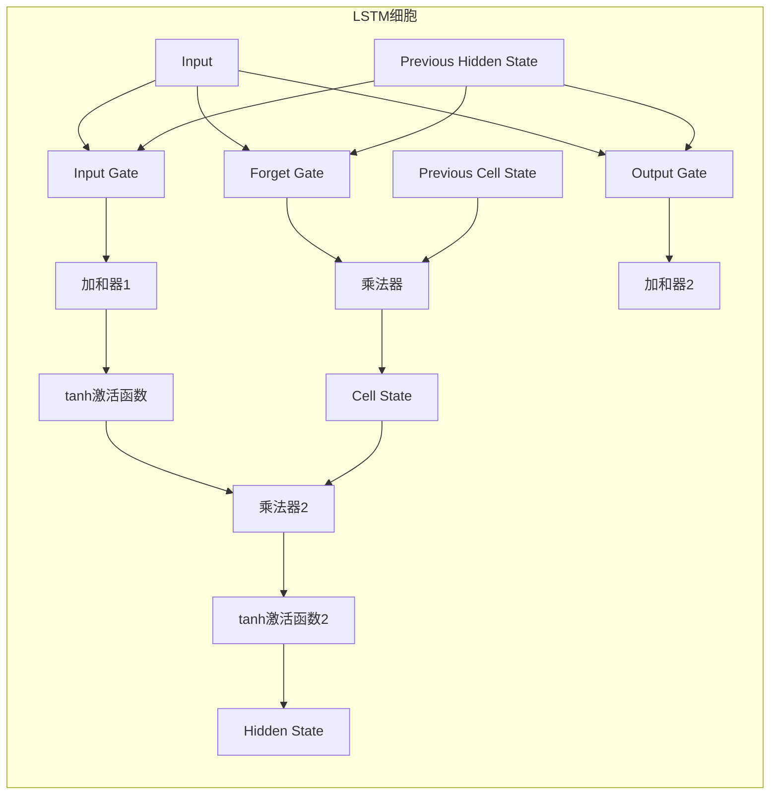

# 长短期记忆网络(Long Short-Term Memory) - 原理与代码实例讲解

## 1.背景介绍

### 1.1 序列数据处理的挑战

在自然语言处理、语音识别、时间序列预测等领域中,我们经常会遇到序列数据。与传统的数据不同,序列数据具有时间或空间上的相关性,数据之间存在着内在的依赖关系。例如,在一个句子中,每个单词的出现都与前面的单词有关。在股票预测中,未来的股价走势与过去的价格变化密切相关。

传统的机器学习模型,如前馈神经网络、逻辑回归等,在处理序列数据时存在一些局限性。这些模型通常假设输入和输出之间是独立无关的,无法有效地捕捉序列数据中的长期依赖关系。为了解决这个问题,循环神经网络(Recurrent Neural Networks, RNNs)应运而生。

### 1.2 循环神经网络的局限性

循环神经网络(RNNs)是一种具有内部循环机制的神经网络,能够处理序列数据。它通过在隐藏层中引入循环,使得网络能够记住之前的信息,从而捕捉序列数据中的长期依赖关系。然而,传统的RNNs在实践中存在一些缺陷,主要体现在以下两个方面:

1. **梯度消失/爆炸问题**: 在训练过程中,由于反向传播算法中的链式法则,梯度值会指数级衰减或爆炸。这导致了RNNs难以学习长期依赖关系,因为梯度信号在反向传播过程中会逐渐衰减或爆炸。

2. **无法有效捕捉长期依赖关系**: 由于梯度消失/爆炸问题,传统的RNNs无法有效地捕捉序列数据中的长期依赖关系,这限制了它们在实际应用中的表现。

为了解决这些问题,研究人员提出了长短期记忆网络(Long Short-Term Memory, LSTMs),这是一种特殊的RNNs结构,旨在解决传统RNNs存在的梯度消失/爆炸问题,从而更好地捕捉长期依赖关系。

## 2.核心概念与联系

### 2.1 LSTM网络的核心概念

LSTM网络是一种特殊的RNNs结构,它通过引入门控机制和记忆细胞状态,解决了传统RNNs存在的梯度消失/爆炸问题,从而能够更好地捕捉长期依赖关系。LSTM网络的核心概念包括:

1. **门控机制(Gate Mechanism)**: LSTM网络引入了三种门控机制,分别是遗忘门(Forget Gate)、输入门(Input Gate)和输出门(Output Gate)。这些门控机制通过学习权重,决定保留、更新或输出记忆细胞状态中的信息。

2. **记忆细胞状态(Cell State)**: LSTM网络中的记忆细胞状态是一种专门设计的结构,用于存储序列数据中的长期依赖信息。通过门控机制的控制,记忆细胞状态可以选择性地保留或更新信息,从而捕捉长期依赖关系。

3. **隐藏状态(Hidden State)**: 隐藏状态是LSTM网络的输出,它基于当前输入和记忆细胞状态计算得到。隐藏状态被传递到下一个时间步,用于计算下一个时间步的输出。

### 2.2 LSTM网络与传统RNNs的联系

LSTM网络是一种特殊的RNNs结构,它们之间存在密切的联系:

1. **网络结构**: LSTM网络和传统RNNs都是循环神经网络,具有类似的网络结构,包括输入层、隐藏层和输出层。

2. **序列数据处理**: LSTM网络和传统RNNs都旨在处理序列数据,捕捉序列数据中的长期依赖关系。

3. **反向传播算法**: LSTM网络和传统RNNs在训练过程中都使用反向传播算法进行参数更新。

4. **隐藏状态传递**: LSTM网络和传统RNNs都通过隐藏状态在时间步之间传递信息,从而捕捉序列数据中的依赖关系。

然而,LSTM网络通过引入门控机制和记忆细胞状态,解决了传统RNNs存在的梯度消失/爆炸问题,从而能够更好地捕捉长期依赖关系。这是LSTM网络相对于传统RNNs的主要优势。

## 3.核心算法原理具体操作步骤

### 3.1 LSTM网络的结构

LSTM网络的基本单元是一个LSTM细胞(LSTM Cell),它包含一个记忆细胞状态(Cell State)和三个门控机制:遗忘门(Forget Gate)、输入门(Input Gate)和输出门(Output Gate)。每个LSTM细胞接收当前时间步的输入 $x_t$ 和上一时间步的隐藏状态 $h_{t-1}$,并计算当前时间步的隐藏状态 $h_t$ 和更新后的记忆细胞状态 $c_t$。

下图展示了LSTM细胞的结构:

上图中,每个门控机制(遗忘门、输入门和输出门)都是一个sigmoid神经网络层,它们的输出值介于0和1之间。记忆细胞状态 $c_t$ 通过以下步骤计算:

1. 遗忘门决定从上一时间步的记忆细胞状态 $c_{t-1}$ 中遗忘哪些信息。
2. 输入门决定从当前输入 $x_t$ 和上一时间步的隐藏状态 $h_{t-1}$ 中获取哪些新信息,并将其与遗忘的信息相结合,形成当前时间步的记忆细胞状态 $c_t$。
3. 输出门决定从当前时间步的记忆细胞状态 $c_t$ 中输出哪些信息,作为当前时间步的隐藏状态 $h_t$。

### 3.2 LSTM网络的具体操作步骤

LSTM网络的具体操作步骤如下:

1. **遗忘门(Forget Gate)**: 计算遗忘门的输出 $f_t$,决定从上一时间步的记忆细胞状态 $c_{t-1}$ 中遗忘哪些信息。

$$f_t = \sigma(W_f \cdot [h_{t-1}, x_t] + b_f)$$

其中, $W_f$ 和 $b_f$ 分别是遗忘门的权重和偏置, $\sigma$ 是sigmoid激活函数, $h_{t-1}$ 是上一时间步的隐藏状态, $x_t$ 是当前时间步的输入。

2. **输入门(Input Gate)**: 计算输入门的输出 $i_t$ 和候选记忆细胞状态 $\tilde{c}_t$。输入门决定从当前输入 $x_t$ 和上一时间步的隐藏状态 $h_{t-1}$ 中获取哪些新信息,而候选记忆细胞状态 $\tilde{c}_t$ 表示可能被添加到记忆细胞状态中的新信息。

$$i_t = \sigma(W_i \cdot [h_{t-1}, x_t] + b_i)$$
$$\tilde{c}_t = \tanh(W_c \cdot [h_{t-1}, x_t] + b_c)$$

其中, $W_i$、$W_c$、$b_i$ 和 $b_c$ 分别是输入门和候选记忆细胞状态的权重和偏置, $\tanh$ 是双曲正切激活函数。

3. **更新记忆细胞状态(Update Cell State)**: 根据遗忘门 $f_t$、输入门 $i_t$ 和候选记忆细胞状态 $\tilde{c}_t$,更新当前时间步的记忆细胞状态 $c_t$。

$$c_t = f_t \odot c_{t-1} + i_t \odot \tilde{c}_t$$

其中, $\odot$ 表示元素wise乘积操作。这一步将上一时间步的记忆细胞状态 $c_{t-1}$ 中的部分信息遗忘掉(通过 $f_t$ 控制),并将新的信息 $\tilde{c}_t$ 加入(通过 $i_t$ 控制)。

4. **输出门(Output Gate)**: 计算输出门的输出 $o_t$,决定从当前时间步的记忆细胞状态 $c_t$ 中输出哪些信息,作为当前时间步的隐藏状态 $h_t$。

$$o_t = \sigma(W_o \cdot [h_{t-1}, x_t] + b_o)$$
$$h_t = o_t \odot \tanh(c_t)$$

其中, $W_o$ 和 $b_o$ 分别是输出门的权重和偏置。

通过上述步骤,LSTM网络能够选择性地保留、更新和输出记忆细胞状态中的信息,从而有效地捕捉序列数据中的长期依赖关系。

## 4.数学模型和公式详细讲解举例说明

在上一节中,我们介绍了LSTM网络的核心算法原理和具体操作步骤。在这一节,我们将详细讲解LSTM网络中涉及的数学模型和公式,并通过具体例子来加深理解。

### 4.1 LSTM网络的数学模型

LSTM网络的数学模型可以用以下公式表示:

$$\begin{aligned}
f_t &= \sigma(W_f \cdot [h_{t-1}, x_t] + b_f) \\
i_t &= \sigma(W_i \cdot [h_{t-1}, x_t] + b_i) \\
\tilde{c}_t &= \tanh(W_c \cdot [h_{t-1}, x_t] + b_c) \\
c_t &= f_t \odot c_{t-1} + i_t \odot \tilde{c}_t \\
o_t &= \sigma(W_o \cdot [h_{t-1}, x_t] + b_o) \\
h_t &= o_t \odot \tanh(c_t)
\end{aligned}$$

其中:

- $x_t$ 是当前时间步的输入
- $h_{t-1}$ 是上一时间步的隐藏状态
- $c_{t-1}$ 是上一时间步的记忆细胞状态
- $f_t$、$i_t$、$o_t$ 分别是遗忘门、输入门和输出门的输出
- $\tilde{c}_t$ 是候选记忆细胞状态
- $c_t$ 是当前时间步的记忆细胞状态
- $h_t$ 是当前时间步的隐藏状态
- $W_f$、$W_i$、$W_c$、$W_o$ 分别是遗忘门、输入门、候选记忆细胞状态和输出门的权重矩阵
- $b_f$、$b_i$、$b_c$、$b_o$ 分别是遗忘门、输入门、候选记忆细胞状态和输出门的偏置向量
- $\sigma$ 是sigmoid激活函数,用于门控机制的计算
- $\tanh$ 是双曲正切激活函数,用于候选记忆细胞状态和隐藏状态的计算
- $\odot$ 表示元素wise乘积操作

### 4.2 数学模型的具体例子

为了更好地理解LSTM网络的数学模型,我们将通过一个具体例子来演示其计算过程。假设我们有一个简单的LSTM网络,其中:

- 输入向量 $x_t$ 的维度为3
- 隐藏状态 $h_t$ 的维度为4
- 记忆细胞状态 $c_t$ 的维度为4

我们将随机初始化权重