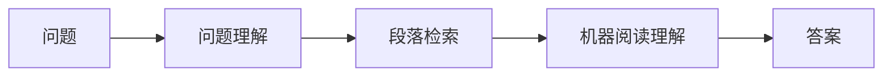
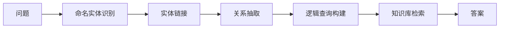

# 问答系统(Question Answering)原理与代码实战案例讲解

## 1. 背景介绍

问答系统(Question Answering, QA)是自然语言处理(NLP)和信息检索(IR)领域的一个重要研究方向。它旨在让计算机能够理解用户以自然语言提出的问题,并从海量的非结构化数据(如文本)中找出精准的答案,从而实现人机交互。

随着人工智能技术的快速发展,尤其是深度学习在NLP领域取得的突破性进展,QA系统的性能不断提升,在智能客服、智能搜索、智能教育等领域得到广泛应用。构建高质量的QA系统,对于提升用户体验、提高工作效率具有重要意义。

### 1.1 QA系统的发展历程

- 20世纪60年代,第一个QA系统Baseball诞生,可回答有关棒球比赛的问题
- 1999年,TREC举办首届QA评测,推动了QA技术的发展
- 2011年,IBM Watson在智力竞赛节目《危险边缘》中战胜人类选手
- 2015年,斯坦福发布SQuAD数据集,成为QA领域的重要benchmark
- 2018年,BERT预训练模型提出,将QA系统的性能大幅提升
- 2020年,GPT-3发布,进一步拓展了QA系统的应用场景

### 1.2 QA系统面临的挑战

尽管QA技术取得了长足进步,但仍面临诸多挑战:

- 语言理解:如何让机器真正理解自然语言的语义
- 知识获取:如何从海量异构数据中获取结构化知识
- 推理决策:如何基于知识进行逻辑推理和决策
- 鲁棒性:如何提高系统对复杂问题、歧义问题的处理能力
- 可解释性:如何让系统给出可解释、可信的答案

## 2. 核心概念与联系

要理解QA系统的工作原理,需要掌握以下几个核心概念:

### 2.1 自然语言理解(NLU)

NLU是QA系统的基础,旨在让机器理解自然语言的语义。主要任务包括:

- 分词和词性标注:将句子划分为词,并标注每个词的词性
- 句法分析:分析句子的语法结构,生成句法树
- 语义角色标注:分析句子的谓语、论元结构
- 指代消解:确定代词所指代的对象
- 语义表示:将句子转化为机器可理解的中间语义表示

### 2.2 信息检索(IR)

IR技术用于从大规模文本语料中快速、准确地检索与用户问题相关的段落。主要方法包括:

- 倒排索引:为文本中的关键词建立索引,加速检索过程
- BM25等排序算法:根据问题与段落的相关性对候选段落排序
- 问题-段落相似度计算:通过词向量、语义向量等方式计算问题与段落的相似度

### 2.3 机器阅读理解(MRC)

MRC是QA系统的核心组件,旨在让机器阅读文本,根据问题找出精准答案。主要分为以下三个步骤:

- 段落编码:通过词向量、字向量等方式,将段落编码为实值向量
- 问题编码:类似地,将问题也编码为实值向量
- 答案抽取:在段落向量中定位与问题最相关的连续跨度,作为答案

### 2.4 知识库问答

知识库问答利用结构化知识(如知识图谱),回答用户的问题。主要涉及:

- 实体链接:将问题中的实体mention链接到知识库中的实体
- 关系抽取:从问题中抽取出实体间的关系
- KBQA:根据抽取出的实体和关系,构建逻辑查询,检索知识库得到答案

### 2.5 对话问答

对话问答系统可以与用户进行多轮对话,根据上下文理解用户意图并给出恰当回复。涉及的关键技术:

- 对话状态跟踪:跟踪对话过程中的用户意图、槽位值等信息
- 对话策略学习:根据当前对话状态,决定下一步系统行为(如询问、澄清、回答)
- 回复生成:根据对话策略,生成自然、流畅的回复文本

## 3. 核心算法原理与操作步骤

本节重点介绍QA系统的两大核心算法:基于检索的QA和基于知识的QA。

### 3.1 基于检索的QA

#### 3.1.1 流程概览
基于检索的QA通过IR技术从文本语料中检索与问题相关的段落,再通过MRC技术从段落中抽取精准答案。其主要流程如下:

#### 3.1.2 问题理解
首先需要对用户输入的自然语言问题进行理解和表示。主要步骤包括:

1. 分词、词性标注:将问题划分为词,标注每个词的词性
2. 命名实体识别:识别问题中的人名、地名、机构名等命名实体
3. 问题分类:判断问题的类型(如事实类、定义类)
4. 语义解析:提取问题中的关键信息,如目标实体、谓语、约束条件等

#### 3.1.3 段落检索 
根据问题表示,利用IR技术从文本语料库中检索一批与问题相关的段落。主要步骤:

1. 构建倒排索引:对语料库中的文本进行分词,为每个关键词建立倒排索引
2. 问题-段落相似度计算:用TF-IDF、BM25等方法,计算问题与每个段落的相似度
3. 段落排序:根据相似度得分,对候选段落进行排序,取Top-K作为候选

#### 3.1.4 机器阅读理解
对于每个候选段落,利用MRC技术抽取与问题相关的精准答案。主要步骤:

1. 段落编码:用BiLSTM、BERT等模型,将段落编码为上下文相关的词向量序列
2. 问题编码:用同样的编码器,将问题编码为固定维度的实值向量
3. 答案抽取:用Pointer Network等方法,在段落向量序列中定位答案的起始和结束位置
4. 答案排序:对多个段落抽取出的答案进行排序,得到最终答案

### 3.2 基于知识的QA

#### 3.2.1 流程概览
基于知识的QA利用结构化知识库(如知识图谱)回答问题。其主要流程如下:

#### 3.2.2 命名实体识别与实体链接
首先识别问题中的命名实体mention,并将其链接到知识库中的实体。主要方法:

- 基于规则的方法:利用词典、正则等规则,从问题中抽取实体
- 基于机器学习的方法:将实体识别看作序列标注问题,用BiLSTM-CRF等模型抽取
- 实体链接:计算mention与知识库实体的相似度,进行消歧和链接

#### 3.2.3 关系抽取
从问题中抽取出实体之间的关系,映射为知识库中定义的谓词。常用方法:

- 基于模板的方法:人工定义问题模板和相应的关系映射规则
- 基于深度学习的方法:端到端地从问题中学习出关系表示

#### 3.2.4 逻辑查询构建与知识库检索
根据抽取出的实体和关系,构建结构化的逻辑查询语句(如SPARQL),检索知识库得到答案。需要解决:

- 查询语句构建:根据抽取出的实体、关系,构建适配知识库Schema的查询语句
- 查询结果排序:对多个查询结果进行排序,综合相关性、置信度等因素
- 答案生成:将结构化的查询结果转化为自然语言答案

## 4. 数学模型与公式详解

### 4.1 语言模型
语言模型用于刻画单词序列的概率分布。给定单词序列$w_1,\ldots,w_T$,语言模型的目标是建模:

$$P(w_1, \ldots, w_T) = \prod_{t=1}^T P(w_t | w_1, \ldots, w_{t-1})$$

其中$P(w_t | w_1, \ldots, w_{t-1})$表示在给定前$t-1$个单词的条件下,第$t$个单词为$w_t$的条件概率。

常用的语言模型有:

- N-gram模型:
$$P(w_t|w_1^{t-1}) \approx P(w_t|w_{t-n+1}^{t-1})$$
即马尔可夫假设,当前词只与前$n-1$个词相关。

- RNN语言模型:
$$h_t=f(x_t,h_{t-1})$$
$$P(w_t|w_1^{t-1})=g(h_t)$$
其中$x_t$为$t$时刻词$w_t$的嵌入表示,$f$为RNN单元(如LSTM、GRU),$g$为softmax输出层。

### 4.2 词嵌入模型
词嵌入将离散的单词映射为连续的实值向量。常见模型有:

- Word2Vec:包括CBOW和Skip-gram两种架构,前者根据上下文词预测中心词,后者根据中心词预测上下文词。优化目标为:
$$J_\text{CBOW}=-\log P(w_t|\mathbf{w}_{t-k},...,\mathbf{w}_{t+k})$$
$$J_\text{Skip-gram}=-\log P(\mathbf{w}_{t-k},...,\mathbf{w}_{t+k}|w_t)$$

- GloVe:基于全局词共现统计,最小化如下损失:
$$J=\sum_{i,j=1}^Vf(X_{ij})(\mathbf{w}_i^T\tilde{\mathbf{w}}_j+b_i+\tilde{b}_j-\log X_{ij})^2$$
其中$X$为词共现矩阵,$\mathbf{w}_i$和$\tilde{\mathbf{w}}_j$分别为词$i$和$j$的嵌入向量。

### 4.3 注意力机制
注意力机制让模型能够聚焦于输入的特定部分。以Transformer中的Scaled Dot-Product Attention为例:

$$\text{Attention}(Q,K,V)=\text{softmax}(\frac{QK^T}{\sqrt{d_k}})V$$

其中$Q,K,V$分别为查询、键、值向量,$d_k$为键向量的维度。

Self-Attention即$Q,K,V$来自同一个输入$X$:

$$Q=XW^Q, K=XW^K, V=XW^V$$

Multi-Head Attention将$Q,K,V$线性投影为$h$个子空间,并行计算$h$个注意力头:

$$\text{MultiHead}(Q,K,V)=\text{Concat}(\text{head}_1,...,\text{head}_h)W^O$$
$$\text{head}_i=\text{Attention}(QW_i^Q,KW_i^K,VW_i^V)$$

### 4.4 MRC中的损失函数

MRC任务常用的损失函数有:

- 指针网络损失:将答案起始位置$y_s$和结束位置$y_e$建模为段落tokens上的分类问题
$$J(\theta)=-\frac{1}{N}\sum_{i=1}^N(\log p(y_s^{(i)}|\mathbf{p}^{(i)},\mathbf{q}^{(i)};\theta)+\log p(y_e^{(i)}|\mathbf{p}^{(i)},\mathbf{q}^{(i)};\theta))$$
其中$\mathbf{p}^{(i)},\mathbf{q}^{(i)}$分别为第$i$个样本的段落、问题表示。

- 序列标注损失:将答案抽取看作基于BIO标签的序列标注问题
$$J(\theta)=-\frac{1}{N}\sum_{i=1}^N\sum_{j=1}^{l_i}\log p(y_j^{(i)}|\mathbf{p}^{(i)},\mathbf{q}^{(i)};\theta)$$
其中$l_