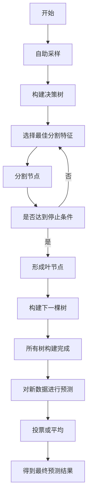

# 随机森林(Random Forests) - 原理与代码实例讲解

## 1. 背景介绍
在机器学习的众多算法中，随机森林因其出色的准确性、鲁棒性和易用性而广受欢迎。它是一种集成学习方法，通过构建多个决策树并集成它们的预测结果来工作。随机森林在处理分类和回归问题上都表现出色，尤其在处理高维数据时，它的性能往往优于其他算法。

## 2. 核心概念与联系
随机森林算法的核心在于两个主要概念：**集成学习**和**决策树**。集成学习是一种策略，通过构建并结合多个模型来提高预测性能。决策树是一种基础的学习模型，它通过一系列的问题来对数据进行分类或回归。

### 2.1 集成学习
集成学习的基本思想是将多个弱学习器组合成一个强学习器。在随机森林中，每个决策树都是一个弱学习器，通过组合这些树的预测结果，可以得到一个更准确、更稳定的模型。

### 2.2 决策树
决策树通过递归地将数据集分割成更小的子集来工作，每个分割都是基于特征值的一个决策。这些连续的决策形成了一条从树的根部到叶节点的路径，每个叶节点代表一个预测结果。

## 3. 核心算法原理具体操作步骤
随机森林的构建过程包括以下步骤：

1. **自助采样(Bootstrap sampling)**：从原始数据集中随机选择样本来构建每个决策树，允许重复选择同一样本。
2. **构建决策树**：对于每个决策树，选择一个随机特征子集，并在这些特征上进行最佳分割来增长树。
3. **预测与投票**：每个决策树对新数据进行预测，最终预测结果由所有树的预测结果通过多数投票或平均来确定。



## 4. 数学模型和公式详细讲解举例说明
随机森林的数学模型基于决策树的集成。每棵树的预测结果可以表示为一个随机变量 $Y_i$，整个森林的预测结果是这些随机变量的组合。

对于分类问题，随机森林的预测结果是众数：
$$
Y_{rf} = \text{mode}\{Y_1, Y_2, \ldots, Y_n\}
$$

对于回归问题，随机森林的预测结果是平均值：
$$
Y_{rf} = \frac{1}{n}\sum_{i=1}^{n}Y_i
$$

其中，$n$ 是决策树的数量。

## 5. 项目实践：代码实例和详细解释说明
在Python中，我们可以使用`sklearn`库来实现随机森林。以下是一个简单的例子：

```python
from sklearn.ensemble import RandomForestClassifier
from sklearn.datasets import make_classification
from sklearn.model_selection import train_test_split
from sklearn.metrics import accuracy_score

# 生成模拟数据
X, y = make_classification(n_samples=1000, n_features=20, n_informative=2, n_redundant=10, random_state=42)

# 划分训练集和测试集
X_train, X_test, y_train, y_test = train_test_split(X, y, test_size=0.3, random_state=42)

# 创建随机森林分类器
clf = RandomForestClassifier(n_estimators=100, random_state=42)

# 训练模型
clf.fit(X_train, y_train)

# 进行预测
y_pred = clf.predict(X_test)

# 评估模型
accuracy = accuracy_score(y_test, y_pred)
print(f"Accuracy: {accuracy:.2f}")
```

在这个例子中，我们首先生成了一个模拟数据集，然后创建了一个随机森林分类器，并在训练集上训练它。最后，我们在测试集上进行预测并计算准确率。

## 6. 实际应用场景
随机森林在许多领域都有应用，包括但不限于：

- **生物信息学**：用于基因表达数据的分类。
- **金融风险评估**：评估信用风险和欺诈检测。
- **医疗诊断**：辅助疾病的诊断和预测。
- **图像分类**：在计算机视觉中用于物体识别。

## 7. 工具和资源推荐
- **Scikit-learn**：一个强大的Python机器学习库，提供了随机森林的实现。
- **R语言**：R语言中的`randomForest`包是另一个流行的随机森林实现。
- **在线课程**：如Coursera和edX上的机器学习课程，提供了随机森林的理论和实践教学。

## 8. 总结：未来发展趋势与挑战
随机森林作为一种成熟的机器学习算法，其未来的发展趋势可能集中在提高效率、处理大规模数据集以及与其他机器学习技术的融合上。挑战包括如何更好地理解模型的决策过程（可解释性问题）以及如何进一步提高模型的性能。

## 9. 附录：常见问题与解答
**Q1：随机森林如何处理过拟合问题？**
A1：随机森林通过构建多个决策树并引入随机性来减少过拟合的风险。每棵树的训练数据和特征都是随机选择的，这样可以确保树之间的差异性，从而降低模型的方差。

**Q2：随机森林的主要参数有哪些？**
A2：主要参数包括树的数量（`n_estimators`）、树的最大深度（`max_depth`）、每个节点分割所需的最小样本数（`min_samples_split`）等。

**Q3：随机森林如何选择特征进行分割？**
A3：随机森林在每个分割点随机选择一定数量的特征，并在这些特征中找到最佳的分割点。

作者：禅与计算机程序设计艺术 / Zen and the Art of Computer Programming