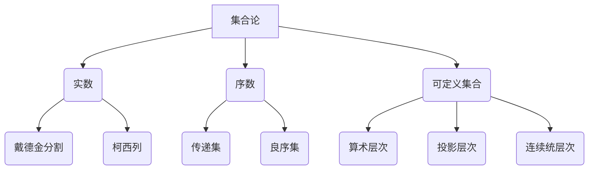

# 集合论导引：实数序数可定义集合

## 1. 背景介绍
### 1.1 集合论的发展历史
#### 1.1.1 康托尔的贡献
#### 1.1.2 罗素悖论的影响
#### 1.1.3 现代公理化集合论的建立
### 1.2 集合论在数学中的地位
#### 1.2.1 集合论作为数学的基础
#### 1.2.2 集合论与其他数学分支的关系
### 1.3 实数、序数和可定义集合的重要性
#### 1.3.1 实数在数学分析中的应用
#### 1.3.2 序数在无穷集合研究中的作用
#### 1.3.3 可定义集合与描述性集合论

## 2. 核心概念与联系
### 2.1 集合的定义与性质
#### 2.1.1 朴素集合论中的集合概念
#### 2.1.2 公理化集合论中的集合定义
#### 2.1.3 集合的基本性质和运算
### 2.2 实数的构造与性质
#### 2.2.1 实数的戴德金分割定义
#### 2.2.2 实数的柯西列定义
#### 2.2.3 实数的完备性与连续性
### 2.3 序数的定义与运算
#### 2.3.1 序数的传递集定义
#### 2.3.2 序数的良序性质
#### 2.3.3 序数的算术运算
### 2.4 可定义集合的概念
#### 2.4.1 算术层次中的可定义集合
#### 2.4.2 投影层次中的可定义集合
#### 2.4.3 连续统层次中的可定义集合

## 3. 核心算法原理具体操作步骤
### 3.1 实数的构造算法
#### 3.1.1 戴德金分割的构造步骤
#### 3.1.2 柯西列的构造步骤
#### 3.1.3 两种构造方法的等价性证明
### 3.2 序数的比较算法
#### 3.2.1 序数的同构比较法
#### 3.2.2 序数的嵌入比较法
#### 3.2.3 比较算法的正确性证明
### 3.3 可定义集合的判定算法
#### 3.3.1 算术层次可定义集合的判定
#### 3.3.2 投影层次可定义集合的判定
#### 3.3.3 连续统层次可定义集合的判定

## 4. 数学模型和公式详细讲解举例说明
### 4.1 实数完备性的数学模型
#### 4.1.1 最小上界原理
#### 4.1.2 单调有界定理
#### 4.1.3 闭区间套定理
### 4.2 序数运算的数学公式
#### 4.2.1 序数加法公式
#### 4.2.2 序数乘法公式
#### 4.2.3 序数指数运算公式
### 4.3 可定义集合的数学刻画
#### 4.3.1 算术层次的数学定义
#### 4.3.2 投影层次的数学定义
#### 4.3.3 连续统层次的数学定义

## 5. 项目实践：代码实例和详细解释说明
### 5.1 实数运算的编程实现
#### 5.1.1 实数加法的代码实现
#### 5.1.2 实数乘法的代码实现
#### 5.1.3 实数比较的代码实现
### 5.2 序数运算的编程实现 
#### 5.2.1 序数加法的代码实现
#### 5.2.2 序数乘法的代码实现
#### 5.2.3 序数比较的代码实现
### 5.3 可定义集合的编程判定
#### 5.3.1 算术层次集合的代码判定
#### 5.3.2 投影层次集合的代码判定
#### 5.3.3 连续统层次集合的代码判定

## 6. 实际应用场景
### 6.1 实数在科学计算中的应用
#### 6.1.1 数值分析中的实数计算
#### 6.1.2 物理模拟中的实数建模
### 6.2 序数在理论计算机科学中的应用
#### 6.2.1 形式语言层次的刻画
#### 6.2.2 递归论中的序数证明
### 6.3 可定义集合在描述性集合论中的应用
#### 6.3.1 Borel 集合的研究
#### 6.3.2 解析集合的研究

## 7. 工具和资源推荐
### 7.1 数学工具软件
#### 7.1.1 Mathematica
#### 7.1.2 MATLAB
#### 7.1.3 Maple
### 7.2 编程语言和库
#### 7.2.1 Python及其数学库
#### 7.2.2 Julia语言
#### 7.2.3 Haskell语言  
### 7.3 相关书籍推荐
#### 7.3.1 《集合论导引》—— Thomas Jech
#### 7.3.2 《实分析》—— Walter Rudin
#### 7.3.3 《模型论》—— C.C.Chang, H.J.Keisler

## 8. 总结：未来发展趋势与挑战
### 8.1 大基数集合论的研究
#### 8.1.1 测度问题与GCH
#### 8.1.2 Woodin 基数与 AD
### 8.2 广义递归论的发展
#### 8.2.1 高阶递归论
#### 8.2.2 无穷时间图灵机
### 8.3 反向数学的应用
#### 8.3.1 数学定理的证明论分析
#### 8.3.2 数学分支的基础研究

## 9. 附录：常见问题与解答
### 9.1 实数是如何从有理数构造出来的？
### 9.2 序数与自然数有何区别？
### 9.3 连续统假设在可定义集合中的地位如何？

集合论作为现代数学的基础，其核心研究对象包括实数、序数和可定义集合。实数可以通过戴德金分割或柯西列的方式从有理数构造得到，具有完备性和连续性等重要性质。序数则刻画了集合的良序结构，可以用于比较和运算无穷集合的大小。可定义集合则根据其定义的复杂程度分为算术层次、投影层次和连续统层次，是描述性集合论的主要研究对象。

在实际应用中，实数广泛用于科学计算和物理建模；序数则在理论计算机科学中用于刻画形式语言的层次结构和进行递归论证明；可定义集合则是描述性集合论中Borel集合和解析集合等的重要工具。

未来，集合论的研究将继续深入大基数假设、广义递归论和反向数学等前沿领域。大基数集合论关注不同基数公理下集合的性质，广义递归论则将计算理论拓展到更高的序数层次，反向数学则利用递归论和证明论的方法分析数学定理的本质。这些研究将为数学基础和计算理论带来新的认识。

集合论的学习需要扎实的数理逻辑基础，除了经典的集合论教材，还可以借助Mathematica、MATLAB等数学软件，以及Python、Julia、Haskell等编程语言和相关数学库进行实践和计算。只有在理论学习和编程实践中不断积累，才能逐步掌握这一现代数学的基石。

作者：禅与计算机程序设计艺术 / Zen and the Art of Computer Programming