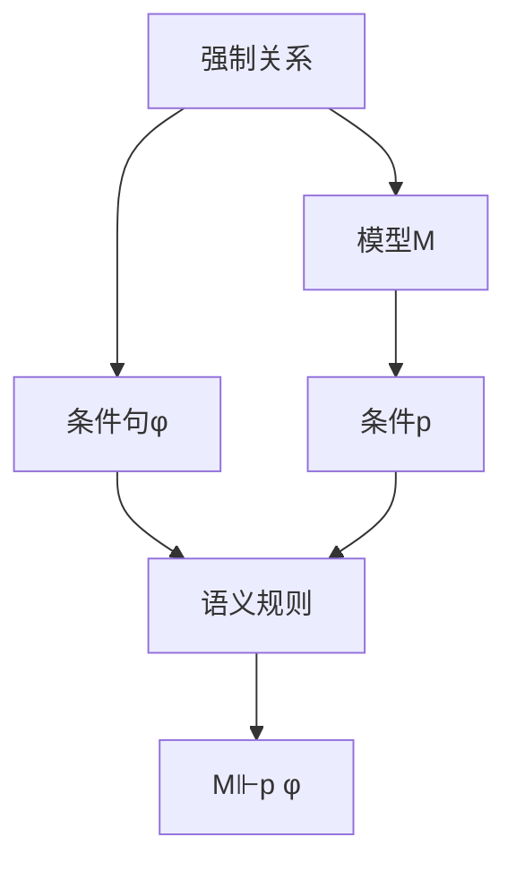

# 集合论导引：恰当力迫公理

## 1.背景介绍

集合论作为数学基础理论之一,在现代数学中扮演着至关重要的角色。它为数学提供了一种精确且统一的语言,使得数学家们能够清晰地表达和操作抽象概念。在集合论的发展历程中,公理化的努力一直是核心目标之一,旨在建立一个完备且自洽的公理系统,为整个数学奠定坚实的基础。

恰当力迫公理(Axiom of Forcing)是20世界纪90年代由数学家Paul Cohen提出的一个重要公理,它在集合论的发展中具有里程碑式的意义。该公理解决了著名的连续体假设(Continuum Hypothesis)问题,同时也为集合论带来了新的发展方向和研究视角。

### 1.1 连续体假设及其困境

连续体假设是由著名数学家卡诺尔(Georg Cantor)在19世纪提出的一个著名猜想。它断言,实数集的基数(cardinal number)是第一个无限基数之后的下一个无限基数。换言之,实数集的基数严格大于可数无穷集的基数,但又是最小的超越可数无穷集的基数。

尽管连续体假设看似合理,但它的真伪一直备受争议。数学家们长期无法在经典集合论的公理系统(ZFC公理系统)中证明或否证这一猜想,这使得连续体假设成为了一个棘手的难题。

### 1.2 恰当力迫公理的提出

1963年,数学家Paul Cohen提出了恰当力迫公理,这一公理为解决连续体假设问题提供了关键契机。Cohen证明了,在经典ZFC公理系统中,连续体假设既不能被证明,也不能被否证,它是一个无法在ZFC公理系统内解决的无决定命题(undecidable statement)。

然而,Cohen进一步证明,如果在ZFC公理系统中加入恰当力迫公理,则连续体假设就可以被否证。也就是说,在扩充的公理系统(ZFC+恰当力迫公理)中,存在一个模型(model)使得连续体假设不成立。这个结果震惊了数学界,因为它打破了长期以来人们对于连续体假设的固有认知。

## 2.核心概念与联系

### 2.1 强制关系(Forcing Relation)

恰当力迫公理的核心概念是强制关系(Forcing Relation)。强制关系是一种在集合论中定义的二元关系,用于描述某个条件句(statement)在给定模型(model)中是否为真。

给定一个模型M和一个条件句φ,如果存在一个条件p属于M,使得p强制φ为真,我们就说φ在M中被强制为真,记作M⊩p φ。这里的条件p可以被视为一种"证明对象"(proof object),它提供了使φ在M中成立的"证明"。

强制关系的定义是通过一组递归规则给出的,这些规则定义了基本逻辑连接词(如与、或、非等)以及量词(全称量词和存在量词)在强制关系下的语义。通过这些规则,我们可以对任意复杂的条件句进行语义分析,并判断它在给定模型中是否被强制为真。



### 2.2 Cohen扩张(Cohen Extension)

Cohen扩张是一种构造新模型的技术,它是Paul Cohen在证明恰当力迫公理时使用的关键工具。Cohen扩张的基本思想是,从一个给定的模型M出发,通过添加一个新的"通用集合"(generic set)G,来构造一个新的模型M[G],使得M[G]满足某些特定的性质。

在Cohen扩张的过程中,通用集合G是通过一种特殊的方式构造出来的,它被设计为能够"编码"某些所需的性质。具体来说,G是由一系列条件(conditions)组成的集合,这些条件被选择的方式保证了G具有所需的性质。

通过将G添加到原始模型M中,我们得到了一个新的模型M[G],它不仅包含了M中的所有元素,还包含了G本身。由于G的特殊性质,M[G]也会继承这些性质,从而满足我们的需求。

```mermaid
graph TD
    A[Cohen扩张] --> B[原始模型M]
    A --> C[通用集合G]
    B --> D[条件集合]
    C --> E[编码性质]
    D --> E
    E --> F[新模型M[G]]
```

### 2.3 Cohen扩张与连续体假设

在证明连续体假设可以被否证的过程中,Cohen利用了Cohen扩张的技术。他构造了一个特殊的通用集合G,使得在扩张后的模型M[G]中,连续体假设不再成立。

具体来说,Cohen选择了一个满足特定条件的通用集合G,使得在M[G]中,实数集的基数严格大于可数无穷集的基数,但又小于任何无限基数的幂集的基数。这样一来,连续体假设就被否证了,因为实数集的基数既不是第一个无限基数之后的下一个无限基数,也不是最小的超越可数无穷集的基数。

通过这一构造,Cohen成功地展示了连续体假设在经典ZFC公理系统中是无法被证明或否证的,但如果加入恰当力迫公理,就可以构造出一个模型使得连续体假设不成立。这一结果极大地推动了集合论的发展,也为数学基础理论提供了新的视角和工具。

## 3.核心算法原理具体操作步骤

### 3.1 强制关系的递归定义

强制关系的定义是通过一组递归规则给出的,这些规则定义了基本逻辑连接词和量词在强制关系下的语义。下面是强制关系的递归定义:

1. **原子句(Atomic Sentences)**: 对于任意原子句φ,我们有M⊩p φ当且仅当φ在M中为真。

2. **否定(Negation)**: 对于任意条件句φ,我们有M⊩p ¬φ当且仅当对于任意q≥p,都不存在M⊩q φ。

3. **合取(Conjunction)**: 对于任意条件句φ和ψ,我们有M⊩p (φ∧ψ)当且仅当存在q≥p,使得M⊩q φ且M⊩q ψ。

4. **析取(Disjunction)**: 对于任意条件句φ和ψ,我们有M⊩p (φ∨ψ)当且仅当存在q≥p,使得M⊩q φ或M⊩q ψ。

5. **全称量词(Universal Quantifier)**: 对于任意条件句φ(x),我们有M⊩p ∀xφ(x)当且仅当对于任意a∈M,都有M⊩p φ(a)。

6. **存在量词(Existential Quantifier)**: 对于任意条件句φ(x),我们有M⊩p ∃xφ(x)当且仅当存在q≥p和a∈M,使得M⊩q φ(a)。

通过这些递归规则,我们可以对任意复杂的条件句进行语义分析,并判断它在给定模型中是否被强制为真。

### 3.2 Cohen扩张的构造过程

Cohen扩张的构造过程包括以下几个关键步骤:

1. **确定扩张的目标**: 首先,我们需要明确扩张的目标,即希望在扩张后的模型中满足哪些性质。在连续体假设的情况下,目标是构造一个模型,使得实数集的基数既不是第一个无限基数之后的下一个无限基数,也不是最小的超越可数无穷集的基数。

2. **定义扩张的条件(Conditions)**: 接下来,我们需要定义一组条件,这些条件将用于构造通用集合G。条件的定义应该与扩张的目标相符,并且需要满足一些特定的性质,如可分性(separativity)和正规性(normality)等。

3. **构造通用集合G**: 利用定义好的条件集合,我们可以通过一种特殊的方式构造出通用集合G。这个过程涉及到一系列技术细节,如密度(density)、反链(antichain)等概念。最终,我们得到一个满足所需性质的通用集合G。

4. **定义扩张模型M[G]**: 一旦获得了通用集合G,我们就可以定义扩张模型M[G]。M[G]包含了原始模型M中的所有元素,以及通用集合G本身。由于G的特殊性质,M[G]也会继承这些性质,从而满足我们的扩张目标。

5. **验证扩张模型的性质**: 最后,我们需要仔细验证扩张模型M[G]是否确实满足了预期的性质。这通常需要进行一系列复杂的证明和推理,以确保扩张的正确性和一致性。

通过上述步骤,我们就可以成功地构造出一个新的模型M[G],使得在这个模型中,连续体假设不再成立。这一过程展现了Cohen扩张技术的强大威力,也为集合论的发展开辟了新的道路。

## 4.数学模型和公式详细讲解举例说明

### 4.1 强制关系的形式化定义

强制关系是恰当力迫公理的核心概念,它提供了一种在给定模型中分析条件句真伪的形式化方法。下面是强制关系的形式化定义:

设M是一个传统模型(classical model),P是M的一个Boolean值代数(Boolean algebra),其中每个条件p∈P都被视为一个"可能的世界"。我们定义M上的强制关系⊩如下:

对于任意条件句φ和条件p∈P,我们说p强制φ在M中为真,记作M⊩p φ,当且仅当满足以下递归规则:

1. **原子句(Atomic Sentences)**:
   - 如果φ是一个关系原子句R(x1,...,xn),那么M⊩p R(a1,...,an)当且仅当<a1,...,an>∈R^M。
   - 如果φ是一个等式原子句x=y,那么M⊩p x=y当且仅当x=y在M中为真。

2. **否定(Negation)**:
   M⊩p ¬φ当且仅当对于任意q≥p,都不存在M⊩q φ。

3. **合取(Conjunction)**:
   M⊩p (φ∧ψ)当且仅当存在q≥p,使得M⊩q φ且M⊩q ψ。

4. **析取(Disjunction)**:
   M⊩p (φ∨ψ)当且仅当存在q≥p,使得M⊩q φ或M⊩q ψ。

5. **全称量词(Universal Quantifier)**:
   M⊩p ∀xφ(x)当且仅当对于任意a∈M,都有M⊩p φ(a)。

6. **存在量词(Existential Quantifier)**:
   M⊩p ∃xφ(x)当且仅当存在q≥p和a∈M,使得M⊩q φ(a)。

通过这一形式化定义,我们可以精确地描述强制关系在任意模型和条件句下的语义。这为后续的理论发展和证明奠定了坚实的基础。

### 4.2 Cohen扩张的形式化构造

Cohen扩张是一种构造新模型的强大技术,它在证明恰当力迫公理时发挥了关键作用。下面是Cohen扩张的形式化构造过程:

设M是一个传统模型,P是M的一个Boolean值代数。我们希望构造一个新的模型M[G],使得在M[G]中,某些特定的条件句φ被强制为真或假。

1. **定义扩张的条件集合(Conditions)**:
   令D是一个包含所有条件的集合,满足以下性质:
   - 对于任意条件p∈D,存在q≤p,使得q决定了φ在M中是真还是假。
   - D是可分的(separative),即对于任意不相等的a,b∈M,存在p∈D使得M⊩p a=b或M⊩p a≠b。
   - D是正规的(normal),即对于任意p∈D和A⊆M,如果对于每个a∈A都有M⊩p φ(a),那么存在q≤p使得M⊩q