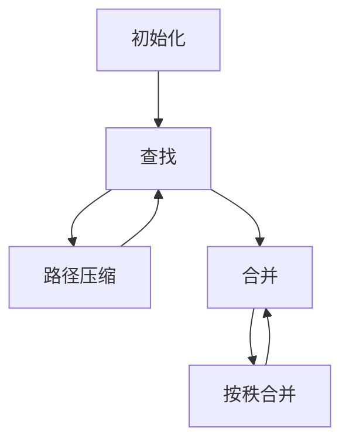
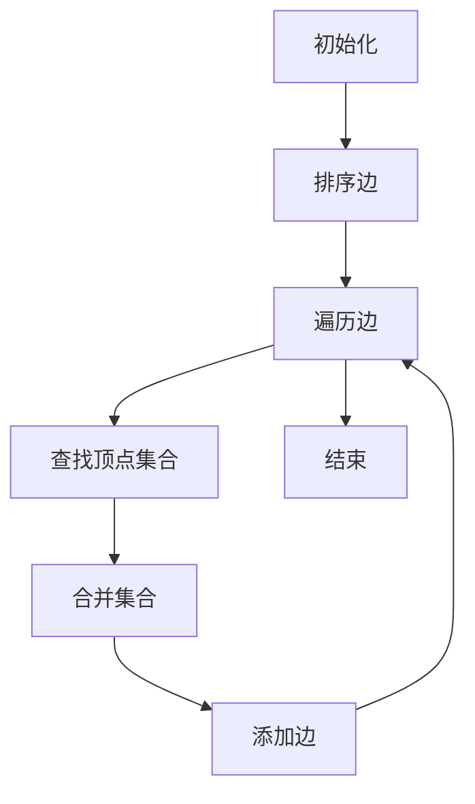
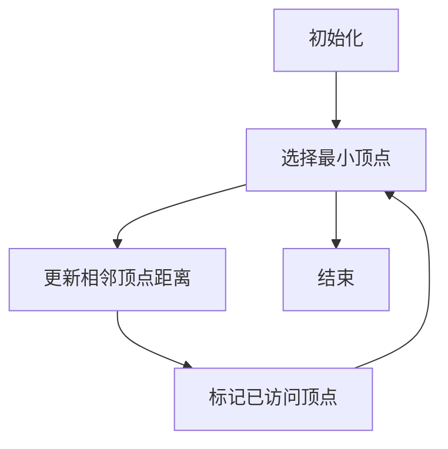

# 集合论导引：银杰力迫构思

## 1.背景介绍

集合论作为数学的一个基础分支,其概念和理论对计算机科学有着深远的影响。它为计算机程序的设计和分析提供了坚实的理论基础,并在许多领域发挥着重要作用,如数据结构、算法、编程语言理论、形式化方法等。集合论的核心思想是研究集合及其运算,为抽象概念建立严格的数学框架。

在计算机程序中,我们经常需要处理各种集合,如整数集合、字符串集合等。集合论为我们提供了处理和操作这些集合的工具和方法。同时,集合论也为计算机科学中的许多概念提供了精确的数学定义,如关系、函数、图等,这些概念在程序设计和算法分析中扮演着重要角色。

## 2.核心概念与联系

### 2.1 集合的基本概念

集合是具有相同性质的对象的总体。集合的基本概念包括:

- 元素(Element):构成集合的对象
- 空集(Empty Set):不包含任何元素的集合,用 $\emptyset$ 或 $\{\}$ 表示
- 有限集(Finite Set):包含有限个元素的集合
- 无限集(Infinite Set):包含无限多个元素的集合

### 2.2 集合的表示法

集合可以用列举法、描述法或使用集合的特征函数来表示。

- 列举法: $A = \{1, 3, 5, 7\}$
- 描述法: $B = \{x | x 是偶数, 1 \leq x \leq 10\}$
- 特征函数: $\chi_A(x) = \begin{cases} 1, & x \in A \\ 0, & x \notin A \end{cases}$

### 2.3 集合运算

集合论中定义了一系列集合运算,如并集、交集、补集、笛卡尔积等,这些运算为处理集合提供了强大的工具。

- 并集 (Union): $A \cup B = \{x | x \in A 或 x \in B\}$
- 交集 (Intersection): $A \cap B = \{x | x \in A 且 x \in B\}$
- 补集 (Complement): $A^c = \{x | x \notin A\}$
- 笛卡尔积 (Cartesian Product): $A \times B = \{(a, b) | a \in A, b \in B\}$

### 2.4 集合与计算机科学的联系

集合论为计算机科学奠定了坚实的理论基础,并在以下领域发挥着重要作用:

- 数据结构: 集合是许多数据结构的基础,如集合、多重集合、映射等。
- 算法分析: 集合论为算法的正确性和时间复杂度分析提供了理论支持。
- 形式化方法: 集合论是形式化规范、模型检查等形式化方法的基础。
- 程序语言理论: 集合论为lambda演算、类型理论等程序语言理论奠定了基础。

## 3.核心算法原理具体操作步骤

集合论中有许多经典的算法,这些算法广泛应用于计算机科学的各个领域。以下是一些核心算法的原理和具体操作步骤。

### 3.1 并查集 (Union-Find)

并查集是一种用于处理集合划分的数据结构,它支持两种操作:查找和合并。

#### 原理

使用森林表示集合,每个集合由一棵树表示,树根表示集合的代表元素。查找操作用于确定某个元素所在的集合,合并操作用于将两个集合合并为一个。

#### 操作步骤

1. 初始化: 将每个元素都视为一个单独的集合。
2. 查找 (Find): 递归查找某个元素所在集合的代表元素。
3. 合并 (Union): 将两个集合的代表元素所在树的根节点相连,较小树连接到较大树上。
4. 路径压缩 (Path Compression): 在查找过程中,将遇到的节点直接连接到根节点,减小树的高度。
5. 按秩合并 (Union by Rank): 在合并时,较小树连接到较大树上,如果两棵树的高度相同,则任选一棵作为较大树,并将其高度加一。

并查集的时间复杂度为 $O(\alpha(n))$,其中 $\alpha(n)$ 是反阿克曼函数,在实际应用中可以近似看作是常数时间复杂度。



### 3.2 Kruskal 算法 (最小生成树)

Kruskal 算法是一种用于求解加权无向连通图的最小生成树的贪心算法。

#### 原理

按照边的权重从小到大的顺序,依次选择不会构成环的边,直到所有顶点都被连通为止。

#### 操作步骤

1. 初始化: 将所有顶点视为单独的集合。
2. 按照边的权重从小到大排序。
3. 遍历所有边,对于每一条边:
   a. 使用并查集查找两个顶点所在的集合。
   b. 如果两个顶点不在同一个集合中,则将该边加入最小生成树,并合并两个集合。
4. 当所有顶点都在同一个集合中时,算法结束。

Kruskal 算法的时间复杂度为 $O(E \log E)$,其中 $E$ 是边的数量。



### 3.3 Dijkstra 算法 (单源最短路径)

Dijkstra 算法是一种用于求解加权有向图中单源最短路径的贪心算法。

#### 原理

从源点出发,不断扩展已知的最短路径,直到找到所有顶点的最短路径为止。

#### 操作步骤

1. 初始化: 将源点的距离设为 0,其他顶点的距离设为无穷大。
2. 使用优先队列或者集合维护未被访问的顶点及其当前最短距离估计值。
3. 从未被访问的顶点中选择距离最小的顶点 $u$。
4. 对于 $u$ 的每个相邻顶点 $v$:
   a. 计算从源点经过 $u$ 到达 $v$ 的距离。
   b. 如果该距离小于 $v$ 的当前最短距离估计值,则更新 $v$ 的最短距离估计值。
5. 重复步骤 3 和 4,直到所有顶点都被访问过。

Dijkstra 算法的时间复杂度为 $O((V + E) \log V)$,其中 $V$ 是顶点数量, $E$ 是边数量。



## 4.数学模型和公式详细讲解举例说明

集合论中有许多重要的数学模型和公式,这些模型和公式为集合运算和算法分析提供了理论支持。

### 4.1 集合的基数 (Cardinality)

集合的基数是指集合中元素的个数。有限集合的基数是一个非负整数,无限集合的基数可以是无穷大。

对于有限集合 $A$,其基数记作 $|A|$,表示集合 $A$ 中元素的个数。例如,如果 $A = \{1, 2, 3\}$,则 $|A| = 3$。

对于无限集合,我们使用无穷大符号 $\infty$ 来表示其基数。例如,自然数集合 $\mathbb{N}$ 的基数为 $|\mathbb{N}| = \infty$。

### 4.2 幂集 (Power Set)

给定一个集合 $A$,它的幂集 $\mathcal{P}(A)$ 是由 $A$ 的所有子集构成的集合。幂集的基数由下式给出:

$$
|\mathcal{P}(A)| = 2^{|A|}
$$

例如,如果 $A = \{1, 2, 3\}$,则 $A$ 的幂集为:

$$
\mathcal{P}(A) = \{\emptyset, \{1\}, \{2\}, \{3\}, \{1, 2\}, \{1, 3\}, \{2, 3\}, \{1, 2, 3\}\}
$$

因此,$|\mathcal{P}(A)| = 2^3 = 8$。

### 4.3 集合的划分 (Partition)

一个集合 $A$ 的划分是 $A$ 的一个子集族 $\{A_1, A_2, \ldots, A_n\}$,满足以下条件:

1. 对于任意 $i \neq j$,有 $A_i \cap A_j = \emptyset$。
2. $\bigcup_{i=1}^n A_i = A$。

换言之,划分将集合 $A$ 分割成了若干个互不相交的非空子集,并且这些子集的并集恰好等于 $A$。

### 4.4 包含-排斥原理 (Inclusion-Exclusion Principle)

包含-排斥原理是一种计算多个集合并集基数的方法。对于有限集合 $A_1, A_2, \ldots, A_n$,它们的并集的基数由下式给出:

$$
\begin{aligned}
\left|\bigcup_{i=1}^n A_i\right| &= \sum_{i=1}^n |A_i| - \sum_{1 \leq i < j \leq n} |A_i \cap A_j| \\
&\quad + \sum_{1 \leq i < j < k \leq n} |A_i \cap A_j \cap A_k| - \cdots \\
&\quad + (-1)^{n-1} \left|\bigcap_{i=1}^n A_i\right|
\end{aligned}
$$

这个公式被广泛应用于组合计数问题。

## 5.项目实践：代码实例和详细解释说明

为了更好地理解集合论在实际编程中的应用,我们将通过一个简单的 Python 项目来实现一些基本的集合运算和算法。

### 5.1 集合的表示和运算

在 Python 中,我们可以使用内置的 `set` 类型来表示集合。`set` 支持基本的集合运算,如并集、交集、差集等。

```python
# 创建集合
A = {1, 2, 3}
B = {2, 3, 4}

# 并集
print(A.union(B))  # 输出: {1, 2, 3, 4}

# 交集
print(A.intersection(B))  # 输出: {2, 3}

# 差集
print(A.difference(B))  # 输出: {1}

# 对称差集
print(A.symmetric_difference(B))  # 输出: {1, 4}
```

### 5.2 并查集的实现

接下来,我们将实现一个并查集数据结构,支持查找和合并操作。

```python
class UnionFind:
    def __init__(self, n):
        self.parent = list(range(n))
        self.rank = [0] * n

    def find(self, x):
        if self.parent[x] != x:
            self.parent[x] = self.find(self.parent[x])
        return self.parent[x]

    def union(self, x, y):
        x_root = self.find(x)
        y_root = self.find(y)

        if x_root == y_root:
            return

        if self.rank[x_root] < self.rank[y_root]:
            self.parent[x_root] = y_root
        elif self.rank[x_root] > self.rank[y_root]:
            self.parent[y_root] = x_root
        else:
            self.parent[y_root] = x_root
            self.rank[x_root] += 1
```

在这个实现中,我们使用两个列表 `parent` 和 `rank` 来维护集合的结构和高度。`find` 函数用于查找一个元素所在的集合,并进行路径压缩优化。`union` 函数用于合并两个集合,并使用按秩合并策略来保持树的平衡。

### 5.3 Kruskal 算法的实现

接下来,我们将实现 Kruskal 算法,用于求解加权无向连通图的最小生成树。

```python
from collections import defaultdict

class Graph:
    def __init__(self, vertices):
        self.vertices = vertices
        self.edges = defaultdict(list