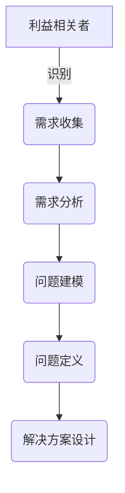

# 需求分析与问题定义原理与代码实战案例讲解

## 1.背景介绍

需求分析和问题定义是软件开发生命周期中的关键环节。它们确保我们正在解决正确的问题,并为整个项目奠定坚实的基础。需求分析涉及收集和分析用户需求,而问题定义则是将这些需求转化为可执行的解决方案。

在现代软件开发中,需求分析和问题定义变得越来越重要。随着系统复杂性的增加和用户期望的提高,准确理解需求和正确定义问题对于项目的成功至关重要。

### 1.1 需求分析的重要性

需求分析确保我们真正理解了用户的需求和期望。它有助于:

- 确定系统的范围和边界
- 识别利益相关者及其需求
- 消除歧义和不明确之处
- 记录和优先排列需求
- 促进与利益相关者的沟通和协作

### 1.2 问题定义的重要性

问题定义将需求转化为可执行的解决方案。它涉及:

- 分解复杂问题并确定子问题
- 识别约束条件和限制
- 评估可能的解决方案
- 选择最佳方法来解决问题
- 定义解决方案的架构和设计

通过适当的需求分析和问题定义,我们可以减少项目风险,提高交付质量,并确保最终产品满足用户的期望。

## 2.核心概念与联系

需求分析和问题定义涉及许多相互关联的概念和活动。以下是一些核心概念及其联系:

### 2.1 利益相关者

利益相关者是对系统或解决方案有利益或影响的个人或组织。他们可能包括最终用户、客户、开发人员、管理层等。识别和参与所有相关利益相关者对于全面理解需求至关重要。

### 2.2 需求收集

需求收集是通过访谈、调查、观察和其他技术从利益相关者那里收集需求的过程。有效的需求收集确保我们捕获到所有相关需求。

### 2.3 需求分析

需求分析涉及审查、整理和优先排列收集到的需求。它有助于消除歧义、解决冲突并确保需求的完整性和一致性。

### 2.4 问题建模

问题建模是将需求转化为抽象模型的过程,以便更好地理解和分析问题。常用的建模技术包括用例图、数据流图和实体关系图。

### 2.5 问题定义

问题定义是根据需求分析和问题建模的结果,明确定义要解决的问题及其约束条件。它是设计解决方案的基础。

### 2.6 解决方案设计

解决方案设计是基于问题定义,制定可执行的解决方案。它包括架构设计、详细设计和实现计划。

## 3.核心算法原理具体操作步骤

需求分析和问题定义过程涉及多个步骤和技术。以下是一些常见的核心算法原理和具体操作步骤:

### 3.1 需求收集算法

#### 3.1.1 访谈法

访谈是收集需求的常用技术。它涉及与利益相关者进行结构化或非结构化的面对面会谈,以了解他们的需求和期望。

操作步骤:

1. 准备访谈计划和问题清单
2. 安排与利益相关者的会面
3. 进行访谈并记录需求
4. 整理和分析访谈结果

#### 3.1.2 调查问卷法

调查问卷是一种收集大量需求的有效方式。它通过设计问卷并发送给利益相关者来收集反馈。

操作步骤:

1. 设计调查问卷
2. 确定目标受众
3. 分发调查问卷
4. 收集和分析反馈

#### 3.1.3 观察法

观察法涉及观察用户在现有系统中的行为和交互,以识别潜在需求和改进机会。

操作步骤:

1. 确定观察目标和场景
2. 设计观察计划
3. 进行现场观察并记录发现
4. 分析观察结果并提取需求

### 3.2 需求分析算法

#### 3.2.1 需求优先排序

需求优先排序是根据预定义的标准(如重要性、风险、成本等)对需求进行排序的过程。

操作步骤:

1. 确定优先排序标准
2. 为每个需求分配优先级
3. 根据优先级对需求进行排序
4. 审查和调整优先级

#### 3.2.2 需求冲突解决

需求冲突解决是识别和解决冲突需求的过程,以确保需求的一致性。

操作步骤:

1. 识别冲突需求
2. 分析冲突的根源
3. 与利益相关者协商解决方案
4. 更新需求以解决冲突

#### 3.2.3 需求跟踪

需求跟踪是跟踪需求在整个生命周期中的状态和变更的过程,以确保需求的可追溯性。

操作步骤:

1. 建立需求跟踪系统
2. 为每个需求分配唯一标识符
3. 记录需求的变更历史
4. 定期审查和更新需求状态

### 3.3 问题建模算法

#### 3.3.1 用例建模

用例建模是使用用例图来可视化系统功能和用户交互的过程。

操作步骤:

1. 识别参与者(用户)
2. 定义用例(功能)
3. 建立参与者和用例之间的关联
4. 细化用例并添加扩展点

#### 3.3.2 数据流建模

数据流建模使用数据流图来描述系统中数据的流动和转换。

操作步骤:

1. 识别外部实体
2. 确定数据流
3. 绘制数据存储
4. 添加数据处理过程

#### 3.3.3 实体关系建模

实体关系建模使用实体关系图来描述系统中数据实体之间的关系。

操作步骤:

1. 识别实体(数据对象)
2. 确定实体属性
3. 建立实体之间的关系
4. 规范化实体关系模型

### 3.4 问题定义算法

#### 3.4.1 问题分解

问题分解是将复杂问题分解为更小、更易管理的子问题的过程。

操作步骤:

1. 识别问题的主要组成部分
2. 将每个组成部分进一步分解为子问题
3. 确定子问题之间的依赖关系
4. 定义每个子问题的边界和约束条件

#### 3.4.2 约束条件识别

约束条件识别是确定限制问题解决方案的各种限制和约束的过程。

操作步骤:

1. 收集技术、法规、预算和时间约束
2. 识别资源和环境约束
3. 考虑用户和组织约束
4. 记录和优先排列所有约束条件

#### 3.4.3 解决方案评估

解决方案评估是根据预定义标准评估潜在解决方案的过程,以选择最佳方案。

操作步骤:

1. 确定评估标准(如成本、风险、可维护性等)
2. 列出潜在解决方案
3. 根据标准评估每个解决方案
4. 选择最佳解决方案

## 4.数学模型和公式详细讲解举例说明

在需求分析和问题定义过程中,数学模型和公式可以用于量化和优化各种决策。以下是一些常见的数学模型和公式,以及它们的详细讲解和示例。

### 4.1 需求优先排序模型

需求优先排序是一个多标准决策问题,可以使用加权评分模型来解决。该模型将每个需求根据多个标准(如重要性、风险、成本等)进行评分,然后根据加权得分对需求进行排序。

加权评分模型公式:

$$
S_i = \sum_{j=1}^{n} w_j \times r_{ij}
$$

其中:
- $S_i$ 是需求 $i$ 的总得分
- $n$ 是标准数量
- $w_j$ 是标准 $j$ 的权重
- $r_{ij}$ 是需求 $i$ 在标准 $j$ 上的评分

示例:

假设我们有三个需求 (R1, R2, R3) 和三个标准 (重要性、风险、成本),权重分别为 0.5、0.3 和 0.2。评分矩阵如下:

|      | 重要性 | 风险 | 成本 |
|------|--------|------|------|
| R1   | 5      | 3    | 4    |
| R2   | 4      | 4    | 2    |
| R3   | 3      | 2    | 5    |

根据加权评分模型,我们可以计算每个需求的总得分:

$S_{R1} = 0.5 \times 5 + 0.3 \times 3 + 0.2 \times 4 = 4.1$
$S_{R2} = 0.5 \times 4 + 0.3 \times 4 + 0.2 \times 2 = 3.8$
$S_{R3} = 0.5 \times 3 + 0.3 \times 2 + 0.2 \times 5 = 3.3$

因此,优先级顺序为 R1 > R2 > R3。

### 4.2 需求冲突解决模型

需求冲突解决可以建模为一个约束优化问题,其目标是最大化需求满意度,同时最小化冲突程度。我们可以使用整数线性规划 (ILP) 模型来解决这个问题。

ILP 模型:

$$
\begin{aligned}
\max \quad & \sum_{i=1}^{m} w_i x_i \\
\text{s.t.} \quad & \sum_{i=1}^{m} a_{ij} x_i \leq b_j, \quad j = 1, \ldots, n \\
& x_i \in \{0, 1\}, \quad i = 1, \ldots, m
\end{aligned}
$$

其中:
- $m$ 是需求数量
- $n$ 是约束条件数量
- $w_i$ 是需求 $i$ 的权重 (重要性)
- $x_i$ 是决策变量,表示是否包含需求 $i$ (1 表示包含,0 表示不包含)
- $a_{ij}$ 是需求 $i$ 对约束条件 $j$ 的影响系数
- $b_j$ 是约束条件 $j$ 的限制值

目标函数 $\sum_{i=1}^{m} w_i x_i$ 最大化需求满意度,约束条件 $\sum_{i=1}^{m} a_{ij} x_i \leq b_j$ 确保解决方案满足所有约束。

示例:

假设我们有三个需求 (R1, R2, R3),权重分别为 5、4 和 3。我们还有两个约束条件:成本限制为 10,冲突程度限制为 2。需求对约束条件的影响如下:

|      | 成本 | 冲突程度 |
|------|------|-----------|
| R1   | 4    | 1         |
| R2   | 3    | 1         |
| R3   | 5    | 2         |

我们可以构建以下 ILP 模型:

$$
\begin{aligned}
\max \quad & 5x_1 + 4x_2 + 3x_3 \\
\text{s.t.} \quad & 4x_1 + 3x_2 + 5x_3 \leq 10 \\
& x_1 + x_2 + 2x_3 \leq 2 \\
& x_1, x_2, x_3 \in \{0, 1\}
\end{aligned}
$$

求解这个 ILP 模型,我们得到最优解 $x_1 = 1, x_2 = 1, x_3 = 0$,即包含需求 R1 和 R2,不包含需求 R3。这样可以最大化需求满意度,同时满足成本和冲突程度的约束。

### 4.3 用例点估算模型

用例点估算模型可用于根据用例模型估算软件开发工作量。该模型考虑了用例的复杂性和技术因素,提供了一种标准化的估算方法。

用例点估算公式:

$$
\text{用例点} = \sum_i \text{