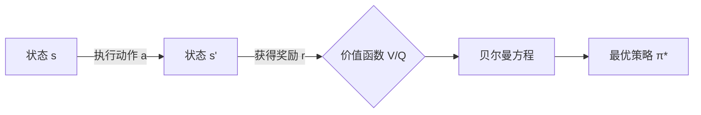

# 马尔可夫决策过程 (MDP)

## 1. 背景介绍
### 1.1 马尔可夫决策过程的起源与发展
#### 1.1.1 马尔可夫决策过程的历史渊源
#### 1.1.2 马尔可夫决策过程在人工智能领域的应用发展
#### 1.1.3 马尔可夫决策过程的研究现状与挑战

### 1.2 马尔可夫决策过程的基本概念
#### 1.2.1 状态、动作、转移概率和奖励函数
#### 1.2.2 策略与最优策略
#### 1.2.3 贝尔曼方程与价值函数

## 2. 核心概念与联系
### 2.1 马尔可夫性与状态转移
#### 2.1.1 马尔可夫性的定义与特点  
#### 2.1.2 状态转移概率矩阵
#### 2.1.3 状态转移图与示例

### 2.2 策略与价值函数
#### 2.2.1 策略的定义与表示方法
#### 2.2.2 状态价值函数与动作价值函数
#### 2.2.3 最优策略与最优价值函数

### 2.3 贝尔曼方程
#### 2.3.1 贝尔曼方程的推导与意义
#### 2.3.2 状态价值函数的贝尔曼方程
#### 2.3.3 动作价值函数的贝尔曼方程



## 3. 核心算法原理具体操作步骤
### 3.1 动态规划算法
#### 3.1.1 价值迭代算法
#### 3.1.2 策略迭代算法
#### 3.1.3 异步动态规划

### 3.2 蒙特卡洛方法
#### 3.2.1 蒙特卡洛预测
#### 3.2.2 蒙特卡洛控制
#### 3.2.3 重要性采样

### 3.3 时间差分学习
#### 3.3.1 Sarsa算法
#### 3.3.2 Q-learning算法
#### 3.3.3 TD(λ)算法

## 4. 数学模型和公式详细讲解举例说明
### 4.1 马尔可夫决策过程的数学定义
#### 4.1.1 五元组 $(S,A,P,R,\gamma)$ 
#### 4.1.2 状态转移概率 $P(s'|s,a)$
#### 4.1.3 奖励函数 $R(s,a)$

### 4.2 贝尔曼方程的数学表示
#### 4.2.1 状态价值函数的贝尔曼方程
$$V(s) = \max_{a \in A} \left\{ R(s,a) + \gamma \sum_{s' \in S} P(s'|s,a) V(s') \right\}$$
#### 4.2.2 动作价值函数的贝尔曼方程 
$$Q(s,a) = R(s,a) + \gamma \sum_{s' \in S} P(s'|s,a) \max_{a' \in A} Q(s',a')$$
#### 4.2.3 贝尔曼最优方程

### 4.3 动态规划算法的数学推导
#### 4.3.1 价值迭代算法
$$V_{k+1}(s) = \max_{a \in A} \left\{ R(s,a) + \gamma \sum_{s' \in S} P(s'|s,a) V_k(s') \right\}$$
#### 4.3.2 策略迭代算法
$$\pi_{k+1}(s) = \arg\max_{a \in A} \left\{ R(s,a) + \gamma \sum_{s' \in S} P(s'|s,a) V_{\pi_k}(s') \right\}$$
#### 4.3.3 异步动态规划

## 5. 项目实践：代码实例和详细解释说明
### 5.1 基于OpenAI Gym的MDP环境
#### 5.1.1 FrozenLake环境介绍
#### 5.1.2 创建FrozenLake环境
```python
import gym

env = gym.make('FrozenLake-v0')
```
#### 5.1.3 环境交互与渲染

### 5.2 动态规划算法实现
#### 5.2.1 价值迭代算法
```python
def value_iteration(env, gamma=0.9, theta=1e-8):
    V = np.zeros(env.nS)
    while True:
        delta = 0
        for s in range(env.nS):
            v = V[s]
            V[s] = max(q_from_v(env, V, s, gamma))
            delta = max(delta, abs(v - V[s]))
        if delta < theta:
            break
    return V
```
#### 5.2.2 策略迭代算法
```python
def policy_iteration(env, gamma=0.9, theta=1e-8):
    policy = np.ones([env.nS, env.nA]) / env.nA
    while True:
        V = policy_evaluation(env, policy, gamma, theta)
        new_policy = policy_improvement(env, V, gamma)
        if np.all(policy == new_policy):
            break
        policy = new_policy
    return policy, V
```
#### 5.2.3 异步动态规划

### 5.3 蒙特卡洛方法实现
#### 5.3.1 蒙特卡洛预测
```python
def mc_prediction(env, policy, num_episodes, gamma=1.0):
    returns_sum = defaultdict(float)
    returns_count = defaultdict(float)
    V = defaultdict(float)
    for i_episode in range(1, num_episodes + 1):
        episode = generate_episode(env, policy)
        states, actions, rewards = zip(*episode)
        discounts = np.array([gamma ** i for i in range(len(rewards) + 1)])
        for i, state in enumerate(states):
            returns_sum[state] += sum(rewards[i:] * discounts[:-(1 + i)])
            returns_count[state] += 1.0
            V[state] = returns_sum[state] / returns_count[state]
    return V
```
#### 5.3.2 蒙特卡洛控制
```python
def mc_control_epsilon_greedy(env, num_episodes, gamma=1.0, epsilon=0.1):
    Q = defaultdict(lambda: np.zeros(env.action_space.n))
    policy = make_epsilon_greedy_policy(Q, epsilon, env.action_space.n)
    for i_episode in range(1, num_episodes + 1):
        episode = generate_episode(env, policy)
        states, actions, rewards = zip(*episode)
        discounts = np.array([gamma ** i for i in range(len(rewards) + 1)])
        for i, state in enumerate(states):
            action = actions[i]
            returns = sum(rewards[i:] * discounts[:-(1 + i)])
            Q[state][action] += (returns - Q[state][action]) / (i + 1)
        policy = make_epsilon_greedy_policy(Q, epsilon, env.action_space.n)
    return Q, policy
```
#### 5.3.3 重要性采样

### 5.4 时间差分学习实现  
#### 5.4.1 Sarsa算法
```python
def sarsa(env, num_episodes, alpha=0.5, gamma=1.0, epsilon=0.1):
    Q = defaultdict(lambda: np.zeros(env.nA))
    policy = make_epsilon_greedy_policy(Q, epsilon, env.nA)
    for i_episode in range(1, num_episodes + 1):
        state = env.reset()
        action = epsilon_greedy(policy, state)
        while True:
            next_state, reward, done, _ = env.step(action)
            next_action = epsilon_greedy(policy, next_state)
            Q[state][action] += alpha * (reward + gamma * Q[next_state][next_action] - Q[state][action])
            state = next_state
            action = next_action
            if done:
                break
        policy = make_epsilon_greedy_policy(Q, epsilon, env.nA)
    return Q, policy
```
#### 5.4.2 Q-learning算法
```python
def q_learning(env, num_episodes, alpha=0.5, gamma=1.0, epsilon=0.1):
    Q = defaultdict(lambda: np.zeros(env.nA))
    policy = make_epsilon_greedy_policy(Q, epsilon, env.nA)
    for i_episode in range(1, num_episodes + 1):
        state = env.reset()
        while True:
            action = epsilon_greedy(policy, state)
            next_state, reward, done, _ = env.step(action)
            Q[state][action] += alpha * (reward + gamma * np.max(Q[next_state]) - Q[state][action])
            state = next_state
            if done:
                break
        policy = make_epsilon_greedy_policy(Q, epsilon, env.nA)
    return Q, policy
```
#### 5.4.3 TD(λ)算法

## 6. 实际应用场景
### 6.1 智能体寻路问题
#### 6.1.1 迷宫寻路
#### 6.1.2 自动驾驶路径规划
#### 6.1.3 机器人导航

### 6.2 资源分配与调度
#### 6.2.1 云计算资源分配
#### 6.2.2 生产调度优化
#### 6.2.3 网络流量控制

### 6.3 推荐系统
#### 6.3.1 电商推荐
#### 6.3.2 新闻推荐
#### 6.3.3 视频推荐

## 7. 工具和资源推荐
### 7.1 开源框架与库
#### 7.1.1 OpenAI Gym
#### 7.1.2 TensorFlow
#### 7.1.3 PyTorch

### 7.2 学习资源
#### 7.2.1 在线课程
#### 7.2.2 书籍推荐
#### 7.2.3 论文与研究资源

## 8. 总结：未来发展趋势与挑战
### 8.1 马尔可夫决策过程的研究前沿
#### 8.1.1 深度强化学习
#### 8.1.2 多智能体决策
#### 8.1.3 元学习与迁移学习

### 8.2 马尔可夫决策过程面临的挑战
#### 8.2.1 高维状态空间问题
#### 8.2.2 探索与利用的平衡
#### 8.2.3 样本效率与泛化能力

### 8.3 马尔可夫决策过程的未来发展方向
#### 8.3.1 与深度学习的结合
#### 8.3.2 实时在线决策
#### 8.3.3 可解释性与安全性

## 9. 附录：常见问题与解答
### 9.1 马尔可夫决策过程与其他强化学习方法的区别
### 9.2 马尔可夫决策过程能否处理连续状态和动作空间
### 9.3 马尔可夫决策过程在实际应用中的局限性
### 9.4 如何选择合适的马尔可夫决策过程算法
### 9.5 马尔可夫决策过程的收敛性与最优性证明

作者：禅与计算机程序设计艺术 / Zen and the Art of Computer Programming