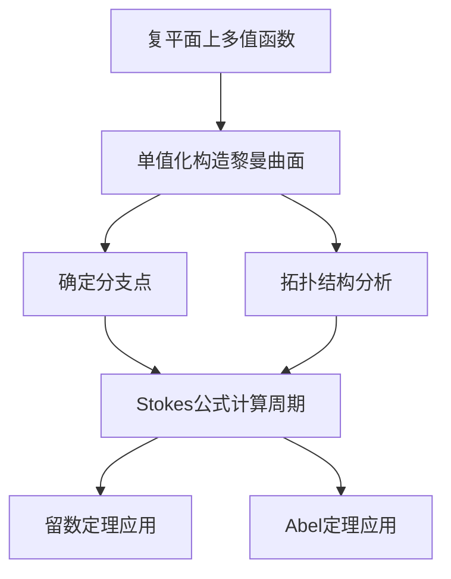

# 黎曼曲面：Stokes公式及其应用

## 1. 背景介绍
### 1.1 黎曼曲面的定义与发展历史
#### 1.1.1 黎曼曲面的定义
#### 1.1.2 黎曼曲面理论的发展历程
#### 1.1.3 黎曼曲面在数学与物理中的重要性
### 1.2 Stokes公式的起源与应用
#### 1.2.1 Stokes公式的提出背景
#### 1.2.2 Stokes公式在流体力学中的应用
#### 1.2.3 Stokes公式在电磁学中的应用

## 2. 核心概念与联系
### 2.1 黎曼曲面的核心概念
#### 2.1.1 复流形与复解析函数
#### 2.1.2 单值化与分支点
#### 2.1.3 亏格与亏格为0的黎曼曲面
### 2.2 Stokes公式的核心概念
#### 2.2.1 流形上的微分形式
#### 2.2.2 外微分算子与外积
#### 2.2.3 边界算子与边界
### 2.3 黎曼曲面与Stokes公式的联系
#### 2.3.1 黎曼曲面上的微分形式
#### 2.3.2 黎曼曲面的边界与Stokes公式
#### 2.3.3 黎曼曲面的周期与Stokes公式

## 3. 核心算法原理具体操作步骤
### 3.1 黎曼曲面的构造算法
#### 3.1.1 复平面上单值化的具体步骤
#### 3.1.2 分支点的确定方法
#### 3.1.3 黎曼曲面的拓扑结构
### 3.2 Stokes公式的计算步骤
#### 3.2.1 流形边界的确定
#### 3.2.2 微分形式在边界上的积分
#### 3.2.3 外微分的计算
### 3.3 黎曼曲面上Stokes公式的应用步骤
#### 3.3.1 周期的计算方法
#### 3.3.2 留数定理在黎曼曲面上的应用
#### 3.3.3 Abel定理的应用

## 4. 数学模型和公式详细讲解举例说明
### 4.1 黎曼曲面的数学模型
#### 4.1.1 复流形的定义与举例
#### 4.1.2 复解析函数与解析延拓
#### 4.1.3 亏格的计算公式与例子
### 4.2 Stokes公式的数学表述
#### 4.2.1 外微分的定义与计算
#### 4.2.2 流形边界的数学刻画
#### 4.2.3 Stokes公式的严格表述
$$
\int_{\partial M} \omega = \int_{M} \mathrm{d}\omega
$$
其中$M$为定向流形，$\partial M$为其边界，$\omega$为$M$上的微分形式，$\mathrm{d}$为外微分算子。
### 4.3 黎曼曲面上Stokes公式的应用实例
#### 4.3.1 计算代数曲线的周期
#### 4.3.2 计算留数的例子
#### 4.3.3 Abel定理的具体应用

## 5. 项目实践：代码实例和详细解释说明
### 5.1 构造黎曼曲面的Python代码实现
#### 5.1.1 复平面网格划分
#### 5.1.2 解析延拓的数值方法
#### 5.1.3 黎曼曲面的可视化
### 5.2 计算Stokes公式的Python代码实现  
#### 5.2.1 流形边界的数值表示
#### 5.2.2 外微分的数值计算
#### 5.2.3 数值积分的实现
### 5.3 代数曲线周期计算的Python代码实现
#### 5.3.1 代数曲线的参数表示
#### 5.3.2 周期的数值计算
#### 5.3.3 Abel定理的数值验证

## 6. 实际应用场景
### 6.1 黎曼曲面在物理学中的应用
#### 6.1.1 量子场论中的黎曼曲面
#### 6.1.2 弦理论中的黎曼曲面
#### 6.1.3 广义相对论中的黎曼曲面
### 6.2 Stokes公式在工程中的应用
#### 6.2.1 流体力学中的Stokes公式
#### 6.2.2 电磁学中的Stokes公式
#### 6.2.3 计算机图形学中的Stokes公式
### 6.3 黎曼曲面与Stokes公式在密码学中的应用
#### 6.3.1 椭圆曲线密码体制
#### 6.3.2 超椭圆曲线密码体制
#### 6.3.3 同余曲线密码体制

## 7. 工具和资源推荐
### 7.1 学习黎曼曲面的书籍推荐
#### 7.1.1 《代数曲线与黎曼曲面》
#### 7.1.2 《黎曼曲面》
#### 7.1.3 《代数曲线导引》
### 7.2 学习Stokes公式的资源推荐
#### 7.2.1 《微分流形》
#### 7.2.2 《微分几何讲义》
#### 7.2.3 《数学分析教程》
### 7.3 相关计算机工具推荐
#### 7.3.1 数学软件Mathematica
#### 7.3.2 数学软件Maple
#### 7.3.3 数学软件MATLAB

## 8. 总结：未来发展趋势与挑战
### 8.1 黎曼曲面理论的前沿发展
#### 8.1.1 代数几何中的黎曼曲面
#### 8.1.2 非交换几何中的黎曼曲面
#### 8.1.3 量子场论中的黎曼曲面
### 8.2 Stokes公式的推广与应用
#### 8.2.1 Stokes公式在流形上的推广
#### 8.2.2 Stokes公式在分形上的应用
#### 8.2.3 Stokes公式在随机分析中的应用
### 8.3 黎曼曲面与Stokes公式研究面临的挑战 
#### 8.3.1 高维黎曼曲面的构造问题
#### 8.3.2 黎曼曲面的算法复杂性
#### 8.3.3 Stokes公式在非光滑流形上的应用

## 9. 附录：常见问题与解答
### 9.1 什么是黎曼曲面？
黎曼曲面是复分析中研究多值函数单值化的重要工具。通过适当的单值化构造，可以将复平面上的多值函数转化为黎曼曲面上的单值函数，从而可以利用单复变函数论的丰富成果研究多值函数的性质。
### 9.2 Stokes公式有什么重要意义？
Stokes公式揭示了流形上微分形式的积分与其边界上积分之间的关系，是现代微分几何的基础定理之一。Stokes公式不仅在数学上有重要地位，在物理学和工程中也有广泛应用，如电磁学、流体力学、计算机图形学等领域。
### 9.3 黎曼曲面与 Stokes 公式有什么联系？
黎曼曲面是一类特殊的定向流形，因此Stokes公式在黎曼曲面上也成立。利用Stokes公式，可以将黎曼曲面上微分形式的积分化为其边界上的积分，这种方法在研究黎曼曲面的周期、留数等问题时非常有效。黎曼曲面与Stokes公式的结合，大大简化了许多复杂问题的求解过程。

作者：禅与计算机程序设计艺术 / Zen and the Art of Computer Programming