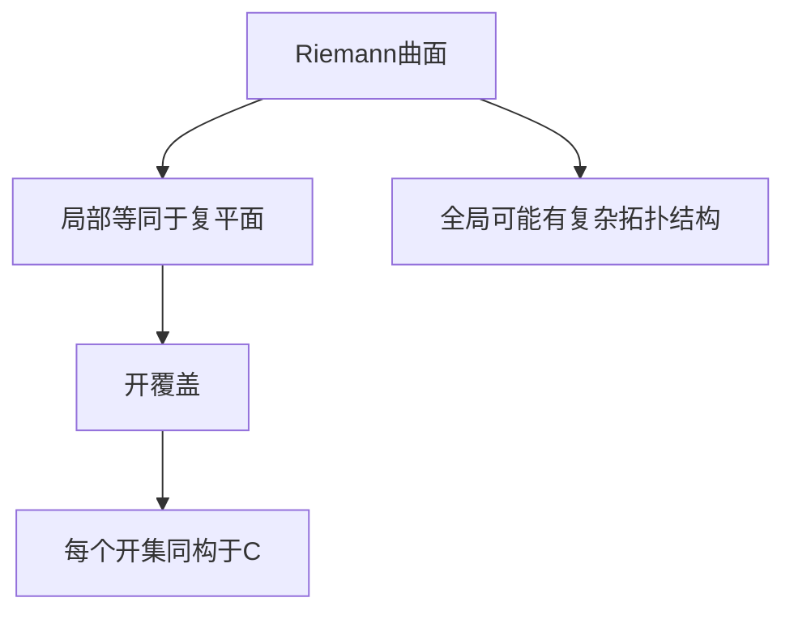
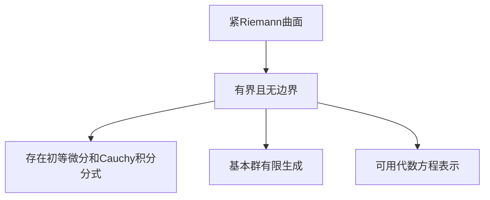
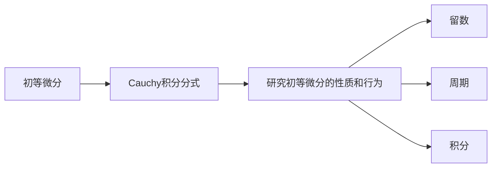
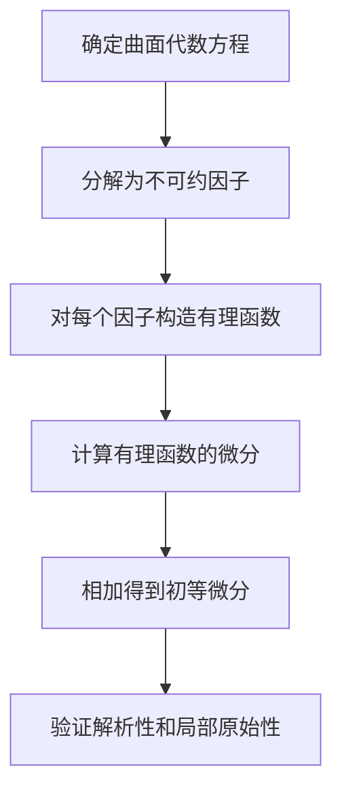

# 黎曼曲面：紧Riemann曲面上的初等微分与Cauchy积分分式

## 1. 背景介绍

在复分析和代数几何中,Riemann曲面是一个重要的概念。它是一个二维实分析流形,局部等同于复平面,但在全局上可能有更复杂的拓扑结构。Riemann曲面在数学和物理学中扮演着重要角色,例如在研究椭圆曲线、代数曲线和微分方程等领域。

紧Riemann曲面是一类特殊的Riemann曲面,它是一个紧致的流形,意味着它是有界且没有边界的。这种曲面具有许多有趣和重要的性质,其中之一就是它们上存在着初等微分和Cauchy积分分式。

### 1.1 初等微分

初等微分是定义在Riemann曲面上的一种特殊的微分形式。它们具有以下性质:

1. 在曲面上的每一点都是解析的。
2. 在曲面上的任何点都有一个局部原始。

这意味着初等微分在整个曲面上都是良好定义的,并且可以在任何点处进行局部研究。

### 1.2 Cauchy积分分式

Cauchy积分分式是一种将初等微分表示为有理函数之比的方法。它的形式如下:

$$
\omega = \frac{P(z)dz}{Q(z)}
$$

其中$P(z)$和$Q(z)$是定义在Riemann曲面上的有理函数,并且$Q(z)$没有在曲面上的零点。这种表示形式对于研究初等微分的性质和行为非常有用。

## 2. 核心概念与联系

### 2.1 Riemann曲面的定义

Riemann曲面是一个二维实分析流形,局部等同于复平面,但在全局上可能有更复杂的拓扑结构。形式上,一个Riemann曲面可以定义为一个连通的Hausdorff空间$X$,以及一个开覆盖$\{U_\alpha\}$,使得每个$U_\alpha$都是同构于复平面$\mathbb{C}$的开子集。



### 2.2 紧Riemann曲面

紧Riemann曲面是一类特殊的Riemann曲面,它是一个紧致的流形,意味着它是有界且没有边界的。这种曲面具有许多有趣和重要的性质,例如:

1. 它们上存在着初等微分和Cauchy积分分式。
2. 它们的基本群是有限生成的。
3. 它们可以用代数方程来表示。



### 2.3 初等微分与Cauchy积分分式

初等微分和Cauchy积分分式是定义在紧Riemann曲面上的重要对象。它们之间存在着密切的联系:

1. 初等微分是定义在Riemann曲面上的一种特殊的微分形式,具有解析性和局部原始性。
2. Cauchy积分分式提供了一种将初等微分表示为有理函数之比的方法。
3. 利用Cauchy积分分式,我们可以研究初等微分的性质和行为,例如它们的留数、周期和积分等。



## 3. 核心算法原理具体操作步骤

### 3.1 初等微分的构造

要在一个紧Riemann曲面上构造初等微分,我们可以遵循以下步骤:

1. 确定曲面的代数方程,并将其分解为不可约因子。
2. 对于每个不可约因子,构造一个有理函数$f_i(z)$,使得$f_i(z)$在该因子上有一个简单极点。
3. 将这些有理函数的微分$df_i(z)$相加,得到一个初等微分$\omega$。

$$
\omega = \sum_{i=1}^n df_i(z)
$$

4. 验证$\omega$在曲面上的每一点都是解析的,并且具有局部原始。



### 3.2 Cauchy积分分式的构造

要将一个初等微分$\omega$表示为Cauchy积分分式,我们可以遵循以下步骤:

1. 确定$\omega$在曲面上的所有极点和它们的阶数。
2. 构造一个有理函数$Q(z)$,使得它在曲面上没有零点,并且在$\omega$的每个极点处有相同阶数的极点。
3. 将$\omega$乘以$Q(z)$,得到一个整体函数$P(z)$。
4. 表示$\omega$为$\frac{P(z)dz}{Q(z)}$。

$$
\omega = \frac{P(z)dz}{Q(z)}
$$

5. 验证这个表示在曲面上的每一点都是有效的。

```mermaid
graph TD
    A[确定初等微分的极点和阶数] --> B[构造有理函数Q(z)]
    B --> C[计算P(z) = omega * Q(z)]
    C --> D[表示为P(z)dz/Q(z)]
    D --> E[验证表示的有效性]
```

## 4. 数学模型和公式详细讲解举例说明

### 4.1 Riemann-Roch定理

Riemann-Roch定理是研究紧Riemann曲面上初等微分和Cauchy积分分式的一个重要工具。它建立了曲面上有理函数、初等微分和它们的零点和极点之间的关系。

定理的形式化陈述如下:

令$X$为一个紧Riemann曲面,genus为$g$。对于任意的有理函数$f$和初等微分$\omega$,定义它们的零点和极点的数量分别为:

$$
Z(f) = \sum_{p \in X} \text{ord}_p(f) \\
Z(\omega) = \sum_{p \in X} \text{ord}_p(\omega)
$$

其中$\text{ord}_p$表示在点$p$处的阶数。则有:

$$
Z(f) + \text{deg}(\omega) = 2g - 2 + Z(\omega)
$$

这个定理为我们研究初等微分和Cauchy积分分式提供了一个强有力的工具。例如,我们可以利用它来确定一个给定的初等微分在曲面上的零点和极点的分布情况。

### 4.2 Abel定理

Abel定理是另一个重要的定理,它描述了紧Riemann曲面上初等微分的积分行为。

定理的陈述如下:

令$X$为一个紧Riemann曲面,genus为$g$。对于任意的初等微分$\omega$,以及曲面上的两个不同点$P$和$Q$,定义$\omega$在$P$到$Q$的积分为:

$$
\int_P^Q \omega
$$

则对于任意的闭合路径$\gamma$,我们有:

$$
\oint_\gamma \omega = 0
$$

这个定理告诉我们,初等微分在闭合路径上的积分总是为零。这是因为初等微分在整个曲面上是单值的,因此它们的积分只依赖于端点,而不依赖于具体的积分路径。

Abel定理对于研究初等微分的周期性质非常重要。例如,我们可以利用它来确定一个给定的初等微分在曲面上的所有闭合积分路径。

### 4.3 例子:椭圆曲线上的初等微分

考虑一个椭圆曲线,它是一个genus为1的紧Riemann曲面。它的方程可以写为:

$$
y^2 = x^3 + ax + b
$$

在这个曲面上,我们可以构造一个初等微分$\omega$:

$$
\omega = \frac{dx}{y}
$$

利用Riemann-Roch定理,我们可以确定$\omega$在曲面上的零点和极点。由于$\text{deg}(\omega) = 2$,而genus为1,因此:

$$
Z(\omega) = 2g - 2 + 2 = 2
$$

这意味着$\omega$在曲面上有两个极点,而没有零点。

另一方面,利用Abel定理,我们可以研究$\omega$的积分行为。由于曲面是紧致的,因此任何闭合路径上的积分都应该为零。例如,考虑一个环绕曲线的闭合路径$\gamma$,我们有:

$$
\oint_\gamma \omega = 0
$$

这个结果对于研究椭圆曲线上的周期函数非常有用。

## 5. 项目实践:代码实例和详细解释说明

在这一部分,我们将提供一些Python代码示例,展示如何在实践中计算和可视化紧Riemann曲面上的初等微分和Cauchy积分分式。

### 5.1 计算初等微分的极点和零点

下面的代码示例展示了如何计算一个给定的初等微分在曲面上的极点和零点。我们将使用SymPy库来处理符号计算。

```python
import sympy as sp

# 定义椭圆曲线方程
x, y, a, b = sp.symbols('x y a b')
eq = y**2 - (x**3 + a*x + b)

# 定义初等微分
omega = sp.diff(x, y) / y

# 计算初等微分的极点和零点
singular_points = sp.solve([eq, omega], [x, y])
poles = [p for p in singular_points if p[1] == 0]
zeros = [p for p in singular_points if p[1] != 0]

print("极点:", poles)
print("零点:", zeros)
```

在这个示例中,我们首先定义了一个椭圆曲线的方程和一个初等微分$\omega = \frac{dx}{y}$。然后,我们使用SymPy的`solve`函数来找到曲面方程和初等微分同时为零的点,这些点就是$\omega$的极点和零点。

### 5.2 可视化初等微分的积分路径

下面的代码示例展示了如何可视化一个初等微分在曲面上的积分路径。我们将使用matplotlib库进行绘图。

```python
import numpy as np
import matplotlib.pyplot as plt

# 定义椭圆曲线参数方程
a, b = 1, 1
t = np.linspace(0, 2*np.pi, 1000)
x = a * np.cos(t)
y = b * np.sin(t)

# 定义初等微分
omega = lambda x, y: 1 / y

# 计算积分路径
x0, y0 = 0, b
integral = 0
xs, ys = [], []
for i in range(len(t)):
    dx = x[i] - x[i-1]
    dy = y[i] - y[i-1]
    integral += omega(x[i], y[i]) * dx
    xs.append(x[i])
    ys.append(y[i])

# 绘制曲线和积分路径
plt.figure(figsize=(8, 6))
plt.plot(x, y, 'b-', label='Elliptic Curve')
plt.plot(xs, ys, 'r--', label='Integration Path')
plt.xlabel('x')
plt.ylabel('y')
plt.title(f'Integration of $\omega = dx/y$ along a path\nIntegral Value: {integral:.4f}')
plt.legend()
plt.show()
```

在这个示例中,我们首先定义了一个椭圆曲线的参数方程和一个初等微分$\omega = \frac{dx}{y}$。然后,我们使用数值积分的方法,沿着曲线上的一条路径计算$\omega$的积分值。最后,我们使用matplotlib绘制曲线和积分路径。

### 5.3 计算Cauchy积分分式

下面的代码示例展示了如何计算一个初等微分的Cauchy积分分式表示。

```python
import sympy as sp

# 定义椭圆曲线方程
x, y, a, b = sp.symbols('x y a b')
eq = y**2 - (x**3 + a*x + b)

# 定义初等微分
omega = sp.diff(x, y) / y

# 找到极点和阶数
singular_