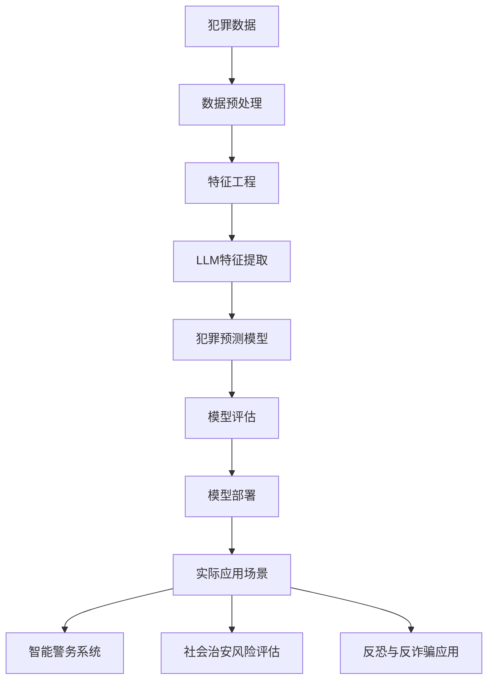

# AI LLM在公共安全领域的应用：预测与预防

## 1. 背景介绍
### 1.1 公共安全面临的挑战
#### 1.1.1 犯罪活动日益复杂化
#### 1.1.2 恐怖主义威胁持续存在
#### 1.1.3 自然灾害频发造成重大损失
### 1.2 人工智能技术的发展
#### 1.2.1 机器学习算法的进步
#### 1.2.2 大数据处理能力的提升
#### 1.2.3 计算硬件性能的跃升
### 1.3 AI在公共安全领域的应用前景
#### 1.3.1 辅助犯罪预测和预防
#### 1.3.2 加强应急响应和救援
#### 1.3.3 优化资源配置和决策支持

## 2. 核心概念与联系
### 2.1 大语言模型(LLM)
#### 2.1.1 LLM的定义和特点
#### 2.1.2 LLM的训练方法和数据要求
#### 2.1.3 LLM在自然语言处理中的优势
### 2.2 犯罪预测模型
#### 2.2.1 犯罪预测的理论基础
#### 2.2.2 基于机器学习的犯罪预测方法
#### 2.2.3 犯罪预测模型的评估指标
### 2.3 LLM与犯罪预测的结合
#### 2.3.1 LLM提取犯罪模式和关键信息
#### 2.3.2 LLM增强犯罪预测模型的表现
#### 2.3.3 LLM助力犯罪预防措施的制定

## 3. 核心算法原理具体操作步骤
### 3.1 基于LLM的犯罪预测流程
#### 3.1.1 数据收集与预处理
#### 3.1.2 特征工程与表示学习
#### 3.1.3 模型训练与调优
#### 3.1.4 模型评估与部署应用
### 3.2 LLM在犯罪预测中的关键技术
#### 3.2.1 命名实体识别与关系抽取
#### 3.2.2 文本分类与聚类
#### 3.2.3 情感分析与观点挖掘
#### 3.2.4 知识图谱构建与推理
### 3.3 LLM与传统机器学习模型的融合
#### 3.3.1 LLM提取高级语义特征
#### 3.3.2 传统模型进行犯罪预测
#### 3.3.3 模型融合策略与效果评估

## 4. 数学模型和公式详细讲解举例说明
### 4.1 Transformer模型的数学原理
#### 4.1.1 自注意力机制的计算过程
#### 4.1.2 多头注意力的并行计算
#### 4.1.3 残差连接和层归一化的作用
### 4.2 犯罪预测常用的机器学习模型
#### 4.2.1 逻辑回归模型及其优化目标
#### 4.2.2 决策树模型的信息增益计算
#### 4.2.3 支持向量机的核函数与损失函数
### 4.3 模型评估的数学指标
#### 4.3.1 精确率、召回率、F1值的计算公式
#### 4.3.2 ROC曲线与AUC值的含义
#### 4.3.3 混淆矩阵与分类报告的解读

## 5. 项目实践：代码实例和详细解释说明
### 5.1 数据集介绍与探索性分析
#### 5.1.1 犯罪数据集的来源与格式
#### 5.1.2 数据清洗与预处理步骤
#### 5.1.3 特征分布可视化与统计分析
### 5.2 基于LLM的特征提取
#### 5.2.1 文本数据的向量化表示
#### 5.2.2 命名实体识别与关系抽取的代码实现
#### 5.2.3 主题模型与文本聚类的应用
### 5.3 犯罪预测模型的训练与评估
#### 5.3.1 逻辑回归模型的训练与调优
#### 5.3.2 决策树模型的超参数选择
#### 5.3.3 模型性能评估与结果分析
### 5.4 模型部署与可视化展示
#### 5.4.1 模型封装与API设计
#### 5.4.2 Web应用开发与交互设计
#### 5.4.3 犯罪热点地图与风险等级可视化

## 6. 实际应用场景
### 6.1 智能警务系统
#### 6.1.1 辅助警力部署与巡逻规划
#### 6.1.2 嫌疑人识别与关系挖掘
#### 6.1.3 案件关联分析与串并案侦查
### 6.2 社会治安风险评估
#### 6.2.1 城市犯罪风险地图绘制
#### 6.2.2 重点区域与人群的动态监测
#### 6.2.3 犯罪模式识别与趋势预警
### 6.3 反恐与反诈骗应用
#### 6.3.1 恐怖活动的早期预警
#### 6.3.2 可疑金融交易的实时检测
#### 6.3.3 诈骗团伙的识别与打击

## 7. 工具和资源推荐
### 7.1 开源LLM模型
#### 7.1.1 BERT及其变体
#### 7.1.2 GPT系列模型
#### 7.1.3 XLNet与ELECTRA
### 7.2 自然语言处理工具包
#### 7.2.1 NLTK与SpaCy
#### 7.2.2 Gensim与FastText
#### 7.2.3 HuggingFace Transformers
### 7.3 犯罪数据集资源
#### 7.3.1 UCR犯罪数据集
#### 7.3.2 芝加哥犯罪数据门户
#### 7.3.3 英国警方犯罪开放数据

## 8. 总结：未来发展趋势与挑战
### 8.1 LLM在公共安全领域的发展趋势
#### 8.1.1 模型规模与性能的持续提升
#### 8.1.2 多模态数据融合与分析
#### 8.1.3 知识增强与因果推理能力
### 8.2 技术应用面临的挑战
#### 8.2.1 数据隐私与安全问题
#### 8.2.2 模型公平性与去偏见
#### 8.2.3 可解释性与可信性
### 8.3 未来研究方向与展望
#### 8.3.1 跨领域知识迁移与泛化
#### 8.3.2 人机协作与交互优化
#### 8.3.3 实时在线学习与适应

## 9. 附录：常见问题与解答
### 9.1 LLM的训练需要多少数据和计算资源？
### 9.2 如何处理犯罪数据中的噪声和缺失值？
### 9.3 犯罪预测模型的性能瓶颈在哪里？
### 9.4 如何平衡模型的准确性和可解释性？
### 9.5 AI辅助犯罪预防是否会侵犯公民隐私？

近年来,随着犯罪活动日益复杂化、恐怖主义威胁持续存在以及自然灾害频发,公共安全面临着前所未有的挑战。与此同时,人工智能技术的快速发展,尤其是大语言模型(LLM)在自然语言处理领域取得的突破性进展,为解决公共安全问题提供了新的思路和工具。LLM 凭借其强大的语言理解和生成能力,在犯罪预测和预防方面展现出广阔的应用前景。

LLM 作为一种基于深度学习的语言模型,通过在大规模文本数据上进行预训练,能够学习到丰富的语言知识和上下文信息。这使得 LLM 在处理犯罪相关的非结构化文本数据时,表现出显著的优势。例如,LLM 可以自动提取犯罪报告中的关键信息,如犯罪类型、时间、地点、嫌疑人特征等,为后续的犯罪分析和预测提供结构化的数据支持。

在犯罪预测任务中,研究人员通常采用机器学习的方法,根据历史犯罪数据训练预测模型。LLM 可以作为一种强大的特征提取器,从海量的犯罪描述文本中学习到高级语义特征,捕捉犯罪模式和趋势。这些语义丰富的特征可以显著提升传统机器学习模型(如逻辑回归、决策树等)的预测性能。此外,LLM 还可以与知识图谱技术相结合,挖掘犯罪事件之间的关联关系,发现犯罪网络,为打击犯罪提供情报支持。

在实际应用场景中,基于 LLM 的犯罪预测模型可以集成到智能警务系统,辅助警力部署和巡逻规划。通过分析犯罪热点区域和高风险人群,系统可以实时预警,合理调配警力资源。在社会治安风险评估方面,LLM 可以帮助绘制城市犯罪风险地图,识别犯罪模式和趋势,为政府部门制定防控策略提供决策依据。此外,LLM 还可应用于反恐和反诈骗领域,通过对可疑活动和交易的语义分析,及时发现和阻止潜在的威胁。

尽管 LLM 在公共安全领域展现出巨大的应用潜力,但我们也要认识到技术应用所面临的挑战。首先是数据隐私和安全问题,如何在合法合规的前提下获取和使用犯罪数据,需要严格的制度规范。其次,模型的公平性和去偏见也是一个重要课题,要防止算法对特定群体产生歧视性影响。此外,犯罪预测模型的可解释性和可信性也备受关注,需要探索人机协作的方式,增强决策的透明度。未来,跨领域知识迁移、实时在线学习等技术的进一步发展,有望突破当前的瓶颈,为公共安全领域带来更加智能高效的解决方案。

综上所述,大语言模型在公共安全领域,特别是犯罪预测和预防方面,具有广阔的应用前景。通过深度挖掘犯罪数据中蕴含的语义信息,LLM 可以显著提升犯罪预测的准确性,为打击犯罪、维护社会稳定提供有力支持。同时,我们也要审慎对待技术应用可能带来的风险和挑战,在法律和伦理的框架下,不断完善 AI 治理体系。只有在技术创新与社会规范的共同推动下,人工智能才能真正造福公共安全事业,为构建和谐安全的社会贡献力量。

作者：禅与计算机程序设计艺术 / Zen and the Art of Computer Programming