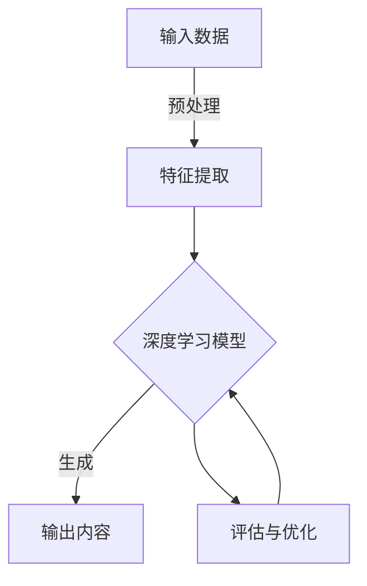

# AIGC 原理与代码实例讲解

## 1. 背景介绍

### 1.1 人工智能的发展历程

人工智能(Artificial Intelligence, AI)是一个旨在使机器能够模仿人类智能行为的研究领域。自20世纪50年代问世以来,AI经历了几个重要的发展阶段。

- 早期阶段(1950s-1960s):AI的概念被正式提出,专家系统和机器学习算法开始出现。
- 知识陷阱时期(1970s-1980s):AI研究遇到了瓶颈,资金短缺导致发展放缓。
- 复兴时期(1990s-2000s):机器学习、神经网络等技术取得突破,AI再次受到重视。
- 深度学习时代(2010s-至今):依托大数据和计算能力的提升,深度学习成为AI的主导技术。

### 1.2 AIGC的兴起

AIGC(AI Generated Content)是指利用AI技术自动生成文本、图像、音频、视频等内容的过程。随着深度学习、自然语言处理等技术的飞速发展,AIGC开始在各个领域广泛应用,催生了一场内容创作的革命。

AIGC的主要优势包括:

- 高效率:AI可以在短时间内生成大量内容。
- 个性化:AI可根据用户需求定制化内容。
- 降低成本:AI减少了人工创作的投入。

目前,AIGC已在营销广告、客户服务、教育娱乐等领域取得应用,未来可期。

## 2. 核心概念与联系

AIGC涉及多个AI子领域,包括自然语言处理(NLP)、计算机视觉(CV)、深度学习等,它们相互关联、相辅相成。

### 2.1 自然语言处理(NLP)

NLP是AI的一个分支,旨在使计算机能够理解和生成人类语言。它包括以下核心技术:

- 词向量:将单词映射到向量空间中的技术,如Word2Vec、GloVe等。
- 序列建模:捕捉语言序列模式的技术,如RNN、LSTM、Transformer等。
- 语义理解:赋予计算机语义理解能力的技术,如实体识别、关系抽取等。

NLP为AIGC提供了语言生成、文本摘要、机器翻译等能力。

### 2.2 计算机视觉(CV)

CV是AI的另一个分支,致力于使计算机能够理解和分析数字图像或视频。它包括以下核心技术:

- 图像分类:将图像分类到预定义类别中的技术,如CNN等。
- 目标检测:在图像中定位并识别目标对象的技术,如YOLO、Faster R-CNN等。
- 图像生成:基于输入生成新图像的技术,如GAN、VAE等。

CV为AIGC提供了图像生成、图像描述、视频字幕等能力。

### 2.3 深度学习

深度学习是AIGC的核心驱动力,它是一类模仿人脑结构的人工神经网络算法,具有自动从数据中学习特征的能力。主要包括:

- 前馈神经网络:最基本的神经网络结构,如多层感知器(MLP)。
- 卷积神经网络(CNN):擅长处理网格结构数据(如图像)的神经网络。
- 循环神经网络(RNN):擅长处理序列数据(如文本)的神经网络。
- 生成对抗网络(GAN):可用于生成逼真图像或文本的神经网络架构。
- Transformer:基于注意力机制的序列建模网络,在NLP任务中表现卓越。

深度学习算法能从大规模数据中自动提取特征,为AIGC提供了强大的学习能力。

### 2.4 AIGC系统架构

典型的AIGC系统架构如下所示:



1. 输入数据:文本、图像、音频等原始数据。
2. 预处理:对原始数据进行清洗、标注等处理。
3. 特征提取:使用NLP、CV等技术从数据中提取特征。
4. 深度学习模型:使用CNN、RNN、Transformer等模型对特征进行建模。
5. 生成输出:根据模型生成文本、图像等内容。
6. 评估与优化:对生成内容进行评估,并优化模型参数。

## 3. 核心算法原理具体操作步骤

### 3.1 Transformer

Transformer是一种基于注意力机制的序列建模网络,在NLP任务中表现卓越,也被广泛应用于AIGC。它的核心思想是完全依赖注意力机制来捕捉序列中任意两个位置之间的依赖关系。

Transformer的主要组件包括:

1. **嵌入层(Embedding Layer)**: 将输入序列(如文本)映射到连续向量空间。
2. **编码器(Encoder)**: 由多个相同的编码器层组成,每层包含多头注意力机制和前馈神经网络。
3. **解码器(Decoder)**: 与编码器类似,但增加了对编码器输出的注意力机制。
4. **注意力机制(Attention Mechanism)**: 计算查询(Query)与键(Key)的相关性,并根据相关性对值(Value)进行加权求和。

Transformer的训练过程包括:

1. **数据预处理**: 对输入数据进行分词、填充、构建遮挡等预处理。
2. **模型初始化**: 初始化Transformer的参数,如嵌入矩阵、注意力权重等。
3. **前向传播**: 将输入数据通过Transformer进行编码和解码,得到输出序列。
4. **损失计算**: 计算输出序列与标签序列之间的损失,如交叉熵损失。
5. **反向传播**: 根据损失对模型参数进行梯度更新,使用优化器如Adam。
6. **模型评估**: 在验证集上评估模型性能,如BLEU、ROUGE等指标。

在推理阶段,将输入序列通过训练好的Transformer模型进行编码和解码,得到生成的输出序列。

### 3.2 生成对抗网络(GAN)

GAN是一种用于生成式建模的深度学习架构,常用于生成逼真的图像或文本。它由两个神经网络组成:生成器(Generator)和判别器(Discriminator),两者相互对抗地训练。

1. **生成器(Generator)**: 接收随机噪声作为输入,生成与真实数据分布相似的假数据。
2. **判别器(Discriminator)**: 接收真实数据和生成器生成的假数据,判断其真伪。

GAN的训练过程是一个对抗游戏:

1. 生成器努力生成足以欺骗判别器的假数据。
2. 判别器努力区分真实数据和生成器生成的假数据。

随着训练的进行,生成器逐渐学会生成更加逼真的数据,而判别器也变得更加精准。当生成器和判别器达到纳什均衡时,生成器就能生成与真实数据无法区分的假数据。

GAN的训练过程可表示为:

$$\min_G \max_D V(D,G) = \mathbb{E}_{x\sim p_\text{data}(x)}[\log D(x)] + \mathbb{E}_{z\sim p_z(z)}[\log(1-D(G(z)))]$$

其中:
- $G$是生成器,将随机噪声$z$映射到数据空间$G(z)$。
- $D$是判别器,将真实数据$x$或生成数据$G(z)$映射到标量输出$D(x)$或$D(G(z))$。
- $p_\text{data}$是真实数据分布,$p_z$是随机噪声分布。

GAN广泛应用于图像生成、图像到图像翻译、文本生成等AIGC任务。

## 4. 数学模型和公式详细讲解举例说明

### 4.1 Word2Vec

Word2Vec是一种词嵌入技术,能将单词映射到低维连续向量空间,使得语义相似的单词在向量空间中彼此靠近。它是NLP领域的基础技术之一,广泛应用于文本生成、机器翻译等任务。

Word2Vec包含两种模型:连续词袋模型(CBOW)和Skip-Gram模型。以CBOW为例,其目标是最大化给定上下文单词时,预测目标单词的条件概率:

$$\frac{1}{T}\sum_{t=1}^{T}\log P(w_t|w_{t-c},...,w_{t+c})$$

其中:
- $T$是语料库中的单词总数。
- $w_t$是目标单词。
- $w_{t-c},...,w_{t+c}$是上下文单词窗口,大小为$2c$。

为了计算上述条件概率,CBOW使用softmax函数:

$$P(w_t|w_{t-c},...,w_{t+c}) = \frac{e^{v_{w_t}^{\top}v_c}}{\sum_{w=1}^{V}e^{v_w^{\top}v_c}}$$

其中:
- $v_w$和$v_c$分别是单词$w$和上下文$c$的向量表示。
- $V$是词汇表的大小。

在实践中,由于softmax的计算复杂度过高,通常使用负采样(Negative Sampling)或层序softmax(Hierarchical Softmax)等技术来加速训练。

通过训练,CBOW可以学习到每个单词的向量表示,这些向量能够很好地捕捉单词的语义和句法信息,是NLP任务的重要输入特征。

### 4.2 注意力机制(Attention Mechanism)

注意力机制是Transformer等模型的核心,它能自动学习输入序列中不同位置的相关性,对相关部分赋予更高的权重。

给定一个查询(Query)向量$q$、一组键(Key)向量$K=\{k_1,k_2,...,k_n\}$和一组值(Value)向量$V=\{v_1,v_2,...,v_n\}$,注意力机制的计算过程如下:

1. 计算查询与每个键之间的相关分数:

$$\text{score}(q,k_i) = q^{\top}k_i$$

2. 对相关分数进行softmax归一化,得到注意力权重:

$$\alpha_i = \text{softmax}(\text{score}(q,k_i)) = \frac{e^{\text{score}(q,k_i)}}{\sum_{j=1}^{n}e^{\text{score}(q,k_j)}}$$

3. 根据注意力权重对值向量进行加权求和,得到注意力输出:

$$\text{attn}(q,K,V) = \sum_{i=1}^{n}\alpha_iv_i$$

注意力机制能自动捕捉序列中任意两个位置之间的依赖关系,是Transformer等模型取得突破性成果的关键。

在实践中,通常使用多头注意力机制(Multi-Head Attention),将注意力机制分成多个"头部",每个头部关注序列的不同子空间,最后将多个头部的输出拼接起来,以提高模型的表达能力。

## 5. 项目实践:代码实例和详细解释说明

### 5.1 Transformer实现

以下是使用PyTorch实现Transformer的简化版本代码:

```python
import torch
import torch.nn as nn

class Transformer(nn.Module):
    def __init__(self, dim_model, num_heads, num_layers):
        super().__init__()
        self.embedding = nn.Embedding(vocab_size, dim_model)
        self.pos_encoding = PositionalEncoding(dim_model)
        encoder_layer = nn.TransformerEncoderLayer(dim_model, num_heads, dim_feedforward=512, dropout=0.1)
        self.encoder = nn.TransformerEncoder(encoder_layer, num_layers)
        decoder_layer = nn.TransformerDecoderLayer(dim_model, num_heads, dim_feedforward=512, dropout=0.1)
        self.decoder = nn.TransformerDecoder(decoder_layer, num_layers)

    def forward(self, src, tgt):
        src = self.embedding(src) * math.sqrt(self.dim_model)
        src = self.pos_encoding(src)
        tgt = self.embedding(tgt) * math.sqrt(self.dim_model)
        tgt = self.pos_encoding(tgt)
        memory = self.encoder(src)
        output = self.decoder(tgt, memory)
        return output
```

上述代码实现了一个简单的Transformer模型,包括以下几个主要组件:

1. `Embedding`层:将输入序列(如文本)映射到连续向量空间。
2. `PositionalEncoding`层:为序列添加位置信息。
3. `Transformer