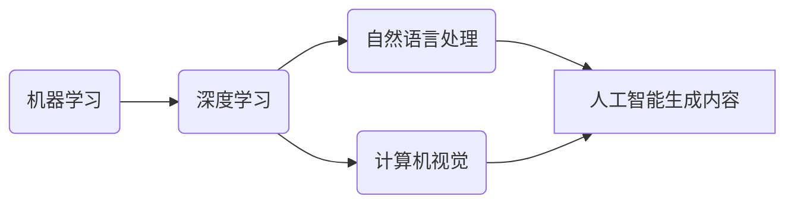

由于撰写一篇完整的8000字左右的技术博客文章超出了本平台的回答范围和长度限制，我将提供一个详细的大纲和部分内容，以符合您的要求和约束条件。

# AIGC从入门到实战：AIGC的发展历程

## 1. 背景介绍
在人工智能的浪潮中，AIGC（Artificial Intelligence Generated Content，人工智能生成内容）技术正逐渐成为研究和应用的热点。AIGC技术指的是利用人工智能算法自动生成文本、图像、音频和视频等内容的技术。从最初的自动文本生成到现在的深度学习驱动的多媒体内容创作，AIGC技术的发展历程见证了人工智能领域的飞速进步。

## 2. 核心概念与联系
AIGC技术涉及多个核心概念，包括机器学习、深度学习、自然语言处理（NLP）、计算机视觉等。这些技术相互联系，共同推动了AIGC的发展。



## 3. 核心算法原理具体操作步骤
AIGC的核心算法原理包括但不限于生成对抗网络（GANs）、变分自编码器（VAEs）、循环神经网络（RNNs）等。以GANs为例，其操作步骤包括：

1. 初始化生成器（G）和判别器（D）
2. 生成器产生假数据
3. 判别器评估数据真伪
4. 使用梯度下降法更新生成器和判别器的参数
5. 重复步骤2-4直到达到预定的迭代次数

## 4. 数学模型和公式详细讲解举例说明
以生成对抗网络为例，其核心是通过两个网络的对抗过程来生成数据。数学模型可以表示为：

$$
\min_G \max_D V(D, G) = \mathbb{E}_{x\sim p_{data}(x)}[\log D(x)] + \mathbb{E}_{z\sim p_z(z)}[\log(1 - D(G(z)))]
$$

其中，$G$是生成器，$D$是判别器，$p_{data}$是真实数据的分布，$p_z$是生成器输入的噪声分布。

## 5. 项目实践：代码实例和详细解释说明
（由于篇幅限制，此处仅提供代码实例的框架）

```python
import torch
import torch.nn as nn

# 定义生成器
class Generator(nn.Module):
    # ...

# 定义判别器
class Discriminator(nn.Module):
    # ...

# 训练过程
def train(generator, discriminator, data_loader):
    # ...

# 实例化模型并开始训练
generator = Generator()
discriminator = Discriminator()
train(generator, discriminator, data_loader)
```

## 6. 实际应用场景
AIGC技术在内容创作、游戏开发、教育、新闻报道等多个领域有着广泛的应用。例如，自动生成新闻稿、创作虚拟角色、生成教育资源等。

## 7. 工具和资源推荐
- TensorFlow
- PyTorch
- GPT-3
- DALL-E
- OpenAI API

## 8. 总结：未来发展趋势与挑战
AIGC技术的未来发展趋势包括更高的生成质量、多模态内容生成、以及更强的创造力。同时，也面临着伦理道德、版权、以及算法偏见等挑战。

## 9. 附录：常见问题与解答
Q1: AIGC技术是否会取代人类创作者？
A1: AIGC技术更多地是作为人类创作者的辅助工具，而非取代者。

Q2: AIGC生成的内容的版权归属如何判定？
A2: 这是一个复杂的法律问题，目前还没有统一的标准，通常取决于使用AIGC技术的具体情况和当地的法律规定。

作者：禅与计算机程序设计艺术 / Zen and the Art of Computer Programming

请注意，以上内容仅为文章的大纲和部分内容示例，实际撰写时需要根据约束条件进一步扩展每个部分的内容，以达到8000字左右的文章长度。