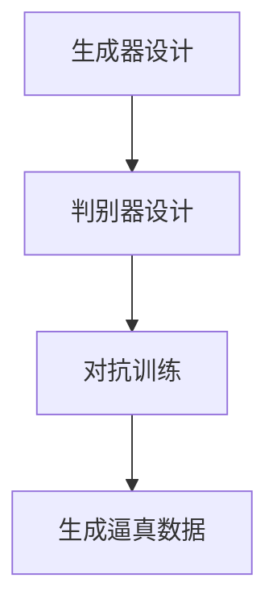

# AIGC从入门到实战：关于个人

## 1.背景介绍

人工智能生成内容（AIGC，Artificial Intelligence Generated Content）是近年来迅速崛起的技术领域。它利用深度学习、自然语言处理和计算机视觉等技术，生成高质量的文本、图像、音频和视频内容。AIGC的应用范围广泛，从自动化新闻报道、个性化广告到虚拟助手和娱乐内容创作，几乎涵盖了所有需要内容生成的领域。

在个人层面，AIGC技术为普通用户提供了前所未有的创作工具，使得非专业人士也能生成高质量的内容。这不仅降低了创作门槛，还极大地丰富了内容生态系统。然而，AIGC技术的复杂性和多样性也给个人用户带来了新的挑战和机遇。

## 2.核心概念与联系

### 2.1 人工智能生成内容（AIGC）

AIGC是指利用人工智能技术生成各种形式的内容。其核心技术包括深度学习、自然语言处理（NLP）、计算机视觉和生成对抗网络（GANs）。

### 2.2 深度学习

深度学习是机器学习的一个子领域，利用多层神经网络来学习和表示数据。它在图像识别、语音识别和自然语言处理等领域取得了显著的成果。

### 2.3 自然语言处理（NLP）

NLP是人工智能的一个分支，专注于机器与人类语言的交互。它包括文本生成、情感分析、机器翻译等任务。

### 2.4 生成对抗网络（GANs）

GANs是一种深度学习模型，由生成器和判别器两个部分组成。生成器负责生成数据，判别器则负责区分生成的数据和真实数据。通过这种对抗训练，GANs可以生成非常逼真的数据。

### 2.5 核心联系

这些技术相互联系，共同构成了AIGC的技术基础。例如，深度学习模型可以用于训练NLP模型，而GANs可以用于生成高质量的图像和视频。

## 3.核心算法原理具体操作步骤

### 3.1 深度学习模型的训练

深度学习模型的训练通常包括以下步骤：

1. **数据收集**：收集大量的训练数据。
2. **数据预处理**：对数据进行清洗和标准化处理。
3. **模型选择**：选择合适的深度学习模型，如卷积神经网络（CNN）或循环神经网络（RNN）。
4. **模型训练**：使用训练数据对模型进行训练。
5. **模型评估**：使用验证数据评估模型的性能。
6. **模型优化**：根据评估结果优化模型。

### 3.2 自然语言处理的具体操作

NLP任务的具体操作步骤如下：

1. **文本预处理**：包括分词、去停用词、词干提取等。
2. **特征提取**：将文本转换为数值特征，如词袋模型（Bag of Words）或词向量（Word Embedding）。
3. **模型训练**：使用特征数据训练NLP模型，如LSTM或Transformer。
4. **模型评估**：使用测试数据评估模型的性能。
5. **模型优化**：根据评估结果优化模型。

### 3.3 生成对抗网络的训练

GANs的训练步骤如下：

1. **生成器设计**：设计生成器网络，用于生成数据。
2. **判别器设计**：设计判别器网络，用于区分生成数据和真实数据。
3. **对抗训练**：交替训练生成器和判别器，使生成器生成的数据越来越逼真。

以下是一个简单的Mermaid流程图，展示了GANs的训练过程：



## 4.数学模型和公式详细讲解举例说明

### 4.1 深度学习中的数学模型

深度学习模型通常由多个神经元组成，每个神经元通过激活函数进行非线性变换。以下是一个简单的神经元计算公式：

$$
y = f(\sum_{i=1}^{n} w_i x_i + b)
$$

其中，$y$ 是输出，$f$ 是激活函数，$w_i$ 是权重，$x_i$ 是输入，$b$ 是偏置。

### 4.2 自然语言处理中的数学模型

在NLP中，词向量（Word Embedding）是常用的特征表示方法。词向量将每个词表示为一个固定维度的向量。常用的词向量模型包括Word2Vec和GloVe。

Word2Vec的Skip-gram模型的目标是最大化以下似然函数：

$$
\frac{1}{T} \sum_{t=1}^{T} \sum_{-c \leq j \leq c, j \neq 0} \log P(w_{t+j} | w_t)
$$

其中，$T$ 是词的总数，$c$ 是上下文窗口大小，$w_t$ 是当前词，$w_{t+j}$ 是上下文词。

### 4.3 生成对抗网络中的数学模型

GANs的目标是通过对抗训练，使生成器生成的数据无法被判别器区分。其损失函数如下：

$$
\min_G \max_D V(D, G) = \mathbb{E}_{x \sim p_{data}(x)} [\log D(x)] + \mathbb{E}_{z \sim p_z(z)} [\log (1 - D(G(z)))]
$$

其中，$G$ 是生成器，$D$ 是判别器，$x$ 是真实数据，$z$ 是噪声数据。

## 5.项目实践：代码实例和详细解释说明

### 5.1 深度学习项目实例

以下是一个使用TensorFlow训练简单神经网络的示例代码：

```python
import tensorflow as tf
from tensorflow.keras.datasets import mnist
from tensorflow.keras.models import Sequential
from tensorflow.keras.layers import Dense, Flatten

# 加载数据
(x_train, y_train), (x_test, y_test) = mnist.load_data()

# 数据预处理
x_train, x_test = x_train / 255.0, x_test / 255.0

# 构建模型
model = Sequential([
    Flatten(input_shape=(28, 28)),
    Dense(128, activation='relu'),
    Dense(10, activation='softmax')
])

# 编译模型
model.compile(optimizer='adam',
              loss='sparse_categorical_crossentropy',
              metrics=['accuracy'])

# 训练模型
model.fit(x_train, y_train, epochs=5)

# 评估模型
model.evaluate(x_test, y_test)
```

### 5.2 自然语言处理项目实例

以下是一个使用NLTK进行文本预处理的示例代码：

```python
import nltk
from nltk.corpus import stopwords
from nltk.tokenize import word_tokenize

# 下载停用词
nltk.download('stopwords')
nltk.download('punkt')

# 文本预处理
text = "This is a sample sentence, showing off the stop words filtration."
stop_words = set(stopwords.words('english'))
word_tokens = word_tokenize(text)

filtered_sentence = [w for w in word_tokens if not w.lower() in stop_words]

print(filtered_sentence)
```

### 5.3 生成对抗网络项目实例

以下是一个使用PyTorch实现简单GAN的示例代码：

```python
import torch
import torch.nn as nn
import torch.optim as optim
from torchvision import datasets, transforms

# 定义生成器
class Generator(nn.Module):
    def __init__(self):
        super(Generator, self).__init__()
        self.main = nn.Sequential(
            nn.Linear(100, 256),
            nn.ReLU(True),
            nn.Linear(256, 512),
            nn.ReLU(True),
            nn.Linear(512, 1024),
            nn.ReLU(True),
            nn.Linear(1024, 784),
            nn.Tanh()
        )

    def forward(self, x):
        return self.main(x)

# 定义判别器
class Discriminator(nn.Module):
    def __init__(self):
        super(Discriminator, self).__init__()
        self.main = nn.Sequential(
            nn.Linear(784, 1024),
            nn.LeakyReLU(0.2, inplace=True),
            nn.Linear(1024, 512),
            nn.LeakyReLU(0.2, inplace=True),
            nn.Linear(512, 256),
            nn.LeakyReLU(0.2, inplace=True),
            nn.Linear(256, 1),
            nn.Sigmoid()
        )

    def forward(self, x):
        return self.main(x)

# 初始化模型
G = Generator()
D = Discriminator()

# 定义损失函数和优化器
criterion = nn.BCELoss()
optimizerD = optim.Adam(D.parameters(), lr=0.0002)
optimizerG = optim.Adam(G.parameters(), lr=0.0002)

# 训练模型
for epoch in range(100):
    for i, (data, _) in enumerate(dataloader):
        # 更新判别器
        D.zero_grad()
        real_data = data.view(-1, 784)
        real_label = torch.ones(data.size(0), 1)
        fake_label = torch.zeros(data.size(0), 1)
        output = D(real_data)
        lossD_real = criterion(output, real_label)
        lossD_real.backward()

        noise = torch.randn(data.size(0), 100)
        fake_data = G(noise)
        output = D(fake_data.detach())
        lossD_fake = criterion(output, fake_label)
        lossD_fake.backward()
        optimizerD.step()

        # 更新生成器
        G.zero_grad()
        output = D(fake_data)
        lossG = criterion(output, real_label)
        lossG.backward()
        optimizerG.step()

    print(f'Epoch [{epoch+1}/100], Loss D: {lossD_real+lossD_fake}, Loss G: {lossG}')
```

## 6.实际应用场景

### 6.1 自动化新闻报道

AIGC技术可以用于自动生成新闻报道。通过训练NLP模型，系统可以从新闻事件中提取关键信息，并生成结构化的新闻报道。

### 6.2 个性化广告

通过分析用户行为数据，AIGC技术可以生成个性化的广告内容，提高广告的点击率和转化率。

### 6.3 虚拟助手

虚拟助手如Siri和Alexa利用AIGC技术生成自然语言响应，提供更加智能和人性化的用户体验。

### 6.4 娱乐内容创作

AIGC技术可以用于生成音乐、绘画和视频等娱乐内容，极大地丰富了娱乐产业的创作手段。

## 7.工具和资源推荐

### 7.1 深度学习框架

- TensorFlow
- PyTorch
- Keras

### 7.2 自然语言处理工具

- NLTK
- SpaCy
- Hugging Face Transformers

### 7.3 生成对抗网络工具

- GAN Lab
- PyTorch GAN Zoo
- TensorFlow GAN

### 7.4 数据集

- MNIST
- CIFAR-10
- IMDB Reviews

## 8.总结：未来发展趋势与挑战

### 8.1 未来发展趋势

AIGC技术将继续快速发展，未来可能会出现更加智能和多样化的内容生成工具。随着计算能力的提升和算法的优化，AIGC的应用场景将更加广泛。

### 8.2 挑战

尽管AIGC技术前景广阔，但也面临一些挑战。首先是数据隐私和安全问题，如何保护用户数据是一个重要课题。其次是生成内容的真实性和伦理问题，如何防止虚假信息的传播也是一个亟待解决的问题。

## 9.附录：常见问题与解答

### 9.1 AIGC技术是否会取代人类创作？

AIGC技术可以辅助人类创作，但难以完全取代人类的创造力和情感表达。它更多的是提供一种新的创作工具，帮助人类更高效地生成内容。

### 9.2 如何入门AIGC技术？

入门AIGC技术可以从学习深度学习和自然语言处理开始。推荐阅读相关书籍和在线课程，并进行实际项目实践。

### 9.3 AIGC技术的应用前景如何？

AIGC技术的应用前景非常广阔，几乎涵盖了所有需要内容生成的领域。随着技术的不断进步，AIGC将会在更多的实际场景中得到应用。

---

作者：禅与计算机程序设计艺术 / Zen and the Art of Computer Programming