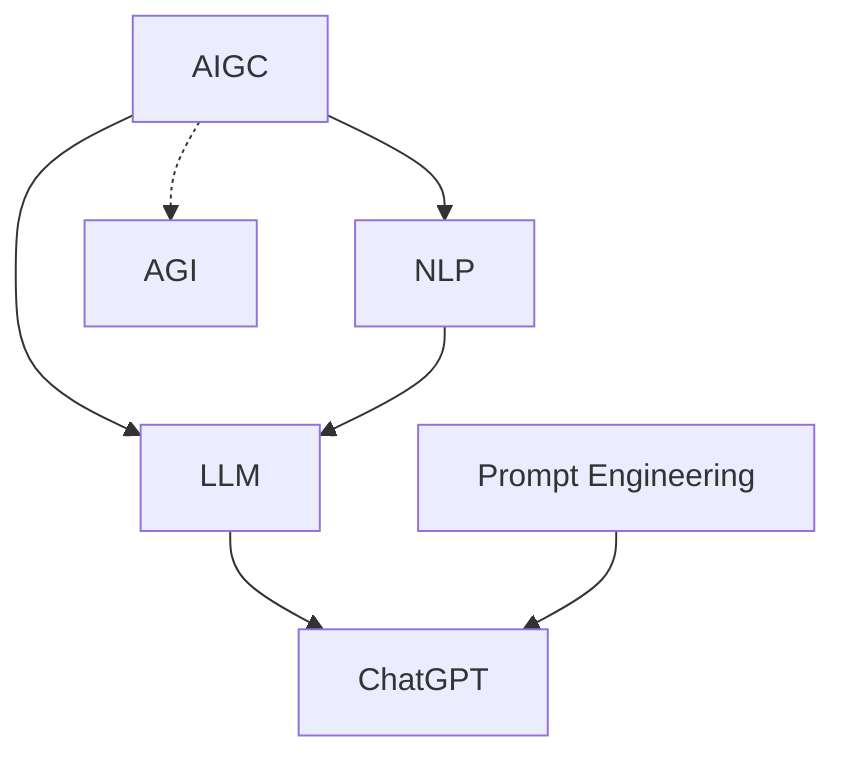

# AIGC从入门到实战：应用：目前 ChatGPT 能在什么场景下做什么事

## 1.背景介绍

人工智能生成内容(AIGC)技术的快速发展，尤其是以 ChatGPT 为代表的大语言模型的出现，正在深刻影响和改变着我们的工作和生活。ChatGPT 作为一个基于海量数据训练的强大语言模型，展现出了惊人的自然语言理解和生成能力，能够与人进行流畅的对话，完成各种语言相关的任务。那么，目前 ChatGPT 究竟能在哪些场景发挥作用，给我们带来哪些应用价值呢？本文将对此进行深入探讨。

### 1.1 AIGC 与 ChatGPT 概述
#### 1.1.1 AIGC 的定义与发展历程
#### 1.1.2 ChatGPT 的诞生与特点
#### 1.1.3 AIGC 与 ChatGPT 的关系

### 1.2 ChatGPT 的技术原理 
#### 1.2.1 Transformer 架构与注意力机制
#### 1.2.2 预训练与微调
#### 1.2.3 Few-shot Learning 与 In-context Learning

### 1.3 ChatGPT 的发展现状
#### 1.3.1 ChatGPT 的版本迭代
#### 1.3.2 ChatGPT 的能力边界与局限性
#### 1.3.3 ChatGPT 的社会影响与争议

## 2.核心概念与联系

要理解 ChatGPT 的应用场景，首先需要厘清几个核心概念：

### 2.1 自然语言处理(NLP)
NLP 是人工智能的一个分支，旨在让计算机能够理解、生成和处理人类语言。ChatGPT 基于先进的 NLP 技术，才具备了强大的语言理解和生成能力。

### 2.2 大语言模型(LLM)
LLM 是一类基于海量文本数据训练的语言模型，能够学习语言的统计规律和语义信息。ChatGPT 就是当前最为强大的 LLM 之一。

### 2.3 通用人工智能(AGI)
AGI 指具备与人类相当的通用智能的人工智能系统。尽管 ChatGPT 展现出了广泛的语言能力，但它离真正的 AGI 还有很大距离。

### 2.4 提示工程(Prompt Engineering)
为了更好地利用 ChatGPT 的能力，需要设计合理的提示(Prompt)来引导其生成我们期望的内容。这就是提示工程的任务。

下图展示了这些概念之间的关系：



## 3.核心算法原理具体操作步骤

ChatGPT 背后的核心算法是 Transformer 架构和自注意力机制。下面我们来详细了解其工作原理和操作步骤。

### 3.1 Transformer 架构
Transformer 是一种基于自注意力机制的神经网络架构，主要由编码器和解码器组成：

1. 编码器将输入序列转换为隐向量表示
2. 解码器根据编码器的输出和之前的输出，生成下一个token

### 3.2 自注意力机制
自注意力机制让模型能够在处理当前token时，参考输入序列中其他位置的信息。其主要步骤为：

1. 将输入序列的每个token映射为 Query/Key/Value 向量
2. 计算每个 Query 与所有 Key 的相似度得分
3. 将得分作为权重，对 Value 进行加权求和，得到该位置的注意力输出

### 3.3 前馈神经网络
除了自注意力子层，Transformer 的每一层还包含一个前馈全连接子层，可以增强特征表示能力。

### 3.4 预训练与微调
ChatGPT 采用了预训练+微调的范式：

1. 在大规模无标注语料上进行自监督预训练，学习通用语言知识
2. 在下游任务的标注数据上进行有监督微调，适应特定任务

## 4.数学模型和公式详细讲解举例说明

接下来，我们用数学语言来刻画 ChatGPT 中的关键公式和模型。

### 4.1 自注意力计算公式

给定输入序列的 Query/Key/Value 矩阵 $Q, K, V$，自注意力的计算过程为：

$$
Attention(Q,K,V) = softmax(\frac{QK^T}{\sqrt{d_k}})V
$$

其中 $d_k$ 为 Key 向量的维度。

例如，假设有一个输入序列 "I love NLP"，经过词嵌入后得到 $Q,K,V$：

$$
Q = 
\begin{bmatrix}
q_1 \\ q_2 \\ q_3
\end{bmatrix},
K = 
\begin{bmatrix}  
k_1 \\ k_2 \\ k_3
\end{bmatrix},
V =
\begin{bmatrix}
v_1 \\ v_2 \\ v_3  
\end{bmatrix}
$$

则第一个位置 "I" 的注意力输出为：

$$
Attention(q_1, K, V) = \sum_{i=1}^3 \frac{exp(q_1 \cdot k_i)}{\sum_{j=1}^3 exp(q_1 \cdot k_j)} v_i
$$

### 4.2 Transformer 的整体结构

设编码器有 $N$ 层，解码器有 $M$ 层，则 Transformer 可以表示为：

$$
\begin{aligned}
H_0 &= Embedding(Input) \\
H_i &= Encoder_i(H_{i-1}), i=1,2,...,N \\
O_0 &= Embedding(Output) \\  
O_j &= Decoder_j(O_{j-1}, H_N), j=1,2,...,M \\
P(Output) &= Softmax(O_M)
\end{aligned}
$$

其中，$Encoder_i$ 和 $Decoder_j$ 分别表示第 $i$ 层编码器和第 $j$ 层解码器的计算过程，$P(Output)$ 为模型预测的输出概率分布。

## 5.项目实践：代码实例和详细解释说明

下面我们通过一个简单的代码实例，来展示如何使用 ChatGPT 进行文本生成任务。

```python
import openai

# 设置 API Key
openai.api_key = "your_api_key"

# 设置 Prompt
prompt = "请用一段话介绍什么是人工智能。"

# 调用 ChatGPT API
response = openai.Completion.create(
    engine="text-davinci-002",
    prompt=prompt,
    max_tokens=100,
    n=1,
    stop=None,
    temperature=0.5,
)

# 打印生成结果
print(response.choices[0].text)
```

代码解释：

1. 首先需要导入 openai 包，并设置好你的 API Key
2. 然后设置好你的 Prompt，这里我们让 ChatGPT 用一段话介绍人工智能
3. 调用 openai.Completion.create 接口，设置好相关参数：
   - engine: 选择使用的模型，这里是 text-davinci-002
   - prompt: 输入的 Prompt
   - max_tokens: 生成结果的最大长度
   - n: 生成几个结果
   - stop: 停止生成的条件，这里设为 None
   - temperature: 控制生成的多样性，0-1 之间，越大越多样
4. 打印出生成的结果，存储在 response.choices[0].text 中

运行该代码，我们可以得到类似下面的生成结果：

> 人工智能是一门计算机科学，旨在创造能够模仿人类智能行为的机器。它包括机器学习、自然语言处理、计算机视觉、语音识别等多个领域。人工智能系统能够从数据中学习，自主完成特定任务，并不断优化和改进自己的性能。人工智能正在深刻影响和改变我们的生活和工作方式，在许多领域展现出了巨大的应用前景。

可以看到，ChatGPT 生成的介绍是符合我们预期的，语言通顺，内容准确。

## 6.实际应用场景

ChatGPT 强大的语言理解和生成能力，使其能够在许多场景发挥重要作用，下面列举一些典型应用：

### 6.1 智能客服
ChatGPT 可以作为智能客服助手，自动回答用户的常见问题，提供相关信息和解决方案，大大减轻人工客服的压力。

### 6.2 内容创作
ChatGPT 可以辅助内容创作者进行写作，例如根据关键词或主题生成文章框架、段落，给出写作灵感和素材。

### 6.3 代码辅助
ChatGPT 可以根据自然语言描述，自动生成代码片段，或对现有代码进行解释、优化建议，提升开发者的效率。

### 6.4 智能教育
ChatGPT 可以扮演智能教学助手的角色，为学生答疑解惑，提供个性化的学习建议和资源推荐。

### 6.5 知识问答
ChatGPT 可以作为一个通用的知识问答系统，根据用户的问题，给出相关的解释和信息。

### 6.6 数据分析
ChatGPT 可以帮助数据分析师进行数据探索和洞见挖掘，自动生成分析报告和可视化图表。

## 7.工具和资源推荐

要开始使用和研究 ChatGPT，以下是一些有用的工具和资源：

### 7.1 OpenAI 官网
OpenAI 是 ChatGPT 的开发商，其官网提供了 API 文档、使用指南和示例代码。

### 7.2 Hugging Face
Hugging Face 是一个开源的 NLP 平台，提供了多个基于 Transformer 的预训练模型，包括 GPT 系列。

### 7.3 Google Colab
Google Colab 是一个在线的 Jupyter 笔记本环境，可以免费使用 GPU 资源，方便进行 ChatGPT 相关的实验和开发。

### 7.4 Prompt Engineering 指南
GitHub 上有许多优秀的 Prompt Engineering 指南和示例，例如 Awesome-Prompt-Engineering 仓库。

### 7.5 论文和教程
关于 ChatGPT 和 Transformer 的论文和教程也是很好的学习资源，例如 《Attention Is All You Need》、《Language Models are Few-Shot Learners》等。

## 8.总结：未来发展趋势与挑战

ChatGPT 的出现标志着 AIGC 和 LLM 技术的重大突破，为自然语言处理和人机交互带来了新的范式。展望未来，ChatGPT 有望在更广泛的领域发挥价值，推动 AI 应用的普及。同时，我们也需要关注和应对 ChatGPT 带来的挑战：

### 8.1 安全与伦理
如何确保 ChatGPT 生成的内容是安全、合乎伦理的，不会对社会和个人造成负面影响，是一个重要课题。

### 8.2 鲁棒性与可控性
ChatGPT 的生成结果有时会出现不一致、不可预测的情况，提高其鲁棒性和可控性是进一步研究的方向。

### 8.3 解释性与可信度
作为一个黑盒模型，ChatGPT 的决策过程难以解释，其生成内容的可信度也备受质疑，需要开发相应的技术来提升其透明度。

### 8.4 公平性与隐私
在 ChatGPT 的训练数据和应用中，需要关注算法公平性，确保不同群体能够平等地获益；同时，要保护用户隐私，避免敏感信息泄露。

尽管挑战不少，但 ChatGPT 所代表的 AIGC 和 LLM 技术必将持续快速发展，为人类社会带来更多的惊喜和助益。让我们拭目以待，见证这场 AI 革命的下一个高潮。

## 9.附录：常见问题与解答

### 9.1 ChatGPT 和 GPT-3 有什么区别？
ChatGPT 是基于 GPT-3 架构微调的一个专门用于对话的模型，而 GPT-3 是一个通用的语言模型，可以应用于更广泛的任务。

### 9.2 ChatGPT 会取代人工客服和写作者吗？
ChatGPT 可以辅助和增强人的工作，提高效率，但不太可能完全取代人。人工客服和写作