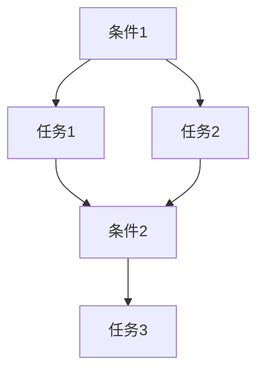

## 1. 背景介绍

随着人工智能技术的不断发展，越来越多的应用场景涌现出来。其中，视频游戏是一个非常重要的领域。在游戏中，AI代理可以扮演各种角色，如敌人、队友、NPC等，为玩家提供更加丰富的游戏体验。然而，AI代理的行为往往是预先设定好的，缺乏自适应性，容易让玩家感到单调和无聊。因此，如何让AI代理具备自适应机制，成为了一个非常重要的问题。

本文将介绍一种基于工作流的AI代理自适应机制，即AI Agent WorkFlow。该机制可以让AI代理根据当前游戏状态和玩家行为，自动调整自己的行为策略，从而提供更加丰富的游戏体验。

## 2. 核心概念与联系

AI Agent WorkFlow是一种基于工作流的AI代理自适应机制。它包含以下几个核心概念：

- 工作流：工作流是一种描述业务流程的模型。在AI Agent WorkFlow中，工作流描述了AI代理的行为策略。
- 任务：任务是工作流中的一个节点，表示AI代理需要执行的具体操作。
- 条件：条件是工作流中的一个节点，表示AI代理需要根据当前游戏状态和玩家行为来判断是否需要执行某个任务。
- 转移：转移是工作流中的一条边，表示AI代理在执行任务时需要根据条件来判断下一步应该执行哪个任务。

AI Agent WorkFlow的核心思想是将AI代理的行为策略抽象成一个工作流，然后根据当前游戏状态和玩家行为来动态调整工作流中的任务和条件，从而实现自适应机制。

## 3. 核心算法原理具体操作步骤

AI Agent WorkFlow的核心算法原理可以分为以下几个步骤：

1. 定义工作流：根据游戏场景和AI代理的角色，定义一个初始的工作流，包含若干个任务和条件。
2. 监听游戏状态和玩家行为：AI代理需要监听游戏状态和玩家行为，例如玩家的位置、血量、武器等信息。
3. 判断条件：根据当前游戏状态和玩家行为，判断当前应该执行哪个任务。
4. 执行任务：根据判断结果，执行相应的任务。
5. 更新工作流：根据执行结果，更新工作流中的任务和条件，以适应当前游戏状态和玩家行为。

## 4. 数学模型和公式详细讲解举例说明

AI Agent WorkFlow的数学模型可以用有向图来表示。其中，节点表示任务或条件，边表示转移关系。具体来说，可以用以下公式来表示：

G = (V, E)

其中，G表示有向图，V表示节点集合，E表示边集合。节点可以表示任务或条件，边可以表示转移关系。

例如，下图就是一个简单的AI Agent WorkFlow的数学模型：



其中，条件1表示需要判断玩家是否在附近，任务1表示向玩家发起攻击，任务2表示向玩家靠近，条件2表示需要判断是否需要继续攻击，任务3表示向其他目标移动。

## 5. 项目实践：代码实例和详细解释说明

下面是一个简单的AI Agent WorkFlow的代码实例：

```python
class AI:
    def __init__(self, workflow):
        self.workflow = workflow

    def update(self, game_state, player_state):
        current_task = None
        for task in self.workflow.tasks:
            if task.condition(game_state, player_state):
                current_task = task
                break
        if current_task:
            current_task.execute(game_state, player_state)
            self.workflow.update(current_task, game_state, player_state)
```

其中，AI类表示一个AI代理，workflow表示AI Agent WorkFlow的工作流。update方法表示AI代理需要根据当前游戏状态和玩家行为来更新自己的行为。具体来说，它会遍历工作流中的任务，根据条件来判断当前应该执行哪个任务，然后执行相应的任务，并更新工作流。

## 6. 实际应用场景

AI Agent WorkFlow可以应用于各种类型的视频游戏中，例如射击游戏、角色扮演游戏等。它可以让AI代理根据当前游戏状态和玩家行为，自动调整自己的行为策略，从而提供更加丰富的游戏体验。

## 7. 工具和资源推荐

- PyFlow：一个基于Python的工作流引擎，可以用于实现AI Agent WorkFlow。
- Unity：一个流行的游戏引擎，可以用于开发各种类型的视频游戏。
- Unreal Engine：另一个流行的游戏引擎，也可以用于开发各种类型的视频游戏。

## 8. 总结：未来发展趋势与挑战

AI Agent WorkFlow是一种非常有前途的AI代理自适应机制。它可以让AI代理根据当前游戏状态和玩家行为，自动调整自己的行为策略，从而提供更加丰富的游戏体验。未来，随着人工智能技术的不断发展，AI Agent WorkFlow将会得到更加广泛的应用。

然而，AI Agent WorkFlow也面临着一些挑战。例如，如何设计一个高效的工作流，如何处理复杂的游戏场景等。这些问题需要我们不断探索和研究。

## 9. 附录：常见问题与解答

Q: AI Agent WorkFlow是否可以应用于其他领域？

A: 是的，AI Agent WorkFlow可以应用于各种领域，例如智能家居、智能制造等。

Q: AI Agent WorkFlow是否可以应用于多人游戏？

A: 是的，AI Agent WorkFlow可以应用于多人游戏，但需要考虑多个玩家之间的交互和协作。

Q: AI Agent WorkFlow是否可以应用于实时游戏？

A: 是的，AI Agent WorkFlow可以应用于实时游戏，但需要考虑实时性和性能等问题。