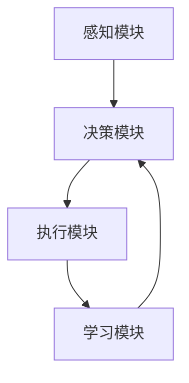

# AI人工智能代理工作流AI Agent WorkFlow：跨领域自主AI代理的集成

## 1.背景介绍

在当今的科技时代，人工智能（AI）已经成为推动各行各业变革的核心力量。AI代理（AI Agent）作为AI技术的一个重要分支，正在逐步改变我们的工作和生活方式。AI代理不仅能够执行特定任务，还能通过学习和适应不断提升自身能力。本文将深入探讨AI代理工作流（AI Agent WorkFlow），特别是跨领域自主AI代理的集成。

## 2.核心概念与联系

### 2.1 AI代理的定义

AI代理是指能够自主感知环境、做出决策并执行任务的智能系统。它们通常具备以下特性：
- 自主性：能够独立完成任务，无需人工干预。
- 适应性：能够根据环境变化调整自身行为。
- 学习能力：通过数据和经验不断提升自身能力。

### 2.2 工作流的定义

工作流（WorkFlow）是指一系列有序的任务和活动，用于实现特定的业务目标。在AI代理工作流中，AI代理通过一系列步骤和决策来完成复杂任务。

### 2.3 跨领域集成的意义

跨领域集成是指将不同领域的AI代理进行协同工作，以实现更复杂和高效的任务。例如，将自然语言处理（NLP）代理与计算机视觉（CV）代理结合，可以实现智能客服系统的自动化。

## 3.核心算法原理具体操作步骤

### 3.1 感知模块

感知模块是AI代理的“眼睛”和“耳朵”，负责从环境中获取信息。常用的感知技术包括传感器数据处理、图像识别和语音识别。

### 3.2 决策模块

决策模块是AI代理的“大脑”，负责分析感知模块获取的信息，并做出决策。常用的决策算法包括强化学习、决策树和贝叶斯网络。

### 3.3 执行模块

执行模块是AI代理的“手脚”，负责执行决策模块做出的决策。执行模块通常涉及机器人控制、自动化系统和软件指令执行。

### 3.4 学习模块

学习模块是AI代理的“记忆”，负责通过数据和经验不断提升自身能力。常用的学习算法包括监督学习、无监督学习和深度学习。

以下是一个典型的AI代理工作流的Mermaid流程图：



## 4.数学模型和公式详细讲解举例说明

### 4.1 强化学习模型

强化学习（Reinforcement Learning, RL）是AI代理常用的决策算法之一。其核心思想是通过与环境的交互，学习最优策略以最大化累积奖励。强化学习的数学模型通常包括以下几个部分：

- 状态空间 $S$：AI代理所处的所有可能状态的集合。
- 动作空间 $A$：AI代理可以执行的所有可能动作的集合。
- 奖励函数 $R(s, a)$：AI代理在状态 $s$ 执行动作 $a$ 后获得的奖励。
- 状态转移函数 $P(s'|s, a)$：AI代理在状态 $s$ 执行动作 $a$ 后转移到状态 $s'$ 的概率。

强化学习的目标是找到一个策略 $\pi(a|s)$，使得累积奖励最大化。常用的强化学习算法包括Q学习和深度Q网络（DQN）。

### 4.2 Q学习算法

Q学习是一种无模型的强化学习算法，其核心思想是通过更新Q值来学习最优策略。Q值表示在状态 $s$ 执行动作 $a$ 的预期累积奖励。Q学习的更新公式如下：

$$
Q(s, a) \leftarrow Q(s, a) + \alpha [R(s, a) + \gamma \max_{a'} Q(s', a') - Q(s, a)]
$$

其中，$\alpha$ 是学习率，$\gamma$ 是折扣因子，$s'$ 是执行动作 $a$ 后的新状态，$a'$ 是在新状态 $s'$ 下的最优动作。

### 4.3 实例说明

假设我们有一个简单的迷宫问题，AI代理需要找到从起点到终点的最短路径。我们可以使用Q学习算法来解决这个问题。首先，我们定义状态空间 $S$ 为迷宫中的所有位置，动作空间 $A$ 为上下左右四个方向，奖励函数 $R(s, a)$ 为到达终点时的奖励（例如 +100），状态转移函数 $P(s'|s, a)$ 为确定性转移。

通过不断迭代更新Q值，AI代理最终可以学到最优策略，从而找到最短路径。

## 5.项目实践：代码实例和详细解释说明

### 5.1 环境设置

首先，我们需要设置一个Python环境，并安装必要的库：

```bash
pip install numpy gym
```

### 5.2 迷宫环境定义

我们使用OpenAI Gym库来定义一个简单的迷宫环境：

```python
import gym
import numpy as np

class MazeEnv(gym.Env):
    def __init__(self):
        self.action_space = gym.spaces.Discrete(4)  # 上下左右四个动作
        self.observation_space = gym.spaces.Discrete(16)  # 4x4迷宫
        self.state = 0  # 初始状态
        self.end_state = 15  # 终点状态

    def reset(self):
        self.state = 0
        return self.state

    def step(self, action):
        if action == 0:  # 上
            next_state = self.state - 4 if self.state >= 4 else self.state
        elif action == 1:  # 下
            next_state = self.state + 4 if self.state < 12 else self.state
        elif action == 2:  # 左
            next_state = self.state - 1 if self.state % 4 != 0 else self.state
        elif action == 3:  # 右
            next_state = self.state + 1 if self.state % 4 != 3 else self.state

        reward = 100 if next_state == self.end_state else -1
        done = next_state == self.end_state
        self.state = next_state
        return next_state, reward, done, {}

    def render(self):
        maze = np.zeros((4, 4))
        maze[self.state // 4, self.state % 4] = 1
        print(maze)
```

### 5.3 Q学习算法实现

接下来，我们实现Q学习算法：

```python
import random

def q_learning(env, num_episodes, alpha, gamma, epsilon):
    q_table = np.zeros((env.observation_space.n, env.action_space.n))

    for episode in range(num_episodes):
        state = env.reset()
        done = False

        while not done:
            if random.uniform(0, 1) < epsilon:
                action = env.action_space.sample()  # 探索
            else:
                action = np.argmax(q_table[state])  # 利用

            next_state, reward, done, _ = env.step(action)
            q_table[state, action] = q_table[state, action] + alpha * (
                reward + gamma * np.max(q_table[next_state]) - q_table[state, action]
            )
            state = next_state

    return q_table

env = MazeEnv()
q_table = q_learning(env, num_episodes=1000, alpha=0.1, gamma=0.99, epsilon=0.1)
print(q_table)
```

### 5.4 结果分析

通过运行上述代码，我们可以得到一个Q值表。Q值表中的每个值表示在特定状态下执行特定动作的预期累积奖励。通过选择Q值最大的动作，AI代理可以找到从起点到终点的最优路径。

## 6.实际应用场景

### 6.1 智能客服系统

智能客服系统是AI代理的一个典型应用场景。通过集成NLP代理和对话管理代理，智能客服系统可以自动处理用户的咨询和问题，提高客服效率和用户满意度。

### 6.2 自动驾驶

自动驾驶是AI代理的另一个重要应用场景。通过集成计算机视觉代理、路径规划代理和控制代理，自动驾驶系统可以实现车辆的自主驾驶，提高交通安全和效率。

### 6.3 智能家居

智能家居系统通过集成语音识别代理、环境感知代理和设备控制代理，可以实现家居设备的智能化控制，提高生活便利性和舒适度。

## 7.工具和资源推荐

### 7.1 开发工具

- **Python**：Python是AI开发的首选编程语言，拥有丰富的AI库和工具。
- **TensorFlow**：TensorFlow是一个开源的机器学习框架，适用于深度学习模型的开发和训练。
- **PyTorch**：PyTorch是另一个流行的深度学习框架，具有动态计算图和易用性。

### 7.2 学习资源

- **Coursera**：Coursera提供了丰富的AI和机器学习课程，适合初学者和进阶学习者。
- **Kaggle**：Kaggle是一个数据科学竞赛平台，提供了大量的公开数据集和竞赛项目，适合实践和提升技能。
- **arXiv**：arXiv是一个学术论文预印本平台，提供了最新的AI研究成果，适合深入研究和了解前沿技术。

## 8.总结：未来发展趋势与挑战

### 8.1 未来发展趋势

- **多模态AI代理**：未来的AI代理将能够处理多种模态的数据，如图像、语音和文本，实现更复杂的任务。
- **自主学习和适应**：AI代理将具备更强的自主学习和适应能力，能够在动态环境中不断提升自身能力。
- **跨领域协同**：不同领域的AI代理将能够更好地协同工作，实现更高效和智能的系统。

### 8.2 挑战

- **数据隐私和安全**：随着AI代理的广泛应用，数据隐私和安全问题将变得更加突出，需要制定相应的法律和技术措施。
- **伦理和道德问题**：AI代理的自主性和决策能力带来了伦理和道德问题，需要在技术开发和应用中充分考虑。
- **技术复杂性**：跨领域AI代理的集成和协同工作涉及复杂的技术问题，需要不断提升技术水平和解决方案。

## 9.附录：常见问题与解答

### 9.1 什么是AI代理？

AI代理是指能够自主感知环境、做出决策并执行任务的智能系统。

### 9.2 什么是强化学习？

强化学习是一种通过与环境的交互，学习最优策略以最大化累积奖励的机器学习方法。

### 9.3 如何实现Q学习算法？

Q学习算法通过更新Q值来学习最优策略，Q值表示在特定状态下执行特定动作的预期累积奖励。

### 9.4 AI代理的实际应用有哪些？

AI代理的实际应用包括智能客服系统、自动驾驶和智能家居等。

### 9.5 AI代理的未来发展趋势是什么？

未来的AI代理将能够处理多种模态的数据，具备更强的自主学习和适应能力，并能够跨领域协同工作。

---

作者：禅与计算机程序设计艺术 / Zen and the Art of Computer Programming