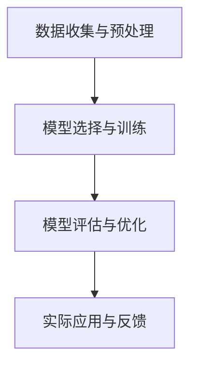

# AI人工智能核心算法原理与代码实例讲解：道德决策

## 1.背景介绍

在人工智能（AI）领域，道德决策是一个备受关注且极具挑战性的课题。随着AI技术的迅猛发展，AI系统在医疗、交通、金融等领域的应用越来越广泛。然而，AI系统在做出决策时，如何确保其符合道德和伦理标准，成为了一个亟待解决的问题。本文将深入探讨AI在道德决策中的核心算法原理，并通过代码实例进行详细讲解。

## 2.核心概念与联系

### 2.1 道德决策的定义

道德决策是指在面对多种选择时，选择符合伦理和道德标准的决策过程。在AI系统中，道德决策涉及到如何编程和训练AI，使其能够在复杂的情境中做出符合人类道德标准的决策。

### 2.2 道德决策与AI的关系

AI系统的决策过程通常依赖于数据和算法。然而，传统的算法往往只关注效率和准确性，而忽略了道德和伦理因素。因此，如何将道德标准融入AI算法中，成为了一个重要的研究方向。

### 2.3 相关技术概述

在道德决策中，常用的技术包括机器学习、深度学习、强化学习等。这些技术可以帮助AI系统在大量数据中学习和提取道德标准，并在实际应用中做出符合道德的决策。

## 3.核心算法原理具体操作步骤

### 3.1 数据收集与预处理

道德决策的第一步是收集和预处理数据。这些数据可以包括历史决策记录、道德规范文献、专家意见等。数据预处理包括数据清洗、特征提取和数据标准化等步骤。

### 3.2 模型选择与训练

在数据预处理完成后，需要选择合适的模型进行训练。常用的模型包括决策树、支持向量机、神经网络等。模型训练的目标是使AI系统能够在给定的数据集上学习到道德标准。

### 3.3 模型评估与优化

模型训练完成后，需要对模型进行评估和优化。评估指标可以包括准确率、召回率、F1值等。优化方法可以包括超参数调优、交叉验证等。

### 3.4 实际应用与反馈

在模型评估和优化完成后，可以将模型应用到实际场景中，并根据实际应用中的反馈进行进一步优化。

以下是一个Mermaid流程图，展示了道德决策的核心算法原理具体操作步骤：



## 4.数学模型和公式详细讲解举例说明

### 4.1 逻辑回归模型

逻辑回归是一种常用的分类算法，可以用于道德决策中的二分类问题。其数学模型如下：

$$
P(y=1|X) = \frac{1}{1 + e^{-(\beta_0 + \beta_1 X_1 + \beta_2 X_2 + ... + \beta_n X_n)}}
$$

其中，$P(y=1|X)$ 表示在给定特征 $X$ 的情况下，决策结果为1的概率；$\beta_0, \beta_1, ..., \beta_n$ 是模型的参数。

### 4.2 支持向量机模型

支持向量机（SVM）是一种常用的分类算法，可以用于道德决策中的多分类问题。其数学模型如下：

$$
f(x) = \text{sign}(w \cdot x + b)
$$

其中，$w$ 是权重向量，$x$ 是输入特征向量，$b$ 是偏置项。

### 4.3 神经网络模型

神经网络是一种强大的模型，可以用于复杂的道德决策问题。其数学模型如下：

$$
y = f(W_2 \cdot f(W_1 \cdot X + b_1) + b_2)
$$

其中，$W_1, W_2$ 是权重矩阵，$b_1, b_2$ 是偏置向量，$f$ 是激活函数。

## 5.项目实践：代码实例和详细解释说明

### 5.1 数据集准备

首先，我们需要准备一个道德决策的数据集。假设我们有一个包含历史决策记录的数据集，其中每条记录包括特征和决策结果。

```python
import pandas as pd

# 读取数据集
data = pd.read_csv('moral_decision_data.csv')

# 查看数据集基本信息
print(data.info())
print(data.head())
```

### 5.2 数据预处理

接下来，我们需要对数据进行预处理，包括数据清洗、特征提取和数据标准化。

```python
from sklearn.preprocessing import StandardScaler

# 数据清洗
data = data.dropna()

# 特征提取
X = data.drop('decision', axis=1)
y = data['decision']

# 数据标准化
scaler = StandardScaler()
X_scaled = scaler.fit_transform(X)
```

### 5.3 模型选择与训练

在数据预处理完成后，我们选择逻辑回归模型进行训练。

```python
from sklearn.model_selection import train_test_split
from sklearn.linear_model import LogisticRegression

# 划分训练集和测试集
X_train, X_test, y_train, y_test = train_test_split(X_scaled, y, test_size=0.2, random_state=42)

# 训练逻辑回归模型
model = LogisticRegression()
model.fit(X_train, y_train)
```

### 5.4 模型评估与优化

训练完成后，我们对模型进行评估和优化。

```python
from sklearn.metrics import accuracy_score, classification_report

# 预测测试集
y_pred = model.predict(X_test)

# 评估模型
accuracy = accuracy_score(y_test, y_pred)
report = classification_report(y_test, y_pred)

print(f'Accuracy: {accuracy}')
print(f'Classification Report:\n{report}')
```

### 5.5 实际应用与反馈

最后，我们将模型应用到实际场景中，并根据反馈进行优化。

```python
# 假设我们有一个新的决策数据
new_data = [[0.5, 1.2, -0.3, 0.8]]

# 数据标准化
new_data_scaled = scaler.transform(new_data)

# 预测新数据的决策结果
new_decision = model.predict(new_data_scaled)
print(f'New Decision: {new_decision}')
```

## 6.实际应用场景

### 6.1 医疗领域

在医疗领域，AI系统可以帮助医生做出诊断和治疗决策。然而，如何确保AI系统在做出决策时，能够考虑到患者的利益和伦理问题，是一个重要的研究方向。

### 6.2 自动驾驶

在自动驾驶领域，AI系统需要在复杂的交通环境中做出决策。例如，在遇到紧急情况时，如何选择最优的避险方案，既要保证乘客的安全，又要考虑到其他交通参与者的安全。

### 6.3 金融领域

在金融领域，AI系统可以帮助投资者做出投资决策。然而，如何确保AI系统在做出决策时，能够考虑到投资者的利益和市场的稳定性，是一个重要的研究方向。

## 7.工具和资源推荐

### 7.1 开源工具

- **TensorFlow**：一个开源的机器学习框架，适用于各种机器学习和深度学习任务。
- **scikit-learn**：一个简单高效的机器学习库，适用于数据挖掘和数据分析。
- **Pandas**：一个强大的数据处理和分析工具，适用于数据预处理和特征提取。

### 7.2 资源推荐

- **《机器学习》**：Tom M. Mitchell著，这本书详细介绍了机器学习的基本概念和算法。
- **《深度学习》**：Ian Goodfellow, Yoshua Bengio, Aaron Courville著，这本书详细介绍了深度学习的基本概念和算法。
- **Coursera**：一个在线学习平台，提供了大量关于机器学习和深度学习的课程。

## 8.总结：未来发展趋势与挑战

### 8.1 未来发展趋势

随着AI技术的不断发展，道德决策将成为AI系统的重要组成部分。未来，AI系统将能够在更复杂的情境中做出符合道德标准的决策，从而更好地服务于人类社会。

### 8.2 挑战

然而，道德决策在AI领域的应用仍面临许多挑战。例如，如何定义和量化道德标准，如何处理不同文化和社会背景下的道德差异，如何确保AI系统的透明性和可解释性等，都是亟待解决的问题。

## 9.附录：常见问题与解答

### 9.1 什么是道德决策？

道德决策是指在面对多种选择时，选择符合伦理和道德标准的决策过程。

### 9.2 为什么道德决策在AI领域中重要？

随着AI技术的广泛应用，AI系统在做出决策时，如何确保其符合道德和伦理标准，成为了一个亟待解决的问题。

### 9.3 如何将道德标准融入AI算法中？

可以通过数据收集与预处理、模型选择与训练、模型评估与优化等步骤，将道德标准融入AI算法中。

### 9.4 道德决策在实际应用中有哪些挑战？

道德决策在实际应用中面临许多挑战，例如如何定义和量化道德标准，如何处理不同文化和社会背景下的道德差异，如何确保AI系统的透明性和可解释性等。

---

作者：禅与计算机程序设计艺术 / Zen and the Art of Computer Programming