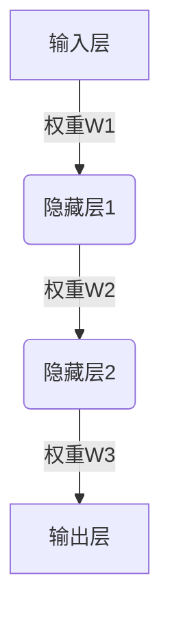
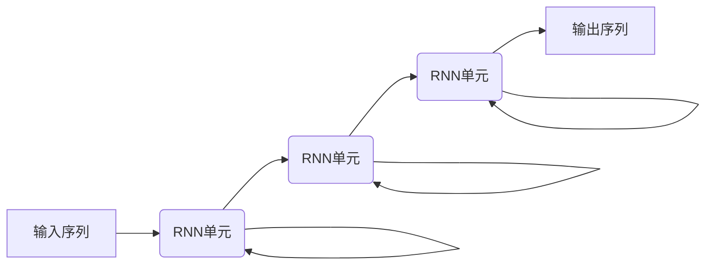

# AI人工智能深度学习算法：在精准医疗中的应用

## 1.背景介绍

### 1.1 医疗健康领域的挑战

医疗健康是关乎生命的重要领域,但同时也面临着诸多挑战。例如疾病的早期诊断、精准用药、手术风险评估等,都需要医生具备丰富的经验和专业知识。然而,医生的诊疗能力受到个人知识和经验的局限性,很难做到完全准确。此外,医疗资源的不均衡分布、医疗费用的不断上涨等,也给普通民众的健康权益带来了挑战。

### 1.2 人工智能的机遇

人工智能技术的发展为解决上述挑战带来了新的机遇。近年来,以深度学习为代表的人工智能算法取得了突破性进展,在图像识别、自然语言处理、决策分析等领域表现出色,展现出广阔的应用前景。将人工智能技术应用于医疗健康领域,可以提高疾病诊断的准确性,优化治疗方案,降低医疗风险,从而提升整体医疗服务水平。

### 1.3 人工智能医疗的愿景

人工智能医疗的终极目标是实现精准医疗。所谓精准医疗,是指根据个体的基因信息、生理状况、生活方式等数据,对疾病风险进行评估,并制定个性化的预防和治疗方案。通过人工智能算法对海量医疗数据进行分析和建模,可以更精准地预测疾病发生的风险,为临床决策提供有力支持。

## 2.核心概念与联系

### 2.1 深度学习

深度学习(Deep Learning)是机器学习的一个新的领域,其灵感来源于人脑的结构和功能。深度学习算法通过构建神经网络模型,对输入数据进行特征提取和转换,并逐层学习越来越抽象的特征表示,从而完成最终的预测或决策任务。

#### 2.1.1 神经网络

神经网络是深度学习模型的基础,它由多层神经元组成,每层神经元对上一层的输出进行加权求和,并通过激活函数转换得到本层的输出。神经网络可以自动从数据中学习特征表示,而无需人工设计特征。

#### 2.1.2 卷积神经网络

卷积神经网络(Convolutional Neural Network, CNN)是一种常用于图像处理的深度学习模型。它通过卷积操作提取图像的局部特征,并通过池化操作降低特征维度,最终将特征映射到高层语义上。CNN在图像分类、目标检测等任务上表现出色。

#### 2.1.3 循环神经网络

循环神经网络(Recurrent Neural Network, RNN)是一种处理序列数据的深度学习模型。它通过内部的循环连接,能够捕捉序列数据中的长期依赖关系。RNN在自然语言处理、时间序列预测等任务中有广泛应用。

### 2.2 医疗数据

医疗数据是人工智能医疗应用的基础,主要包括以下几种类型:

- 医疗影像数据:如X光、CT、MRI等各种医学影像
- 电子病历数据:包括病人的诊断信息、用药记录、手术记录等
- 基因组数据:患者的基因测序数据
- 生理信号数据:如心电图、脑电图等生理参数记录
- 其他辅助数据:如病人的年龄、性别、生活方式等

通过对这些海量异构数据的收集和整合,人工智能算法可以从中发现隐藏的规律和模式,为临床决策提供支持。

### 2.3 人工智能医疗的主要任务

人工智能在医疗领域的主要任务包括:

- 疾病风险预测:根据患者的基因、生理和生活方式数据,预测患某种疾病的风险
- 辅助诊断:通过分析医学影像、电子病历等数据,辅助医生进行疾病诊断
- 智能影像分析:自动检测和分割医学影像中的病灶、器官等目标
- 用药优化:根据患者的基因信息、病情等,优化用药方案
- 医疗质量控制:对医疗服务质量进行监控和评估
- 医疗资源优化:优化医疗资源的配置和调度

## 3.核心算法原理具体操作步骤  

### 3.1 医学影像分析

医学影像分析是人工智能医疗的一个重要应用场景。常用的深度学习模型包括卷积神经网络(CNN)和U-Net等。以CT肺部病灶检测为例,算法的具体步骤如下:

1. **数据预处理**:对原始CT影像进行标准化、切片等预处理,将其转换为模型可以输入的张量形式。

2. **模型构建**:构建基于CNN的分割模型,例如U-Net。该模型由编码器(下采样)和解码器(上采样)两部分组成,可以同时完成特征提取和像素级分割任务。

3. **模型训练**:使用包含病灶标注的CT数据集对模型进行训练,通过最小化像素级别的损失函数(如交叉熵损失)来优化模型参数。

4. **模型评估**:在保留的测试集上评估模型的分割性能,常用的指标包括像素准确率(Pixel Accuracy)、平均交并比(Mean IoU)等。

5. **模型微调**:根据评估结果对模型进行微调,如调整超参数、增加训练数据等,以进一步提高模型性能。

6. **模型部署**:将训练好的模型部署到医疗AI系统中,用于实时的CT影像病灶检测和分割。

### 3.2 电子病历分析

电子病历分析是另一个重要的人工智能医疗应用场景。常用的深度学习模型包括循环神经网络(RNN)、注意力机制(Attention)等。以病历自动编码为例,算法步骤如下:

1. **数据预处理**:对原始电子病历文本进行分词、去停用词等预处理,将其转换为模型可以输入的序列形式。

2. **模型构建**:构建基于RNN的序列到序列(Seq2Seq)模型,例如带注意力机制的编码器-解码器架构。该模型可以自动学习病历文本和编码之间的映射关系。

3. **模型训练**:使用包含病历文本和对应编码的数据集对模型进行训练,通过最小化序列级别的损失函数(如交叉熵损失)来优化模型参数。

4. **模型评估**:在保留的测试集上评估模型的编码性能,常用的指标包括准确率(Accuracy)、F1分数等。

5. **模型微调**:根据评估结果对模型进行微调,如调整注意力机制、增加训练数据等,以进一步提高模型性能。

6. **模型部署**:将训练好的模型部署到医疗AI系统中,用于自动对电子病历进行编码,减轻医生的工作负担。

### 3.3 基因数据分析

基因数据分析是实现精准医疗的关键环节。常用的深度学习模型包括卷积神经网络(CNN)、图神经网络(GNN)等。以基因数据的疾病风险预测为例,算法步骤如下:

1. **数据预处理**:对原始基因测序数据进行质量控制、比对等预处理,提取出与疾病相关的基因变异信息。

2. **特征提取**:使用CNN或者GNN等模型,从基因数据中自动提取与疾病风险相关的高维特征表示。

3. **模型构建**:将提取的特征输入到全连接神经网络或其他机器学习模型中,构建疾病风险预测模型。

4. **模型训练**:使用包含基因数据和疾病标注的数据集对模型进行训练,通过最小化风险预测的损失函数(如交叉熵损失)来优化模型参数。

5. **模型评估**:在保留的测试集上评估模型的风险预测性能,常用的指标包括准确率(Accuracy)、受试者工作特征曲线下面积(AUC)等。

6. **模型微调**:根据评估结果对模型进行微调,如调整特征提取网络、增加训练数据等,以进一步提高模型性能。

7. **模型部署**:将训练好的模型部署到医疗AI系统中,用于对患者的基因数据进行疾病风险评估,为临床决策提供支持。

## 4.数学模型和公式详细讲解举例说明

### 4.1 卷积神经网络

卷积神经网络(CNN)是深度学习中一种常用的网络结构,它具有局部连接、权值共享和池化操作等特点,使其在图像处理任务中表现出色。CNN的核心操作是卷积操作,其数学表达式如下:

$$
y_{ij} = \sum_{m}\sum_{n}w_{mn}x_{i+m,j+n} + b
$$

其中,$ y_{ij} $表示输出特征图在位置(i,j)处的值,$ x_{i+m,j+n} $表示输入特征图在位置(i+m,j+n)处的值,$ w_{mn} $表示卷积核的权重,b是偏置项。

卷积操作可以看作是在输入特征图上滑动卷积核,对每个局部区域进行加权求和,从而提取出该区域的特征。通过堆叠多个卷积层,CNN可以自动从低级到高级逐层提取图像的抽象特征表示。

另一个重要操作是池化操作,常用的有最大池化和平均池化两种。以最大池化为例,其数学表达式为:

$$
y_{ij} = \max\limits_{(m,n) \in R_{ij}}x_{m,n}
$$

其中,$ y_{ij} $表示池化后的特征图在位置(i,j)处的值,$ R_{ij} $表示以(i,j)为中心的池化区域,$ x_{m,n} $表示该区域内的输入值。最大池化操作可以保留该区域内最显著的特征,同时降低了特征维度,从而提高了模型的泛化能力。

### 4.2 循环神经网络

循环神经网络(RNN)是一种处理序列数据的深度学习模型,它通过内部的循环连接,能够捕捉序列数据中的长期依赖关系。RNN的核心是递归计算单元,其数学表达式为:

$$
h_t = f_W(x_t, h_{t-1})
$$

其中,$ h_t $表示时刻t的隐藏状态,$ x_t $表示时刻t的输入,$ h_{t-1} $表示前一时刻的隐藏状态,$ f_W $是由权重W参数化的非线性函数,通常是一个门控循环单元(GRU)或长短期记忆单元(LSTM)。

RNN通过不断更新隐藏状态$ h_t $,将序列数据的历史信息编码到内部状态中。在序列建模任务中,RNN的输出$ y_t $可以由隐藏状态$ h_t $和输出层权重$ W_o $计算得到:

$$
y_t = g_{W_o}(h_t)
$$

其中,$ g_{W_o} $是由输出层权重$ W_o $参数化的非线性函数,如softmax函数。

在实际应用中,RNN常常与注意力机制(Attention)相结合,以更好地捕捉长期依赖关系。注意力机制通过为每个时刻的隐藏状态赋予不同的权重,从而聚焦于序列中最重要的部分,提高了模型的性能。

### 4.3 图神经网络

图神经网络(Graph Neural Network, GNN)是一种处理非欧几里得数据(如图、分子结构等)的深度学习模型。GNN的核心思想是通过信息传播的方式,将节点的