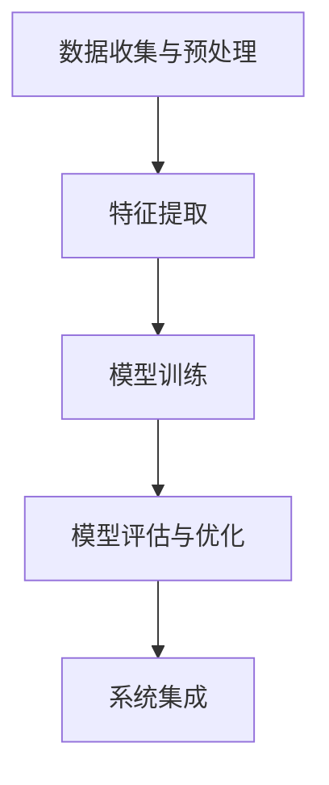

# AI系统Chef原理与代码实战案例讲解

## 1.背景介绍

在当今的科技时代，人工智能（AI）已经渗透到各个领域，从医疗到金融，从制造到娱乐。AI系统Chef是一个专注于烹饪领域的智能系统，它不仅能够根据用户的需求生成食谱，还能根据现有的食材推荐最佳的烹饪方法。本文将深入探讨AI系统Chef的原理、算法、数学模型、实际应用以及代码实现，帮助读者全面了解这一系统的构建和应用。

## 2.核心概念与联系

### 2.1 人工智能与机器学习

人工智能是指计算机系统能够执行通常需要人类智能的任务，如视觉识别、语音识别、决策和语言翻译。机器学习是实现AI的一种方法，通过从数据中学习模式和规律来做出预测或决策。

### 2.2 自然语言处理（NLP）

自然语言处理是AI的一个分支，涉及计算机与人类语言的互动。NLP在AI系统Chef中用于理解用户输入的食材和需求，并生成相应的食谱。

### 2.3 推荐系统

推荐系统是AI系统Chef的核心组件之一。它通过分析用户的历史数据和当前需求，推荐最合适的食谱和烹饪方法。

### 2.4 深度学习

深度学习是机器学习的一个子领域，使用多层神经网络来学习复杂的数据模式。AI系统Chef使用深度学习模型来处理图像识别（如食材识别）和自然语言处理任务。

## 3.核心算法原理具体操作步骤

### 3.1 数据收集与预处理

AI系统Chef需要大量的食谱数据和食材图像数据。数据收集包括从公开的食谱网站抓取数据和用户上传的食材图像。预处理步骤包括数据清洗、去重、归一化等。

### 3.2 特征提取

特征提取是将原始数据转换为机器学习模型可以理解的特征。对于文本数据，使用词嵌入（word embedding）技术；对于图像数据，使用卷积神经网络（CNN）提取特征。

### 3.3 模型训练

使用深度学习模型（如LSTM、Transformer）训练NLP任务，使用CNN训练图像识别任务。模型训练需要大量的计算资源和时间。

### 3.4 模型评估与优化

使用交叉验证和测试集评估模型性能，优化模型参数以提高准确性和效率。

### 3.5 系统集成

将训练好的模型集成到AI系统Chef中，构建前端用户界面和后端服务，提供食谱生成和推荐功能。



## 4.数学模型和公式详细讲解举例说明

### 4.1 词嵌入（Word Embedding）

词嵌入是将词语映射到高维向量空间的技术。常用的词嵌入方法包括Word2Vec和GloVe。假设词语 $w_i$ 的词嵌入向量为 $\mathbf{v}_i$，则词语之间的相似度可以通过余弦相似度计算：

$$
\text{cosine\_similarity}(\mathbf{v}_i, \mathbf{v}_j) = \frac{\mathbf{v}_i \cdot \mathbf{v}_j}{\|\mathbf{v}_i\| \|\mathbf{v}_j\|}
$$

### 4.2 卷积神经网络（CNN）

卷积神经网络用于图像特征提取。假设输入图像为 $I$，卷积核为 $K$，则卷积操作可以表示为：

$$
(I * K)(x, y) = \sum_{i} \sum_{j} I(x+i, y+j) K(i, j)
```

### 4.3 长短期记忆网络（LSTM）

LSTM是一种特殊的RNN，能够捕捉长时间依赖关系。LSTM单元的更新公式如下：

$$
f_t = \sigma(W_f \cdot [h_{t-1}, x_t] + b_f)
$$

$$
i_t = \sigma(W_i \cdot [h_{t-1}, x_t] + b_i)
$$

$$
\tilde{C}_t = \tanh(W_C \cdot [h_{t-1}, x_t] + b_C)
$$

$$
C_t = f_t * C_{t-1} + i_t * \tilde{C}_t
$$

$$
o_t = \sigma(W_o \cdot [h_{t-1}, x_t] + b_o)
$$

$$
h_t = o_t * \tanh(C_t)
$$

### 4.4 Transformer

Transformer模型使用自注意力机制来处理序列数据。自注意力机制的计算公式如下：

$$
\text{Attention}(Q, K, V) = \text{softmax}\left(\frac{QK^T}{\sqrt{d_k}}\right) V
$$

其中，$Q$、$K$、$V$ 分别表示查询、键和值矩阵，$d_k$ 是键向量的维度。

## 5.项目实践：代码实例和详细解释说明

### 5.1 数据收集与预处理

```python
import requests
from bs4 import BeautifulSoup
import pandas as pd

def fetch_recipes(url):
    response = requests.get(url)
    soup = BeautifulSoup(response.text, 'html.parser')
    recipes = []
    for recipe in soup.find_all('div', class_='recipe'):
        title = recipe.find('h2').text
        ingredients = [ing.text for ing in recipe.find_all('li', class_='ingredient')]
        recipes.append({'title': title, 'ingredients': ingredients})
    return pd.DataFrame(recipes)

url = 'https://example.com/recipes'
recipes_df = fetch_recipes(url)
recipes_df.to_csv('recipes.csv', index=False)
```

### 5.2 特征提取

```python
from sklearn.feature_extraction.text import CountVectorizer

vectorizer = CountVectorizer()
X = vectorizer.fit_transform(recipes_df['ingredients'].apply(lambda x: ' '.join(x)))
```

### 5.3 模型训练

```python
from keras.models import Sequential
from keras.layers import LSTM, Dense, Embedding

model = Sequential()
model.add(Embedding(input_dim=vocab_size, output_dim=128))
model.add(LSTM(128))
model.add(Dense(1, activation='sigmoid'))
model.compile(loss='binary_crossentropy', optimizer='adam', metrics=['accuracy'])

model.fit(X_train, y_train, epochs=10, batch_size=32, validation_data=(X_val, y_val))
```

### 5.4 模型评估与优化

```python
loss, accuracy = model.evaluate(X_test, y_test)
print(f'Test Accuracy: {accuracy}')
```

### 5.5 系统集成

```python
from flask import Flask, request, jsonify

app = Flask(__name__)

@app.route('/recommend', methods=['POST'])
def recommend():
    data = request.json
    ingredients = data['ingredients']
    input_vector = vectorizer.transform([' '.join(ingredients)])
    prediction = model.predict(input_vector)
    return jsonify({'recommendation': prediction})

if __name__ == '__main__':
    app.run(debug=True)
```

## 6.实际应用场景

### 6.1 家庭烹饪助手

AI系统Chef可以作为家庭烹饪助手，帮助用户根据现有食材生成食谱，节省时间和精力。

### 6.2 餐厅菜单设计

餐厅可以使用AI系统Chef设计菜单，根据季节性食材和顾客偏好推荐菜品，提高顾客满意度。

### 6.3 健康饮食建议

AI系统Chef可以根据用户的健康数据（如过敏信息、营养需求）推荐健康食谱，促进健康饮食习惯。

## 7.工具和资源推荐

### 7.1 开发工具

- **Python**：主要编程语言
- **TensorFlow/Keras**：深度学习框架
- **Flask**：Web框架

### 7.2 数据资源

- **Kaggle**：提供大量公开的食谱和食材数据集
- **Food.com**：丰富的食谱资源

### 7.3 学习资源

- **Coursera**：提供AI和机器学习相关课程
- **GitHub**：开源项目和代码示例

## 8.总结：未来发展趋势与挑战

AI系统Chef展示了AI在烹饪领域的巨大潜力。未来，随着技术的进步，AI系统Chef可以实现更高的智能化和个性化服务。然而，挑战也不容忽视，如数据隐私问题、模型的可解释性和用户体验的优化等。持续的研究和创新将推动这一领域的发展。

## 9.附录：常见问题与解答

### 9.1 如何处理数据不足的问题？

可以通过数据增强技术（如图像翻转、旋转）和迁移学习（使用预训练模型）来缓解数据不足的问题。

### 9.2 如何提高模型的准确性？

可以通过增加数据量、优化模型结构、调整超参数和使用集成学习方法来提高模型的准确性。

### 9.3 如何确保系统的实时性？

可以通过优化代码、使用高效的算法和分布式计算技术来提高系统的实时性。

---

作者：禅与计算机程序设计艺术 / Zen and the Art of Computer Programming