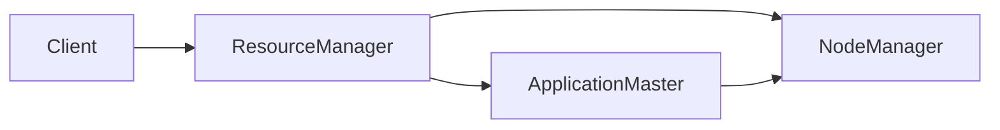

## 1.背景介绍

在大数据处理领域，Apache Hadoop是一种广泛使用的开源框架，它允许处理和存储大规模数据集。Hadoop的一个重要组成部分是YARN（Yet Another Resource Negotiator），它是一个资源管理平台，负责管理计算资源，并在集群中调度用户应用程序。在YARN中，ApplicationMaster是一个重要的概念，它负责管理单个应用程序的生命周期，并与ResourceManager（资源管理器）和NodeManager（节点管理器）协同工作，以保证应用程序的正常运行。

## 2.核心概念与联系

在YARN的架构中，ApplicationMaster扮演着至关重要的角色。它是YARN应用程序的主要协调者，负责管理和调度任务。每个YARN应用程序都有自己的ApplicationMaster，它运行在一个分配给应用程序的容器中。

ApplicationMaster与ResourceManager进行交互，请求合适的资源（比如CPU、内存等），并与NodeManager交互，启动或停止任务。它还负责监控任务的进度，并在任务失败时重新启动任务。



## 3.核心算法原理具体操作步骤

ApplicationMaster的工作过程如下：

1. 当应用程序启动时，ResourceManager会启动一个新的ApplicationMaster实例。
2. ApplicationMaster向ResourceManager注册，表明它现在是活跃的，并且可以接受来自客户端的请求。
3. ApplicationMaster开始向ResourceManager请求资源，ResourceManager会根据可用的资源情况分配资源给ApplicationMaster。
4. 当ApplicationMaster收到资源后，它会与运行在相应节点上的NodeManager通信，要求它在分配的资源上启动任务。
5. ApplicationMaster会监控任务的状态，并根据需要调整资源请求。例如，如果一个任务失败，ApplicationMaster可能会请求更多的资源来重新启动任务。
6. 当所有的任务都完成后，ApplicationMaster会向ResourceManager注销，并关闭自己，标志着应用程序的结束。

## 4.数学模型和公式详细讲解举例说明

在YARN中，资源的分配是通过一个叫做公平调度器（Fair Scheduler）的组件来完成的。公平调度器的工作原理是，它会根据应用程序的需求和集群的资源情况，尽可能公平地分配资源。

公平调度器的核心思想可以用下面的公式来表示：

$$
\text{资源分配} = \frac{\text{应用程序的需求}}{\text{集群的总资源}}
$$

这个公式表明，每个应用程序获得的资源是它的需求和集群总资源的比例。这样可以保证每个应用程序都有公平的机会获得资源。

## 5.项目实践：代码实例和详细解释说明

在实际的项目中，我们可以通过编写一个简单的ApplicationMaster来理解其工作原理。下面是一个简单的ApplicationMaster的代码示例：

```java
public class SimpleApplicationMaster extends AbstractService implements AMRMClientAsync.CallbackHandler, NMClientAsync.CallbackHandler {
    // 省略其他代码...

    @Override
    public void onContainersAllocated(List<Container> containers) {
        for (Container container : containers) {
            // 启动任务
            nmClientAsync.startContainerAsync(container, createContainerLaunchContext(container));
        }
    }

    @Override
    public void onContainersCompleted(List<ContainerStatus> statuses) {
        for (ContainerStatus status : statuses) {
            // 监控任务状态
            if (status.getExitStatus() != 0) {
                // 如果任务失败，重新请求资源
                AMRMClient.ContainerRequest containerRequest = new AMRMClient.ContainerRequest(resource, null, null, priority);
                amRMClient.addContainerRequest(containerRequest);
            }
        }
    }

    // 省略其他代码...
}
```

在这个示例中，我们创建了一个简单的ApplicationMaster，它会在容器分配给它后启动任务，并在任务完成后检查任务的状态。如果任务失败，它会重新请求资源，尝试重新启动任务。

## 6.实际应用场景

ApplicationMaster在许多大数据处理场景中都有应用。例如，在运行MapReduce作业时，会有一个专门的MapReduce ApplicationMaster来管理和调度MapReduce任务。在Spark中，也有一个专门的Spark ApplicationMaster来管理和调度Spark任务。

此外，ApplicationMaster也可以用于开发自定义的YARN应用程序。通过自定义ApplicationMaster，开发者可以利用YARN的资源管理能力，来运行和管理自己的应用程序。

## 7.工具和资源推荐

以下是一些有用的工具和资源，可以帮助你更好地理解和使用ApplicationMaster：

- Apache Hadoop官方文档：提供了详细的YARN和ApplicationMaster的信息。
- Hadoop YARN in Action：一本详细介绍YARN的书，包括了ApplicationMaster的使用和开发。
- Hadoop源代码：阅读源代码是理解ApplicationMaster工作原理的最好方式。

## 8.总结：未来发展趋势与挑战

随着大数据处理需求的不断增长，YARN和ApplicationMaster的重要性也在不断提高。然而，随着集群规模的扩大和应用程序复杂性的增加，ApplicationMaster面临着许多挑战，如资源管理的复杂性、容错能力的提高等。未来，我们期待看到更多的研究和工作，以解决这些挑战，进一步提升ApplicationMaster的效率和可靠性。

## 9.附录：常见问题与解答

1. **问题：ApplicationMaster如何与ResourceManager和NodeManager通信？**
   答：ApplicationMaster使用RPC（远程过程调用）协议与ResourceManager和NodeManager通信。在Hadoop中，RPC是通过Protocol Buffers实现的。

2. **问题：如果ApplicationMaster失败了怎么办？**
   答：如果ApplicationMaster失败，ResourceManager会在另一个节点上启动一个新的ApplicationMaster实例。这是YARN的容错机制的一部分。

3. **问题：我可以自定义ApplicationMaster吗？**
   答：是的，你可以自定义ApplicationMaster来满足你的特殊需求。你可以继承`AMRMClientAsync`和`NMClientAsync`接口，实现自己的回调方法。

作者：禅与计算机程序设计艺术 / Zen and the Art of Computer Programming