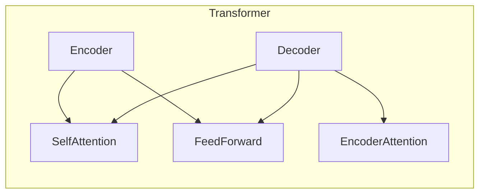
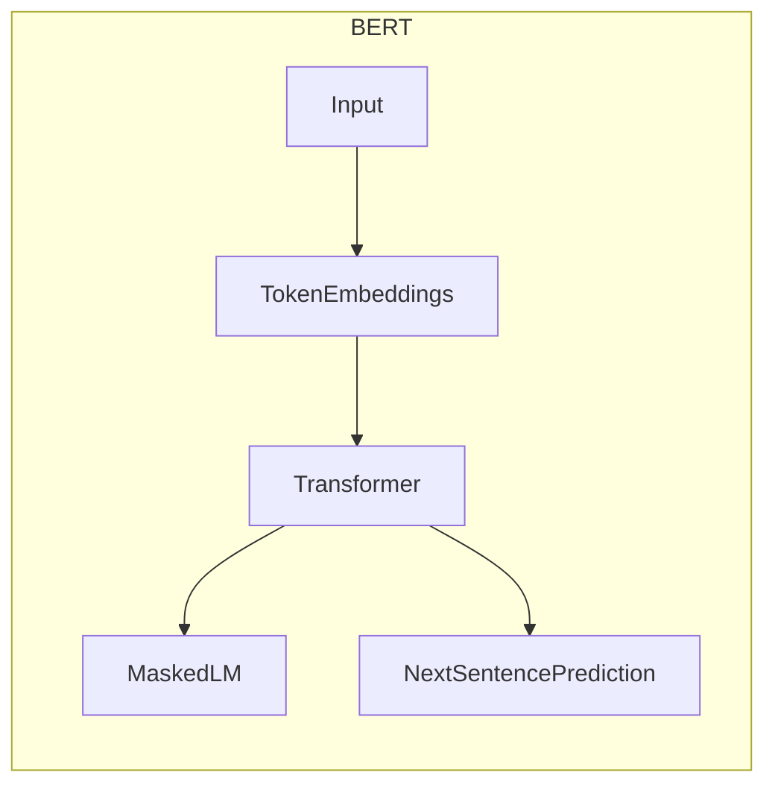

# BERT 原理与代码实战案例讲解

## 1.背景介绍

### 1.1 自然语言处理的重要性

在当今的数字时代,自然语言处理(Natural Language Processing, NLP)已成为人工智能领域中最重要和最具挑战性的研究方向之一。随着大数据、云计算和深度学习技术的快速发展,NLP技术在各个领域都有着广泛的应用,如智能问答系统、机器翻译、文本分类、情感分析等。

### 1.2 NLP面临的主要挑战

然而,自然语言的复杂性给NLP技术带来了诸多挑战:

- 语义歧义:同一个词或句子在不同上下文中可能有不同的含义。
- 语法复杂性:自然语言的语法结构错综复杂,需要精确分析。
- 领域迁移:不同领域的语料特征差异较大,模型的迁移能力受到挑战。

### 1.3 Transformer与BERT的重要意义

为了应对这些挑战,谷歌在2017年提出了Transformer模型,通过自注意力机制有效捕捉长距离依赖关系。2018年,谷歌又在Transformer的基础上提出了BERT(Bidirectional Encoder Representations from Transformers)模型,通过双向编码器和掩码语言模型的预训练策略,极大地提高了下游NLP任务的性能表现,成为NLP领域最重要的技术突破之一。

## 2.核心概念与联系

### 2.1 Transformer模型

Transformer是一种全新的基于注意力机制的序列到序列(Seq2Seq)模型,完全摒弃了循环神经网络(RNN)和卷积神经网络(CNN)结构。它主要由编码器(Encoder)和解码器(Decoder)两个模块组成。



编码器负责将输入序列编码为向量表示,解码器则根据编码器的输出和之前的输出生成目标序列。两个模块中都使用了多头自注意力(Multi-Head Attention)和前馈神经网络(Feed-Forward Neural Network)子层。

### 2.2 BERT模型

BERT是一种基于Transformer的双向编码器模型,主要用于生成上下文敏感的词向量表示。它通过掩码语言模型(Masked Language Model)和下一句预测(Next Sentence Prediction)两个预训练任务,学习通用的语义表示。



BERT的输入是由词元(Token)、位置编码(Position Encoding)和分段编码(Segment Encoding)组成的向量表示。经过多层Transformer编码器的处理后,BERT可以生成每个词元的上下文敏感表示,用于下游的NLP任务,如文本分类、问答系统等。

### 2.3 BERT与Transformer的关系

BERT实际上是一种特殊形式的Transformer编码器,它只使用了Transformer的编码器部分,并通过掩码语言模型和下一句预测两个预训练任务,学习了通用的语义表示。这种预训练方式使得BERT可以捕捉到双向的上下文信息,从而在下游任务中表现出色。

## 3.核心算法原理具体操作步骤 

### 3.1 输入表示

BERT的输入由三部分组成:词元嵌入(Token Embeddings)、位置嵌入(Position Embeddings)和分段嵌入(Segment Embeddings)。

1. **词元嵌入**:将输入文本按词元(如单词或子词)分割,每个词元对应一个嵌入向量。
2. **位置嵌入**:捕捉词元在序列中的位置信息,每个位置对应一个位置嵌入向量。
3. **分段嵌入**:区分输入属于句子A还是句子B,对应不同的分段嵌入向量。

最终输入表示是三个嵌入向量的元素级求和。

### 3.2 Transformer编码器

BERT使用了基于多头自注意力机制的Transformer编码器,由多个相同的编码器层组成。每个编码器层包含两个子层:

1. **多头自注意力子层**:通过计算查询(Query)、键(Key)和值(Value)之间的注意力权重,捕捉输入序列中不同位置之间的相关性。
2. **前馈神经网络子层**:对每个位置的表示进行非线性变换,捕捉更复杂的特征。

两个子层之间使用残差连接(Residual Connection)和层归一化(Layer Normalization)来促进梯度传播和模型收敛。

### 3.3 掩码语言模型

BERT的预训练任务之一是掩码语言模型(Masked Language Model, MLM)。在训练过程中,部分词元会被随机遮蔽,模型需要根据其余的上下文信息预测被遮蔽的词元。

具体操作步骤如下:

1. 随机选择输入序列中的15%的词元进行遮蔽,其中80%的遮蔽词元用特殊标记[MASK]替换,10%用随机词元替换,剩余10%保持不变。
2. 将遮蔽后的序列输入BERT编码器,得到每个位置的上下文表示向量。
3. 对于被遮蔽的位置,使用其上下文表示向量预测原始的词元。
4. 使用交叉熵损失函数优化模型参数。

通过MLM预训练,BERT可以学习到双向的上下文信息,捕捉词元之间的深层次语义关系。

### 3.4 下一句预测

BERT的另一个预训练任务是下一句预测(Next Sentence Prediction, NSP)。在训练过程中,模型需要判断两个输入句子是否为连续的句子对。

具体操作步骤如下:

1. 将两个句子作为输入,用特殊标记[SEP]分隔,并添加相应的分段嵌入。
2. 将输入序列输入BERT编码器,得到特殊标记[CLS]对应的表示向量。
3. 将[CLS]表示向量输入到二分类器,预测两个句子是否为连续的句子对。
4. 使用二元交叉熵损失函数优化模型参数。

NSP任务可以帮助BERT捕捉句子之间的关系和语境信息,提高模型的理解能力。

## 4.数学模型和公式详细讲解举例说明

### 4.1 自注意力机制

自注意力机制是Transformer和BERT的核心,它通过计算查询(Query)、键(Key)和值(Value)之间的相似性,捕捉输入序列中不同位置之间的关系。

给定一个长度为$n$的输入序列$X = (x_1, x_2, \dots, x_n)$,我们将其线性映射到查询$Q$、键$K$和值$V$:

$$Q = XW^Q$$
$$K = XW^K$$
$$V = XW^V$$

其中$W^Q$、$W^K$和$W^V$分别是可学习的查询、键和值的权重矩阵。

然后,我们计算查询和所有键之间的点积,得到注意力分数矩阵$S$:

$$S = \frac{QK^T}{\sqrt{d_k}}$$

其中$d_k$是键的维度,用于缩放点积值。

接着,我们对注意力分数矩阵$S$进行软最大值操作,得到注意力权重矩阵$A$:

$$A = \text{softmax}(S)$$

最后,我们将注意力权重矩阵$A$与值$V$相乘,得到加权和表示$Z$:

$$Z = AV$$

$Z$就是输入序列的新表示,它捕捉了不同位置之间的相关性。

### 4.2 多头自注意力

为了捕捉不同子空间的关系,BERT使用了多头自注意力机制。具体来说,我们将查询、键和值分别线性映射到$h$个不同的子空间,对每个子空间分别计算自注意力,然后将所有子空间的结果拼接起来:

$$\text{MultiHead}(Q, K, V) = \text{Concat}(head_1, \dots, head_h)W^O$$

其中$head_i$是第$i$个子空间的自注意力结果,定义为:

$$head_i = \text{Attention}(QW_i^Q, KW_i^K, VW_i^V)$$

$W_i^Q$、$W_i^K$和$W_i^V$分别是第$i$个子空间的查询、键和值的权重矩阵,$W^O$是可学习的线性变换矩阵。

多头自注意力机制可以从不同的子空间捕捉不同的关系,提高模型的表示能力。

### 4.3 位置编码

由于自注意力机制没有捕捉序列顺序信息的能力,BERT引入了位置编码来保留位置信息。具体来说,对于每个位置$i$,我们定义一个位置编码向量$P_i$:

$$P_{i,2j} = \sin(i/10000^{2j/d_\text{model}})$$
$$P_{i,2j+1} = \cos(i/10000^{2j/d_\text{model}})$$

其中$j$是维度索引,$d_\text{model}$是模型的隐层维度。

位置编码向量$P_i$与输入嵌入相加,从而将位置信息编码到输入表示中。

## 5.项目实践:代码实例和详细解释说明

在这一部分,我们将使用Python和Hugging Face的Transformers库,实现一个基于BERT的文本分类任务。具体来说,我们将构建一个二分类模型,判断一个给定的电影评论是正面评论还是负面评论。

### 5.1 导入所需库

```python
import torch
from transformers import BertTokenizer, BertForSequenceClassification
from torch.utils.data import TensorDataset, DataLoader
```

我们导入了PyTorch、Transformers库以及一些数据处理的工具。

### 5.2 加载BERT分词器和预训练模型

```python
tokenizer = BertTokenizer.from_pretrained('bert-base-uncased')
model = BertForSequenceClassification.from_pretrained('bert-base-uncased', num_labels=2)
```

我们加载了BERT的基础版本分词器和预训练模型。`num_labels=2`表示这是一个二分类任务。

### 5.3 数据预处理

```python
texts = [
    "This movie was amazing! The acting was superb, and the plot kept me engaged throughout.",
    "I didn't enjoy this film at all. The story was confusing, and the characters were one-dimensional."
]
encoded_texts = [tokenizer.encode_plus(text, max_length=128, pad_to_max_length=True, truncation=True) for text in texts]

input_ids = torch.tensor([item['input_ids'] for item in encoded_texts])
attention_masks = torch.tensor([item['attention_mask'] for item in encoded_texts])
labels = torch.tensor([1, 0])  # 1 for positive, 0 for negative

dataset = TensorDataset(input_ids, attention_masks, labels)
dataloader = DataLoader(dataset, batch_size=2, shuffle=True)
```

我们首先定义了两个示例文本,分别代表正面和负面评论。然后,我们使用BERT分词器对文本进行编码,得到输入ID和注意力掩码。接着,我们构建了PyTorch的`TensorDataset`和`DataLoader`对象,方便后续的训练和评估。

### 5.4 模型训练

```python
device = torch.device('cuda' if torch.cuda.is_available() else 'cpu')
model.to(device)

optimizer = torch.optim.Adam(model.parameters(), lr=2e-5)

for epoch in range(2):
    model.train()
    for batch in dataloader:
        input_ids, attention_masks, labels = [item.to(device) for item in batch]
        
        outputs = model(input_ids, attention_mask=attention_masks, labels=labels)
        loss = outputs.loss
        
        loss.backward()
        optimizer.step()
        optimizer.zero_grad()
```

我们将模型移动到GPU或CPU上,并定义了一个Adam优化器。接着,我们进行了两个epoch的训练。在每个batch中,我们将输入数据移动到相应的设备上,计算损失值,并进行反向传播和优化器更新。

### 5.5 模型评估

```python
model.eval()
with torch.no_grad():
    input_ids, attention_masks, labels = [item.to(device) for item in batch]
    outputs = model(input_ids, attention_mask=attention_masks)
    logits = outputs.logits
    predictions = torch.argmax(logits, dim=1)
    
    print("Predictions:", predictions)
    print("Ground Truth:", labels)
```

在评估阶段,我们将模型设置为