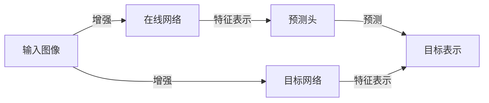

# BYOL原理与代码实例讲解

## 1. 背景介绍

在深度学习的领域中，自监督学习(Self-Supervised Learning, SSL)已经成为一种重要的无监督学习方法。它通过构造伪标签来训练模型，从而在没有人工标注数据的情况下学习有用的特征表示。Bootstrap Your Own Latent (BYOL) 是一种新颖的自监督学习框架，它通过一种独特的方式来学习特征表示，不需要负样本对比，避免了对比学习中的一些常见问题。

## 2. 核心概念与联系

### 2.1 自监督学习与对比学习
自监督学习是一种数据驱动的学习方法，它不依赖于外部的标注信息，而是利用数据本身的结构和内在关系来进行学习。对比学习是自监督学习的一种形式，通过比较正负样本对来学习数据的表示。

### 2.2 BYOL的创新之处
BYOL摒弃了传统对比学习中使用的负样本对，它通过维护一个在线网络和一个目标网络，并在这两个网络之间进行权重更新，从而实现特征表示的学习。

## 3. 核心算法原理具体操作步骤

### 3.1 网络结构
BYOL包含两个主要的网络结构：在线网络和目标网络。在线网络负责生成特征表示，目标网络则用于提供一个稳定的目标来指导在线网络的学习。

### 3.2 权重更新
在线网络的权重通过梯度下降进行更新，而目标网络的权重则通过在线网络的权重进行指数移动平均更新。



## 4. 数学模型和公式详细讲解举例说明

BYOL的目标是最小化在线网络的预测表示和目标网络的表示之间的距离。这可以通过以下损失函数来实现：

$$ L(\theta) = \| \text{normalize}(q_\theta(x)) - \text{normalize}(z_\xi(x')) \|_2^2 $$

其中，$q_\theta(x)$ 是在线网络的预测表示，$z_\xi(x')$ 是目标网络的表示，$\theta$ 和 $\xi$ 分别是在线网络和目标网络的参数。

## 5. 项目实践：代码实例和详细解释说明

在实际的代码实现中，我们首先需要定义在线网络和目标网络的结构，然后实现权重更新的逻辑。以下是一个简化的代码示例：

```python
# 定义网络结构
class ResNet(nn.Module):
    ...

# 初始化在线网络和目标网络
online_network = ResNet(...)
target_network = ResNet(...)
target_network.load_state_dict(online_network.state_dict())

# 定义损失函数
def byol_loss(online_pred, target_repr):
    return F.mse_loss(F.normalize(online_pred, dim=1), F.normalize(target_repr, dim=1))

# 训练循环
for images in dataloader:
    online_pred = online_network(images)
    with torch.no_grad():
        target_repr = target_network(images)
    loss = byol_loss(online_pred, target_repr)
    loss.backward()
    optimizer.step()
    # 更新目标网络的权重
    for target_param, online_param in zip(target_network.parameters(), online_network.parameters()):
        target_param.data = target_param.data * (1.0 - tau) + online_param.data * tau
```

## 6. 实际应用场景

BYOL可以应用于多种场景，包括图像分类、目标检测和语义分割等。由于其不需要负样本，因此特别适合于数据集较小或者负样本难以定义的任务。

## 7. 工具和资源推荐

- PyTorch: 一个开源的机器学习库，非常适合于实现BYOL算法。
- TensorFlow: 另一个流行的机器学习库，也可以用来实现BYOL。
- BYOL官方实现: 可以参考BYOL的官方实现来深入理解算法的细节。

## 8. 总结：未来发展趋势与挑战

BYOL作为一种新兴的自监督学习方法，展现出了巨大的潜力。未来的发展趋势可能会集中在进一步提高算法的效率和泛化能力上。同时，如何将BYOL应用于更广泛的领域，如自然语言处理和强化学习，也是一个值得探索的挑战。

## 9. 附录：常见问题与解答

Q1: BYOL如何避免模式坍塌？
A1: BYOL通过目标网络提供的稳定目标和在线网络的权重更新机制来避免模式坍塌。

Q2: BYOL的训练效率如何？
A2: BYOL不需要负样本，因此在某些情况下可以比传统的对比学习方法更高效。

Q3: BYOL适用于哪些类型的数据？
A3: BYOL适用于各种类型的数据，包括图像、视频和文本等。

作者：禅与计算机程序设计艺术 / Zen and the Art of Computer Programming