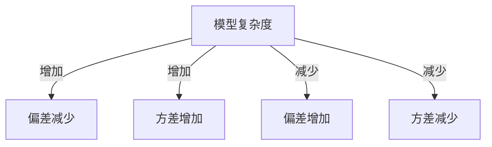

# Bias-Variance Tradeoff 原理与代码实战案例讲解

## 1.背景介绍

在机器学习和统计学中，Bias-Variance Tradeoff（偏差-方差权衡）是一个至关重要的概念。它描述了模型复杂度与预测性能之间的关系。理解这一权衡对于构建高效的机器学习模型至关重要。本文将深入探讨Bias-Variance Tradeoff的原理，并通过实际代码案例来帮助读者更好地理解和应用这一概念。

## 2.核心概念与联系

### 2.1 偏差（Bias）

偏差是指模型预测值与真实值之间的差异。高偏差通常意味着模型过于简单，无法捕捉数据的复杂模式，导致欠拟合。

### 2.2 方差（Variance）

方差是指模型预测值的波动性。高方差通常意味着模型过于复杂，过度拟合训练数据，导致在新数据上的表现不佳。

### 2.3 噪声（Noise）

噪声是数据中不可预测的部分，无法通过任何模型来捕捉。噪声是数据固有的，无法通过调整模型来消除。

### 2.4 偏差-方差权衡

偏差和方差之间存在一种权衡关系。增加模型复杂度可以减少偏差，但会增加方差；反之，减少模型复杂度可以减少方差，但会增加偏差。理想的模型应该在偏差和方差之间找到一个平衡点。



## 3.核心算法原理具体操作步骤

### 3.1 数据准备

首先，我们需要准备数据集。数据集可以是任何形式的，但为了简单起见，我们将使用一个简单的回归数据集。

### 3.2 模型选择

选择不同复杂度的模型，例如线性回归、多项式回归等。

### 3.3 模型训练

使用训练数据集训练模型，并记录每个模型的训练误差和验证误差。

### 3.4 误差分析

分析不同模型的训练误差和验证误差，绘制误差随模型复杂度变化的曲线。

### 3.5 权衡点选择

根据误差曲线，选择一个合适的模型复杂度，使得偏差和方差达到平衡。

## 4.数学模型和公式详细讲解举例说明

### 4.1 偏差公式

偏差可以通过以下公式计算：

$$
\text{Bias} = \mathbb{E}[\hat{f}(x) - f(x)]
$$

其中，$\hat{f}(x)$ 是模型的预测值，$f(x)$ 是真实值。

### 4.2 方差公式

方差可以通过以下公式计算：

$$
\text{Variance} = \mathbb{E}[(\hat{f}(x) - \mathbb{E}[\hat{f}(x)])^2]
$$

### 4.3 总误差公式

总误差可以表示为偏差、方差和噪声的和：

$$
\text{Total Error} = \text{Bias}^2 + \text{Variance} + \text{Noise}
$$

## 5.项目实践：代码实例和详细解释说明

### 5.1 数据集生成

```python
import numpy as np
import matplotlib.pyplot as plt
from sklearn.model_selection import train_test_split
from sklearn.preprocessing import PolynomialFeatures
from sklearn.linear_model import LinearRegression
from sklearn.metrics import mean_squared_error

# 生成数据集
np.random.seed(0)
X = 2 - 3 * np.random.normal(0, 1, 100)
y = X - 2 * (X ** 2) + np.random.normal(-3, 3, 100)

# 数据集分割
X = X[:, np.newaxis]
X_train, X_test, y_train, y_test = train_test_split(X, y, test_size=0.2, random_state=0)
```

### 5.2 模型训练与评估

```python
# 训练不同复杂度的模型
degrees = [1, 4, 15]
train_errors = []
test_errors = []

for degree in degrees:
    polynomial_features = PolynomialFeatures(degree=degree)
    X_train_poly = polynomial_features.fit_transform(X_train)
    X_test_poly = polynomial_features.fit_transform(X_test)
    
    model = LinearRegression()
    model.fit(X_train_poly, y_train)
    
    y_train_pred = model.predict(X_train_poly)
    y_test_pred = model.predict(X_test_poly)
    
    train_errors.append(mean_squared_error(y_train, y_train_pred))
    test_errors.append(mean_squared_error(y_test, y_test_pred))

# 绘制误差曲线
plt.figure(figsize=(10, 6))
plt.plot(degrees, train_errors, label='Training Error')
plt.plot(degrees, test_errors, label='Testing Error')
plt.xlabel('Model Complexity (Degree)')
plt.ylabel('Mean Squared Error')
plt.legend()
plt.show()
```

### 5.3 结果分析

通过绘制的误差曲线，我们可以观察到随着模型复杂度的增加，训练误差逐渐减少，但测试误差先减少后增加。这表明模型在训练数据上表现良好，但在测试数据上过拟合。

## 6.实际应用场景

### 6.1 回归问题

在回归问题中，Bias-Variance Tradeoff可以帮助我们选择合适的模型复杂度，以避免过拟合和欠拟合。

### 6.2 分类问题

在分类问题中，Bias-Variance Tradeoff同样适用。我们可以通过调整模型复杂度来优化分类器的性能。

### 6.3 时间序列预测

在时间序列预测中，Bias-Variance Tradeoff可以帮助我们选择合适的模型，以提高预测精度。

## 7.工具和资源推荐

### 7.1 工具

- **Scikit-learn**：一个强大的Python机器学习库，提供了丰富的模型和工具。
- **Matplotlib**：一个用于数据可视化的Python库。

### 7.2 资源

- **《Pattern Recognition and Machine Learning》**：Christopher M. Bishop著作，深入探讨了机器学习中的各种概念，包括Bias-Variance Tradeoff。
- **Coursera和Udacity上的机器学习课程**：提供了丰富的学习资源和实践机会。

## 8.总结：未来发展趋势与挑战

Bias-Variance Tradeoff是机器学习中的一个基本概念，理解这一权衡对于构建高效的模型至关重要。未来，随着数据量和计算能力的增加，我们可以构建更加复杂的模型，但同时也需要更加精细地处理Bias-Variance Tradeoff，以避免过拟合和欠拟合。

## 9.附录：常见问题与解答

### 9.1 什么是Bias-Variance Tradeoff？

Bias-Variance Tradeoff是指模型复杂度与预测性能之间的权衡关系。增加模型复杂度可以减少偏差，但会增加方差；反之，减少模型复杂度可以减少方差，但会增加偏差。

### 9.2 如何选择合适的模型复杂度？

通过分析训练误差和验证误差的变化曲线，选择一个使得偏差和方差达到平衡的模型复杂度。

### 9.3 Bias-Variance Tradeoff在实际应用中有哪些挑战？

在实际应用中，数据的噪声和复杂性可能会影响Bias-Variance Tradeoff的效果。需要通过多次实验和调整来找到最佳的模型复杂度。

---

作者：禅与计算机程序设计艺术 / Zen and the Art of Computer Programming