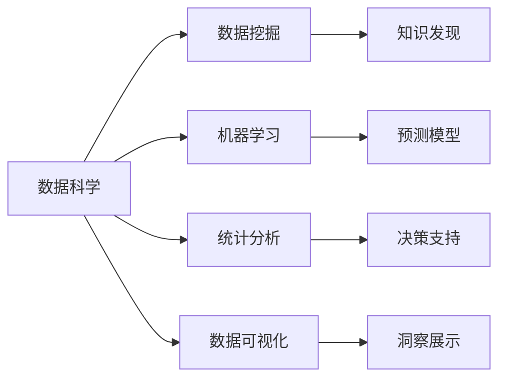

# Data Science 原理与代码实战案例讲解

## 1. 背景介绍
数据科学作为一门交叉学科，它涵盖了统计学、计算机科学、信息科学以及相关领域的知识，旨在从大量的、多样化的数据中提取知识和洞察力。随着大数据时代的到来，数据科学的重要性日益凸显，它已经成为企业和组织做出基于数据的决策的关键。

## 2. 核心概念与联系
数据科学的核心概念包括数据挖掘、机器学习、统计分析和数据可视化。这些概念相互联系，共同构成了数据科学的基础框架。



## 3. 核心算法原理具体操作步骤
以决策树为例，核心算法原理的操作步骤包括特征选择、树的生成和树的剪枝。特征选择的目的是选出对训练数据具有分类能力的特征，以增加模型的预测准确性。

## 4. 数学模型和公式详细讲解举例说明
决策树中常用的信息增益计算公式为：

$$
\text{信息增益}(G) = \text{熵}(S) - \sum_{v \in Values(A)} \frac{|S_v|}{|S|} \text{熵}(S_v)
$$

其中，熵是表示随机变量不确定性的度量。

## 5. 项目实践：代码实例和详细解释说明
以Python语言为例，使用scikit-learn库中的决策树算法进行分类：

```python
from sklearn import tree
X = [[0, 0], [1, 1]]
Y = [0, 1]
clf = tree.DecisionTreeClassifier()
clf = clf.fit(X, Y)
```

这段代码展示了如何训练一个简单的决策树模型。

## 6. 实际应用场景
数据科学在金融风控、医疗健康、市场营销等多个领域都有广泛的应用。例如，在金融风控领域，数据科学可以帮助构建信用评分模型，预测贷款违约的可能性。

## 7. 工具和资源推荐
推荐使用Python语言，它拥有丰富的数据科学库，如NumPy、Pandas、scikit-learn等。同时，Jupyter Notebook是一个非常好的交互式编程环境，适合进行数据分析和模型开发。

## 8. 总结：未来发展趋势与挑战
数据科学的未来发展趋势将更加侧重于自动化和智能化，同时，隐私保护和数据安全将成为新的挑战。

## 9. 附录：常见问题与解答
Q1: 数据科学和数据分析有什么区别？
A1: 数据科学比数据分析涵盖更广泛的领域，不仅包括分析，还包括数据的清洗、处理、模型构建等。

作者：禅与计算机程序设计艺术 / Zen and the Art of Computer Programming