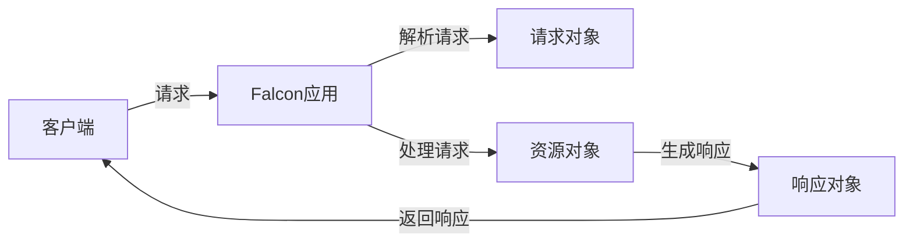

## 1.背景介绍

Falcon是一个高性能的Python Web框架，专为构建大规模的应用程序和微服务而设计。它提供了一种简单的、直观的方式来构建Web应用程序，同时也提供了丰富的特性和灵活性以满足更复杂的需求。Falcon的设计原则是最小主义，尽可能减少CPU和内存的消耗，以提高性能。

## 2.核心概念与联系

Falcon的核心概念主要包括以下几个部分：资源、请求和响应。

- 资源：在Falcon中，资源是一个Python对象，它定义了应用程序的一部分功能。每个资源都有一些方法，这些方法对应HTTP的动词（如GET、POST等）。

- 请求：当客户端向服务器发送HTTP请求时，Falcon会将其解析为一个请求对象。请求对象包含了请求的所有信息，例如HTTP方法、URL、头部信息等。

- 响应：响应对象代表了服务器返回给客户端的HTTP响应。开发者可以通过设置响应对象的属性来控制响应的内容和行为。

这三个概念之间的关系可以通过下面的Mermaid流程图进行展示：



## 3.核心算法原理具体操作步骤

Falcon处理HTTP请求的过程主要包括以下几个步骤：

1. Falcon应用接收到客户端的HTTP请求。

2. Falcon应用解析HTTP请求，生成请求对象。

3. Falcon应用根据请求对象的URL找到对应的资源对象。

4. Falcon应用调用资源对象的对应方法（如GET、POST等）处理请求，生成响应对象。

5. Falcon应用返回响应对象给客户端。

## 4.数学模型和公式详细讲解举例说明

在Falcon中，我们通常使用时间复杂度来衡量处理请求的性能。时间复杂度是描述算法执行时间如何随着输入数据规模的增长而变化的一种度量方法。在最坏的情况下，Falcon处理一个请求的时间复杂度可以表示为$O(1)$，这意味着无论请求的规模如何，Falcon处理请求的时间都是常数，这是因为Falcon的设计目标是实现高性能和高吞吐量。

## 5.项目实践：代码实例和详细解释说明

下面是一个使用Falcon构建简单Web应用的例子：

```python
import falcon

class HelloWorldResource:
    def on_get(self, req, resp):
        resp.status = falcon.HTTP_200
        resp.body = 'Hello, World!'

app = falcon.API()
app.add_route('/', HelloWorldResource())
```

上述代码创建了一个Falcon应用，并添加了一个资源对象`HelloWorldResource`。当客户端发送GET请求到根URL('/')时，服务器会返回"Hello, World!"。

## 6.实际应用场景

Falcon广泛应用于构建各种Web应用和微服务，例如：

- API后端：Falcon的高性能和简洁的设计使其成为构建API后端的理想选择。

- 数据处理：Falcon可以处理大量的并发请求，使其成为大数据处理和实时分析的好工具。

- IoT设备：Falcon的轻量级和高性能使其适合在物联网设备中使用。

## 7.工具和资源推荐

- Falcon官方文档：提供了详细的Falcon使用指南和API参考。

- Falcon Github仓库：可以找到Falcon的源代码和示例项目。

- Falcon社区：可以找到其他Falcon用户和开发者，分享经验和解决问题。

## 8.总结：未来发展趋势与挑战

随着云计算和微服务的发展，Falcon的应用场景将进一步扩大。然而，Falcon面临的挑战也不少，例如如何提高处理大规模并发请求的能力，如何提供更丰富的特性和更好的易用性等。

## 9.附录：常见问题与解答

- Q: Falcon支持哪些Python版本？

  A: Falcon支持Python 2.7和Python 3.4以上的版本。

- Q: Falcon如何处理异常？

  A: Falcon提供了一个错误处理机制，可以捕获和处理资源对象方法中抛出的异常。

- Q: 如何测试Falcon应用？

  A: Falcon提供了一个测试客户端，可以用来模拟HTTP请求和验证响应。

作者：禅与计算机程序设计艺术 / Zen and the Art of Computer Programming