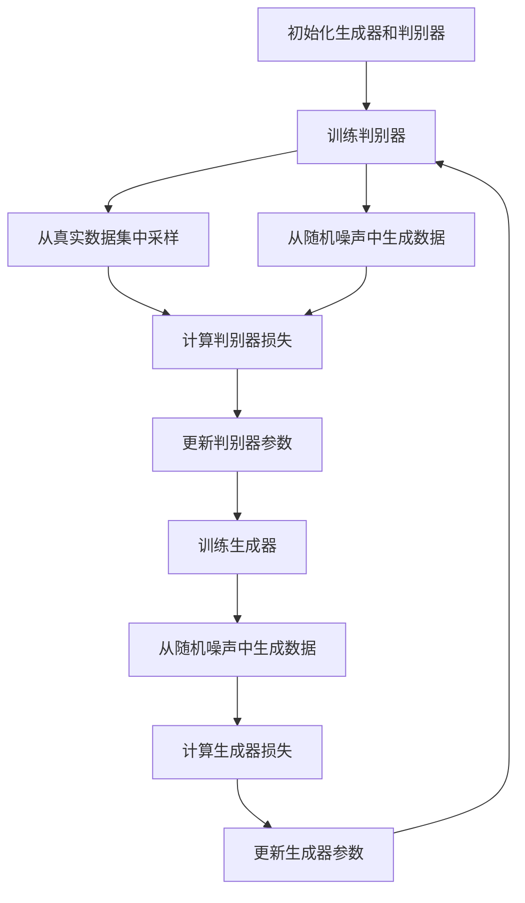

# GAN 生成模型：生成器 (Generator) 原理与代码实例讲解

## 1.背景介绍

生成对抗网络（Generative Adversarial Networks，简称GAN）自2014年由Ian Goodfellow等人提出以来，迅速成为机器学习和人工智能领域的热门研究方向。GAN的核心思想是通过两个神经网络——生成器（Generator）和判别器（Discriminator）之间的对抗训练，使得生成器能够生成逼真的数据样本。本文将深入探讨GAN中的生成器部分，详细讲解其原理、算法、数学模型，并通过代码实例展示其实际应用。

## 2.核心概念与联系

### 2.1 生成器（Generator）

生成器是GAN中的一个神经网络，其任务是从随机噪声中生成逼真的数据样本。生成器的目标是欺骗判别器，使其无法区分生成的数据和真实数据。

### 2.2 判别器（Discriminator）

判别器是另一个神经网络，其任务是区分真实数据和生成器生成的数据。判别器的目标是最大化区分真实数据和生成数据的能力。

### 2.3 对抗训练

生成器和判别器通过对抗训练的方式进行优化。生成器试图生成逼真的数据以欺骗判别器，而判别器则试图提高其区分能力。这个过程可以看作是一个零和博弈。

### 2.4 损失函数

GAN的损失函数由生成器和判别器的损失函数组成。生成器的损失函数旨在最小化判别器对生成数据的判别能力，而判别器的损失函数则旨在最大化其对真实数据和生成数据的区分能力。

## 3.核心算法原理具体操作步骤

### 3.1 初始化

1. 初始化生成器和判别器的参数。
2. 定义生成器和判别器的结构。

### 3.2 训练判别器

1. 从真实数据集中采样一批数据。
2. 从随机噪声中生成一批数据。
3. 计算判别器对真实数据和生成数据的损失。
4. 更新判别器的参数以最小化损失。

### 3.3 训练生成器

1. 从随机噪声中生成一批数据。
2. 计算判别器对生成数据的损失。
3. 更新生成器的参数以最小化损失。

### 3.4 重复训练

重复步骤3.2和3.3，直到生成器生成的数据足够逼真。

以下是GAN的训练流程图：



## 4.数学模型和公式详细讲解举例说明

### 4.1 生成器的目标

生成器的目标是生成逼真的数据样本，使得判别器无法区分生成数据和真实数据。生成器的损失函数可以表示为：

$$
L_G = -\mathbb{E}_{z \sim p_z(z)}[\log(D(G(z)))]
$$

其中，$G(z)$表示生成器生成的数据，$D(G(z))$表示判别器对生成数据的判别结果，$p_z(z)$表示随机噪声的分布。

### 4.2 判别器的目标

判别器的目标是最大化其对真实数据和生成数据的区分能力。判别器的损失函数可以表示为：

$$
L_D = -\mathbb{E}_{x \sim p_{data}(x)}[\log(D(x))] - \mathbb{E}_{z \sim p_z(z)}[\log(1 - D(G(z)))]
$$

其中，$D(x)$表示判别器对真实数据的判别结果，$p_{data}(x)$表示真实数据的分布。

### 4.3 总体目标

GAN的总体目标是通过对抗训练，使得生成器和判别器的损失函数达到一个平衡点。这个过程可以表示为一个极小极大问题：

$$
\min_G \max_D V(D, G) = \mathbb{E}_{x \sim p_{data}(x)}[\log(D(x))] + \mathbb{E}_{z \sim p_z(z)}[\log(1 - D(G(z)))]
$$

## 5.项目实践：代码实例和详细解释说明

### 5.1 环境准备

首先，我们需要安装必要的库：

```bash
pip install torch torchvision matplotlib
```

### 5.2 定义生成器和判别器

```python
import torch
import torch.nn as nn

class Generator(nn.Module):
    def __init__(self, input_dim, output_dim):
        super(Generator, self).__init__()
        self.model = nn.Sequential(
            nn.Linear(input_dim, 128),
            nn.ReLU(),
            nn.Linear(128, 256),
            nn.ReLU(),
            nn.Linear(256, output_dim),
            nn.Tanh()
        )

    def forward(self, x):
        return self.model(x)

class Discriminator(nn.Module):
    def __init__(self, input_dim):
        super(Discriminator, self).__init__()
        self.model = nn.Sequential(
            nn.Linear(input_dim, 256),
            nn.LeakyReLU(0.2),
            nn.Linear(256, 128),
            nn.LeakyReLU(0.2),
            nn.Linear(128, 1),
            nn.Sigmoid()
        )

    def forward(self, x):
        return self.model(x)
```

### 5.3 训练过程

```python
import torch.optim as optim

# 超参数
input_dim = 100
output_dim = 784  # 28x28的图像
batch_size = 64
epochs = 100

# 初始化生成器和判别器
generator = Generator(input_dim, output_dim)
discriminator = Discriminator(output_dim)

# 损失函数和优化器
criterion = nn.BCELoss()
optimizer_G = optim.Adam(generator.parameters(), lr=0.0002)
optimizer_D = optim.Adam(discriminator.parameters(), lr=0.0002)

# 训练循环
for epoch in range(epochs):
    for i, (real_data, _) in enumerate(dataloader):
        # 训练判别器
        optimizer_D.zero_grad()
        real_data = real_data.view(-1, output_dim)
        real_labels = torch.ones(batch_size, 1)
        fake_labels = torch.zeros(batch_size, 1)

        outputs = discriminator(real_data)
        d_loss_real = criterion(outputs, real_labels)

        z = torch.randn(batch_size, input_dim)
        fake_data = generator(z)
        outputs = discriminator(fake_data.detach())
        d_loss_fake = criterion(outputs, fake_labels)

        d_loss = d_loss_real + d_loss_fake
        d_loss.backward()
        optimizer_D.step()

        # 训练生成器
        optimizer_G.zero_grad()
        z = torch.randn(batch_size, input_dim)
        fake_data = generator(z)
        outputs = discriminator(fake_data)
        g_loss = criterion(outputs, real_labels)

        g_loss.backward()
        optimizer_G.step()

    print(f'Epoch [{epoch+1}/{epochs}], d_loss: {d_loss.item()}, g_loss: {g_loss.item()}')
```

### 5.4 生成样本

```python
import matplotlib.pyplot as plt

z = torch.randn(64, input_dim)
fake_data = generator(z)
fake_data = fake_data.view(-1, 1, 28, 28)
grid = torchvision.utils.make_grid(fake_data, nrow=8, normalize=True)
plt.imshow(grid.permute(1, 2, 0).detach().numpy())
plt.show()
```

## 6.实际应用场景

### 6.1 图像生成

GAN在图像生成领域有广泛的应用，如生成高分辨率图像、图像修复、图像超分辨率等。

### 6.2 数据增强

在数据不足的情况下，GAN可以用于生成额外的训练数据，从而提高模型的性能。

### 6.3 风格迁移

GAN可以用于图像风格迁移，如将照片转换为绘画风格，或将白天的照片转换为夜晚的照片。

### 6.4 文本生成

GAN也可以用于生成文本数据，如生成新闻文章、诗歌等。

## 7.工具和资源推荐

### 7.1 开源框架

- TensorFlow
- PyTorch
- Keras

### 7.2 数据集

- MNIST
- CIFAR-10
- CelebA

### 7.3 参考文献

- Ian Goodfellow等人提出的GAN原始论文
- 相关的深度学习书籍和教程

## 8.总结：未来发展趋势与挑战

### 8.1 发展趋势

GAN在生成模型领域有着广阔的前景，未来可能会在更多的实际应用中得到广泛应用，如医疗图像生成、自动驾驶等。

### 8.2 挑战

GAN的训练过程不稳定，容易出现模式崩溃（Mode Collapse）等问题。此外，GAN生成的数据质量和多样性仍有待提高。

## 9.附录：常见问题与解答

### 9.1 为什么GAN的训练过程不稳定？

GAN的训练过程涉及到生成器和判别器的对抗训练，这种对抗关系容易导致训练过程的不稳定。常见的解决方法包括使用改进的损失函数、优化算法等。

### 9.2 如何解决模式崩溃问题？

模式崩溃是指生成器生成的样本缺乏多样性。解决方法包括使用改进的GAN架构（如WGAN、LSGAN等）、增加训练数据的多样性等。

### 9.3 GAN可以用于哪些领域？

GAN可以用于图像生成、数据增强、风格迁移、文本生成等多个领域，具有广泛的应用前景。

---

作者：禅与计算机程序设计艺术 / Zen and the Art of Computer Programming