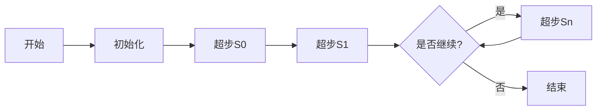

# Giraph原理与代码实例讲解

## 1. 背景介绍
在大数据时代，图数据的处理变得日益重要。社交网络、推荐系统、网络分析等领域都涉及到大规模图数据的处理。Apache Giraph是一个基于图的计算框架，它扩展了Google的Pregel计算模型，专为高效处理大规模图数据而设计。Giraph利用Hadoop的MapReduce框架，能够在成千上万的计算节点上进行分布式图计算，处理亿级别甚至更大规模的图数据。

## 2. 核心概念与联系
Giraph的核心概念围绕图的顶点、边以及消息传递。每个顶点都包含一个顶点ID、顶点值和边列表。计算过程中，顶点可以接收、发送消息，并根据消息更新自己的值。Giraph的执行流程遵循BSP（Bulk Synchronous Parallel）模型，即全局同步并行模型，它将计算过程分为一系列的超步（supersteps）。在每个超步中，顶点并行执行相同的用户定义函数，并在超步之间同步。



## 3. 核心算法原理具体操作步骤
Giraph的核心算法原理是基于Pregel模型的，操作步骤如下：
1. 加载图数据：Giraph从HDFS中加载图数据，初始化每个顶点和边。
2. 超步迭代：在每个超步中，顶点并行执行计算。
3. 消息传递：顶点处理接收到的消息，并基于这些消息更新状态。
4. 状态同步：在超步之间，系统同步所有顶点的状态。
5. 结果输出：当所有顶点投票停止计算时，算法结束，输出最终结果。

## 4. 数学模型和公式详细讲解举例说明
以PageRank算法为例，其数学模型可以表示为：
$$
PR(u) = \frac{1-d}{N} + d \sum_{v \in B_u} \frac{PR(v)}{L(v)}
$$
其中，$PR(u)$ 是顶点u的PageRank值，$d$ 是阻尼因子，通常设置为0.85，$N$ 是图中顶点的总数，$B_u$ 是指向顶点u的顶点集合，$L(v)$ 是顶点v的出链数量。

## 5. 项目实践：代码实例和详细解释说明
以下是一个Giraph实现PageRank算法的简单代码示例：

```java
public class SimplePageRankVertex extends BasicComputation<
    LongWritable, DoubleWritable, FloatWritable, DoubleWritable> {

  @Override
  public void compute(
      Vertex<LongWritable, DoubleWritable, FloatWritable> vertex,
      Iterable<DoubleWritable> messages) {
    if (getSuperstep() >= 1) {
      double sum = 0;
      for (DoubleWritable message : messages) {
        sum += message.get();
      }
      DoubleWritable vertexValue = new DoubleWritable((0.15f / getTotalNumVertices()) + 0.85f * sum);
      vertex.setValue(vertexValue);
    }

    if (getSuperstep() < 30) {
      long edges = vertex.getNumEdges();
      sendMessages(vertex.getEdges(), new DoubleWritable(vertex.getValue().get() / edges));
    } else {
      vertex.voteToHalt();
    }
  }
}
```

在这段代码中，`compute` 方法是每个顶点在每个超步中执行的核心函数。在第一个超步之后，顶点会计算基于接收到的消息的新PageRank值。如果超步数小于30，顶点会将其PageRank值除以出链数量，然后发送给其邻居顶点。

## 6. 实际应用场景
Giraph在社交网络分析、网络拓扑结构分析、生物信息学以及交通网络优化等领域有广泛的应用。例如，Facebook使用Giraph进行图数据分析，以改善其社交网络服务。

## 7. 工具和资源推荐
- Apache Giraph官方网站：提供Giraph的下载、文档和用户指南。
- Hadoop：Giraph基于Hadoop MapReduce，因此熟悉Hadoop生态对使用Giraph非常有帮助。
- Maven：用于构建和管理Giraph项目的依赖。

## 8. 总结：未来发展趋势与挑战
随着图数据规模的不断增长，Giraph需要不断优化其性能和扩展性。未来的发展趋势可能包括更高效的图分割算法、更好的容错机制以及对动态图数据的支持。挑战在于如何平衡计算资源的使用，提高算法的并行度和处理速度。

## 9. 附录：常见问题与解答
Q1: Giraph和Hadoop MapReduce的关系是什么？
A1: Giraph是建立在Hadoop MapReduce之上的图计算框架，它利用MapReduce进行资源管理和任务调度。

Q2: Giraph如何保证计算的正确性？
A2: Giraph通过BSP模型确保在每个超步中，所有顶点的计算都是基于上一个超步的稳定状态，从而保证了计算的正确性。

Q3: Giraph能处理动态变化的图数据吗？
A3: Giraph主要设计用于处理静态图，但也可以通过增量计算的方式处理动态变化的图数据。

作者：禅与计算机程序设计艺术 / Zen and the Art of Computer Programming