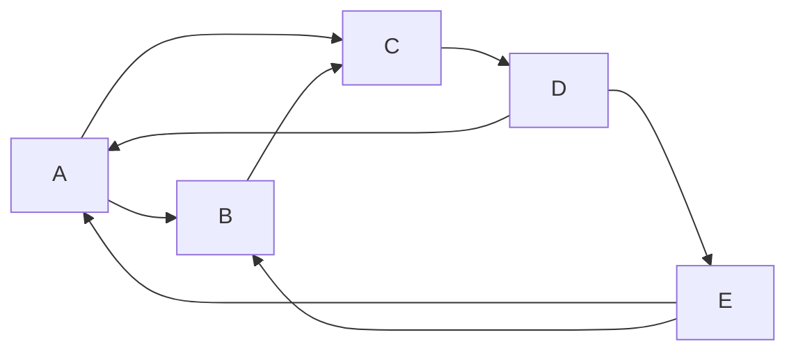

# GraphX原理与代码实例讲解

## 1.背景介绍

在大数据时代,数据规模呈指数级增长,处理海量数据已成为当前亟待解决的重大挑战之一。Apache Spark作为一种快速、通用的大规模数据处理引擎,凭借其优秀的内存计算性能、容错能力和易用性,成为分布式数据处理的首选方案。而GraphX作为Spark体系中的图计算框架,为高效处理图形结构数据提供了强大的支持。

图数据广泛应用于社交网络、Web图、交通网络、推荐系统等诸多领域。相比于传统的关系型数据库,图数据库能够更自然地表达实体之间的复杂关联关系,从而更好地解决许多挑战性问题。GraphX作为Spark生态中的核心组件,将图计算与Spark的分布式计算能力相结合,为图数据的存储、查询、分析和可视化提供了高效的解决方案。

## 2.核心概念与联系

在深入探讨GraphX的原理和实现之前,我们有必要先了解一些基本概念。

### 2.1 属性图(Property Graph)

属性图是GraphX所采用的数据模型,由一组顶点(Vertex)和边(Edge)组成。顶点和边均可携带任意类型的属性数据。形式上,属性图可表示为 $G = (V, E, \Phi_V, \Phi_E)$,其中:

- $V$ 表示顶点集合
- $E \subseteq V \times V$ 表示边集合
- $\Phi_V$ 为顶点属性函数,将顶点映射到其属性值
- $\Phi_E$ 为边属性函数,将边映射到其属性值

属性图能够自然地表达现实世界中的各种关系网络,是图计算的基础数据结构。

### 2.2 消息传递模型(Message Passing Model)

GraphX采用消息传递模型来实现图并行计算。在该模型中,每个顶点可以向相邻顶点发送消息,并根据收到的消息更新自身状态。该过程通过一系列的超步(Superstep)迭代完成,直至满足指定条件。消息传递模型具有以下优点:

1. **数据局部性**:每个顶点只需关注来自邻居的消息,避免了不必要的通信和计算开销。
2. **容错性**:顶点的计算状态可以根据收到的消息重建,从而实现容错。
3. **通用性**:该模型可以表达多种图算法,如PageRank、连通分量、最短路径等。

### 2.3 Pregel模型

GraphX的消息传递模型借鉴了Google的Pregel模型。Pregel模型将图计算过程抽象为一系列的超步,每个超步包含以下三个阶段:

1. **Gather**:顶点收集来自邻居的消息
2. **Sum**:顶点汇总收到的消息
3. **Apply**:顶点根据汇总后的消息更新自身状态,并向邻居发送新的消息

该模型保证了计算的并行性和容错性,GraphX在此基础上进行了优化和扩展。

### 2.4 RDD与DataFrame

GraphX是构建在Spark RDD(Resilient Distributed Dataset)之上的,因此能够充分利用RDD的分布式计算能力和容错机制。同时,GraphX也支持DataFrame API,用户可以方便地将图数据与结构化数据进行集成处理。

## 3.核心算法原理具体操作步骤

GraphX提供了一组经典的图算法实现,包括PageRank、连通分量、最短路径等。这些算法的核心思想都是基于消息传递模型,通过一系列超步迭代完成计算。下面我们以PageRank算法为例,详细介绍其原理和实现步骤。

### 3.1 PageRank算法原理

PageRank是一种用于衡量网页重要性的算法,它模拟了随机网络浏览者的行为。算法的基本思想是:一个网页越是被其他重要网页链接到,它的权重就越高。具体来说,PageRank算法包含以下几个关键步骤:

1. 初始化每个网页的PageRank值为 $\frac{1}{N}$,其中N为网页总数。
2. 在每个迭代中,每个网页将自身的PageRank值平均分配给所有出链接的网页。
3. 每个网页汇总从其他网页传递过来的PageRank值,并根据预设的阻尼系数进行调整。
4. 重复步骤2和3,直至PageRank值收敛。

PageRank算法的数学表达式如下:

$$PR(p_i) = (1-d) + d \sum_{p_j \in M(p_i)} \frac{PR(p_j)}{L(p_j)}$$

其中:

- $PR(p_i)$ 表示网页 $p_i$ 的PageRank值
- $M(p_i)$ 表示链接到 $p_i$ 的所有网页集合
- $L(p_j)$ 表示网页 $p_j$ 的出链接数量
- $d$ 为阻尼系数,通常取值0.85

### 3.2 GraphX实现PageRank

在GraphX中,PageRank算法的实现遵循消息传递模型,主要包括以下步骤:

1. **初始化**:为每个顶点(网页)分配初始的PageRank值,并将其作为顶点属性存储。

2. **消息传递**:
   - **Gather**:每个顶点收集来自入链接网页的PageRank值。
   - **Sum**:每个顶点汇总收到的PageRank值。
   - **Apply**:每个顶点根据公式计算新的PageRank值,并将其作为消息发送给出链接网页。

3. **迭代**:重复步骤2,直至PageRank值收敛或达到最大迭代次数。

4. **输出**:将最终的PageRank值与顶点ID对应起来,得到结果。

下面是GraphX实现PageRank算法的Scala代码示例:

```scala
import org.apache.spark.graphx._

val graph: Graph[Double, Double] = ... // 加载图数据

val resetProb = 0.15 // 重置概率
val errorTol = 0.0001 // 收敛阈值

// 初始化PageRank值
val initialPR = graph.mapVertices((vid, attr) => 1.0)

def sendMessageSum(
    triplet: EdgeTriplet[Double, Double]): Iterator[(VertexId, Double)] = {
  val srcAttr = if (triplet.srcAttr > 0) triplet.srcAttr else 1.0
  val dstAttr = if (triplet.dstAttr > 0) triplet.dstAttr else 1.0
  Iterator((triplet.dstId, dstAttr / (resetProb + triplet.srcAttr)))
}

def vertexProgram(
    vertexId: VertexId,
    attr: Double,
    msgSum: Double): Double =
  resetProb + (1 - resetProb) * msgSum

val prg = initialPR.pregel(Double.NegativeInfinity)(
  vertexProgram,
  sendMessage = sendMessageSum,
  maxIter = 20,
  activeDir = ActiveDirectionConsts.From)

val finalPR = prg.vertices
```

在上述代码中,我们首先初始化每个顶点的PageRank值为1.0。然后定义了`sendMessageSum`函数,用于计算每个顶点向邻居发送的消息值。`vertexProgram`函数则根据收到的消息和重置概率计算新的PageRank值。

最后,我们调用`pregel`算子启动PageRank迭代计算。`pregel`算子接受一个初始的图、一个顶点程序(`vertexProgram`)、一个消息发送函数(`sendMessageSum`)以及其他配置参数。迭代过程中,每个顶点根据`vertexProgram`更新自身状态,并通过`sendMessageSum`向邻居发送消息。迭代结束后,我们可以从最终的图中获取顶点的PageRank值。

通过上述示例,我们可以看到GraphX如何利用消息传递模型高效地实现经典的PageRank算法。同时,GraphX还提供了其他常用图算法的实现,如连通分量、最短路径等,用户可以根据需求进行灵活组合和扩展。

## 4.数学模型和公式详细讲解举例说明

在前面的章节中,我们已经介绍了PageRank算法的数学模型和公式。现在,我们将通过一个具体的例子,更深入地理解PageRank公式的含义和计算过程。

假设我们有一个由5个网页组成的小型网络,如下所示:



其中,每个节点代表一个网页,边表示网页之间的链接关系。我们的目标是计算每个网页的PageRank值。

首先,我们需要初始化每个网页的PageRank值为 $\frac{1}{N} = \frac{1}{5} = 0.2$。

接下来,我们开始迭代计算。在第一次迭代中:

1. 网页A收到来自D和E的PageRank值,共计 $0.2 + 0.2 = 0.4$。
2. 网页B收到来自A和E的PageRank值,共计 $0.2 + 0.2 = 0.4$。
3. 网页C收到来自A和B的PageRank值,共计 $0.2 + 0.2 = 0.4$。
4. 网页D收到来自C的PageRank值,共计 $0.2$。
5. 网页E收到来自D的PageRank值,共计 $0.2$。

然后,每个网页根据公式计算新的PageRank值:

$$PR(p_i) = (1-d) + d \sum_{p_j \in M(p_i)} \frac{PR(p_j)}{L(p_j)}$$

其中,我们取阻尼系数 $d = 0.85$。

- 网页A: $PR(A) = 0.15 + 0.85 \times \frac{0.4}{2} = 0.39$
- 网页B: $PR(B) = 0.15 + 0.85 \times \frac{0.4}{2} = 0.39$
- 网页C: $PR(C) = 0.15 + 0.85 \times \frac{0.4}{2} = 0.39$
- 网页D: $PR(D) = 0.15 + 0.85 \times \frac{0.2}{1} = 0.32$
- 网页E: $PR(E) = 0.15 + 0.85 \times \frac{0.2}{1} = 0.32$

我们可以看到,在第一次迭代后,每个网页的PageRank值已经发生了变化。接下来,我们将重复上述过程,直至PageRank值收敛或达到最大迭代次数。

通过这个示例,我们可以更好地理解PageRank公式的含义。公式中的第一项 $(1-d)$ 表示每个网页的基础重要性,而第二项则表示从其他网页传递过来的重要性贡献。网页的最终PageRank值是这两部分的加权和。

同时,我们也可以看到,PageRank算法的核心思想是模拟随机网络浏览者的行为。每个网页将自身的重要性平均分配给出链接的网页,而收到的重要性贡献则来自入链接的网页。通过不断迭代,PageRank值最终会收敛到一个稳定的状态,反映了网页在整个网络中的相对重要性。

## 5.项目实践:代码实例和详细解释说明

为了帮助读者更好地理解GraphX的使用方法,我们将通过一个实际的项目示例,演示如何加载图数据、执行图算法以及可视化结果。

### 5.1 项目概述

在本示例中,我们将分析一个社交网络数据集,目标是找出网络中的重要用户(影响力用户)。我们将使用GraphX实现经典的PageRank算法,并将结果与用户的粉丝数进行对比,验证PageRank算法的有效性。

### 5.2 数据准备

我们使用的是一个开源的Twitter社交网络数据集,包含了用户之间的关注关系。数据集的格式如下:

```
user1,user2
user3,user4
...
```

其中,每一行表示一条"user1关注user2"的关系。我们将把这些数据加载到GraphX中,构建一个有向图。

### 5.3 代码实现

下面是使用Scala语言实现的完整代码:

```scala
import org.apache.spark.graphx._
import org.apache.spark.rdd.RDD
import org.apache.spark.sql.SparkSession

object TwitterInfluencers {
  def main(args: Array[String]): Unit = {
    val spark = SparkSession.builder()
      .appName("TwitterInfluencers")
      .getOrCreate()

    // 加载数据
    val follows