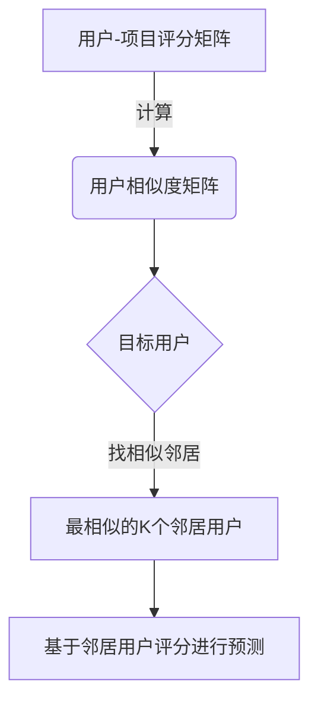
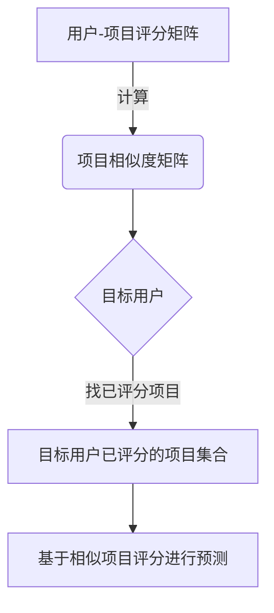

# Mahout推荐算法原理与代码实例讲解

## 1.背景介绍

### 1.1 推荐系统的重要性

在当今信息过载的时代,推荐系统已经成为帮助用户发现感兴趣的内容、产品或服务的重要工具。无论是电子商务网站推荐商品、视频网站推荐视频、新闻网站推荐新闻资讯,还是社交网络推荐好友,推荐系统都扮演着不可或缺的角色。一个好的推荐系统不仅能提升用户体验,还能为企业带来可观的经济收益。

### 1.2 推荐系统的挑战

然而,构建一个高质量的推荐系统并非易事。它需要解决诸多挑战,如海量数据的高效处理、稀疏数据问题、冷启动问题、上下文信息的融合等。此外,推荐系统还需要权衡多个目标,如个性化与多样性、新颖性与准确性之间的平衡。

### 1.3 Mahout介绍 

Apache Mahout是一个可扩展的机器学习库,旨在帮助开发人员构建可扩展的智能系统。作为Apache软件基金会的一个顶级项目,Mahout提供了多种常用的机器学习算法实现,涵盖协同过滤、聚类、分类、回归等领域。其中,Mahout的推荐引擎模块就是一个强大的工具,可用于构建高质量的推荐系统。

## 2.核心概念与联系

在深入探讨Mahout推荐算法之前,我们需要先了解一些核心概念。

### 2.1 用户-项目评分矩阵

推荐系统的核心数据结构是用户-项目评分矩阵(User-Item Rating Matrix)。它是一个二维矩阵,行表示用户,列表示项目,每个元素的值代表该用户对该项目的评分或喜好程度。该矩阵通常是高度稀疏的,因为大多数用户只对少数项目进行了评分。

```math
R = 
\begin{bmatrix}
5 & ? & 3 & 4\\
? & ? & ? & ?\\  
? & 1 & 2 & 3\\
5 & 5 & ? & ?
\end{bmatrix}
```

### 2.2 相似度计算

相似度计算是推荐系统的核心操作之一。我们需要计算用户之间的相似度(基于他们的评分模式),或者计算项目之间的相似度(基于被评分的模式)。常用的相似度度量包括余弦相似度、皮尔逊相关系数和调整余弦相似度等。

### 2.3 推荐技术

根据采用的技术不同,推荐系统可以分为以下几种类型:

1. **协同过滤(Collaborative Filtering)**: 利用用户-项目评分矩阵,通过计算相似用户或相似项目来预测目标用户对项目的喜好程度。
2. **基于内容(Content-based)**: 根据项目的内容特征(如文本、图像等)与用户的兴趣偏好进行匹配。
3. **基于知识(Knowledge-based)**: 利用领域知识和规则对用户进行推荐。
4. **混合推荐(Hybrid)**: 将上述多种技术相结合的方法。

Mahout主要实现了协同过滤和基于内容的推荐算法。

### 2.4 评估指标

为了评估推荐系统的质量,我们需要一些评估指标,如:

- **准确率(Accuracy)**: 推荐的项目与用户实际喜好的契合程度。
- **覆盖率(Coverage)**: 推荐系统能够为用户产生推荐的比例。
- **多样性(Diversity)**: 推荐结果的多样性程度。
- **新颖性(Novelty)**: 推荐结果的新鲜程度。

## 3.核心算法原理具体操作步骤

Mahout实现了多种推荐算法,本节将重点介绍其中的核心算法:基于用户的协同过滤算法和基于项目的协同过滤算法。

### 3.1 基于用户的协同过滤算法

基于用户的协同过滤算法的核心思想是:对于目标用户,找到与其有相似兴趣的一组邻居用户,然后根据这些邻居用户对项目的评分,预测目标用户对该项目的兴趣程度。算法步骤如下:

1. **计算用户相似度矩阵**: 基于用户-项目评分矩阵,计算所有用户对之间的相似度,常用的相似度计算方法有皮尔逊相关系数、余弦相似度等。
2. **找到最相似的邻居用户集合**: 对于目标用户,根据相似度矩阵找到与其最相似的 k 个邻居用户。
3. **基于邻居用户的评分进行预测**: 对于目标用户未评分的项目,基于其邻居用户对该项目的评分,结合相似度加权,预测目标用户对该项目的兴趣程度。

该算法的优点是简单直观,缺点是对于新用户或新项目可能无法给出准确的预测(冷启动问题)。



### 3.2 基于项目的协同过滤算法

基于项目的协同过滤算法的核心思想类似,不过它是基于项目相似度进行推荐。算法步骤如下:

1. **计算项目相似度矩阵**: 基于用户-项目评分矩阵的转置,计算所有项目对之间的相似度。
2. **对于目标用户,找到其已评分的项目**: 从用户-项目评分矩阵中获取目标用户已评分的项目集合。
3. **基于相似项目的评分进行预测**: 对于目标用户未评分的项目,基于其已评分的相似项目以及这些相似项目的评分,结合相似度加权,预测目标用户对该项目的兴趣程度。

该算法的优点是能较好地解决新用户问题,缺点是对于新项目可能无法给出准确预测。



### 3.3 算法优化

上述基本协同过滤算法还有一些需要优化的地方:

1. **数据稀疏性**: 评分矩阵通常非常稀疏,会影响相似度计算的准确性。可以采用基于项目相似度的平滑权重、基于有价值投票者的相似度计算等方法进行优化。

2. **冷启动问题**: 对于新用户或新项目,缺乏足够的历史数据,传统协同过滤算法可能无法给出好的推荐。可以通过结合其他信息(如用户/项目元数据)或采用混合推荐的方式来缓解。

3. **数据规模问题**: 对于大规模数据集,传统的内存算法可能无法高效运行。需要采用分布式计算框架(如Apache Spark)并行化算法。

4. **上下文信息的融入**: 除了用户和项目之外,还有许多其他上下文信息(如时间、地点、设备等)可以帮助改善推荐质量。如何将这些信息融入推荐模型是一个值得探索的方向。

## 4.数学模型和公式详细讲解举例说明

在推荐算法中,常用的相似度计算方法有余弦相似度和皮尔逊相关系数。

### 4.1 余弦相似度

余弦相似度衡量两个向量之间的夹角余弦值,常用于计算项目之间的相似度。对于两个项目 $i$ 和 $j$,它们的余弦相似度定义为:

$$\text{sim}(i,j) = \cos(\vec{i},\vec{j}) = \frac{\vec{i} \cdot \vec{j}}{\|\vec{i}\|\|\vec{j}\|} = \frac{\sum\limits_{u \in U} r_{ui}r_{uj}}{\sqrt{\sum\limits_{u \in U} r_{ui}^2}\sqrt{\sum\limits_{u \in U} r_{uj}^2}}$$

其中 $r_{ui}$ 表示用户 $u$ 对项目 $i$ 的评分, $U$ 表示所有用户的集合。

**举例**:
假设我们有三个用户 $\{A,B,C\}$ 对两个项目 $\{x,y\}$ 的评分如下:

$$
\begin{array}{c|cc}
    & x & y\\
\hline
A & 5 & 4\\
B & 3 & 1\\
C & 4 & 3
\end{array}
$$

我们可以计算项目 $x$ 和 $y$ 的余弦相似度:

$$\begin{aligned}
\vec{x} &= (5, 3, 4) \\
\vec{y} &= (4, 1, 3) \\
\text{sim}(x,y) &= \frac{5\times4 + 3\times1 + 4\times3}{\sqrt{5^2+3^2+4^2}\sqrt{4^2+1^2+3^2}} \\
&\approx 0.98
\end{aligned}$$

可以看出,项目 $x$ 和 $y$ 的评分模式非常相似,余弦相似度接近 1。

### 4.2 皮尔逊相关系数

皮尔逊相关系数常用于计算用户之间的相似度。对于两个用户 $u$ 和 $v$,它们的皮尔逊相关系数定义为:

$$\text{sim}(u,v) = \frac{\sum\limits_{i \in I}(r_{ui} - \overline{r_u})(r_{vi} - \overline{r_v})}{\sqrt{\sum\limits_{i \in I}(r_{ui} - \overline{r_u})^2}\sqrt{\sum\limits_{i \in I}(r_{vi} - \overline{r_v})^2}}$$

其中 $r_{ui}$ 表示用户 $u$ 对项目 $i$ 的评分, $\overline{r_u}$ 表示用户 $u$ 的平均评分, $I$ 表示两个用户都评分过的项目集合。

**举例**:
假设我们有三个用户 $\{A,B,C\}$ 对四个项目 $\{x,y,z,w\}$ 的评分如下:

$$
\begin{array}{c|cccc}
    & x & y & z & w\\
\hline
A & 5 & 3 & 4 & 4\\
B & 3 & 1 & 5 & 4\\
C & 4 & 3 & 3 & 2
\end{array}
$$

我们可以计算用户 $A$ 和 $B$ 的皮尔逊相关系数:

$$\begin{aligned}
\overline{r_A} &= \frac{5+3+4+4}{4} = 4\\
\overline{r_B} &= \frac{3+1+5+4}{4} = 3.25\\
\sum(r_{Ai} - \overline{r_A})(r_{Bi} - \overline{r_B}) &= (5-4)(3-3.25) + (3-4)(1-3.25) + (4-4)(5-3.25) + (4-4)(4-3.25)\\
&= 1 \times (-0.25) + (-1) \times (-2.25) + 0 \times 1.75 + 0 \times 0.75\\
&= -0.25 + 2.25 = 2\\
\sum(r_{Ai} - \overline{r_A})^2 &= (5-4)^2 + (3-4)^2 + (4-4)^2 + (4-4)^2 = 1 + 1 + 0 + 0 = 2\\
\sum(r_{Bi} - \overline{r_B})^2 &= (3-3.25)^2 + (1-3.25)^2 + (5-3.25)^2 + (4-3.25)^2 = 0.0625 + 4.0625 + 3.0625 + 0.5625 = 7.75\\
\text{sim}(A,B) &= \frac{2}{\sqrt{2}\sqrt{7.75}} \approx 0.51
\end{aligned}$$

可以看出,用户 $A$ 和 $B$ 的评分模式存在一定相关性,皮尔逊相关系数约为 0.51。

通过上述公式和举例,我们对相似度计算有了更深入的理解。在实际应用中,我们还需要考