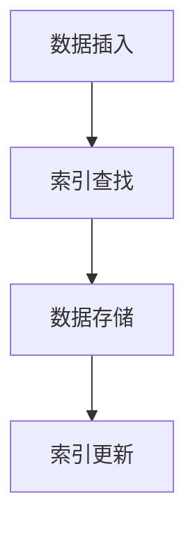
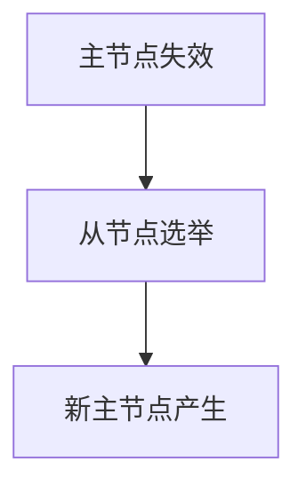

# MongoDB原理与代码实例讲解

## 1.背景介绍

MongoDB是一种基于分布式文件存储的NoSQL数据库，由C++语言编写。它旨在为现代应用提供高性能、高可用性和自动扩展性。与传统的关系型数据库不同，MongoDB采用了文档存储的方式，使得数据的存储和查询更加灵活和高效。本文将深入探讨MongoDB的核心概念、算法原理、数学模型，并通过代码实例和实际应用场景来帮助读者更好地理解和使用MongoDB。

## 2.核心概念与联系

### 2.1 文档与集合

在MongoDB中，数据以文档的形式存储。文档是一个键值对的集合，类似于JSON对象。多个文档组成一个集合，类似于关系型数据库中的表。

### 2.2 数据模型

MongoDB采用灵活的文档数据模型，支持嵌套文档和数组。这使得数据结构可以根据应用需求进行调整，而不需要预定义模式。

### 2.3 索引

MongoDB支持多种索引类型，包括单字段索引、复合索引、地理空间索引等。索引的使用可以显著提高查询性能。

### 2.4 分片

为了实现水平扩展，MongoDB支持分片。分片是将数据分布到多个服务器上的一种技术，使得数据库可以处理更大的数据量和更高的吞吐量。

### 2.5 复制集

复制集是MongoDB实现高可用性的一种机制。一个复制集包含多个节点，其中一个是主节点，其他是从节点。主节点负责处理写操作，从节点负责复制数据并提供读操作。

## 3.核心算法原理具体操作步骤

### 3.1 数据存储与检索

MongoDB的数据存储和检索基于BSON（Binary JSON）格式。BSON是一种二进制表示形式，支持丰富的数据类型和高效的编码解码。

### 3.2 索引创建与维护

索引的创建和维护是MongoDB性能优化的关键。MongoDB使用B树结构来实现索引，支持快速的插入、删除和查找操作。



### 3.3 分片策略

MongoDB支持多种分片策略，包括基于哈希的分片和基于范围的分片。分片键的选择对系统性能和数据分布有重要影响。

### 3.4 复制集选举

复制集中的主节点通过选举机制产生。当主节点失效时，从节点会进行选举，选出新的主节点。选举过程基于Raft算法，保证系统的一致性和可用性。



## 4.数学模型和公式详细讲解举例说明

### 4.1 数据分布模型

MongoDB的数据分布可以用数学模型来描述。假设有 $N$ 个分片，每个分片存储的数据量为 $D_i$，则总数据量 $D$ 为：

$$
D = \sum_{i=1}^{N} D_i
$$

### 4.2 索引性能分析

索引的性能可以通过时间复杂度来分析。假设有 $n$ 个文档，B树索引的查找、插入和删除操作的时间复杂度均为 $O(\log n)$。

### 4.3 复制集一致性模型

复制集的一致性可以通过CAP定理来分析。CAP定理指出，一个分布式系统在一致性（Consistency）、可用性（Availability）和分区容忍性（Partition Tolerance）之间只能同时满足两个。MongoDB通过复制集机制在一致性和可用性之间做出权衡。

## 5.项目实践：代码实例和详细解释说明

### 5.1 环境搭建

首先，确保已经安装了MongoDB。可以通过以下命令启动MongoDB服务：

```bash
mongod --dbpath /path/to/your/db
```

### 5.2 数据插入

以下是一个简单的Python代码示例，展示如何使用PyMongo库插入数据：

```python
from pymongo import MongoClient

client = MongoClient('localhost', 27017)
db = client['test_db']
collection = db['test_collection']

document = {
    "name": "Alice",
    "age": 30,
    "address": {
        "street": "123 Main St",
        "city": "New York"
    }
}

collection.insert_one(document)
```

### 5.3 数据查询

以下代码展示了如何查询数据：

```python
result = collection.find_one({"name": "Alice"})
print(result)
```

### 5.4 创建索引

以下代码展示了如何创建索引：

```python
collection.create_index([("name", 1)])
```

### 5.5 分片配置

以下是分片配置的示例：

```bash
sh.addShard("shard1/localhost:27018")
sh.addShard("shard2/localhost:27019")
sh.enableSharding("test_db")
sh.shardCollection("test_db.test_collection", {"name": 1})
```

## 6.实际应用场景

### 6.1 电商平台

MongoDB在电商平台中广泛应用，特别是商品信息、用户数据和订单管理等场景。其灵活的数据模型和高性能的查询能力使得电商平台能够快速响应用户请求。

### 6.2 社交网络

在社交网络中，用户数据和关系数据的存储和查询是关键。MongoDB的文档模型和嵌套文档支持使得社交网络的数据存储更加高效。

### 6.3 物联网

物联网设备生成大量的传感器数据，这些数据需要高效的存储和实时分析。MongoDB的分片和复制集机制可以满足物联网应用的高吞吐量和高可用性需求。

## 7.工具和资源推荐

### 7.1 开发工具

- **MongoDB Compass**：官方的MongoDB图形化管理工具，支持数据浏览、查询和索引管理。
- **Robo 3T**：轻量级的MongoDB管理工具，支持多种操作系统。

### 7.2 学习资源

- **MongoDB官方文档**：详细的API文档和使用指南。
- **MongoDB University**：提供免费的在线课程，涵盖基础到高级的MongoDB知识。

## 8.总结：未来发展趋势与挑战

MongoDB作为一种现代的NoSQL数据库，已经在多个领域得到了广泛应用。未来，随着大数据和云计算的发展，MongoDB在分布式存储和实时分析方面将面临更多的挑战和机遇。如何进一步优化性能、提高可用性和扩展性，将是MongoDB未来发展的重要方向。

## 9.附录：常见问题与解答

### 9.1 如何选择分片键？

选择分片键时，需要考虑数据的访问模式和分布情况。理想的分片键应该能够均匀分布数据，避免热点问题。

### 9.2 如何处理复制集中的网络分区？

在复制集中，网络分区可能导致主节点失效。可以通过配置仲裁节点和调整选举超时时间来提高系统的容错能力。

### 9.3 如何优化查询性能？

优化查询性能的方法包括创建合适的索引、使用投影减少返回字段、避免使用$regex$等高成本操作。

---

作者：禅与计算机程序设计艺术 / Zen and the Art of Computer Programming