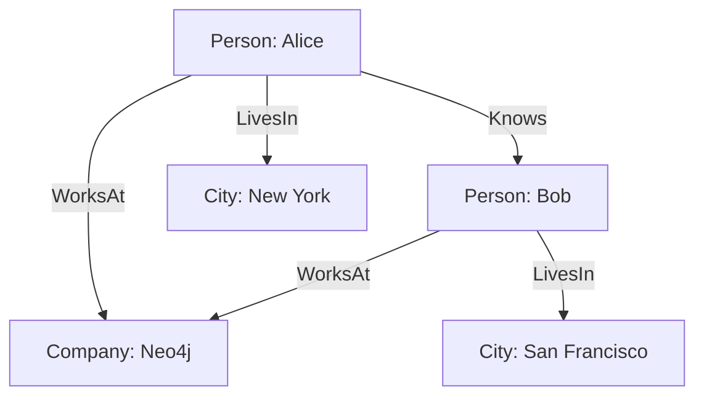

# Neo4j原理与代码实例讲解

## 1.背景介绍

在当今数据驱动的世界中，图数据库因其独特的优势而逐渐受到关注。与传统的关系型数据库不同，图数据库能够更高效地处理复杂的关系和连接。Neo4j作为图数据库领域的佼佼者，凭借其高性能和灵活性，成为了许多企业和开发者的首选。

Neo4j是一种基于图理论的数据库管理系统，专门用于存储和查询高度互联的数据。它使用节点、关系和属性来表示和存储数据，这使得它在处理社交网络、推荐系统、网络安全等领域表现出色。

## 2.核心概念与联系

在深入探讨Neo4j之前，我们需要了解一些基本概念：

### 2.1 节点（Node）

节点是图数据库中的基本单位，类似于关系型数据库中的行。每个节点可以有多个属性，用于存储具体的数据。

### 2.2 关系（Relationship）

关系是连接两个节点的边，表示节点之间的关联。关系也可以有属性，用于存储关系的具体信息。

### 2.3 属性（Property）

属性是节点和关系的键值对，用于存储具体的数据。例如，一个节点可以有名称、年龄等属性。

### 2.4 标签（Label）

标签用于对节点进行分类，一个节点可以有一个或多个标签。例如，一个节点可以同时有“Person”和“Employee”两个标签。

### 2.5 图（Graph）

图是由节点和关系组成的结构，用于表示数据和数据之间的关系。

以下是一个简单的Mermaid图示例，展示了节点、关系和属性之间的联系：



## 3.核心算法原理具体操作步骤

Neo4j的核心算法主要集中在图遍历和路径查找上。以下是一些关键算法及其操作步骤：

### 3.1 深度优先搜索（DFS）

深度优先搜索是一种遍历图的算法，从起始节点开始，沿着每一个分支尽可能深入地搜索，直到找到目标节点或遍历完所有节点。

#### 操作步骤：

1. 从起始节点开始，将其标记为已访问。
2. 选择一个未访问的相邻节点，递归地进行深度优先搜索。
3. 如果所有相邻节点都已访问，回溯到上一个节点，继续搜索。

### 3.2 广度优先搜索（BFS）

广度优先搜索是一种遍历图的算法，从起始节点开始，逐层向外扩展，直到找到目标节点或遍历完所有节点。

#### 操作步骤：

1. 从起始节点开始，将其标记为已访问，并加入队列。
2. 从队列中取出一个节点，访问其所有未访问的相邻节点，并将这些节点加入队列。
3. 重复步骤2，直到队列为空或找到目标节点。

### 3.3 最短路径算法

最短路径算法用于查找两个节点之间的最短路径。Dijkstra算法是其中一种常用的最短路径算法。

#### 操作步骤：

1. 初始化起始节点的距离为0，其他节点的距离为无穷大。
2. 将起始节点加入优先队列。
3. 从优先队列中取出距离最小的节点，更新其相邻节点的距离。
4. 重复步骤3，直到找到目标节点或优先队列为空。

## 4.数学模型和公式详细讲解举例说明

图数据库的数学模型基于图理论。图 $G$ 由一组节点 $V$ 和一组边 $E$ 组成，记为 $G = (V, E)$。每个节点 $v \in V$ 可以有多个属性，每个边 $e \in E$ 连接两个节点，并可以有属性。

### 4.1 节点和边的表示

节点 $v$ 可以表示为一个属性集合：

$$
v = \{(key_1, value_1), (key_2, value_2), \ldots, (key_n, value_n)\}
$$

边 $e$ 可以表示为一个三元组：

$$
e = (v_i, v_j, \{(key_1, value_1), (key_2, value_2), \ldots, (key_m, value_m)\})
$$

### 4.2 路径和距离

路径 $P$ 是一组有序的节点和边的集合，表示从起始节点到目标节点的连接：

$$
P = \{v_1, e_1, v_2, e_2, \ldots, v_k\}
$$

路径的距离可以通过累加路径上所有边的权重来计算：

$$
d(P) = \sum_{i=1}^{k-1} w(e_i)
$$

其中，$w(e_i)$ 表示边 $e_i$ 的权重。

### 4.3 最短路径

最短路径问题可以表示为在图 $G$ 中找到从起始节点 $v_s$ 到目标节点 $v_t$ 的路径 $P$，使得路径的距离 $d(P)$ 最小。

$$
P_{min} = \arg\min_{P} d(P)
$$

## 5.项目实践：代码实例和详细解释说明

在这一部分，我们将通过一个具体的代码实例来展示如何使用Neo4j进行图数据的存储和查询。

### 5.1 环境准备

首先，我们需要安装Neo4j数据库和Neo4j的Python驱动程序`neo4j`。可以使用以下命令进行安装：

```bash
pip install neo4j
```

### 5.2 连接数据库

接下来，我们需要连接到Neo4j数据库。以下是一个简单的连接示例：

```python
from neo4j import GraphDatabase

uri = "bolt://localhost:7687"
username = "neo4j"
password = "password"

driver = GraphDatabase.driver(uri, auth=(username, password))

def close_driver():
    driver.close()
```

### 5.3 创建节点和关系

我们将创建一些节点和关系来构建一个简单的图：

```python
def create_graph(tx):
    tx.run("CREATE (a:Person {name: 'Alice', age: 30})")
    tx.run("CREATE (b:Person {name: 'Bob', age: 25})")
    tx.run("CREATE (c:Company {name: 'Neo4j'})")
    tx.run("CREATE (a)-[:KNOWS]->(b)")
    tx.run("CREATE (a)-[:WORKS_AT]->(c)")
    tx.run("CREATE (b)-[:WORKS_AT]->(c)")

with driver.session() as session:
    session.write_transaction(create_graph)
```

### 5.4 查询数据

我们可以使用Cypher查询语言来查询图中的数据。以下是一个简单的查询示例：

```python
def find_person(tx, name):
    result = tx.run("MATCH (p:Person {name: $name}) RETURN p", name=name)
    return result.single()[0]

with driver.session() as session:
    person = session.read_transaction(find_person, "Alice")
    print(person)
```

### 5.5 更新和删除数据

我们还可以更新和删除图中的数据。以下是一些示例：

```python
def update_person_age(tx, name, age):
    tx.run("MATCH (p:Person {name: $name}) SET p.age = $age", name=name, age=age)

def delete_person(tx, name):
    tx.run("MATCH (p:Person {name: $name}) DETACH DELETE p", name=name)

with driver.session() as session:
    session.write_transaction(update_person_age, "Alice", 35)
    session.write_transaction(delete_person, "Bob")
```

## 6.实际应用场景

Neo4j在许多实际应用场景中表现出色，以下是一些典型的应用场景：

### 6.1 社交网络

在社交网络中，用户之间的关系非常复杂，Neo4j能够高效地存储和查询这些关系。例如，查找用户的朋友、朋友的朋友等。

### 6.2 推荐系统

推荐系统需要处理大量的用户和物品之间的关系，Neo4j能够快速地查找和推荐相关的物品。例如，基于用户的购买历史推荐相似的商品。

### 6.3 网络安全

在网络安全中，Neo4j可以用于检测和分析网络中的威胁和攻击。例如，查找网络中的异常行为和潜在的攻击路径。

### 6.4 知识图谱

知识图谱用于表示和存储知识和知识之间的关系，Neo4j能够高效地存储和查询这些知识。例如，查找某个概念的相关知识和关系。

## 7.工具和资源推荐

在使用Neo4j时，有一些工具和资源可以帮助我们更高效地进行开发和管理：

### 7.1 Neo4j Desktop

Neo4j Desktop是一个图形化的管理工具，提供了一个直观的界面来管理和查询Neo4j数据库。

### 7.2 Neo4j Browser

Neo4j Browser是一个Web界面工具，允许我们使用Cypher查询语言来查询和可视化图数据。

### 7.3 Neo4j Aura

Neo4j Aura是Neo4j的云服务，提供了一个托管的Neo4j数据库，简化了部署和管理。

### 7.4 官方文档和社区

Neo4j的官方文档和社区提供了丰富的资源和支持，帮助我们解决问题和提升技能。

## 8.总结：未来发展趋势与挑战

随着数据量的不断增长和关系的日益复杂，图数据库的需求将会越来越大。Neo4j作为图数据库的领导者，将在未来继续发挥重要作用。然而，图数据库也面临一些挑战，例如：

### 8.1 性能优化

随着数据量的增加，如何保持高性能是一个重要的挑战。Neo4j需要不断优化其存储和查询算法，以应对大规模数据的需求。

### 8.2 数据一致性

在分布式环境中，如何保证数据的一致性和可靠性是一个重要的问题。Neo4j需要提供更强大的分布式支持和数据一致性保证。

### 8.3 安全性

随着数据隐私和安全问题的日益重要，Neo4j需要提供更强大的安全机制，保护数据的安全和隐私。

## 9.附录：常见问题与解答

### 9.1 如何安装Neo4j？

可以从Neo4j的官方网站下载Neo4j的安装包，并按照安装指南进行安装。也可以使用Docker来快速部署Neo4j。

### 9.2 如何连接Neo4j数据库？

可以使用Neo4j提供的驱动程序（如Python的`neo4j`库）来连接Neo4j数据库。需要提供数据库的URI、用户名和密码。

### 9.3 如何使用Cypher查询语言？

Cypher是Neo4j的查询语言，可以用于创建、查询、更新和删除图数据。可以参考Neo4j的官方文档学习Cypher的语法和用法。

### 9.4 如何优化Neo4j的性能？

可以通过索引、缓存和查询优化等方法来提升Neo4j的性能。需要根据具体的应用场景进行优化。

### 9.5 如何保证数据的一致性？

可以使用Neo4j提供的事务机制来保证数据的一致性。在分布式环境中，可以使用Neo4j的分布式功能来保证数据的一致性。

---

作者：禅与计算机程序设计艺术 / Zen and the Art of Computer Programming