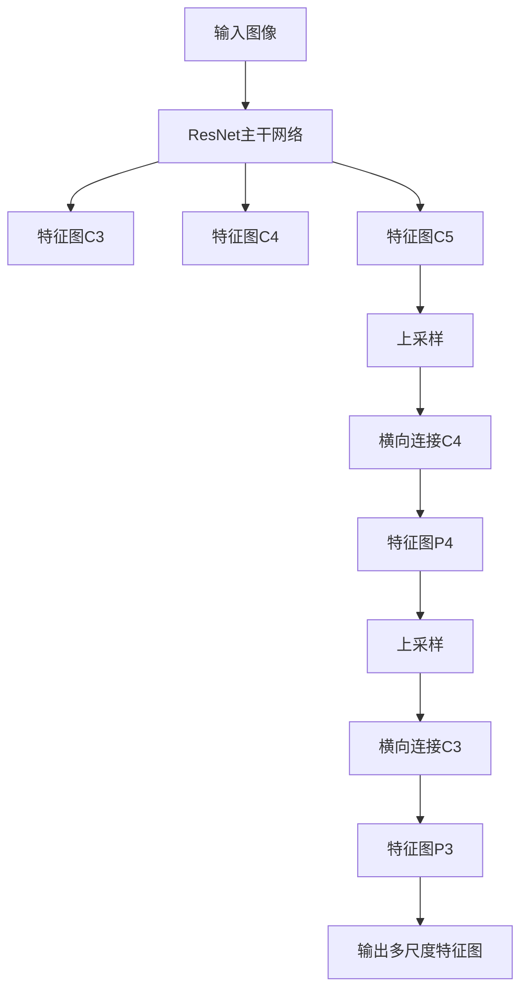

# RetinaNet原理与代码实例讲解

## 1.背景介绍

在计算机视觉领域，目标检测一直是一个重要且具有挑战性的任务。传统的目标检测方法，如R-CNN、Fast R-CNN和Faster R-CNN，虽然在准确性上取得了显著进展，但在速度和效率上仍存在瓶颈。为了解决这些问题，Facebook AI Research (FAIR) 团队提出了RetinaNet，这是一种基于单阶段检测器的目标检测算法，兼具高效性和高准确性。

RetinaNet的核心创新在于引入了Focal Loss，这种损失函数能够有效地处理类别不平衡问题，从而提升检测性能。本文将详细介绍RetinaNet的核心概念、算法原理、数学模型、代码实例以及实际应用场景，帮助读者深入理解这一先进的目标检测技术。

## 2.核心概念与联系

### 2.1 单阶段检测器与双阶段检测器

目标检测算法可以分为单阶段检测器和双阶段检测器。双阶段检测器（如Faster R-CNN）首先生成候选区域，然后在这些区域上进行分类和回归。单阶段检测器（如YOLO、SSD和RetinaNet）则直接在图像上进行分类和回归，具有更高的检测速度。

### 2.2 Focal Loss

Focal Loss是RetinaNet的核心创新之一。传统的交叉熵损失在处理类别不平衡问题时效果不佳，而Focal Loss通过引入一个调节因子，使得模型更加关注难以分类的样本，从而提升检测性能。

### 2.3 特征金字塔网络 (FPN)

RetinaNet采用了特征金字塔网络（FPN）来处理不同尺度的目标。FPN通过自顶向下和横向连接的方式，生成多尺度的特征图，从而提高了检测的准确性。

## 3.核心算法原理具体操作步骤

### 3.1 特征提取

RetinaNet使用ResNet作为主干网络，通过FPN生成多尺度的特征图。这些特征图用于后续的分类和回归任务。

### 3.2 分类和回归

在每个特征图上，RetinaNet使用两个子网络分别进行分类和回归。分类子网络用于预测每个锚框的类别概率，回归子网络用于预测每个锚框的边界框偏移量。

### 3.3 损失函数

RetinaNet的损失函数由分类损失和回归损失组成。分类损失采用Focal Loss，回归损失采用平滑L1损失。总损失函数可以表示为：

$$
L = \frac{1}{N} \sum_{i} L_{cls}(p_i, p_i^*) + \lambda \frac{1}{N} \sum_{i} L_{reg}(t_i, t_i^*)
$$

其中，$L_{cls}$ 是分类损失，$L_{reg}$ 是回归损失，$p_i$ 和 $p_i^*$ 分别是预测的类别概率和真实类别，$t_i$ 和 $t_i^*$ 分别是预测的边界框偏移量和真实偏移量，$\lambda$ 是平衡因子。

### 3.4 训练与推理

在训练过程中，RetinaNet通过反向传播算法优化损失函数。在推理过程中，模型对输入图像进行前向传播，生成预测的类别概率和边界框偏移量，最终通过非极大值抑制（NMS）得到最终的检测结果。

## 4.数学模型和公式详细讲解举例说明

### 4.1 Focal Loss 公式

Focal Loss 的公式如下：

$$
FL(p_t) = -\alpha_t (1 - p_t)^\gamma \log(p_t)
$$

其中，$p_t$ 是预测的类别概率，$\alpha_t$ 是平衡因子，$\gamma$ 是调节因子。通过调整 $\alpha_t$ 和 $\gamma$ 的值，可以控制模型对难以分类样本的关注程度。

### 4.2 平滑L1损失

平滑L1损失用于回归任务，其公式如下：

$$
L_{reg}(t_i, t_i^*) = \sum_{j \in \{x, y, w, h\}} smooth_{L1}(t_i^j - t_i^{*j})
$$

其中，$smooth_{L1}$ 函数定义为：

$$
smooth_{L1}(x) = 
\begin{cases} 
0.5x^2 & \text{if } |x| < 1 \\
|x| - 0.5 & \text{otherwise}
\end{cases}
$$

### 4.3 特征金字塔网络

特征金字塔网络通过自顶向下和横向连接的方式生成多尺度特征图。其结构可以用Mermaid流程图表示如下：



## 5.项目实践：代码实例和详细解释说明

### 5.1 环境配置

首先，确保你的环境中安装了必要的库，如TensorFlow或PyTorch。以下是使用PyTorch的示例：

```bash
pip install torch torchvision
```

### 5.2 数据准备

使用COCO数据集进行训练和评估。下载并解压数据集：

```bash
wget http://images.cocodataset.org/zips/train2017.zip
wget http://images.cocodataset.org/zips/val2017.zip
wget http://images.cocodataset.org/annotations/annotations_trainval2017.zip
unzip train2017.zip
unzip val2017.zip
unzip annotations_trainval2017.zip
```

### 5.3 模型定义

定义RetinaNet模型，包括主干网络、FPN、分类子网络和回归子网络：

```python
import torch
import torch.nn as nn
import torchvision.models as models

class RetinaNet(nn.Module):
    def __init__(self, num_classes):
        super(RetinaNet, self).__init__()
        self.backbone = models.resnet50(pretrained=True)
        self.fpn = FPN()
        self.classification_head = ClassificationHead(num_classes)
        self.regression_head = RegressionHead()

    def forward(self, x):
        features = self.backbone(x)
        features = self.fpn(features)
        cls_logits = self.classification_head(features)
        bbox_reg = self.regression_head(features)
        return cls_logits, bbox_reg

class FPN(nn.Module):
    def __init__(self):
        super(FPN, self).__init__()
        # 定义FPN层

    def forward(self, x):
        # 实现FPN前向传播
        pass

class ClassificationHead(nn.Module):
    def __init__(self, num_classes):
        super(ClassificationHead, self).__init__()
        # 定义分类子网络层

    def forward(self, x):
        # 实现分类子网络前向传播
        pass

class RegressionHead(nn.Module):
    def __init__(self):
        super(RegressionHead, self).__init__()
        # 定义回归子网络层

    def forward(self, x):
        # 实现回归子网络前向传播
        pass
```

### 5.4 损失函数定义

定义Focal Loss和平滑L1损失：

```python
class FocalLoss(nn.Module):
    def __init__(self, alpha=0.25, gamma=2.0):
        super(FocalLoss, self).__init__()
        self.alpha = alpha
        self.gamma = gamma

    def forward(self, inputs, targets):
        BCE_loss = nn.BCEWithLogitsLoss(reduction='none')(inputs, targets)
        pt = torch.exp(-BCE_loss)
        F_loss = self.alpha * (1-pt)**self.gamma * BCE_loss
        return F_loss.mean()

class SmoothL1Loss(nn.Module):
    def __init__(self):
        super(SmoothL1Loss, self).__init__()

    def forward(self, inputs, targets):
        loss = nn.SmoothL1Loss(reduction='none')(inputs, targets)
        return loss.mean()
```

### 5.5 训练与评估

定义训练和评估函数：

```python
def train(model, dataloader, optimizer, criterion_cls, criterion_reg, device):
    model.train()
    for images, targets in dataloader:
        images = images.to(device)
        targets = [target.to(device) for target in targets]

        optimizer.zero_grad()
        cls_logits, bbox_reg = model(images)
        loss_cls = criterion_cls(cls_logits, targets)
        loss_reg = criterion_reg(bbox_reg, targets)
        loss = loss_cls + loss_reg
        loss.backward()
        optimizer.step()

def evaluate(model, dataloader, device):
    model.eval()
    with torch.no_grad():
        for images, targets in dataloader:
            images = images.to(device)
            targets = [target.to(device) for target in targets]
            cls_logits, bbox_reg = model(images)
            # 计算评估指标
```

### 5.6 代码运行

运行训练和评估代码：

```python
import torch.optim as optim

device = torch.device('cuda' if torch.cuda.is_available() else 'cpu')
model = RetinaNet(num_classes=80).to(device)
optimizer = optim.Adam(model.parameters(), lr=1e-4)
criterion_cls = FocalLoss()
criterion_reg = SmoothL1Loss()

# 假设dataloader已经定义
train(model, dataloader, optimizer, criterion_cls, criterion_reg, device)
evaluate(model, dataloader, device)
```

## 6.实际应用场景

RetinaNet在多个实际应用场景中表现出色，包括但不限于：

### 6.1 自动驾驶

在自动驾驶领域，目标检测是关键技术之一。RetinaNet可以用于检测道路上的车辆、行人、交通标志等目标，帮助自动驾驶系统做出正确的决策。

### 6.2 安防监控

在安防监控系统中，RetinaNet可以用于实时检测和识别监控视频中的可疑行为和目标，提高安全性和响应速度。

### 6.3 医学影像分析

在医学影像分析中，RetinaNet可以用于检测和识别医学图像中的病变区域，如肿瘤、病灶等，辅助医生进行诊断和治疗。

## 7.工具和资源推荐

### 7.1 开源框架

- [Detectron2](https://github.com/facebookresearch/detectron2): Facebook AI Research 开发的目标检测开源框架，支持RetinaNet。
- [mmdetection](https://github.com/open-mmlab/mmdetection): OpenMMLab 开发的目标检测开源框架，支持多种目标检测算法，包括RetinaNet。

### 7.2 数据集

- [COCO](http://cocodataset.org/): 常用的目标检测数据集，包含丰富的图像和标注信息。
- [PASCAL VOC](http://host.robots.ox.ac.uk/pascal/VOC/): 经典的目标检测数据集，广泛用于目标检测算法的评估。

### 7.3 学习资源

- [RetinaNet论文](https://arxiv.org/abs/1708.02002): 详细介绍了RetinaNet的原理和实现。
- [深度学习课程](https://www.coursera.org/learn/deep-learning): 提供全面的深度学习知识，包括目标检测技术。

## 8.总结：未来发展趋势与挑战

RetinaNet作为一种高效且准确的目标检测算法，在多个领域展现了其强大的应用潜力。然而，随着技术的发展，目标检测领域仍面临一些挑战和机遇：

### 8.1 处理更复杂的场景

未来的目标检测算法需要能够处理更加复杂和多样化的场景，如遮挡、光照变化和背景干扰等。

### 8.2 提高实时性

在实际应用中，目标检测算法需要具备更高的实时性，以满足自动驾驶、安防监控等领域的需求。

### 8.3 融合多模态数据

未来的目标检测算法可以尝试融合多模态数据，如图像、视频、激光雷达等，以提高检测的准确性和鲁棒性。

## 9.附录：常见问题与解答

### 9.1 RetinaNet与Faster R-CNN相比有哪些优势？

RetinaNet作为单阶段检测器，具有更高的检测速度，同时通过Focal Loss解决了类别不平衡问题，提升了检测准确性。

### 9.2 如何选择Focal Loss的参数？

Focal Loss的参数 $\alpha$ 和 $\gamma$ 可以通过实验进行调优。一般来说，$\alpha$ 取0.25，$\gamma$ 取2.0 是一个较好的选择。

### 9.3 RetinaNet是否适用于小目标检测？

RetinaNet通过FPN生成多尺度特征图，能够较好地处理不同尺度的目标，包括小目标。

### 9.4 如何提高RetinaNet的检测性能？

可以尝试使用更深的主干网络（如ResNet-101），或者结合其他先进的技术（如注意力机制）来提高RetinaNet的检测性能。

### 9.5 RetinaNet在实际应用中有哪些限制？

RetinaNet在处理复杂场景和实时性方面仍存在一定的挑战，需要结合具体应用场景进行优化和改进。

---

作者：禅与计算机程序设计艺术 / Zen and the Art of Computer Programming