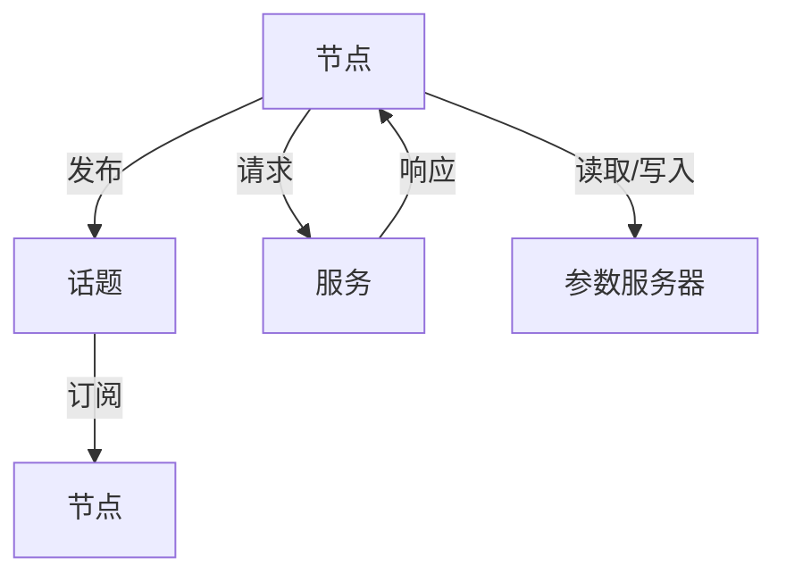

# Robot Operating System (ROS) 原理与代码实战案例讲解

## 1.背景介绍

### 1.1 什么是ROS

Robot Operating System (ROS) 是一个用于机器人软件开发的开源框架。它提供了一系列工具、库和约定，旨在简化机器人应用程序的创建。ROS不仅仅是一个操作系统，它更像是一个中间件，提供了消息传递、包管理、设备驱动等功能。

### 1.2 ROS的历史与发展

ROS最初由Willow Garage开发，现已成为全球机器人研究和开发的标准。自2007年发布以来，ROS已经经历了多个版本的迭代，最新的ROS 2版本引入了更多的实时性和安全性特性。

### 1.3 ROS的应用领域

ROS广泛应用于学术研究、工业自动化、无人驾驶、服务机器人等多个领域。其模块化设计和丰富的社区资源使其成为机器人开发者的首选。

## 2.核心概念与联系

### 2.1 节点（Node）

节点是ROS系统中的基本执行单元。每个节点是一个独立的进程，负责特定的任务。节点之间通过消息进行通信。

### 2.2 话题（Topic）

话题是节点之间进行异步通信的机制。一个节点可以发布消息到一个话题，另一个节点可以订阅这个话题以接收消息。

### 2.3 服务（Service）

服务提供了节点之间同步通信的机制。一个节点可以请求另一个节点执行某个任务，并等待其返回结果。

### 2.4 参数服务器（Parameter Server）

参数服务器是一个全局存储，用于存储参数。节点可以从参数服务器读取或写入参数。

### 2.5 消息（Message）

消息是节点之间传递的数据结构。ROS定义了一系列标准消息类型，开发者也可以自定义消息类型。

### 2.6 包（Package）

包是ROS软件的基本单元。一个包可以包含节点、消息、服务、参数等。包管理工具rosbuild和catkin用于构建和管理包。

### 2.7 工作空间（Workspace）

工作空间是开发ROS应用程序的目录结构。它包含多个包，并提供构建和管理这些包的工具。



## 3.核心算法原理具体操作步骤

### 3.1 ROS通信机制

ROS的通信机制主要包括话题和服务。话题用于异步通信，服务用于同步通信。以下是ROS通信机制的具体操作步骤：

1. **节点初始化**：使用`ros::init`函数初始化节点。
2. **创建节点句柄**：使用`ros::NodeHandle`创建节点句柄。
3. **发布消息**：使用`advertise`函数创建一个发布者，并使用`publish`函数发布消息。
4. **订阅消息**：使用`subscribe`函数创建一个订阅者，并定义回调函数处理接收到的消息。
5. **请求服务**：使用`serviceClient`函数创建一个服务客户端，并使用`call`函数请求服务。
6. **提供服务**：使用`advertiseService`函数创建一个服务，并定义回调函数处理服务请求。

### 3.2 ROS导航算法

ROS提供了多种导航算法，如A*、Dijkstra、SLAM等。以下是A*算法的具体操作步骤：

1. **初始化地图**：将地图表示为一个二维网格。
2. **定义起点和终点**：设置起点和终点的坐标。
3. **计算启发函数**：使用曼哈顿距离或欧几里得距离作为启发函数。
4. **搜索路径**：从起点开始，使用优先队列选择代价最小的节点，直到到达终点。
5. **生成路径**：从终点回溯生成路径。

## 4.数学模型和公式详细讲解举例说明

### 4.1 ROS消息传递模型

ROS的消息传递模型可以用数学公式表示为：

$$
M(t) = \{m_1(t), m_2(t), \ldots, m_n(t)\}
$$

其中，$M(t)$表示在时间$t$时刻的消息集合，$m_i(t)$表示第$i$个消息。

### 4.2 A*算法的数学模型

A*算法的代价函数可以表示为：

$$
f(n) = g(n) + h(n)
$$

其中，$f(n)$表示节点$n$的总代价，$g(n)$表示从起点到节点$n$的实际代价，$h(n)$表示从节点$n$到终点的启发代价。

### 4.3 SLAM算法的数学模型

SLAM（Simultaneous Localization and Mapping）算法的数学模型可以表示为：

$$
p(x_t, m | z_{1:t}, u_{1:t}) = \eta p(z_t | x_t, m) p(x_t | x_{t-1}, u_t) p(x_{t-1}, m | z_{1:t-1}, u_{1:t-1})
$$

其中，$p(x_t, m | z_{1:t}, u_{1:t})$表示在时间$t$时刻，给定观测值$z_{1:t}$和控制输入$u_{1:t}$的情况下，机器人位置$x_t$和地图$m$的联合概率分布。

## 5.项目实践：代码实例和详细解释说明

### 5.1 创建一个简单的ROS节点

以下是一个简单的ROS节点示例代码：

```cpp
#include "ros/ros.h"
#include "std_msgs/String.h"

void chatterCallback(const std_msgs::String::ConstPtr& msg)
{
  ROS_INFO("I heard: [%s]", msg->data.c_str());
}

int main(int argc, char **argv)
{
  ros::init(argc, argv, "listener");
  ros::NodeHandle n;
  ros::Subscriber sub = n.subscribe("chatter", 1000, chatterCallback);
  ros::spin();
  return 0;
}
```

### 5.2 解释代码

1. **包含头文件**：包含ROS和标准消息类型的头文件。
2. **定义回调函数**：定义一个回调函数`chatterCallback`，用于处理接收到的消息。
3. **初始化节点**：使用`ros::init`函数初始化节点。
4. **创建节点句柄**：使用`ros::NodeHandle`创建节点句柄。
5. **订阅话题**：使用`subscribe`函数订阅话题`chatter`，并指定回调函数`chatterCallback`。
6. **进入循环**：使用`ros::spin`进入循环，等待消息到来。

### 5.3 运行代码

1. **编译代码**：使用`catkin_make`编译代码。
2. **运行节点**：使用`rosrun`命令运行节点。

```bash
rosrun my_package listener
```

## 6.实际应用场景

### 6.1 无人驾驶

ROS在无人驾驶领域有广泛应用。通过集成激光雷达、摄像头、GPS等传感器，ROS可以实现环境感知、路径规划和车辆控制。

### 6.2 服务机器人

服务机器人如送餐机器人、清洁机器人等，使用ROS进行导航、避障和任务执行。ROS的模块化设计使得开发者可以方便地集成各种功能模块。

### 6.3 工业自动化

在工业自动化中，ROS用于机器人臂的控制、生产线的自动化和质量检测。通过与PLC、SCADA等系统的集成，ROS可以实现复杂的工业自动化任务。

## 7.工具和资源推荐

### 7.1 开发工具

- **ROS官网**：提供了丰富的文档和教程。
- **Gazebo**：一个强大的机器人仿真工具。
- **RViz**：一个3D可视化工具，用于显示机器人状态和传感器数据。

### 7.2 学习资源

- **《Programming Robots with ROS》**：一本详细介绍ROS编程的书籍。
- **ROS Wiki**：官方维基，包含了大量的教程和示例代码。
- **ROS Answers**：一个社区问答平台，可以在这里找到解决方案和技术支持。

## 8.总结：未来发展趋势与挑战

### 8.1 未来发展趋势

ROS 2的发布标志着ROS进入了一个新的发展阶段。ROS 2引入了更多的实时性和安全性特性，使其在工业和商业应用中具有更大的潜力。未来，ROS将继续在无人驾驶、服务机器人和工业自动化等领域发挥重要作用。

### 8.2 挑战

尽管ROS有许多优点，但也面临一些挑战。首先，ROS的学习曲线较陡，需要开发者具备一定的编程和机器人知识。其次，ROS的实时性和安全性在某些应用场景下仍需改进。最后，ROS的生态系统虽然丰富，但也存在版本兼容性和依赖管理等问题。

## 9.附录：常见问题与解答

### 9.1 如何安装ROS？

可以参考ROS官网的安装指南，根据操作系统选择合适的安装方法。

### 9.2 如何调试ROS节点？

可以使用`roslaunch`启动节点，并使用`rosnode`、`rostopic`等命令行工具进行调试。

### 9.3 如何创建自定义消息类型？

可以在包的`msg`目录下定义自定义消息类型，并在`CMakeLists.txt`和`package.xml`中进行相应配置。

### 9.4 如何解决依赖问题？

可以使用`rosdep`工具自动安装依赖，或者手动安装缺失的依赖包。

### 9.5 如何提高ROS的实时性？

可以使用ROS 2，并配置实时内核和网络，以提高系统的实时性。

---

作者：禅与计算机程序设计艺术 / Zen and the Art of Computer Programming