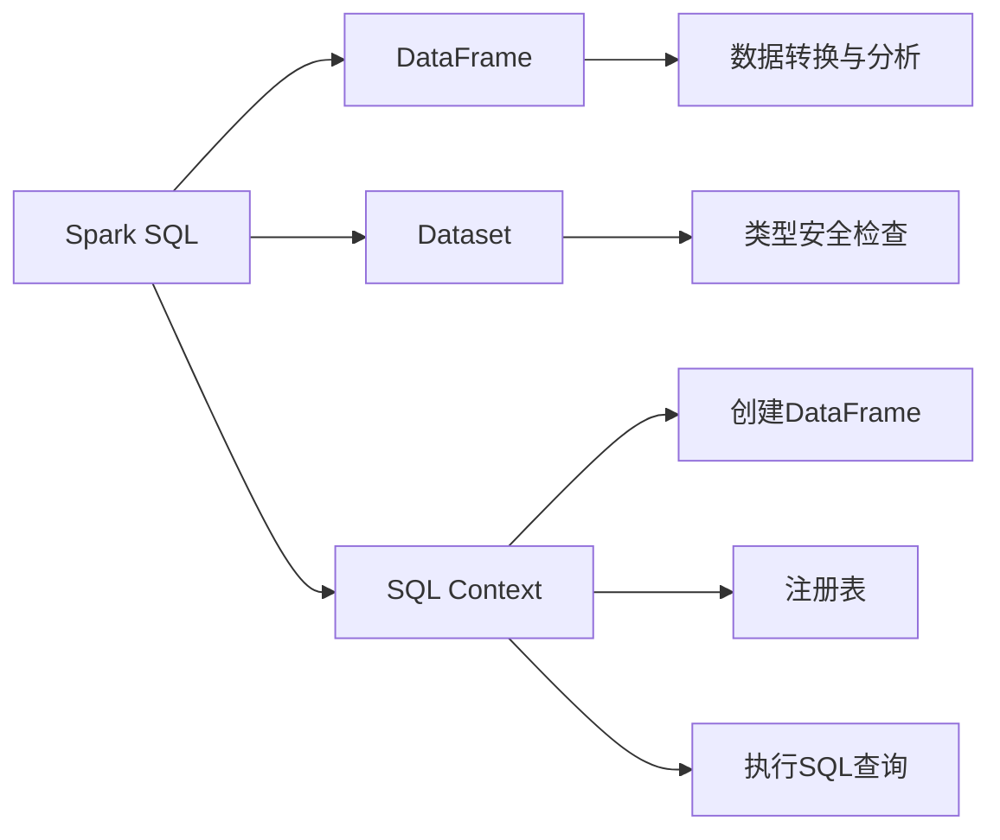

# Spark SQL原理与代码实例讲解

## 1. 背景介绍
在大数据时代，数据处理的效率和便捷性成为了衡量技术优劣的重要标准。Apache Spark作为一个强大的开源分布式计算系统，以其高效的大数据处理能力而广受欢迎。Spark SQL是Spark的一个模块，用于处理结构化数据。通过提供DataFrame和SQL两种API，Spark SQL让用户能够以编程和声明式查询的方式进行数据处理，同时保证了高性能和优化的执行计划。

## 2. 核心概念与联系
Spark SQL的核心概念包括DataFrame、Dataset和SQL Context。DataFrame是一个分布式数据集合，它提供了一个丰富的API，可以用来进行复杂的数据转换和分析。Dataset是一个强类型版本的DataFrame，它提供了编译时类型安全检查。SQL Context是Spark SQL的入口点，它允许用户创建DataFrame，注册DataFrame为表，执行SQL查询等。



## 3. 核心算法原理具体操作步骤
Spark SQL的核心算法原理是基于Catalyst优化器和Tungsten执行引擎。Catalyst优化器负责生成和优化逻辑执行计划，而Tungsten执行引擎则负责高效地执行这些计划。

操作步骤如下：
1. 解析：将用户输入的SQL语句解析成抽象语法树（AST）。
2. 逻辑计划：将AST转换成未优化的逻辑计划。
3. 优化：应用一系列规则优化逻辑计划。
4. 物理计划：将优化后的逻辑计划转换成物理计划。
5. 执行：Tungsten执行引擎执行物理计划。


## 4. 数学模型和公式详细讲解举例说明
Spark SQL的优化过程可以用代数优化的数学模型来表示。例如，考虑关系代数中的选择（σ）和投影（π）操作。优化器会应用诸如选择下推（pushdown）等规则来减少数据处理的规模。

$$
\pi_{columns}(\sigma_{condition}(R))
$$

上述公式表示对关系R进行条件筛选后，再进行列的投影。优化器可能会调整操作的顺序，以减少中间结果的大小，从而提高查询效率。

## 5. 项目实践：代码实例和详细解释说明
以下是一个Spark SQL的代码实例，展示了如何使用DataFrame API进行数据处理：

```scala
import org.apache.spark.sql.SparkSession

val spark = SparkSession.builder.appName("Spark SQL Example").getOrCreate()
import spark.implicits._

// 创建DataFrame
val df = spark.read.json("examples/src/main/resources/people.json")

// 显示DataFrame的内容
df.show()

// 注册DataFrame为临时视图
df.createOrReplaceTempView("people")

// 执行SQL查询
val sqlDF = spark.sql("SELECT name, age FROM people WHERE age > 21")
sqlDF.show()
```

在这个例子中，我们首先创建了一个SparkSession对象，然后读取了一个JSON文件创建DataFrame，接着将DataFrame注册为一个临时视图，最后执行了一个SQL查询。

## 6. 实际应用场景
Spark SQL广泛应用于数据仓库、数据分析和数据挖掘等场景。例如，在电商平台中，Spark SQL可以用来分析用户行为数据，提取购买模式，优化商品推荐算法。

## 7. 工具和资源推荐
- Apache Spark官方文档：提供了详细的Spark SQL使用指南。
- Databricks Community Edition：一个免费的Spark SQL云平台，适合学习和实验。
- Spark SQL性能优化的书籍和博客：提供了深入的优化技巧和案例分析。

## 8. 总结：未来发展趋势与挑战
Spark SQL将继续在易用性、性能和功能上进行优化。未来的发展趋势可能包括更智能的查询优化器、更紧密的云集成和对多种数据源的支持。挑战包括处理更大规模的数据、实时查询优化和跨语言API的一致性。

## 9. 附录：常见问题与解答
Q1: Spark SQL和Hive SQL有什么区别？
A1: Spark SQL是基于Spark的内存计算特性，而Hive SQL通常运行在磁盘上的MapReduce之上。Spark SQL通常提供更好的性能。

Q2: 如何在Spark SQL中进行性能调优？
A2: 可以通过广播小表、选择合适的数据格式、使用缓存和分区等方式进行调优。

作者：禅与计算机程序设计艺术 / Zen and the Art of Computer Programming