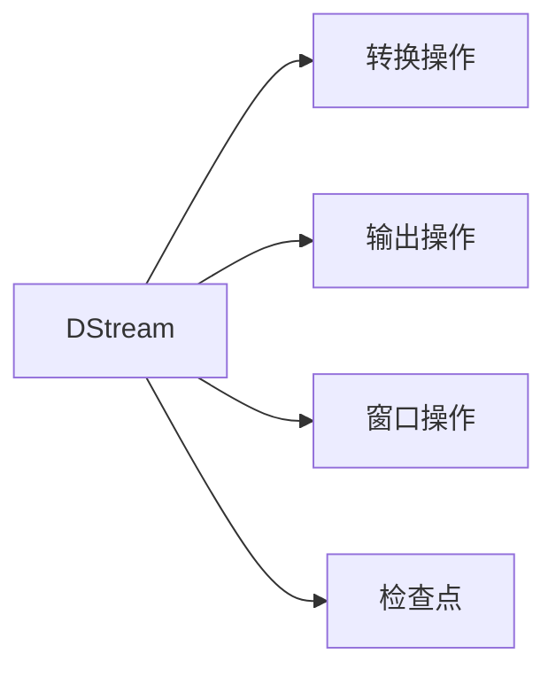

# Spark Streaming原理与代码实例讲解

## 1. 背景介绍
在大数据技术迅猛发展的今天，实时数据处理已成为众多企业和组织的核心需求。Apache Spark作为一个强大的开源集群计算系统，通过其扩展模块Spark Streaming，为实时数据处理提供了强有力的支持。Spark Streaming允许用户以近乎实时的方式处理数据流，它通过高效的DAG（Directed Acyclic Graph）执行引擎，实现了高吞吐量和可扩展性。

## 2. 核心概念与联系
Spark Streaming的核心概念包括DStream（离散流）、转换操作、输出操作、窗口操作和检查点。DStream是Spark Streaming的基本抽象，代表一个连续的数据流。转换操作用于从现有的DStream创建新的DStream，而输出操作则用于将数据写入外部系统。窗口操作允许对数据流进行基于时间的聚合操作，检查点则用于容错。



## 3. 核心算法原理具体操作步骤
Spark Streaming的核心算法原理是“微批处理”（Micro-batching）。它将连续的数据流分割成小的批次，然后使用Spark的批处理能力对这些小批次进行处理。具体操作步骤包括：

1. 定义输入源以接收数据
2. 将接收到的数据分割成一系列的小批次
3. 对每个批次应用转换操作和输出操作
4. 在需要时应用窗口操作和检查点

## 4. 数学模型和公式详细讲解举例说明
Spark Streaming的处理模型可以用以下数学公式表示：

$$
DStream = \bigcup_{t=0}^{\infty} RDD_t
$$

其中，$DStream$ 是离散流，$RDD_t$ 是在时间点 $t$ 的弹性分布式数据集。每个 $RDD_t$ 包含了在时间区间 $[t, t+\Delta t)$ 内收集的数据，$\Delta t$ 是批处理间隔。

## 5. 项目实践：代码实例和详细解释说明
以下是一个Spark Streaming的简单代码实例，它展示了如何从TCP套接字接收数据并进行词频统计：

```scala
import org.apache.spark._
import org.apache.spark.streaming._

val conf = new SparkConf().setMaster("local[2]").setAppName("NetworkWordCount")
val ssc = new StreamingContext(conf, Seconds(1))

val lines = ssc.socketTextStream("localhost", 9999)
val words = lines.flatMap(_.split(" "))
val pairs = words.map(word => (word, 1))
val wordCounts = pairs.reduceByKey(_ + _)

wordCounts.print()

ssc.start()
ssc.awaitTermination()
```

在这个例子中，我们首先创建了一个Spark配置和StreamingContext对象，然后使用`socketTextStream`方法创建了一个从TCP套接字接收数据的DStream。之后，我们对DStream进行了flatMap、map和reduceByKey转换操作，最后使用`print`方法输出了词频统计结果。

## 6. 实际应用场景
Spark Streaming在多个领域都有广泛的应用，包括实时日志处理、社交媒体分析、在线推荐系统、欺诈检测等。

## 7. 工具和资源推荐
为了更好地使用Spark Streaming，推荐以下工具和资源：

- Apache Spark官方文档
- Spark Streaming的GitHub仓库
- 相关的在线课程和教程，如Coursera和edX上的课程

## 8. 总结：未来发展趋势与挑战
Spark Streaming作为实时数据处理的重要工具，其未来的发展趋势包括更好的容错机制、更高的吞吐量和更低的延迟。同时，随着数据量的不断增长，如何保持系统的可扩展性和稳定性也是未来的挑战。

## 9. 附录：常见问题与解答
Q1: Spark Streaming和Apache Flink有什么区别？
A1: Spark Streaming是基于微批处理模型，而Flink是基于真正的流处理模型，这导致了它们在延迟和吞吐量上的差异。

Q2: Spark Streaming如何保证数据的完整性和一致性？
A2: Spark Streaming通过检查点和Write Ahead Logs（WAL）来保证数据的完整性和一致性。

Q3: Spark Streaming能否处理非结构化数据？
A3: 是的，Spark Streaming可以处理非结构化数据，但可能需要额外的转换操作来解析数据。

作者：禅与计算机程序设计艺术 / Zen and the Art of Computer Programming