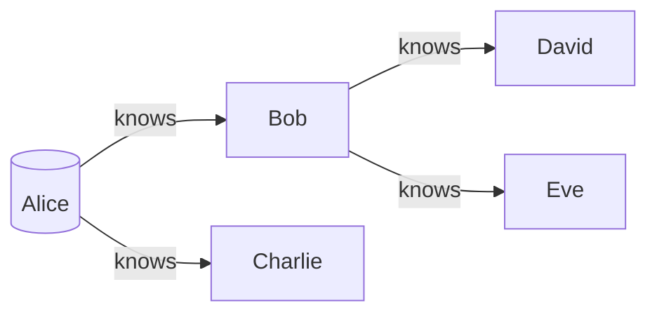
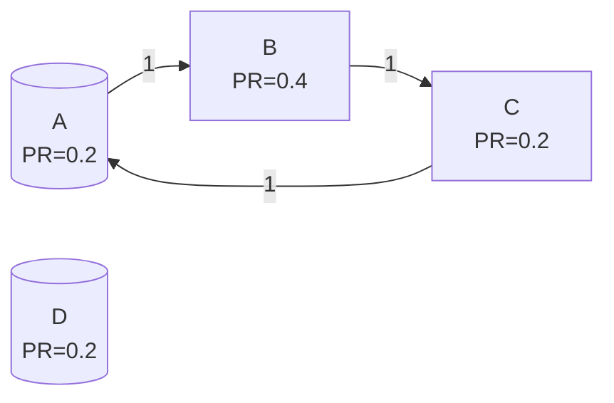

# TinkerPop原理与代码实例讲解

## 1.背景介绍

### 1.1 图数据库概述

在当今数据密集型应用程序中,传统的关系型数据库和NoSQL数据库在处理复杂的数据关系时往往显得力不从心。图数据库(Graph Database)应运而生,它使用图结构高效地存储实体(节点)及其相互关系(边),非常适合表示和处理高度连接的数据。

图数据库具有以下优势:

- 高效处理复杂数据关系
- 支持深度遍历查询
- 符合人类对现实世界的自然认知方式

### 1.2 TinkerPop 简介

TinkerPop是一个开源的图计算框架,提供了一套统一的API和数据结构定义,支持多种图数据库和图计算引擎。它使开发人员能够用一种语言编写代码,在不同的图数据库和图计算引擎之间无缝切换。

TinkerPop主要包括以下四个部分:

- **Gremlin** - 一种功能丰富的图遍历查询语言
- **Blueprints** - 一组标准化的接口,定义了图数据库的基本操作
- **Gremlin-Server** - 一个用于托管Gremlin查询引擎的服务器
- **Gremlin-Driver** - 一组用于连接Gremlin-Server的客户端驱动程序

## 2.核心概念与联系

### 2.1 图的表示

在TinkerPop中,图由以下三个核心元素组成:

- **Vertex(节点)** - 表示图中的实体对象
- **Edge(边)** - 表示节点之间的关系
- **Property(属性)** - 描述节点或边的元数据

下面是一个简单的社交网络图的示例:



在这个图中,Alice、Bob、Charlie、David和Eve是节点,knows是连接节点的边,节点可以有诸如姓名、年龄等属性。

### 2.2 属性图数据模型

TinkerPop采用属性图数据模型(Property Graph Data Model),它扩展了基本的图模型,支持以下附加功能:

- 节点和边可以有任意数量的键/值属性
- 节点和边可以有标签,用于对它们进行分类
- 边可以是有向或无向的
- 支持多重边(同一对节点之间可以有多条边)

属性图数据模型使得图数据库可以更好地表示现实世界中的复杂关系。

## 3.核心算法原理具体操作步骤

### 3.1 Gremlin 查询语言

Gremlin是TinkerPop中的核心查询语言,它提供了一种基于流式处理的声明式方式来表达复杂的图遍历和图分析查询。Gremlin查询由一系列小步骤(step)组成,每个步骤都会对输入的数据进行过滤、转换或计算。

以下是一个简单的Gremlin查询示例,用于查找Alice的朋友:

```groovy
g.V().has('name','Alice').outE('knows').inV().values('name')
```

这个查询的执行步骤如下:

1. `g.V()` - 获取所有节点
2. `.has('name','Alice')` - 过滤出名为Alice的节点
3. `.outE('knows')` - 从Alice节点出发,获取所有knows类型的出边
4. `.inV()` - 遍历到这些边的目标节点
5. `.values('name')` - 提取这些目标节点的name属性值

Gremlin查询可以通过链式调用的方式进行组合,从而构建出复杂的图遍历和分析逻辑。

### 3.2 遍历策略

在执行Gremlin查询时,TinkerPop提供了多种遍历策略(Traversal Strategy),用于优化查询性能和行为。常用的遍历策略包括:

- **EvaluationStrategy** - 控制查询是在服务器端还是客户端执行
- **VertexProgramStrategy** - 支持在图数据库中执行并行图算法
- **SubgraphStrategy** - 允许在子图上执行查询,提高性能
- **LazyBarrierStrategy** - 优化分布式遍历的数据传输

开发人员可以根据具体的应用场景和性能需求,选择和配置合适的遍历策略。

### 3.3 图算法

除了图遍历查询,TinkerPop还提供了许多内置的图算法,用于解决诸如最短路径、连通分量、PageRank等常见的图分析问题。这些算法可以通过Gremlin语言进行调用和配置。

以下是一个使用PageRank算法计算节点重要性的示例:

```groovy
g.withComputer().pageRank().withEdgeWeight(outE().count()).by(outE().values('weight')).program()
```

这个查询首先创建一个图计算作业,然后配置PageRank算法的参数,包括边权重计算方式等,最后执行该算法并返回结果。

## 4.数学模型和公式详细讲解举例说明

在图算法中,常常需要使用数学模型和公式来描述和解决特定的问题。以PageRank算法为例,它是基于以下核心思想:

一个节点的重要性取决于指向它的节点的重要性及其数量。具体来说,PageRank算法使用以下公式计算每个节点的PageRank值:

$$PR(u) = \frac{1-d}{N} + d \sum_{v \in Bu} \frac{PR(v)}{L(v)}$$

其中:

- $PR(u)$ 表示节点 $u$ 的PageRank值
- $Bu$ 是所有链接到节点 $u$ 的节点集合
- $L(v)$ 是节点 $v$ 的出度(指向其他节点的边数)
- $N$ 是图中节点的总数
- $d$ 是一个阻尼系数(damping factor),通常取值0.85

该公式可以理解为:一个节点的PageRank值由两部分组成。第一部分是所有节点对它的平均贡献,第二部分是所有链接到它的节点根据自身PageRank值和出度对它的贡献。

PageRank算法通过迭代计算,直到所有节点的PageRank值收敛。在每一轮迭代中,每个节点的PageRank值都会根据上面的公式进行更新。

以下是一个简单的PageRank计算示例:



假设阻尼系数 $d=0.85$,图中共有4个节点。在第一轮迭代后,每个节点的PageRank值为:

$$
\begin{aligned}
PR(A) &= \frac{1-0.85}{4} + 0.85 \times \frac{0.2}{1} = 0.2875\\
PR(B) &= \frac{1-0.85}{4} + 0.85 \times \frac{0.2}{1} = 0.2875\\
PR(C) &= \frac{1-0.85}{4} + 0.85 \times \frac{0.2875}{1} = 0.319375\\
PR(D) &= \frac{1-0.85}{4} = 0.0375
\end{aligned}
$$

通过多轮迭代,PageRank值将逐渐收敛到稳定值。

## 5.项目实践:代码实例和详细解释说明

接下来,我们将通过一个实际的代码示例,演示如何使用TinkerPop和Gremlin语言进行图数据建模和查询。我们将使用一个简单的社交网络数据集,其中包含用户、他们之间的关系以及一些附加信息。

### 5.1 数据准备

首先,我们需要导入所需的依赖项,并创建一个空的TinkerGraph实例:

```groovy
// 导入依赖项
@Grab('org.apache.tinkerpop:gremlin-groovy:3.5.2')
import org.apache.tinkerpop.gremlin.process.traversal.dsl.graph.GraphTraversalSource
import org.apache.tinkerpop.gremlin.structure.Graph
import org.apache.tinkerpop.gremlin.tinkergraph.structure.TinkerGraph

// 创建一个空的TinkerGraph实例
Graph graph = TinkerGraph.open()
```

接下来,我们将定义节点和边的标签,并添加一些示例数据:

```groovy
// 定义节点和边的标签
graph.io(IoCore.gryo()).readVertex().fromValue([
    'name'   : 'person',
    'cluster': 'node'
]).iterate()

graph.io(IoCore.gryo()).readEdge().fromValue([
    'name'   : 'knows',
    'cluster': 'edge'
]).iterate()

// 添加示例数据
GraphTraversalSource g = graph.traversal()

def alice = g.addV('person').property('name', 'Alice').property('age', 35).next()
def bob = g.addV('person').property('name', 'Bob').property('age', 28).next()
def charlie = g.addV('person').property('name', 'Charlie').property('age', 42).next()
def david = g.addV('person').property('name', 'David').property('age', 31).next()
def eve = g.addV('person').property('name', 'Eve').property('age', 27).next()

g.addE('knows').from(alice).to(bob).iterate()
g.addE('knows').from(alice).to(charlie).iterate()
g.addE('knows').from(bob).to(david).iterate()
g.addE('knows').from(bob).to(eve).iterate()
```

在上面的代码中,我们首先定义了`person`和`knows`标签,分别表示节点和边的类型。然后,我们添加了5个人物节点,并为每个节点设置了`name`和`age`属性。最后,我们创建了4条`knows`边,表示人物之间的关系。

### 5.2 图遍历查询

现在,我们可以使用Gremlin语言执行各种图遍历查询。以下是一些示例:

1. 查找Alice的朋友:

```groovy
g.V().has('name', 'Alice').outE('knows').inV().values('name')
```

输出:

```
==>Bob
==>Charlie
```

2. 查找30岁以上的人:

```groovy
g.V().has('age', gt(30)).values('name', 'age')
```

输出:

```
==>Alice=35
==>Charlie=42
==>David=31
```

3. 查找Alice的朋友的朋友(二度关系):

```groovy
g.V().has('name', 'Alice').outE('knows').inV().outE('knows').inV().dedup().values('name')
```

输出:

```
==>David
==>Eve
```

4. 计算每个人的朋友数量:

```groovy
g.V().project('name', 'friendCount')
      .by('name')
      .by(outE('knows').count())
```

输出:

```
==>name=Alice,friendCount=2
==>name=Bob,friendCount=2
==>name=Charlie,friendCount=0
==>name=David,friendCount=0
==>name=Eve,friendCount=0
```

这些示例展示了如何使用Gremlin语言执行常见的图遍历操作,如过滤节点、遍历边、访问属性等。Gremlin语言提供了丰富的步骤(step)和功能,可以构建出复杂的图查询逻辑。

## 6.实际应用场景

图数据库和TinkerPop框架在许多领域都有广泛的应用,例如:

### 6.1 社交网络分析

社交网络是图数据库最典型的应用场景之一。在社交网络中,用户可以被建模为节点,他们之间的关系(如朋友、关注等)可以被建模为边。图数据库可以高效地存储和查询这些复杂的关系数据,支持诸如社交影响力分析、社区发现、推荐系统等功能。

### 6.2 知识图谱

知识图谱是一种结构化的知识表示形式,它将实体、概念及其关系以图的形式组织起来。图数据库非常适合构建和查询知识图谱,支持复杂的语义查询和推理。知识图谱在搜索引擎、问答系统、智能助理等领域有广泛应用。

### 6.3 金融风险分析

在金融领域,图数据库可以用于建模和分析复杂的交易网络、欺诈行为模式等。通过图算法,可以发现潜在的风险点和异常情况,从而加强风险管控。

### 6.4 物联网和供应链管理

在物联网和供应链管理领域,图数据库可以用于表示和追踪物品、设备之间的关系和流转过程。基于图的查询和分析可以帮助优化物流路径、发现瓶颈等。

### 6.5 网络