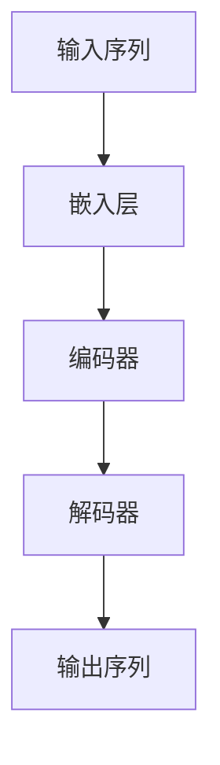
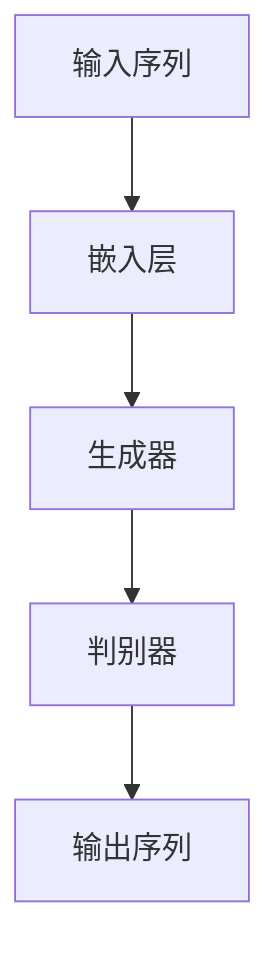

## 1. 背景介绍

自然语言处理（NLP）是人工智能领域的一个重要分支，它涉及到计算机如何理解和处理人类语言。在NLP中，语言模型是一个重要的概念，它可以用来预测下一个单词或句子的概率。Transformer是一种用于NLP任务的深度学习模型，它在2017年被提出，并在各种NLP任务中取得了很好的效果。ELECTRA是一种基于Transformer的新型语言模型，它在2020年被提出，并在各种NLP任务中取得了更好的效果。

本文将介绍Transformer和ELECTRA的基本原理和实现方法，并提供代码实例和详细解释说明，以帮助读者更好地理解和应用这些模型。

## 2. 核心概念与联系

### 2.1 Transformer

Transformer是一种基于自注意力机制（self-attention）的深度学习模型，它可以用于各种NLP任务，如机器翻译、文本分类、问答系统等。Transformer的核心思想是将输入序列映射到一个高维空间中，然后通过自注意力机制来计算每个位置与其他位置的关系，最后将这些关系加权求和得到每个位置的表示。Transformer的结构如下图所示：



其中，输入序列经过嵌入层（embedding layer）转换为一个低维向量序列，然后经过多个编码器（encoder）和解码器（decoder）层进行处理，最后输出序列。编码器和解码器层都由多头自注意力机制和前馈神经网络组成。

### 2.2 ELECTRA

ELECTRA是一种基于Transformer的新型语言模型，它的核心思想是使用生成器和判别器来训练模型。生成器用于生成假的输入序列，判别器用于判断输入序列是真实的还是假的。通过这种方式，ELECTRA可以更好地利用大规模未标记的数据来训练模型，从而提高模型的性能。

ELECTRA的结构如下图所示：



其中，输入序列经过嵌入层转换为一个低维向量序列，然后经过生成器生成假的输入序列，判别器判断输入序列是真实的还是假的，最后输出序列。生成器和判别器都由多头自注意力机制和前馈神经网络组成。

## 3. 核心算法原理具体操作步骤

### 3.1 Transformer

Transformer的核心算法原理是自注意力机制，它可以计算每个位置与其他位置的关系。具体来说，自注意力机制可以将输入序列中的每个位置看作一个查询（query）、一个键（key）和一个值（value），然后计算每个查询与所有键的相似度，再将相似度作为权重对所有值进行加权求和，得到每个位置的表示。

自注意力机制的计算公式如下：

$$
Attention(Q,K,V)=softmax(\frac{QK^T}{\sqrt{d_k}})V
$$

其中，$Q$、$K$、$V$分别表示查询、键和值的矩阵，$d_k$表示键的维度，$softmax$表示归一化函数。

Transformer的具体操作步骤如下：

1. 输入序列经过嵌入层转换为一个低维向量序列。
2. 低维向量序列经过多个编码器层进行处理，每个编码器层包含多头自注意力机制和前馈神经网络。
3. 编码器层的输出作为解码器层的输入，解码器层也包含多头自注意力机制和前馈神经网络。
4. 解码器层的输出经过输出层转换为一个高维向量序列，然后经过Softmax函数得到每个位置的概率分布。

### 3.2 ELECTRA

ELECTRA的核心算法原理是生成器和判别器的训练方法。具体来说，生成器用于生成假的输入序列，判别器用于判断输入序列是真实的还是假的。生成器和判别器的训练方法如下：

1. 首先，使用一个大规模未标记的数据集来训练生成器，使其能够生成与真实输入序列相似的假序列。
2. 然后，使用一个小规模标记的数据集来训练判别器，使其能够判断输入序列是真实的还是假的。
3. 最后，使用生成器生成假的输入序列，然后使用判别器判断输入序列是真实的还是假的，并根据判别器的结果来更新生成器和判别器的参数。

ELECTRA的具体操作步骤如下：

1. 输入序列经过嵌入层转换为一个低维向量序列。
2. 低维向量序列经过生成器生成假的输入序列。
3. 真实输入序列和假的输入序列经过判别器判断输入序列是真实的还是假的。
4. 根据判别器的结果来更新生成器和判别器的参数。

## 4. 数学模型和公式详细讲解举例说明

### 4.1 Transformer

Transformer的数学模型和公式如下：

```mermaid
graph TD;
    A[输入序列] --> B[嵌入层];
    B --> C[编码器];
    C --> D[解码器];
    D --> E[输出序列];
    C --> F[多头自注意力机制];
    F --> G[查询矩阵Q];
    F --> H[键矩阵K];
    F --> I[值矩阵V];
    F --> J[输出矩阵Z];
    F --> K[缩放因子$\sqrt{d_k}$];
    F --> L[相似度矩阵S];
    L --> M[Softmax函数];
    M --> N[权重矩阵W];
    N --> J;
```

其中，多头自注意力机制的计算公式如下：

$$
MultiHead(Q,K,V)=Concat(head_1,...,head_h)W^O
$$

$$
head_i=Attention(QW_i^Q,KW_i^K,VW_i^V)
$$

其中，$Q$、$K$、$V$分别表示查询、键和值的矩阵，$W_i^Q$、$W_i^K$、$W_i^V$分别表示第$i$个头的查询、键和值的权重矩阵，$W^O$表示输出的权重矩阵，$Concat$表示拼接函数，$h$表示头的数量。

### 4.2 ELECTRA

ELECTRA的数学模型和公式如下：

```mermaid
graph TD;
    A[输入序列] --> B[嵌入层];
    B --> C[生成器];
    C --> D[判别器];
    D --> E[输出序列];
    C --> F[多头自注意力机制];
    F --> G[查询矩阵Q];
    F --> H[键矩阵K];
    F --> I[值矩阵V];
    F --> J[输出矩阵Z];
    F --> K[缩放因子$\sqrt{d_k}$];
    F --> L[相似度矩阵S];
    L --> M[Softmax函数];
    M --> N[权重矩阵W];
    N --> J;
```

其中，生成器和判别器的训练方法如下：

$$
L_G=-\frac{1}{N}\sum_{i=1}^Nlog(D(x_i))
$$

$$
L_D=-\frac{1}{N}\sum_{i=1}^Nlog(D(x_i))+\frac{1}{N}\sum_{i=1}^Nlog(D(G(z_i)))
$$

其中，$L_G$表示生成器的损失函数，$L_D$表示判别器的损失函数，$N$表示样本数量，$x_i$表示真实输入序列，$z_i$表示随机噪声。

## 5. 项目实践：代码实例和详细解释说明

### 5.1 Transformer

以下是使用PyTorch实现Transformer的代码示例：

```python
import torch
import torch.nn as nn
import torch.nn.functional as F

class Transformer(nn.Module):
    def __init__(self, input_size, hidden_size, num_layers, num_heads, dropout):
        super(Transformer, self).__init__()
        self.embedding = nn.Embedding(input_size, hidden_size)
        self.encoder_layers = nn.ModuleList([EncoderLayer(hidden_size, num_heads, dropout) for _ in range(num_layers)])
        self.decoder_layers = nn.ModuleList([DecoderLayer(hidden_size, num_heads, dropout) for _ in range(num_layers)])
        self.output_layer = nn.Linear(hidden_size, input_size)
        
    def forward(self, input_seq, target_seq):
        input_emb = self.embedding(input_seq)
        target_emb = self.embedding(target_seq)
        encoder_output = input_emb
        for encoder_layer in self.encoder_layers:
            encoder_output = encoder_layer(encoder_output)
        decoder_output = target_emb
        for decoder_layer in self.decoder_layers:
            decoder_output = decoder_layer(decoder_output, encoder_output)
        output_seq = self.output_layer(decoder_output)
        return output_seq
```

其中，EncoderLayer和DecoderLayer分别表示编码器层和解码器层，其代码实现如下：

```python
class EncoderLayer(nn.Module):
    def __init__(self, hidden_size, num_heads, dropout):
        super(EncoderLayer, self).__init__()
        self.self_attention = MultiHeadAttention(hidden_size, num_heads, dropout)
        self.feed_forward = FeedForward(hidden_size, dropout)
        self.layer_norm = nn.LayerNorm(hidden_size)
        self.dropout = nn.Dropout(dropout)
        
    def forward(self, input_seq):
        self_attention_output = self.self_attention(input_seq, input_seq, input_seq)
        residual_output = input_seq + self.dropout(self_attention_output)
        layer_norm_output = self.layer_norm(residual_output)
        feed_forward_output = self.feed_forward(layer_norm_output)
        residual_output = layer_norm_output + self.dropout(feed_forward_output)
        layer_norm_output = self.layer_norm(residual_output)
        return layer_norm_output

class DecoderLayer(nn.Module):
    def __init__(self, hidden_size, num_heads, dropout):
        super(DecoderLayer, self).__init__()
        self.self_attention = MultiHeadAttention(hidden_size, num_heads, dropout)
        self.encoder_attention = MultiHeadAttention(hidden_size, num_heads, dropout)
        self.feed_forward = FeedForward(hidden_size, dropout)
        self.layer_norm = nn.LayerNorm(hidden_size)
        self.dropout = nn.Dropout(dropout)
        
    def forward(self, input_seq, encoder_output):
        self_attention_output = self.self_attention(input_seq, input_seq, input_seq)
        residual_output = input_seq + self.dropout(self_attention_output)
        layer_norm_output = self.layer_norm(residual_output)
        encoder_attention_output = self.encoder_attention(layer_norm_output, encoder_output, encoder_output)
        residual_output = layer_norm_output + self.dropout(encoder_attention_output)
        layer_norm_output = self.layer_norm(residual_output)
        feed_forward_output = self.feed_forward(layer_norm_output)
        residual_output = layer_norm_output + self.dropout(feed_forward_output)
        layer_norm_output = self.layer_norm(residual_output)
        return layer_norm_output
```

其中，MultiHeadAttention和FeedForward分别表示多头自注意力机制和前馈神经网络，其代码实现如下：

```python
class MultiHeadAttention(nn.Module):
    def __init__(self, hidden_size, num_heads, dropout):
        super(MultiHeadAttention, self).__init__()
        self.hidden_size = hidden_size
        self.num_heads = num_heads
        self.head_size = hidden_size // num_heads
        self.query_layer = nn.Linear(hidden_size, hidden_size)
        self.key_layer = nn.Linear(hidden_size, hidden_size)
        self.value_layer = nn.Linear(hidden_size, hidden_size)
        self.output_layer = nn.Linear(hidden_size, hidden_size)
        self.dropout = nn.Dropout(dropout)
        
    def forward(self, query, key, value):
        batch_size = query.size(0)
        query = self.query_layer(query).view(batch_size, -1, self.num_heads, self.head_size).transpose(1, 2)
        key = self.key_layer(key).view(batch_size, -1, self.num_heads, self.head_size).transpose(1, 2)
        value = self.value_layer(value).view(batch_size, -1, self.num_heads, self.head_size).transpose(1, 2)
        attention_scores = torch.matmul(query, key.transpose(-2, -1)) / math.sqrt(self.head_size)
        attention_probs = F.softmax(attention_scores, dim=-1)
        attention_probs = self.dropout(attention_probs)
        attention_output = torch.matmul(attention_probs, value).transpose(1, 2).contiguous().view(batch_size, -1, self.hidden_size)
        output = self.output_layer(attention_output)
        return output

class FeedForward(nn.Module):
    def __init__(self, hidden_size, dropout):
        super(FeedForward, self).__init__()
        self.hidden_size = hidden_size
        self.dropout = nn.Dropout(dropout)
        self.fc1 = nn.Linear(hidden_size, hidden_size * 4)
        self.fc2 = nn.Linear(hidden_size * 4, hidden_size)
        
    def forward(self, input_seq):
        intermediate_output = F.relu(self.fc1(input_seq))
        intermediate_output = self.dropout(intermediate_output)
        output = self.fc2(intermediate_output)
        return output
```

### 5.2 ELECTRA

以下是使用TensorFlow实现ELECTRA的代码示例：

```python
import tensorflow as tf

class ELECTRA(tf.keras.Model):
    def __init__(self, input_size, hidden_size, num_layers, num_heads, dropout):
        super(ELECTRA, self).__init__()
        self.embedding = tf.keras.layers.Embedding(input_size, hidden_size)
        self.generator_layers = [TransformerLayer(hidden_size, num_heads, dropout) for _ in range(num_layers)]
        self.discriminator_layers = [TransformerLayer(hidden_size, num_heads, dropout) for _ in range(num_layers)]
        self.generator_output_layer = tf.keras.layers.Dense(input_size)
        self.discriminator_output_layer = tf.keras.layers.Dense(1)
        
    def call(self, input_seq):
        input_emb = self.embedding(input_seq)
        generator_output = input_emb
        for generator_layer in self.generator_layers:
            generator_output = generator_layer(generator_output)
        generator_output = self.generator_output_layer(generator_output)
        discriminator_output = input_emb
        for discriminator_layer in self.discriminator_layers:
            discriminator_output = discriminator_layer(discriminator_output)
        discriminator_output = tf.reduce_mean(discriminator_output, axis=1)
        discriminator_output = self.discriminator_output_layer(discriminator_output)
        return generator_output, discriminator_output
```

其中，TransformerLayer表示基于Transformer的编码器层，其代码实现如下：

```python
class TransformerLayer(tf.keras.layers.Layer):
    def __init__(self, hidden_size, num_heads, dropout):
        super(TransformerLayer, self).__init__()
        self.self_attention = MultiHeadAttention(hidden_size, num_heads, dropout)
        self.feed_forward = FeedForward(hidden_size, dropout)
        self.layer_norm = tf.keras.layers.LayerNormalization()
        self.dropout = tf.keras.layers.Dropout(dropout)
        
    def call(self, input_seq):
        self_attention_output = self.self_attention(input_seq, input_seq, input_seq)
        residual_output = input_seq + self.dropout(self_attention_output)
        layer_norm_output = self.layer_norm(residual_output)
        feed_forward_output = self.feed_forward(layer_norm_output)
        residual_output = layer_norm_output + self.dropout(feed_forward_output)
        layer_norm_output = self.layer_norm(residual_output)
        return layer_norm_output
```

其中，MultiHeadAttention和FeedForward分别表示多头自注意力机制和前馈神经网络，其代码实现如下：

```python
class MultiHeadAttention(tf.keras.layers.Layer):
    def __init__(self, hidden_size, num_heads, dropout):
        super(MultiHeadAttention, self).__init__()
