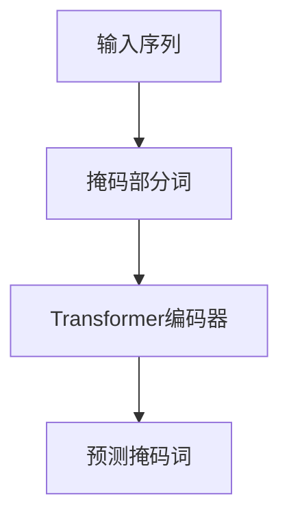
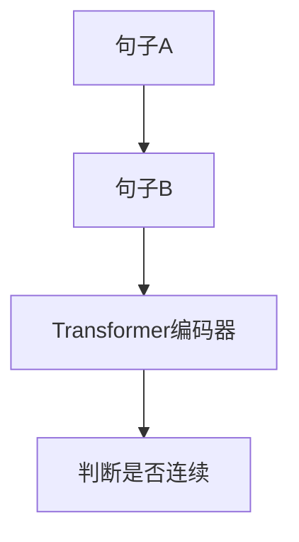
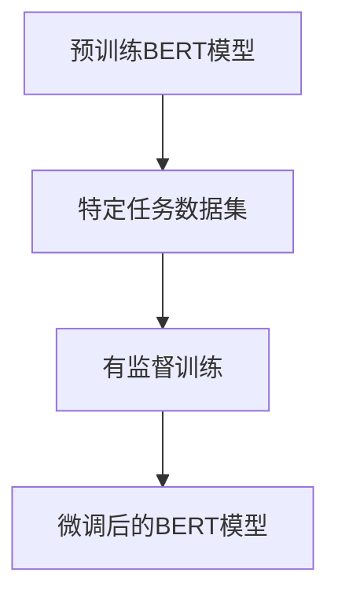

# Transformer大模型实战 特定语言的BERT模型

## 1.背景介绍

在自然语言处理（NLP）领域，Transformer模型的引入无疑是一个革命性的突破。自从Vaswani等人在2017年提出Transformer架构以来，它迅速成为了NLP任务的主流方法。BERT（Bidirectional Encoder Representations from Transformers）作为Transformer家族中的一员，通过其双向编码器架构，显著提升了各种NLP任务的性能。

BERT模型的核心思想是通过预训练和微调两个阶段来实现对特定任务的高效处理。预训练阶段，模型在大规模无监督文本数据上进行训练，学习到通用的语言表示。微调阶段，模型在特定任务的数据集上进行有监督训练，以适应具体任务的需求。

本文将深入探讨特定语言的BERT模型，从核心概念、算法原理、数学模型、项目实践、实际应用场景、工具和资源推荐等多个方面进行详细讲解，帮助读者全面理解和掌握BERT模型的应用。

## 2.核心概念与联系

### 2.1 Transformer架构

Transformer架构由编码器和解码器两部分组成。编码器负责将输入序列转换为一组连续的表示，解码器则将这些表示转换为目标序列。BERT模型只使用了Transformer的编码器部分。

### 2.2 BERT模型

BERT模型的核心在于其双向编码器架构。与传统的单向语言模型不同，BERT在预训练阶段通过掩码语言模型（Masked Language Model, MLM）和下一句预测（Next Sentence Prediction, NSP）任务，学习到更丰富的上下文信息。

### 2.3 特定语言的BERT模型

特定语言的BERT模型是指在某一特定语言的大规模文本数据上进行预训练的BERT模型。例如，中文BERT模型、法语BERT模型等。这些模型在处理特定语言的NLP任务时表现出色。

## 3.核心算法原理具体操作步骤

### 3.1 预训练阶段

#### 3.1.1 掩码语言模型（MLM）

在MLM任务中，输入序列中的部分词被随机掩码，模型需要预测这些被掩码的词。通过这种方式，模型能够学习到词与词之间的上下文关系。



#### 3.1.2 下一句预测（NSP）

在NSP任务中，模型需要判断两个句子是否是连续的。通过这种方式，模型能够学习到句子之间的关系。



### 3.2 微调阶段

在微调阶段，预训练好的BERT模型在特定任务的数据集上进行有监督训练。通过调整模型参数，使其适应具体任务的需求。



## 4.数学模型和公式详细讲解举例说明

### 4.1 掩码语言模型（MLM）

在MLM任务中，给定输入序列 $X = \{x_1, x_2, ..., x_n\}$，其中部分词被掩码，记为 $X_{mask}$。模型的目标是最大化被掩码词的概率：

$$
P(X_{mask} | X) = \prod_{i \in mask} P(x_i | X)
$$

### 4.2 下一句预测（NSP）

在NSP任务中，给定两个句子 $A$ 和 $B$，模型的目标是判断 $B$ 是否是 $A$ 的下一句。模型通过一个二分类任务来实现这一目标：

$$
P(label | A, B) = \text{softmax}(W [CLS])
$$

其中，$[CLS]$ 是句子对的联合表示，$W$ 是分类层的权重矩阵。

## 5.项目实践：代码实例和详细解释说明

### 5.1 环境准备

首先，确保安装了必要的库：

```bash
pip install transformers torch
```

### 5.2 加载预训练模型

使用Hugging Face的Transformers库加载预训练的BERT模型：

```python
from transformers import BertTokenizer, BertModel

tokenizer = BertTokenizer.from_pretrained('bert-base-uncased')
model = BertModel.from_pretrained('bert-base-uncased')
```

### 5.3 预处理输入数据

将输入文本转换为模型可接受的格式：

```python
text = "Hello, my dog is cute"
inputs = tokenizer(text, return_tensors="pt")
```

### 5.4 模型推理

将预处理后的数据输入模型，获取输出：

```python
outputs = model(**inputs)
last_hidden_states = outputs.last_hidden_state
```

### 5.5 微调模型

以文本分类任务为例，微调BERT模型：

```python
from transformers import BertForSequenceClassification, Trainer, TrainingArguments

model = BertForSequenceClassification.from_pretrained('bert-base-uncased', num_labels=2)

training_args = TrainingArguments(
    output_dir='./results',
    num_train_epochs=3,
    per_device_train_batch_size=8,
    per_device_eval_batch_size=8,
    warmup_steps=500,
    weight_decay=0.01,
    logging_dir='./logs',
)

trainer = Trainer(
    model=model,
    args=training_args,
    train_dataset=train_dataset,
    eval_dataset=eval_dataset
)

trainer.train()
```

## 6.实际应用场景

### 6.1 情感分析

BERT模型可以用于情感分析任务，通过微调模型，可以实现对文本情感的准确分类。

### 6.2 问答系统

BERT模型在问答系统中表现出色，通过预训练和微调，可以实现高效的问答匹配。

### 6.3 机器翻译

虽然BERT模型主要用于编码任务，但通过结合解码器，可以实现高质量的机器翻译。

## 7.工具和资源推荐

### 7.1 Hugging Face Transformers

Hugging Face的Transformers库是一个强大的工具，提供了丰富的预训练模型和便捷的API。

### 7.2 TensorFlow和PyTorch

TensorFlow和PyTorch是两大主流深度学习框架，支持BERT模型的训练和推理。

### 7.3 数据集

推荐使用公开的NLP数据集，如GLUE、SQuAD等，进行模型的预训练和微调。

## 8.总结：未来发展趋势与挑战

BERT模型的引入极大地推动了NLP领域的发展。然而，随着模型规模的不断扩大，计算资源和数据需求也在增加。未来，如何在保证模型性能的同时，降低计算成本和数据需求，将是一个重要的研究方向。此外，BERT模型在多语言处理上的应用也将是一个重要的趋势。

## 9.附录：常见问题与解答

### 9.1 BERT模型的输入长度有限制吗？

是的，BERT模型的输入长度通常限制在512个词以内。如果输入文本超过这个长度，可以考虑截断或分段处理。

### 9.2 如何选择预训练模型？

选择预训练模型时，可以根据任务的具体需求和数据集的语言特点进行选择。例如，对于中文任务，可以选择中文BERT模型。

### 9.3 微调BERT模型需要多少数据？

微调BERT模型所需的数据量取决于具体任务和数据的质量。一般来说，数千到数万条数据是一个合理的范围。

---

作者：禅与计算机程序设计艺术 / Zen and the Art of Computer Programming