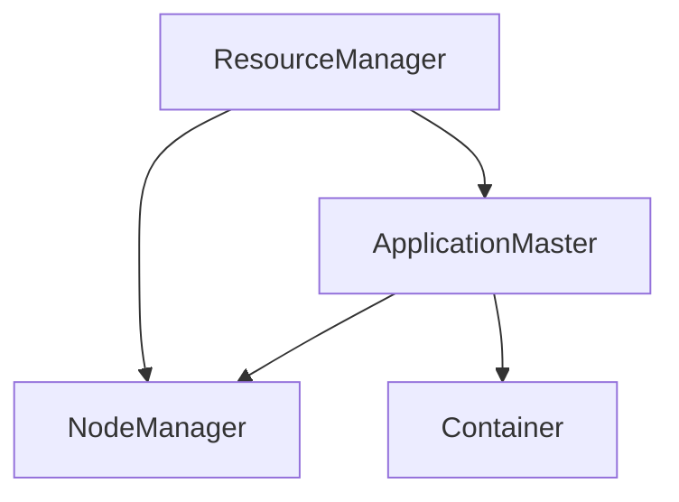

## 1. 背景介绍

随着大数据技术的快速发展，Hadoop已经成为了处理海量数据的标准工具。然而，Hadoop的一个缺点是它的资源管理器（ResourceManager）是单点故障，这意味着如果ResourceManager出现故障，整个Hadoop集群将无法正常工作。为了解决这个问题，Yarn（Yet Another Resource Negotiator）应运而生。

Yarn是一个分布式资源管理系统，它可以管理Hadoop集群中的资源，并为应用程序提供资源。Yarn的核心思想是将资源管理和任务调度分离开来，这样就可以实现更高效的资源利用和更好的任务调度。

## 2. 核心概念与联系

Yarn的核心概念包括NodeManager、ResourceManager、ApplicationMaster和Container。

- NodeManager：每个节点上都有一个NodeManager，它负责管理节点上的资源，并与ResourceManager通信以获取任务分配。
- ResourceManager：整个集群只有一个ResourceManager，它负责管理整个集群的资源，并与ApplicationMaster通信以分配任务。
- ApplicationMaster：每个应用程序都有一个ApplicationMaster，它负责协调应用程序的执行，并与ResourceManager通信以获取资源。
- Container：每个任务都运行在一个Container中，它是一个虚拟的计算资源，包括CPU、内存和磁盘等。

Yarn的核心概念之间的联系如下图所示：



## 3. 核心算法原理具体操作步骤

Yarn的核心算法原理是资源管理和任务调度的分离。ResourceManager负责管理整个集群的资源，包括节点的CPU、内存和磁盘等。ApplicationMaster负责协调应用程序的执行，并与ResourceManager通信以获取资源。NodeManager负责管理节点上的资源，并与ResourceManager通信以获取任务分配。Container是一个虚拟的计算资源，包括CPU、内存和磁盘等。

Yarn的操作步骤如下：

1. 应用程序向ResourceManager提交一个应用程序请求。
2. ResourceManager为应用程序分配一个ApplicationMaster。
3. ApplicationMaster向ResourceManager请求资源。
4. ResourceManager为ApplicationMaster分配资源。
5. ApplicationMaster向NodeManager请求Container。
6. NodeManager为ApplicationMaster分配Container。
7. ApplicationMaster向Container分配任务。
8. 任务在Container中执行。
9. 任务执行完成后，Container将结果返回给ApplicationMaster。
10. ApplicationMaster将结果返回给ResourceManager。

## 4. 数学模型和公式详细讲解举例说明

Yarn的数学模型和公式主要涉及资源管理和任务调度。其中，资源管理的数学模型和公式包括资源分配和资源利用率等。任务调度的数学模型和公式包括任务优先级和任务执行时间等。

以资源分配为例，Yarn的资源分配模型可以表示为：

$$
\begin{aligned}
& \text{maximize} && \sum_{i=1}^{n} u_i x_i \\
& \text{subject to} && \sum_{i=1}^{n} x_i \leq C \\
&&& x_i \in \{0,1\} \\
\end{aligned}
$$

其中，$u_i$表示第$i$个任务的资源需求，$x_i$表示第$i$个任务是否被分配资源，$C$表示可用资源的总量。

## 5. 项目实践：代码实例和详细解释说明

以下是一个使用Yarn的MapReduce程序的示例代码：

```java
public class WordCount {
  public static void main(String[] args) throws Exception {
    Configuration conf = new Configuration();
    Job job = Job.getInstance(conf, "word count");
    job.setJarByClass(WordCount.class);
    job.setMapperClass(TokenizerMapper.class);
    job.setCombinerClass(IntSumReducer.class);
    job.setReducerClass(IntSumReducer.class);
    job.setOutputKeyClass(Text.class);
    job.setOutputValueClass(IntWritable.class);
    FileInputFormat.addInputPath(job, new Path(args[0]));
    FileOutputFormat.setOutputPath(job, new Path(args[1]));
    System.exit(job.waitForCompletion(true) ? 0 : 1);
  }
}
```

在这个示例中，我们使用Yarn来运行一个MapReduce程序。首先，我们创建一个Configuration对象，然后创建一个Job对象，并设置Map和Reduce函数。接下来，我们设置输入和输出路径，并启动Job。

## 6. 实际应用场景

Yarn的实际应用场景包括大数据处理、机器学习、图像处理等。在大数据处理中，Yarn可以管理Hadoop集群中的资源，并为应用程序提供资源。在机器学习中，Yarn可以管理分布式机器学习任务，并为任务提供资源。在图像处理中，Yarn可以管理分布式图像处理任务，并为任务提供资源。

## 7. 工具和资源推荐

以下是一些与Yarn相关的工具和资源：

- Hadoop：Hadoop是一个开源的分布式计算平台，Yarn是Hadoop的一个子项目。
- Apache Spark：Apache Spark是一个快速的、通用的大数据处理引擎，它可以与Yarn集成。
- YARN-UI：YARN-UI是一个基于Web的用户界面，用于监视和管理Yarn集群。
- Yarn Site：Yarn Site是Yarn的官方网站，提供了Yarn的文档、示例代码和社区支持等资源。

## 8. 总结：未来发展趋势与挑战

Yarn作为一个分布式资源管理系统，已经成为了处理海量数据的标准工具。未来，随着大数据技术的不断发展，Yarn将继续发挥重要作用。然而，Yarn也面临着一些挑战，例如资源利用率的优化、任务调度的优化等。

## 9. 附录：常见问题与解答

Q: Yarn的优点是什么？

A: Yarn的优点包括资源管理和任务调度的分离、高效的资源利用、高可靠性等。

Q: Yarn的缺点是什么？

A: Yarn的缺点包括资源利用率的优化、任务调度的优化等。

Q: Yarn如何与Hadoop集成？

A: Yarn是Hadoop的一个子项目，可以与Hadoop集成使用。

Q: Yarn如何管理分布式机器学习任务？

A: Yarn可以管理分布式机器学习任务，并为任务提供资源。

Q: Yarn如何管理分布式图像处理任务？

A: Yarn可以管理分布式图像处理任务，并为任务提供资源。

作者：禅与计算机程序设计艺术 / Zen and the Art of Computer Programming