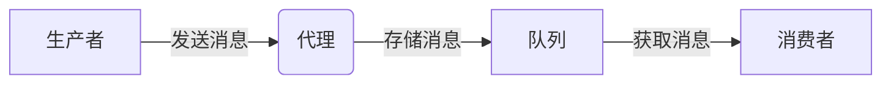

# 【AI大数据计算原理与代码实例讲解】消息队列

## 1.背景介绍

### 1.1 什么是消息队列

在现代分布式系统中,消息队列(Message Queue)扮演着至关重要的角色。它是一种跨进程的通信机制,用于传递消息或任务,实现应用程序之间的异步通信。消息队列可以看作是一个暂时存储消息的中介,发送方将消息发送到队列中,接收方从队列中获取消息并进行处理。

消息队列的出现主要是为了解决应用程序之间的耦合问题。在传统的系统中,应用程序之间通常采用直接相互调用的方式进行通信,这种紧密耦合的架构会导致系统的可伸缩性、可用性和维护性较差。通过引入消息队列,应用程序只需关注将消息发送到队列或从队列中获取消息,而不必关心消息的接收方或发送方,从而实现了应用程序之间的解耦。

### 1.2 消息队列的优势

引入消息队列可以带来以下优势:

1. **解耦**:消息队列实现了发送方和接收方的解耦,它们不需要知道对方的存在,只需关注消息的发送和接收。这种松耦合的设计提高了系统的灵活性和可维护性。

2. **异步通信**:发送方将消息发送到队列后,无需等待接收方处理完毕即可继续执行其他操作。接收方可以按照自身的速度从队列中获取并处理消息,实现了发送方和接收方的异步通信。

3. **流量削峰**:在高并发场景下,消息队列可以起到缓冲作用,将突发的请求暂存于队列中,防止系统被瞬时流量压垮。

4. **增强可靠性**:消息队列提供了持久化机制,即使系统出现故障,队列中的消息也不会丢失,可以在系统恢复后继续处理。

5. **解耦计算资源**:通过消息队列,可以将计算资源分配给不同的服务或应用程序,实现资源的动态调度和优化利用。

6. **灵活的系统集成**:消息队列可以帮助不同的系统或应用程序进行集成,实现异构系统之间的通信。

### 1.3 消息队列的应用场景

消息队列在现代分布式系统中有着广泛的应用场景,包括但不限于:

1. **异步处理**:将耗时的操作offload到消息队列中进行异步处理,提高系统的响应速度。

2. **应用程序解耦**:通过消息队列,可以实现不同应用程序之间的解耦,提高系统的可维护性和灵活性。

3. **流量削峰**:在高并发场景下,消息队列可以起到缓冲作用,防止系统被瞬时流量压垮。

4. **日志处理**:将日志信息写入消息队列,由专门的日志处理系统进行异步处理。

5. **事件驱动架构**:基于消息队列构建事件驱动架构,实现不同组件之间的松耦合通信。

6. **分布式事务处理**:在分布式事务中,消息队列可以作为事务协调者,保证事务的最终一致性。

总的来说,消息队列为构建可靠、可伸缩、解耦的分布式系统提供了坚实的基础。

## 2.核心概念与联系

### 2.1 消息队列的核心概念

消息队列涉及以下几个核心概念:

1. **生产者(Producer)**:负责生成消息并将其发送到消息队列中。

2. **消费者(Consumer)**:从消息队列中获取消息并进行处理。

3. **消息(Message)**:传递的数据单元,可以是任意格式的数据,如字符串、对象等。

4. **队列(Queue)**:用于存储和传递消息的数据结构,遵循先进先出(FIFO)或先进后出(LIFO)的原则。

5. **代理(Broker)**:消息队列服务器,负责接收生产者发送的消息,并将消息存储到队列中,同时为消费者提供从队列中获取消息的服务。

这些概念之间的关系如下图所示:



### 2.2 消息队列的工作流程

消息队列的工作流程可以概括为以下几个步骤:

1. **生产者发送消息**:生产者创建消息,并将其发送到代理(Broker)。

2. **代理存储消息**:代理接收到生产者发送的消息后,将其存储到队列中。

3. **消费者订阅队列**:消费者向代理发送订阅请求,订阅感兴趣的队列。

4. **代理推送消息**:代理检测到队列中有新的消息,就会将消息推送给已订阅该队列的消费者。

5. **消费者处理消息**:消费者接收到代理推送的消息后,进行相应的处理逻辑。

6. **确认消息**:消费者处理完消息后,需要向代理发送确认信号,代理则从队列中删除该消息。

这种生产者-代理-消费者的模式实现了应用程序之间的异步通信,提高了系统的可靠性和可伸缩性。

## 3.核心算法原理具体操作步骤

消息队列的核心算法原理主要体现在以下几个方面:

### 3.1 消息持久化

为了确保消息的可靠性,消息队列需要提供消息的持久化机制。常见的持久化方式包括:

1. **内存队列**:将消息存储在内存中,速度较快但不能保证消息的持久性。

2. **磁盘队列**:将消息持久化到磁盘文件中,可以保证消息的持久性,但性能相对较差。

3. **数据库队列**:将消息存储在关系型或NoSQL数据库中,具有较好的持久性和可靠性,但性能和扩展性受到一定限制。

4. **混合队列**:结合内存队列和磁盘队列的优点,先将消息存储在内存中,定期将内存中的消息持久化到磁盘文件或数据库中。

无论采用何种持久化方式,消息队列都需要保证消息的顺序性和一致性,避免消息的丢失或重复处理。

### 3.2 消息路由

在复杂的分布式系统中,消息队列需要提供灵活的消息路由机制,将消息准确地发送到指定的队列或消费者。常见的消息路由策略包括:

1. **直接路由**:根据队列名称或消费者ID直接将消息发送到指定的队列或消费者。

2. **主题订阅**:生产者将消息发送到主题(Topic),消费者可以订阅感兴趣的主题,从中获取消息。

3. **内容路由**:根据消息的内容(如消息头或消息体)进行路由,将消息发送到符合条件的队列或消费者。

4. **负载均衡**:当有多个消费者订阅同一个队列时,消息队列需要采用合理的负载均衡策略,将消息平均分发给各个消费者。

消息路由策略需要根据具体的应用场景和需求进行选择和配置,以确保消息的高效传递和处理。

### 3.3 消息确认与重试

为了保证消息的可靠性,消息队列需要提供消息确认和重试机制。具体步骤如下:

1. **消费者获取消息**:消费者从队列中获取消息。

2. **消费者处理消息**:消费者执行相应的业务逻辑,处理消息。

3. **消费者确认消息**:消费者成功处理消息后,向代理发送确认信号。

4. **代理删除消息**:代理接收到确认信号后,将相应的消息从队列中删除。

5. **消息重试**:如果消费者在处理消息时出现异常或超时,代理会将该消息重新投递给其他消费者或将其重新放入队列,以实现消息的重试机制。

通过消息确认和重试机制,消息队列可以确保消息的最终一致性,避免消息的丢失或重复处理。

## 4.数学模型和公式详细讲解举例说明

在消息队列的设计和优化过程中,常常需要借助数学模型和公式来量化和分析系统的性能和可靠性。以下是一些常见的数学模型和公式:

### 4.1 小顶堆模型

在消息队列中,常常需要维护一个优先级队列,以确保高优先级的消息可以被优先处理。小顶堆(Min Heap)是一种常用的数据结构,可以高效地实现优先级队列。

小顶堆的定义如下:对于任意一个非叶子节点 $A$,它的值总是小于或等于其子节点的值。即:

$$
A \leq \text{parent}(A)
$$

其中,`parent(A)`表示节点 A 的父节点。

在小顶堆中,插入和删除操作的时间复杂度均为 $O(\log n)$,其中 $n$ 表示堆中元素的个数。

### 4.2 队列模型

消息队列可以看作是一个先进先出(FIFO)的队列,其中的消息按照到达的顺序被处理。我们可以使用队列模型来分析消息队列的性能和可靠性。

假设消息以均匀的速率 $\lambda$ 到达队列,并以均匀的速率 $\mu$ 被处理。根据排队论,当 $\rho = \lambda / \mu < 1$ 时,队列是稳定的,否则队列会无限增长。

我们可以使用 Kendall 符号 $M/M/1$ 来表示这种单服务器队列模型,其中第一个 $M$ 表示到达过程服从泊松分布,第二个 $M$ 表示服务时间服从指数分布,1 表示只有一个服务器。

在 $M/M/1$ 队列模型中,平均队长 $L_q$ 和平均等待时间 $W_q$ 可以由以下公式计算:

$$
L_q = \frac{\rho^2}{1 - \rho}
$$

$$
W_q = \frac{\rho}{\mu(1 - \rho)}
$$

通过这些公式,我们可以评估消息队列的性能,并进行相应的优化和扩展。

### 4.3 可靠性模型

消息队列的可靠性是一个非常重要的指标,它反映了系统在一定时间内正常运行的概率。我们可以使用可靠性模型来量化和分析消息队列的可靠性。

假设消息队列由 $n$ 个独立的组件组成,每个组件的可靠性为 $R_i$,则整个系统的可靠性 $R_s$ 可以由以下公式计算:

$$
R_s = \prod_{i=1}^{n} R_i
$$

如果组件之间存在冗余关系,例如并行或串行结构,则可以使用其他公式来计算系统的可靠性。

在实际应用中,我们通常会根据历史数据和经验,为每个组件建立可靠性模型,并据此评估和优化整个消息队列系统的可靠性。

## 5.项目实践:代码实例和详细解释说明

为了更好地理解消息队列的原理和实现,我们将通过一个基于 RabbitMQ 的示例项目来进行实践。RabbitMQ 是一个流行的开源消息队列系统,它支持多种消息协议,如 AMQP、MQTT、STOMP 等。

### 5.1 安装和配置 RabbitMQ

首先,我们需要安装和配置 RabbitMQ。以下是在 Ubuntu 系统上安装 RabbitMQ 的步骤:

1. 安装 Erlang 运行环境:

```bash
sudo apt-get install erlang
```

2. 安装 RabbitMQ 服务器:

```bash
sudo apt-get install rabbitmq-server
```

3. 启动 RabbitMQ 服务器:

```bash
sudo systemctl start rabbitmq-server
```

4. 启用 Web 管理界面(可选):

```bash
sudo rabbitmq-plugins enable rabbitmq_management
```

现在,你可以通过访问 `http://localhost:15672` 来访问 RabbitMQ 的 Web 管理界面。默认的用户名和密码都是 `guest`。

### 5.2 Python 示例代码

接下来,我们将使用