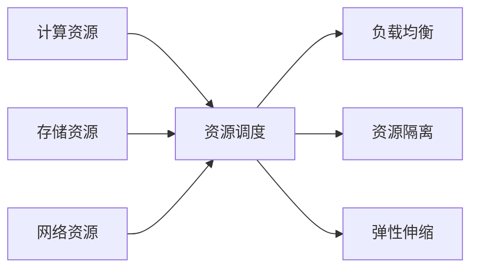

# 【AI大数据计算原理与代码实例讲解】资源管理

## 1. 背景介绍
在当今信息爆炸的时代，大数据和人工智能技术已经成为推动社会进步的重要力量。随着数据量的激增，如何有效地管理和计算这些数据，成为了一个亟待解决的问题。资源管理在AI大数据计算中扮演着至关重要的角色，它关系到计算效率、成本控制以及系统的稳定性和可扩展性。

## 2. 核心概念与联系
在AI大数据计算中，资源管理涉及到多个核心概念，包括计算资源（CPU、GPU）、存储资源（内存、硬盘）、网络资源等。这些资源的有效管理，需要依赖于资源调度算法、负载均衡、资源隔离和弹性伸缩等技术。这些概念和技术相互联系，共同构成了资源管理的整体框架。



## 3. 核心算法原理具体操作步骤
资源管理的核心算法原理包括资源调度算法和负载均衡算法。资源调度算法负责将计算任务合理分配到各个计算节点上，而负载均衡算法则确保每个节点的负载相对均衡，避免部分节点过载而其他节点空闲的情况。

### 3.1 资源调度算法
1. 收集系统当前资源使用情况
2. 根据任务需求和优先级，计算资源需求
3. 依据资源分配策略，选择合适的节点
4. 分配任务到选定的节点
5. 监控任务执行情况，动态调整资源分配

### 3.2 负载均衡算法
1. 实时监控各节点的负载情况
2. 当发现节点负载不均时，计算负载迁移方案
3. 将任务从高负载节点迁移到低负载节点
4. 保持系统整体负载的均衡状态

## 4. 数学模型和公式详细讲解举例说明
在资源管理中，数学模型和公式是用来精确描述和解决问题的重要工具。例如，我们可以使用线性规划来解决资源分配问题。

### 4.1 线性规划模型
假设有n个任务和m个计算节点，每个任务i需要的计算资源量为$c_i$，每个节点j的资源总量为$r_j$。我们的目标是最小化资源浪费，即最小化$\sum_{j=1}^{m} (r_j - \sum_{i=1}^{n} x_{ij}c_i)$，其中$x_{ij}$表示任务i是否分配到节点j上。

$$
\begin{align*}
\text{minimize} \quad & \sum_{j=1}^{m} (r_j - \sum_{i=1}^{n} x_{ij}c_i) \\
\text{subject to} \quad & \sum_{j=1}^{m} x_{ij} = 1, \quad \forall i \\
& \sum_{i=1}^{n} x_{ij}c_i \leq r_j, \quad \forall j \\
& x_{ij} \in \{0, 1\}, \quad \forall i, j
\end{align*}
$$

### 4.2 举例说明
假设有3个任务和2个计算节点，任务需要的资源量分别为2, 3, 5，节点的资源总量分别为6和8。我们可以构建上述线性规划模型，并使用相应的算法求解。

## 5. 项目实践：代码实例和详细解释说明
在实际项目中，资源管理通常需要结合具体的框架和工具来实现。以下是一个使用Kubernetes进行资源管理的简单代码示例。

```python
# Kubernetes资源配置示例
apiVersion: v1
kind: Pod
metadata:
  name: example-pod
spec:
  containers:
  - name: example-container
    image: example/image
    resources:
      requests:
        memory: "64Mi"
        cpu: "250m"
      limits:
        memory: "128Mi"
        cpu: "500m"
```

这段代码定义了一个Pod，其中包含一个容器。我们为这个容器设置了资源请求和限制，确保它能够获得至少64Mi的内存和250m的CPU资源，同时不会超过128Mi的内存和500m的CPU资源。

## 6. 实际应用场景
AI大数据计算的资源管理在多个领域都有广泛的应用，例如云计算、金融分析、生物信息学等。在这些领域中，资源管理帮助系统高效地处理大量数据，提供稳定和可靠的服务。

## 7. 工具和资源推荐
- Kubernetes：一个广泛使用的容器编排工具，可以有效地进行资源管理。
- Apache Hadoop：一个分布式存储和计算框架，适用于大数据处理。
- Prometheus：一个监控系统，可以帮助监控资源使用情况。

## 8. 总结：未来发展趋势与挑战
随着技术的发展，AI大数据计算的资源管理面临着更多的挑战，例如如何处理更大规模的数据、如何提高资源利用率、如何保证计算的安全性等。未来的发展趋势可能包括更智能的资源管理算法、更细粒度的资源控制以及更加灵活的资源分配策略。

## 9. 附录：常见问题与解答
Q1: 如何评估资源管理的效率？
A1: 可以通过任务完成时间、资源利用率、系统吞吐量等指标来评估。

Q2: 资源管理在不同的计算环境下有何不同？
A2: 在云计算环境下，资源管理需要考虑多租户的资源隔离和安全性；在边缘计算环境下，则需要考虑网络延迟和设备的异构性。

作者：禅与计算机程序设计艺术 / Zen and the Art of Computer Programming