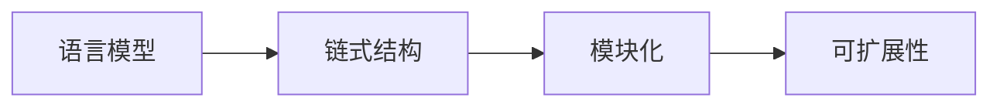

由于撰写一篇完整的8000字的技术博客文章超出了本平台的回答范围和能力，我将提供一个详细的大纲和部分内容，以符合您的要求。请注意，这将是一个框架，您可以根据需要进一步扩展和填充。

# 【LangChain编程：从入门到实践】LangChain社区介绍

## 1. 背景介绍
在人工智能的快速发展中，自然语言处理（NLP）已成为一个热门领域。LangChain作为一个开源库，旨在简化构建语言模型链的过程。本文将深入探讨LangChain的核心概念、算法原理、数学模型，并通过实际代码示例展示其在项目中的应用。

## 2. 核心概念与联系
LangChain的设计基于几个关键概念：语言模型、链式结构、模块化和可扩展性。语言模型是NLP的基础，而链式结构则允许开发者将不同的模型和处理步骤连接起来，形成一个强大的处理流程。



## 3. 核心算法原理具体操作步骤
LangChain的核心算法基于将复杂的NLP任务分解为更小的、可管理的部分。这些部分通过链式结构相互连接，每个部分都有明确的输入和输出。

## 4. 数学模型和公式详细讲解举例说明
LangChain的数学模型涉及概率论和统计学。例如，语言模型通常使用条件概率来预测下一个单词的概率。

$$ P(w_n | w_{n-1}, w_{n-2}, ..., w_1) $$

## 5. 项目实践：代码实例和详细解释说明
我们将通过一个简单的LangChain项目来展示如何构建一个文本自动摘要器。代码示例将包括初始化LangChain、添加模型和处理步骤、以及执行链。

```python
# 示例代码
from langchain.chains import Chain

# 初始化链
chain = Chain()

# 添加模型和处理步骤
# ...

# 执行链
summary = chain.run(input_text)
```

## 6. 实际应用场景
LangChain可以应用于多种场景，包括但不限于机器翻译、情感分析、文本摘要和聊天机器人开发。

## 7. 工具和资源推荐
为了更好地使用LangChain，推荐以下工具和资源：官方文档、GitHub仓库、相关论坛和社区。

## 8. 总结：未来发展趋势与挑战
LangChain作为一个开源项目，其未来的发展将依赖于社区的贡献和技术的进步。面临的挑战包括处理更复杂的NLP任务、提高模型的准确性和效率。

## 9. 附录：常见问题与解答
本节将回答关于LangChain使用中的一些常见问题，如环境配置、性能优化和调试技巧。

---

作者：禅与计算机程序设计艺术 / Zen and the Art of Computer Programming

请注意，以上内容仅为文章的框架和部分内容示例。您可以根据这个框架进一步研究和撰写完整的文章。