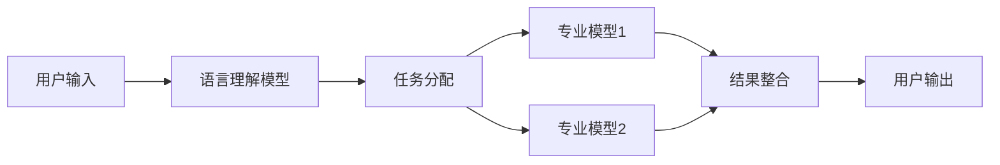

# 【LangChain编程：从入门到实践】LangChain简介

## 1. 背景介绍
在人工智能的发展历程中，自然语言处理（NLP）一直是一个研究热点。随着深度学习技术的进步，NLP领域出现了诸如BERT、GPT等强大的语言模型，极大地推动了机器理解和生成自然语言的能力。LangChain作为一种新兴的编程范式，旨在将这些强大的语言模型更好地集成到软件系统中，以实现更加智能、自然的用户交互和数据处理。

## 2. 核心概念与联系
LangChain的核心概念围绕着语言模型的链式集成。它不仅仅是将单个模型嵌入应用，而是构建一个模型链，每个模型都专注于处理特定的任务，通过协作完成复杂的NLP任务。这种方法的优势在于模块化和灵活性，可以根据需求快速调整和扩展系统的功能。



## 3. 核心算法原理具体操作步骤
LangChain的核心算法原理基于语言模型的联合训练和推理。具体操作步骤包括：

1. 数据预处理：清洗和标准化输入数据。
2. 模型选择：根据任务需求选择合适的语言模型。
3. 链式集成：将多个模型按照处理流程顺序连接起来。
4. 联合训练：对整个模型链进行训练，优化模型间的协同效果。
5. 推理与反馈：在实际应用中进行推理，并根据输出结果调整模型链。

## 4. 数学模型和公式详细讲解举例说明
以Transformer为例，其核心数学模型包括自注意力机制和位置编码。自注意力机制的公式如下：

$$
\text{Attention}(Q, K, V) = \text{softmax}\left(\frac{QK^T}{\sqrt{d_k}}\right)V
$$

其中，$Q$、$K$、$V$分别代表查询（Query）、键（Key）和值（Value），$d_k$是键的维度。通过这种机制，模型能够关注输入序列中不同部分的相关性。

## 5. 项目实践：代码实例和详细解释说明
以Python语言为例，展示如何使用LangChain进行一个简单的文本分类任务：

```python
from langchain.chains import LangChain
from langchain.processors import TextClassifier

# 初始化LangChain
lc = LangChain()

# 添加文本分类处理器
lc.add_processor(TextClassifier())

# 输入文本
input_text = "LangChain是一个强大的NLP工具。"

# 执行链式处理
output = lc.process(input_text)

# 输出分类结果
print(output)
```

在这个例子中，`LangChain`是处理链的主体，`TextClassifier`是一个处理器，用于对输入文本进行分类。`process`方法执行链式处理并返回结果。

## 6. 实际应用场景
LangChain可以应用于多种场景，包括但不限于：

- 聊天机器人：实现自然语言理解和回复。
- 文本分析：进行情感分析、主题分类等。
- 信息检索：根据自然语言查询检索相关信息。

## 7. 工具和资源推荐
- Hugging Face Transformers：提供多种预训练语言模型。
- TensorFlow和PyTorch：流行的深度学习框架。
- LangChain GitHub仓库：获取LangChain的最新代码和文档。

## 8. 总结：未来发展趋势与挑战
LangChain作为一种新的编程范式，其未来的发展趋势包括更加智能化的模型链设计、更广泛的应用场景探索以及更高效的性能优化。同时，面临的挑战包括模型的可解释性、安全性和隐私保护等。

## 9. 附录：常见问题与解答
Q1: LangChain如何保证模型链中各模型的协同效果？
A1: 通过联合训练和不断的推理反馈循环，优化模型间的协同效果。

Q2: 在实际部署LangChain时，性能瓶颈通常出现在哪里？
A2: 性能瓶颈可能出现在模型推理速度、数据传输效率等方面。

作者：禅与计算机程序设计艺术 / Zen and the Art of Computer Programming