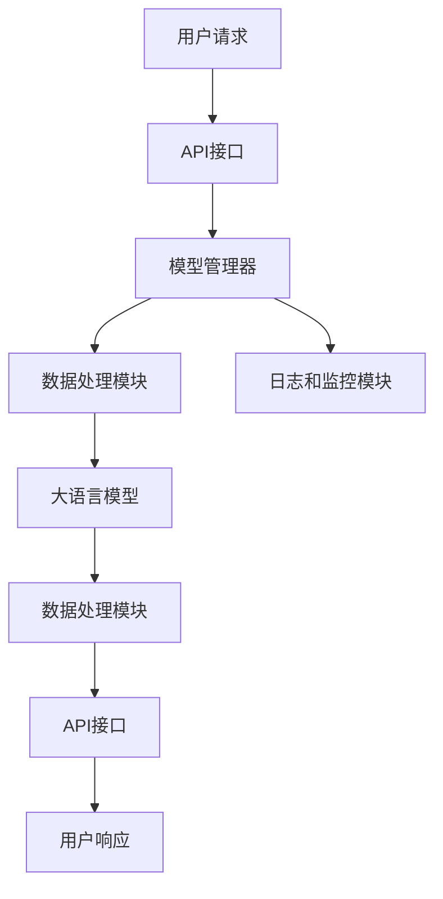

# 【LangChain编程：从入门到实践】大模型接口

## 1.背景介绍

在人工智能和自然语言处理领域，语言模型（Language Model, LM）已经成为了一个重要的研究方向。近年来，随着深度学习技术的发展，基于大规模数据训练的语言模型如GPT-3、BERT等，展现出了强大的语言生成和理解能力。LangChain作为一种新兴的编程框架，旨在简化和优化大模型的接口调用，使开发者能够更高效地利用这些强大的语言模型。

LangChain编程框架不仅提供了便捷的API接口，还支持多种语言模型的无缝集成，极大地降低了开发者的使用门槛。本文将深入探讨LangChain的核心概念、算法原理、数学模型、实际应用场景等，帮助读者全面掌握LangChain编程的精髓。

## 2.核心概念与联系

### 2.1 LangChain简介

LangChain是一个专为大语言模型设计的编程框架，旨在简化模型调用和集成过程。它提供了统一的API接口，支持多种语言模型的无缝切换和组合使用。

### 2.2 大语言模型

大语言模型（Large Language Model, LLM）是基于深度学习技术训练的自然语言处理模型，能够生成和理解自然语言文本。常见的大语言模型包括GPT-3、BERT、T5等。

### 2.3 LangChain与大语言模型的关系

LangChain通过提供统一的API接口，使得开发者可以方便地调用和集成不同的大语言模型。它不仅支持单一模型的调用，还支持多模型的组合使用，极大地提高了开发效率和灵活性。

## 3.核心算法原理具体操作步骤

### 3.1 LangChain的架构设计

LangChain的架构设计包括以下几个核心组件：

- **模型管理器**：负责管理和调度不同的语言模型。
- **API接口**：提供统一的API接口，简化模型调用过程。
- **数据处理模块**：负责数据的预处理和后处理。
- **日志和监控模块**：提供日志记录和性能监控功能。

以下是LangChain架构的Mermaid流程图：



### 3.2 LangChain的工作流程

1. **用户请求**：用户通过API接口发送请求。
2. **API接口处理**：API接口接收请求并进行初步处理。
3. **模型管理器调度**：模型管理器根据请求类型选择合适的语言模型。
4. **数据预处理**：数据处理模块对输入数据进行预处理。
5. **模型调用**：调用大语言模型进行处理。
6. **数据后处理**：数据处理模块对输出数据进行后处理。
7. **响应返回**：API接口将处理结果返回给用户。
8. **日志记录和监控**：日志和监控模块记录请求和处理过程中的日志信息，并进行性能监控。

## 4.数学模型和公式详细讲解举例说明

### 4.1 语言模型的数学基础

语言模型的核心是概率论和统计学。给定一个词序列 $w_1, w_2, ..., w_n$，语言模型的目标是计算该序列的概率 $P(w_1, w_2, ..., w_n)$。根据链式法则，这个概率可以分解为：

$$
P(w_1, w_2, ..., w_n) = P(w_1) \cdot P(w_2|w_1) \cdot P(w_3|w_1, w_2) \cdot ... \cdot P(w_n|w_1, w_2, ..., w_{n-1})
$$

### 4.2 神经网络语言模型

神经网络语言模型通过训练一个神经网络来估计上述条件概率。常见的神经网络结构包括前馈神经网络（Feedforward Neural Network, FNN）、循环神经网络（Recurrent Neural Network, RNN）和变换器（Transformer）。

#### 4.2.1 前馈神经网络

前馈神经网络通过多层感知机（Multi-Layer Perceptron, MLP）来估计条件概率。其结构如下：

$$
h = \tanh(W_h \cdot x + b_h)
$$

$$
P(w|context) = \text{softmax}(W_o \cdot h + b_o)
$$

#### 4.2.2 循环神经网络

循环神经网络通过引入循环连接来处理序列数据。其结构如下：

$$
h_t = \tanh(W_h \cdot x_t + U_h \cdot h_{t-1} + b_h)
$$

$$
P(w_t|context) = \text{softmax}(W_o \cdot h_t + b_o)
$$

#### 4.2.3 变换器

变换器通过自注意力机制来处理序列数据。其结构如下：

$$
\text{Attention}(Q, K, V) = \text{softmax}\left(\frac{QK^T}{\sqrt{d_k}}\right)V
$$

$$
P(w_t|context) = \text{softmax}(W_o \cdot \text{Attention}(Q, K, V) + b_o)
$$

### 4.3 LangChain中的数学模型

LangChain通过封装上述神经网络结构，提供了统一的API接口，使得开发者可以方便地调用不同的语言模型。以下是一个简单的LangChain调用示例：

```python
from langchain import LangChain

# 初始化LangChain
lc = LangChain(api_key='your_api_key')

# 调用GPT-3模型
response = lc.call_model(model='gpt-3', prompt='Hello, world!')

print(response)
```

## 5.项目实践：代码实例和详细解释说明

### 5.1 环境配置

在开始项目实践之前，需要进行环境配置。以下是环境配置的步骤：

1. 安装Python和相关依赖库：

```bash
pip install langchain
```

2. 获取API密钥并配置LangChain：

```python
from langchain import LangChain

# 初始化LangChain
lc = LangChain(api_key='your_api_key')
```

### 5.2 简单示例：调用GPT-3生成文本

以下是一个简单的示例，展示如何使用LangChain调用GPT-3生成文本：

```python
from langchain import LangChain

# 初始化LangChain
lc = LangChain(api_key='your_api_key')

# 调用GPT-3模型生成文本
prompt = "请写一篇关于人工智能的短文。"
response = lc.call_model(model='gpt-3', prompt=prompt)

print(response)
```

### 5.3 复杂示例：多模型组合使用

以下是一个复杂的示例，展示如何使用LangChain组合多个模型进行文本处理：

```python
from langchain import LangChain

# 初始化LangChain
lc = LangChain(api_key='your_api_key')

# 调用BERT模型进行文本分类
text = "LangChain是一个强大的编程框架。"
classification = lc.call_model(model='bert', task='classification', text=text)

# 调用GPT-3模型生成文本
prompt = f"请根据以下分类结果生成一段描述：{classification}"
response = lc.call_model(model='gpt-3', prompt=prompt)

print(response)
```

## 6.实际应用场景

### 6.1 聊天机器人

LangChain可以用于构建智能聊天机器人，通过调用大语言模型生成自然语言响应，提高用户交互体验。

### 6.2 文本生成

LangChain可以用于自动生成文章、报告等文本内容，极大地提高了内容创作的效率。

### 6.3 文本分类

LangChain可以用于文本分类任务，如垃圾邮件检测、情感分析等，帮助企业更好地处理和分析文本数据。

### 6.4 机器翻译

LangChain可以用于机器翻译任务，通过调用多语言模型实现高质量的翻译服务。

## 7.工具和资源推荐

### 7.1 开发工具

- **Jupyter Notebook**：用于交互式编程和数据分析。
- **PyCharm**：用于Python开发的集成开发环境。
- **VS Code**：轻量级的代码编辑器，支持多种编程语言。

### 7.2 在线资源

- **LangChain官方文档**：提供详细的API文档和使用指南。
- **OpenAI API**：提供GPT-3等大语言模型的API接口。
- **Hugging Face**：提供多种预训练语言模型和相关工具。

### 7.3 学习资源

- **《深度学习》**：Ian Goodfellow等著，介绍深度学习的基础理论和应用。
- **《自然语言处理入门》**：介绍自然语言处理的基本概念和技术。
- **Coursera**：提供多种人工智能和自然语言处理相关的在线课程。

## 8.总结：未来发展趋势与挑战

### 8.1 未来发展趋势

随着人工智能技术的不断发展，大语言模型的应用前景将更加广阔。未来，LangChain有望在以下几个方面取得突破：

- **模型性能提升**：通过优化算法和硬件，进一步提升大语言模型的性能。
- **多模态融合**：结合图像、语音等多模态数据，提升模型的综合处理能力。
- **个性化定制**：根据用户需求，提供个性化的模型定制服务。

### 8.2 面临的挑战

尽管大语言模型展现出了强大的能力，但在实际应用中仍面临一些挑战：

- **数据隐私**：如何保护用户数据隐私，避免数据泄露。
- **模型偏见**：如何消除模型中的偏见，确保公平性。
- **计算资源**：如何降低模型的计算资源消耗，提高效率。

## 9.附录：常见问题与解答

### 9.1 LangChain支持哪些语言模型？

LangChain支持多种语言模型，包括GPT-3、BERT、T5等。用户可以根据需求选择合适的模型进行调用。

### 9.2 如何获取LangChain的API密钥？

用户可以在LangChain官网注册账号并获取API密钥。具体步骤请参考LangChain官方文档。

### 9.3 LangChain是否支持多模型组合使用？

是的，LangChain支持多模型组合使用。用户可以通过API接口调用多个模型，并将其结果进行组合处理。

### 9.4 LangChain的性能如何？

LangChain通过优化算法和架构设计，提供了高效的模型调用和处理能力。具体性能取决于所使用的模型和硬件配置。

### 9.5 如何处理LangChain中的错误？

LangChain提供了详细的错误日志和调试信息，用户可以根据日志信息进行排查和处理。具体方法请参考LangChain官方文档。

---

作者：禅与计算机程序设计艺术 / Zen and the Art of Computer Programming