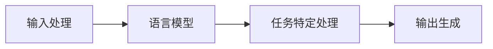

# 【LangChain编程：从入门到实践】构建多模态机器人

## 1. 背景介绍
随着人工智能技术的飞速发展，多模态机器人已经成为研究的热点。多模态机器人能够通过视觉、听觉、触觉等多种感官模式理解世界，并通过自然语言处理（NLP）、计算机视觉（CV）和其他AI技术与人类进行交互。LangChain编程作为构建多模态机器人的重要工具，其灵活性和强大的功能使得开发者能够更加高效地实现复杂的交互逻辑。

## 2. 核心概念与联系
### 2.1 多模态机器人的定义
多模态机器人是指能够处理并整合多种感官输入信息的机器人，它们通过模拟人类的感知方式来理解和响应外部世界。

### 2.2 LangChain编程概述
LangChain是一个用于构建语言模型链的编程框架，它允许开发者将不同的语言模型和处理模块以链式结构组合起来，以实现复杂的语言处理任务。

### 2.3 核心概念之间的联系
在多模态机器人中，LangChain编程可以作为连接不同模态输入和输出的桥梁，通过链式结构整合多种AI技术，实现流畅的人机交互。

## 3. 核心算法原理具体操作步骤
### 3.1 LangChain编程流程

### 3.2 操作步骤
1. 输入处理：收集并预处理来自多模态传感器的数据。
2. 语言模型：使用预训练的语言模型处理文本数据。
3. 任务特定处理：根据具体任务需求，对语言模型的输出进行进一步处理。
4. 输出生成：生成响应或执行动作。

## 4. 数学模型和公式详细讲解举例说明
### 4.1 数学模型
多模态机器人的核心数学模型通常涉及概率论和统计学，例如贝叶斯网络和隐马尔可夫模型。

### 4.2 公式举例
$$ P(X|Y) = \frac{P(Y|X)P(X)}{P(Y)} $$
上述公式为贝叶斯定理，其中$P(X|Y)$表示在Y条件下X的概率，$P(Y|X)$表示在X条件下Y的概率。

## 5. 项目实践：代码实例和详细解释说明
### 5.1 代码实例
```python
# 示例代码：使用LangChain构建一个简单的问答机器人
from langchain.chains import Chain

# 定义输入处理函数
def input_processing(input_data):
    # 对输入数据进行预处理
    return preprocessed_data

# 定义语言模型函数
def language_model(preprocessed_data):
    # 使用语言模型处理数据
    return model_output

# 定义任务特定处理函数
def task_specific_processing(model_output):
    # 根据任务需求处理模型输出
    return task_output

# 定义输出生成函数
def output_generation(task_output):
    # 生成最终输出
    return final_output

# 构建LangChain
chain = Chain([input_processing, language_model, task_specific_processing, output_generation])

# 使用链处理输入
input_data = "How is the weather today?"
output = chain(input_data)
print(output)
```
### 5.2 详细解释说明
上述代码展示了如何使用LangChain构建一个简单的问答机器人。每个函数都代表链中的一个环节，最终通过链的组合来处理输入并生成输出。

## 6. 实际应用场景
多模态机器人在客服、医疗、教育等多个领域都有广泛的应用。例如，在客服领域，它们可以通过分析客户的语音和表情来提供更加个性化的服务。

## 7. 工具和资源推荐
- LangChain官方文档
- TensorFlow和PyTorch等深度学习框架
- Hugging Face的Transformers库

## 8. 总结：未来发展趋势与挑战
多模态机器人的发展趋势是向着更加智能化和自然化的方向发展，但同时也面临着数据隐私、算法偏见等挑战。

## 9. 附录：常见问题与解答
Q1: LangChain编程适用于哪些类型的项目？
A1: LangChain编程适用于需要复杂语言处理的项目，如聊天机器人、自然语言理解等。

作者：禅与计算机程序设计艺术 / Zen and the Art of Computer Programming