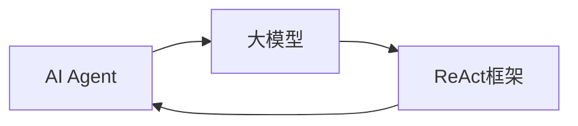

## 1. 背景介绍

随着人工智能技术的飞速发展，大模型已经成为了推动AI应用创新的重要力量。在众多的AI框架中，ReAct以其独特的设计理念和灵活性，成为了开发者构建高效、可扩展AI Agent的首选工具。本文将深入探讨如何在ReAct框架下开发大模型应用，并通过实际案例分析，为读者提供一套完整的开发指南。

## 2. 核心概念与联系

在深入ReAct框架之前，我们需要理解几个核心概念及其之间的联系：

- **AI Agent**：一个能够自主执行任务、做出决策的智能体。
- **大模型**：指的是具有大量参数、能力强大的机器学习模型。
- **ReAct框架**：一个专为AI Agent设计的软件架构，它提供了一套机制来处理Agent的状态管理、事件响应和异步通信。

这些概念之间的联系在于，ReAct框架为大模型提供了一个运行和交互的平台，使AI Agent能够在此基础上实现复杂的功能和任务。



## 3. 核心算法原理具体操作步骤

开发基于ReAct框架的AI Agent涉及以下关键步骤：

1. **定义Agent的状态和行为**：确定Agent需要维护的状态信息以及它可以执行的行为。
2. **构建大模型**：设计并训练一个大模型，使其能够处理复杂的任务。
3. **集成模型与框架**：将训练好的大模型嵌入到ReAct框架中，实现模型的调用和管理。
4. **事件处理和响应**：编写事件处理逻辑，使Agent能够根据外部输入做出反应。
5. **测试和优化**：对Agent进行测试，根据反馈优化模型和框架的配置。

## 4. 数学模型和公式详细讲解举例说明

在构建大模型时，我们通常会遇到一些基础的数学模型和公式，例如神经网络的前向传播公式：

$$
a^{[l]} = g^{[l]}(W^{[l]}a^{[l-1]} + b^{[l]})
$$

其中，$a^{[l]}$ 表示第$l$层的激活值，$W^{[l]}$ 和 $b^{[l]}$ 分别是第$l$层的权重和偏置，$g^{[l]}$ 是激活函数。

通过这个公式，我们可以计算出每一层的输出，进而得到模型的最终预测结果。在ReAct框架中，这些计算过程会被封装在模型调用接口中，以便Agent可以直接使用。

## 5. 项目实践：代码实例和详细解释说明

为了更好地理解ReAct框架下的AI Agent开发流程，我们将通过一个简单的项目实践来展示整个过程。假设我们要开发一个能够识别图像中物体的AI Agent，我们需要完成以下步骤：

```javascript
// 定义Agent状态
class ImageRecognitionAgent {
    constructor(model) {
        this.model = model;
        this.imageData = null;
    }

    // 加载图像数据
    loadImageData(data) {
        this.imageData = data;
    }

    // 识别图像中的物体
    async recognizeObjects() {
        if (this.imageData) {
            const predictions = await this.model.predict(this.imageData);
            return predictions;
        }
        throw new Error('No image data provided.');
    }
}

// 使用ReAct框架的API来创建和管理Agent
const agent = new ImageRecognitionAgent(yourPretrainedModel);
agent.loadImageData(yourImageData);
const objects = await agent.recognizeObjects();
console.log(objects);
```

在这个代码示例中，我们首先定义了一个`ImageRecognitionAgent`类，它包含了模型和图像数据的状态。然后，我们使用ReAct框架提供的API来创建Agent实例，并调用它的方法来执行物体识别任务。

## 6. 实际应用场景

基于ReAct框架的AI Agent可以应用于多种场景，包括但不限于：

- **智能客服**：能够自动回答用户问题的客服Agent。
- **推荐系统**：根据用户行为和偏好推荐内容的Agent。
- **自动驾驶**：能够感知环境并做出驾驶决策的Agent。

## 7. 工具和资源推荐

为了更好地开发和部署基于ReAct框架的AI Agent，以下是一些有用的工具和资源：

- **TensorFlow/PyTorch**：用于构建和训练大模型的机器学习库。
- **ReAct官方文档**：提供了关于ReAct框架的详细指南和API参考。
- **GitHub**：可以找到许多开源的ReAct项目和代码示例。

## 8. 总结：未来发展趋势与挑战

随着技术的不断进步，基于ReAct框架的AI Agent将会变得更加智能和高效。未来的发展趋势可能包括更深层次的模型集成、跨平台的Agent部署以及更强大的自适应能力。同时，我们也将面临一些挑战，如隐私保护、算法透明度和伦理问题。

## 9. 附录：常见问题与解答

- **Q1：ReAct框架适合初学者吗？**
- **A1：** ReAct框架的设计理念是易于上手，但要充分利用其功能，需要一定的学习和实践。

- **Q2：如何确保AI Agent的决策是公正的？**
- **A2：** 需要在模型训练阶段考虑数据的多样性和公平性，并定期审查Agent的决策过程。

- **Q3：大模型的训练成本是否很高？**
- **A3：** 是的，大模型通常需要大量的计算资源和数据，这可能导致较高的训练成本。

作者：禅与计算机程序设计艺术 / Zen and the Art of Computer Programming